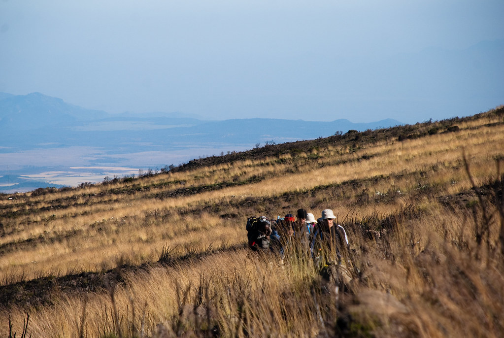
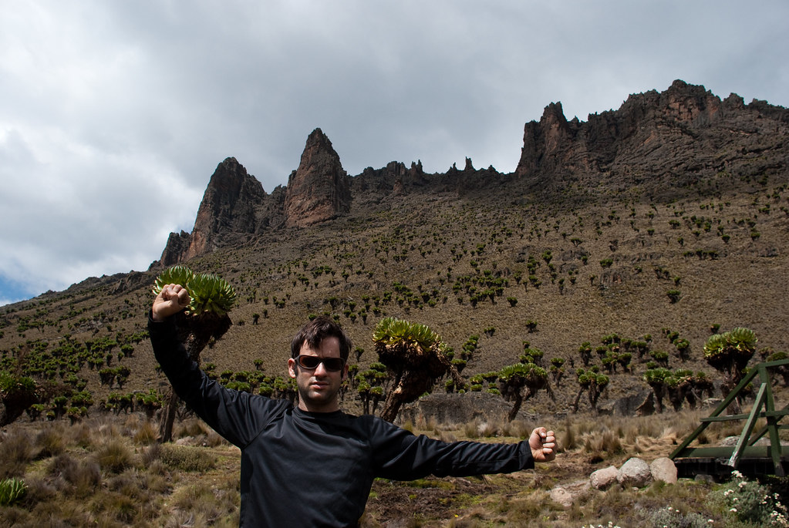
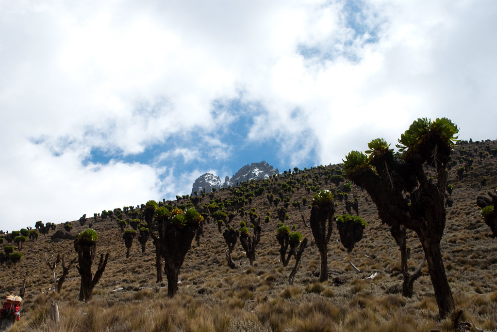
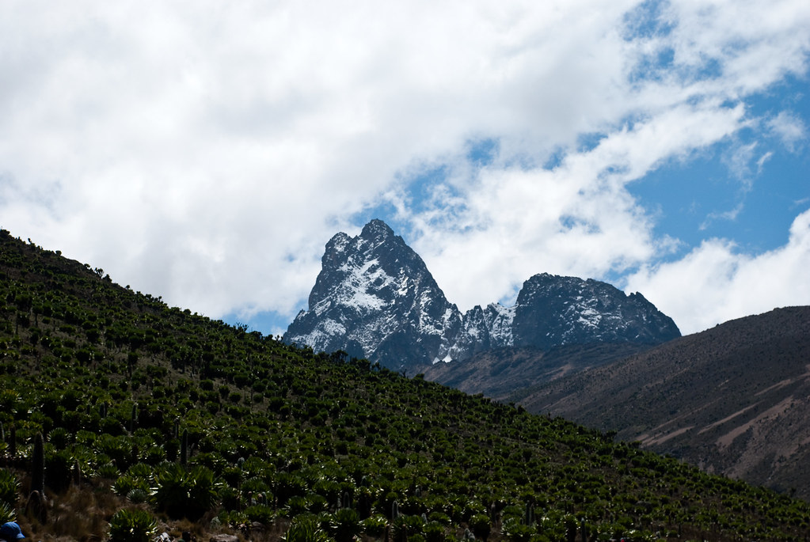
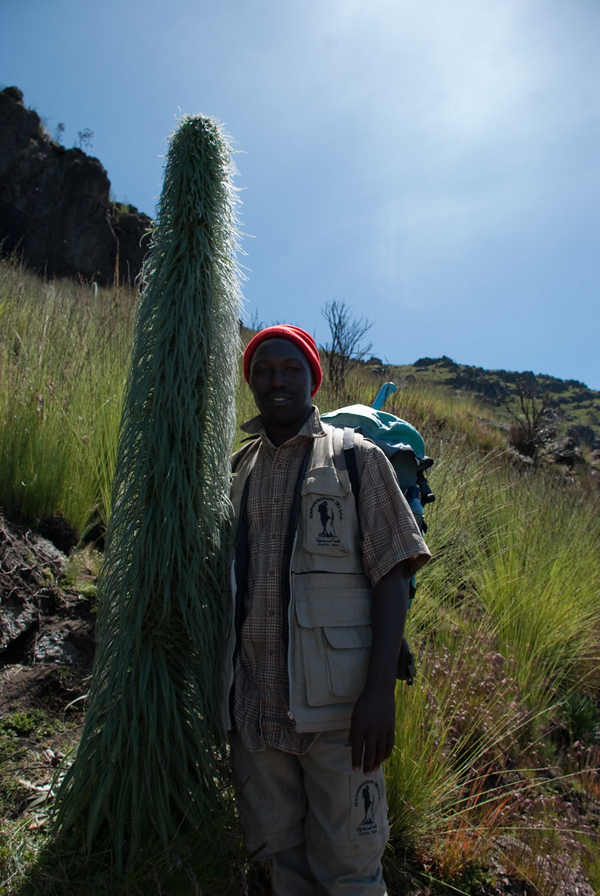
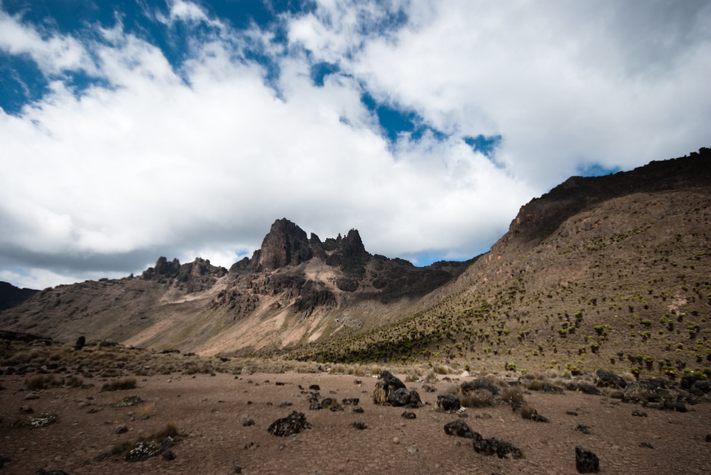
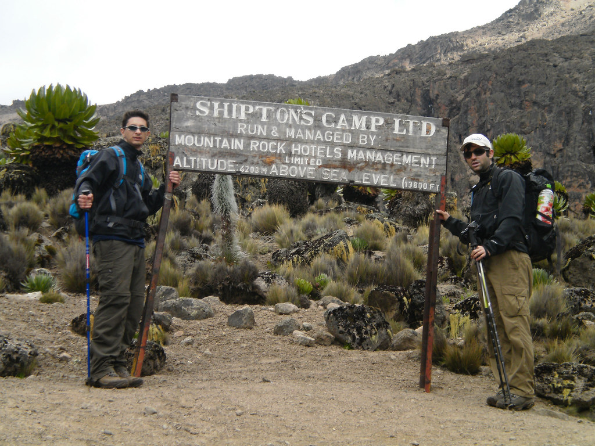

היום נלך מOld Moses Camp (שבגובה 3350 מ’) ל Shipton’s Camp בגובה 4230 מ.המסלול של היום כבר מתחיל להיות תלול יותר וארוך, כך שביחד עם הגובה אליו נגיע, יהיה לנו יום קשה פיזית.  
מצד שני הנופים והצמחיה המשוגעת שיש באזורים האלה משכיחים כל קושי. מכיוון שהטיפול המונע הכי יעיל למחלת גבהים הוא הסתגלות איטית, הלכנו בקצב בינוני כדי להגיע אל היעד בכ9 שעות הליכה.

**28/01/2010 – אל בקתת שיפטון**

אחרי לילה ארוך ומלא בנחירות קמנו מוקדם לבוקר חדש וקפוא.
בלילה ניסיתי בפעם הראשונה והאחרונה את “טיפ בקבוק המים החמים בשק השינה” שבגללו נסחבתי עם בקבוקי פריגת מצחיקים מהארץ.  
אמנם זה היה נעים לחבק בקבוק רותח עם כפות רגליים קפואות, אבל פקק הפלסטיק, שלא הגיב יפה לחום נפתח - ומים התחילו לטפטף ולבשל לי את כפות הרגליים. העפתי את הבקבוק ונשארתי לישון בשק שינה בניחוח מרק רגליים.

תלונה אחרונה ודי:  
בנוסף לכל הצרות, אתמול התחלנו לקחת כדורים למניעת מחלת גבהים.  
תופעת הלואי העיקרית של הכדורים היא שיתון מוגבר, מה שהגביר את הטיילת והפחית עוד יותר את שעות השינה של כולם…

כשהתחלנו את ההליכה שמנו לב שאפילו הדשא באיזור הבקתה קפא במהלך הלילה. מוקדם בבוקר היה קר מאד, אך מהר מאד התחממנו מההליכה והתחלנו להתקלף מהבגדים.  
היום הרגיש סוף סוף כמו טרק. הלכנו יום שלם בהר וכמעט שלא התעכבנו בשביל ללמוד על צמחים – לפחות לא על המשעממים מבינהם...

למרת זאת, לצערי הרב אני יודע לספר על הפרטים הבאים: החל מגובה מסויים, עברנו בין “חגורות צומח” שונות והגענו לאיזור בו שולטים סביוני הענק הכרוביים - [Dendrosenecio](http://en.wikipedia.org/wiki/Dendrosenecio) וזן של לובליות גדולות בשם [*Lobelia telekii*](http://en.wikipedia.org/wiki/Lobelia_telekii).  
לא הייתי טורח להזכיר את כל זה, אלמלא הצמחים הללו היו באמת מגניבים.

עוד עובדה שהופכת את הסיפור הזה למעניין, היא שאת הזנים העצומים הללו ניתן למצוא אך ורק בהרים של מזרח אפריקה.  
בפעם הבאה שאתם מתעסקים עם סביון, שווה לזכור את בן הדוד הביריון שלו…ככל שהתקדמנו הסביונים נהיו גדולים יותר וצפופים יותר, עד שבשלב מסויים נראה שנחתנו בכוכב לכת הנשלט על ידי הצומח.

עיקרי ההסבר הדחוק שקיבלנו לתופעת צמחי הענק: גבוה פה, קר פה והקרינה פה מאד חזקה – צמחים לא ידעו איך להתמודד עם התנאים הללו ונהיו ענקיים :)

ג’קסון, אחד המדריכים המקומיים, לימד אותנו לתבל קצת את ברכות השלום שאומרים לאנשים שחולפים על פנינו במהלך היום.  
בדרך כלל מסתפקים ב Jambo Jambo(שלום), או במשפט הכי מוכר בסווהילי Hakuna matata (אין בעיות).  
השיפורים המתבקשים הם Hakuna matiti (אין ציצים) ו-Hakuna matako (אין תחת)  
ג’קסון לא היה דברן גדול, ורוב מה שהוא אמר היה pole-pole – לאט לאט.  
 

אני לא אשכח את הפרצוף של ג’קסון כשרגע לפני שהוא הכניס לפה סוכריה שקיבל מחבר לקבוצה, סיפרתי לו שזהו מנהג יהודי עתיק - לחלק סוכריות שעשויות מדם חתולים.  
בהמשך היום, אחרי שהוא ערך כמה בירורים עם המדריך, הוא חזר אלינו עם צחוק מתגלגל, שבלי להגזים  - היה מפחיד אריה :)

היום היה המרשים ביותר מבחינת נופים עד כה בטיול, וזה רק אמור להשתפר.  
גם מזג האויר המשיך להאיר לנו פנים והשמש נראתה בשמים רוב היום.

לקראת סוף ההליכה, קצת אחרי שעברנו את גובה ה 4000 מטר, התחלתי להרגיש כאב ראש. עד שהגענו למחנה התחזק הכאב, הספקתי להחליף כמה צבעים, והתקבעתי על צבע כחול :)

למזלי התיאבון אצלי זו תכונה שלעולם אינה נפגעת, ולמרות שהרגשתי בחילה נוראית, היא השתלבה בתחושה מוזרה של רעב בחילתי :)  
דחפתי משהו מארוחת הערב, כדי שאוכל להתחזק והלכתי לישון.

במבט לאחור, נוטים לזכור חוויות מהסוג הזה כ“מחזקות”, “מיוחדות”  או במקרה הטוב “לא כל כך נוראיות”.  
מצד אחד, כשאני נזכר בלילה ההוא עכשיו, באמת עולה לי משהו מהסופרלטיבים הנ”ל. אבל אז, על ההר, ברגע של פיקחות, הבטחתי לעצמי - שלא חשוב מה, אני תמיד אזכור שזה היה סיוט איום ונורא!  
אני אתן לעצמי את הכבוד, ואפסוק שבאמת כך היה :)

ידעתי שאם אני ארגיש ככה מחר בבוקר, אני אצטרך לרדת חזרה, דבר שבאותו הרגע לא נראה לי רעיון כל כך נורא…  
לא הייתי היחיד שסבל מסימפטומים של מחלת גבהים, אבל לא ממש שמתי לב למה שקורה סביבי כדי לספר, לצלם או אפילו לזכור…

המשך יבוא…
