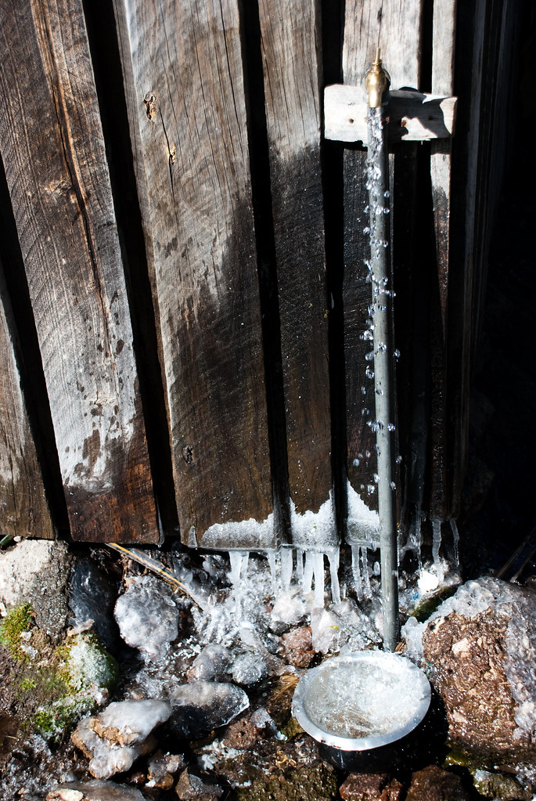
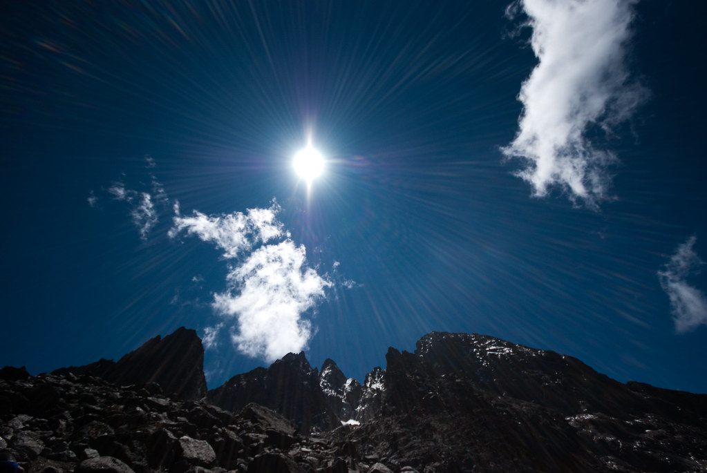
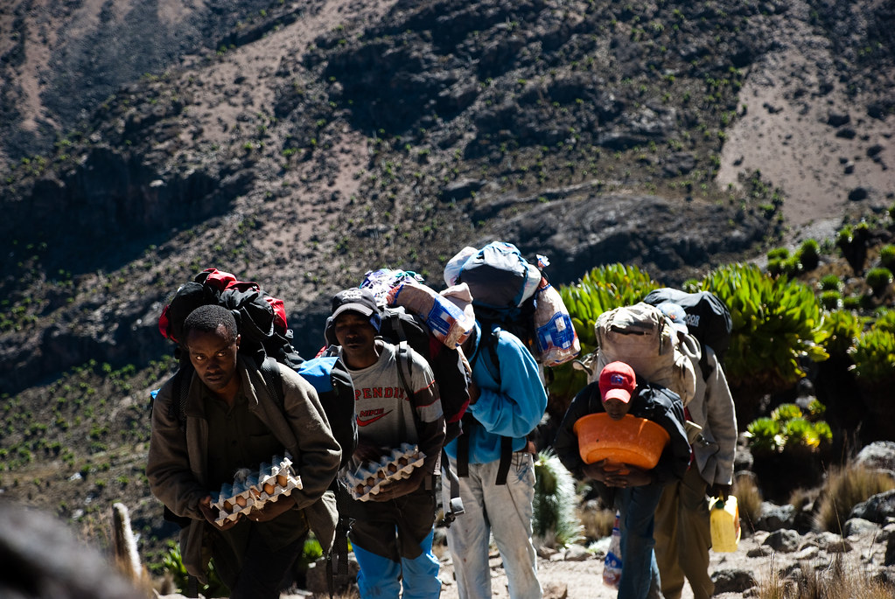
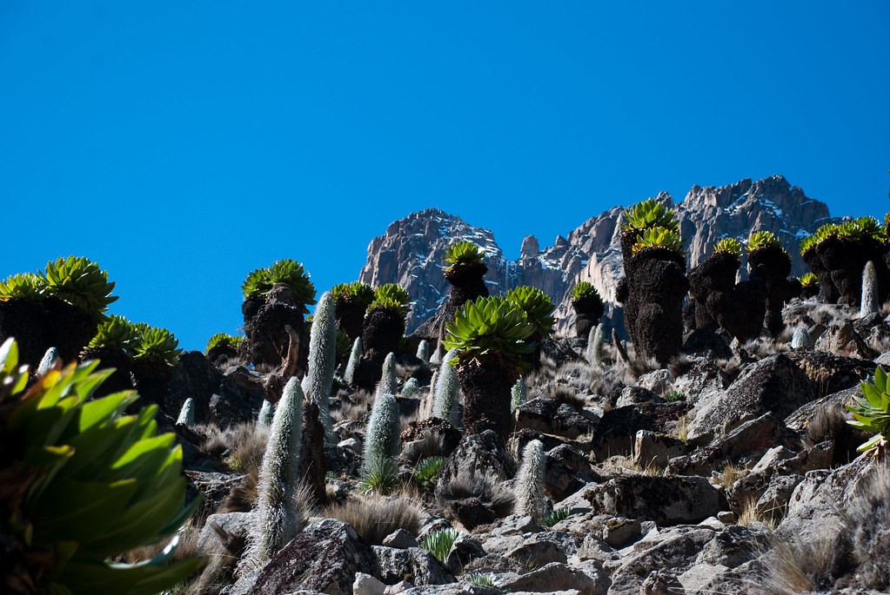
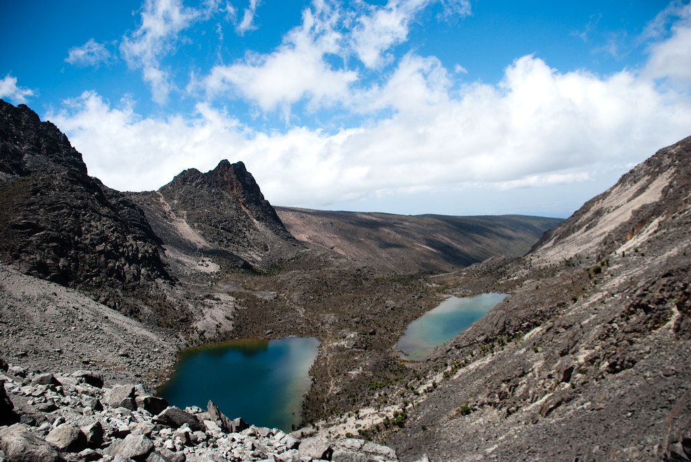
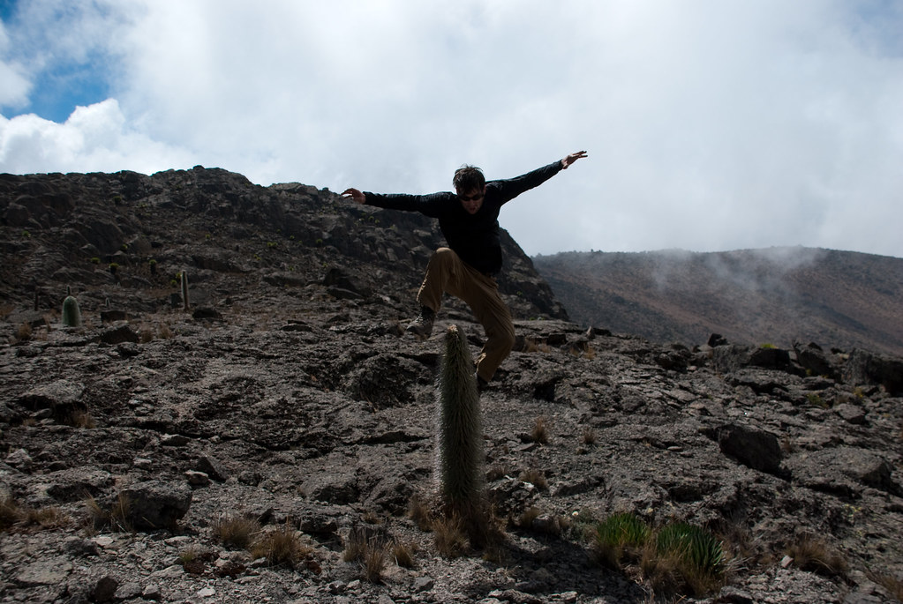
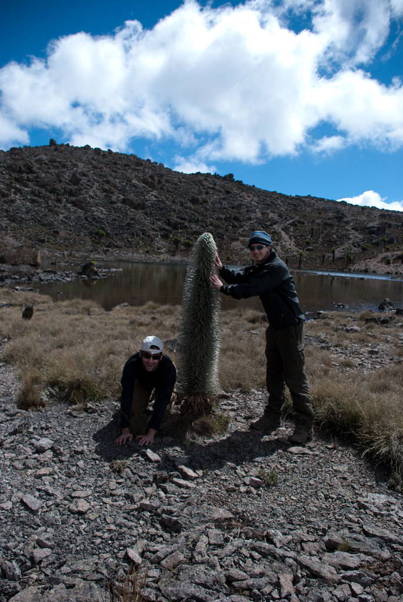
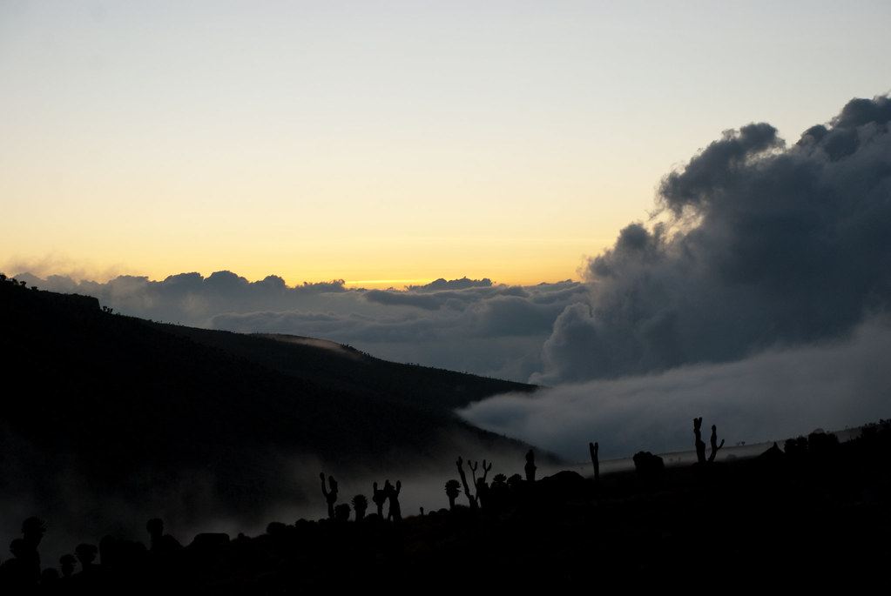

היום נלך ממחנה Shipton’s הממוקם צפון מערבית לפסגת ההר, ונגיע למחנה Mackinder’s שממוקם פחות או יותר באותו הגובה, מכיוון דרום מערב לפסגה.  
באופן עקרוני, אפשר לטפס ישירות מShipton’s לפסגת לננה. המסלול שלנו הקיף את הפסגה, על מנת לעלות אליה מכיוון דרום.

חוץ מזה שלא כדאי לפספס את הקרחונים, האגמים ועמק מקינדרס, המוטיבציה לבחירה במסלול כזה, היא לאפשר התאקלמות טובה יותר לתנאי חוסר החמצן בגובה, על ידי עליה לגובה של כ4,600 מטר וירידה חזרה ללינה בגובה 4,200.

**29/01/2010 – אל בקתת מקינדרס**

אחרי כאב הראש של אתמול בערב, הלילה לא היה קל - אבל בעזרת כמה כדורים הצלחתי בסופו של דבר לישון קצת..  
קמתי בבוקר עם תחושה משונה במח – אבל הרגשתי כבר הרבה יותר טוב.  
אחרי ארוחת הבוקר, המדריך לקח אותי לשיחה כדי לראות אם אני יכול להמשיך.  
הוא הסביר לי שהסיבה שלא הסתדרתי עם כמות החמצן פה, היא שלדבריו אני לא סותם את הפה :)  
דיבור מוביל את הנשימה, וכשחסר חמצן – הגוף צריך לנצל את כל מה שאפשר להשיג..  
סיכמנו שהיום אני אלך אחריו, לא אדבר, ואנשום נשימות ארוכות – וכך היה..

מיום ליום נהיה יותר קר. הלילה, כל נוזל שלא שמר על תנועה מתמדת קפא.

ככל שעולים הנופים נהיים פראיים יותר, וסיפקו לנו תפאורה נהדרת.  
בחלק גדול מהיום השמש שלטה בשמיים נקיים מעננים.  
כל צעד שאנחנו מטפסים מביא אותנו להיות הכי קרובים לשמש שהיינו אי פעם.  
למרות שהקור מסווה את זה – הגובה הרב בו אנו מטיילים, ביחד עם הקרבה לקו המשווה, הופך את קרינת השמש לקטלנית.  
כל איבר שחשוף לשמש חייב להיות מוגן. יואב למשל, שהתחכם ולא מרח הגנה על השפתים - חזר עם שפתיים צהובות!

תמיד נשמעה לי מוזרה העובדה שלמרות שהשמש רחוקה מכדור הארץ כ-150 מיליון קילומטרים -  אם ניסע עשרות קילומטרים בודדים לכיוון כלשהו, קרינת השמש ואיתה האקלים כולו משתנה בצורה לא פרופורציונית.  
גם כשמטפסים – כל ההר העצום הזה הוא בסך הכל בגובה 5 קילומטרים - וזה עושה הבדל עצום! מה הם 5 קילומטרים מול 150 מיליון ?!

ההסבר (לפחות עד שיגיע מדען חדש ויגיד אחרת) הוא שהמרחק מהשמש זה הפרמטר הכי פחות משמעותי בכל המשוואה הזאת.  
זוית הכניסה לאטמוספירה ופיזור הקרניים הם אלו שמשפיעים.   
נו מילא…  אם לא מרשים לי לדבר, לפחות ניצלתי את הזמן כדי לחפש אי-דיוקים ביקום..

")

כמו בכל יום, בזמן שאנחנו צועדים לאיטנו, הסבלים שלנו מספיקים לארוז את כל הציוד, להשיג אותנו ולהכין אוכל במחנה החדש.

כמו אתמול, הצמחים ששלטו באזור היו סביוני הענק והלובליות. ההבדל הוא שהיום אפשר לראות רק את שני הצמחים הללו – צמחים אחרים כבר לא יכולים לשרוד פה.

הסדרת הנשימות והפסקת הדברת החזירה אותי לחיים. עד הצהריים כבר כמעט שלא כאב לי הראש. עד הערב כבר הייתי כמו חדש!

למרות שהיום הזה נועד להיות יום התאקלמות לפני ליל הטיפוס לפסגה, הוא גבה יותר קורבנות מאשר כל יום אחר.  
סמיאן, שלא ישן טוב בלילה הקיא ואם פיגמנט העור שלו היה מאפשר הוא גם היה הופך ללבן כמו סיד.  
מטיילת נוספת בקבוצה התעלפה לקראת סוף היום ועוד שניים החליטו שהם לא ינסו להגיע לפסגה הלילה.

")

 
אני לעומת זאת חוויתי היום תחיה מחדש, בדיוק בזמן לקראת ליל הטיפוס.  
הלילה ב1:30 נתחיל בטיפוס לעבר הפסגה. בלי יום ההתאקלמות הזה (וגזירת השתיקה כמובן), הייתי מחמיץ את הפסגה…  
כשכאב הראש נעלם לחלוטין היה זה בדיוק הזמן לעשות את כל השטויות שהצטברו ולא יכולתי לבצע…

עייפים אך מרוצים הלכנו לישון בבקתה על שם מקינדרס – האיש הראשון שהגיע לפסגת הר קניה.  
אחרי ארוחת ערב חמה שכללה נקניקיות טעימות מחיות שלא מומלץ לשאול מהן, הלכנו לישון מוקדם לקראת הלילה הקשה.

המשך יבוא…
