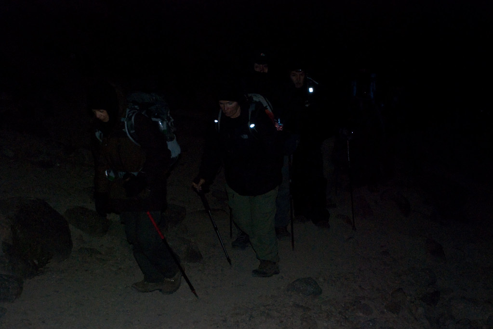
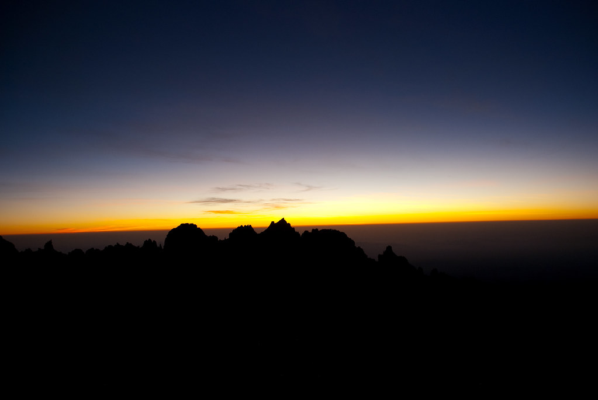
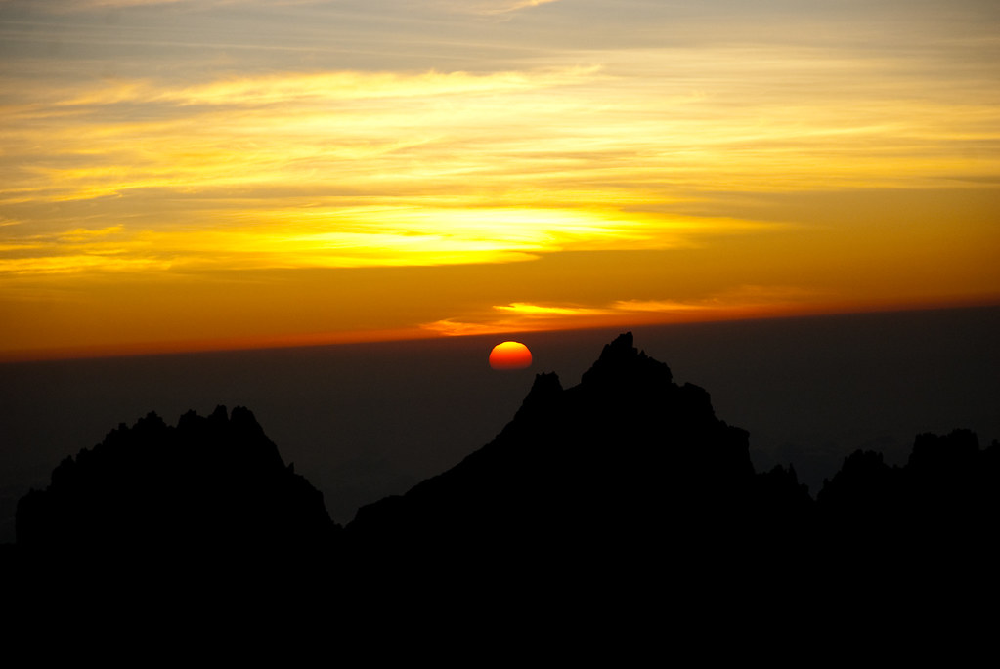
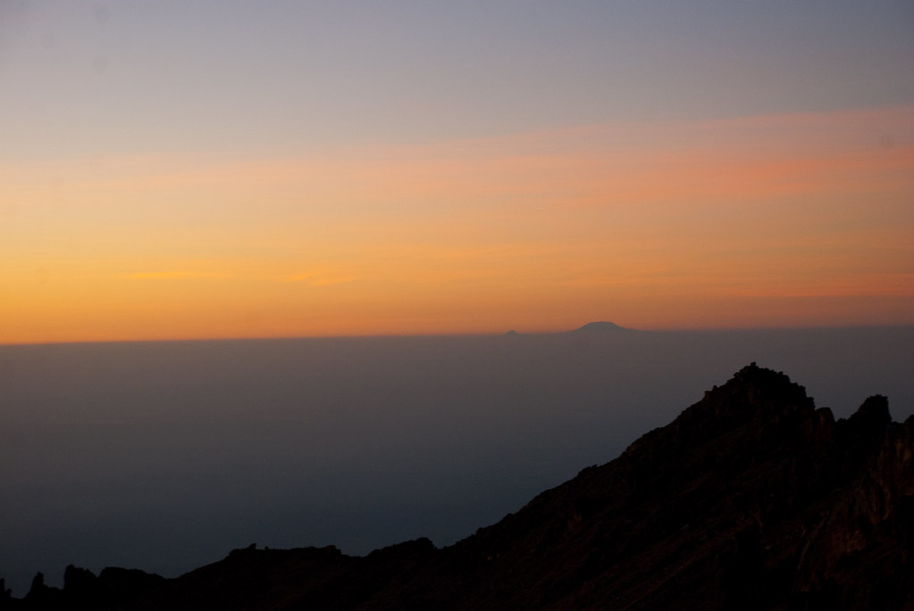
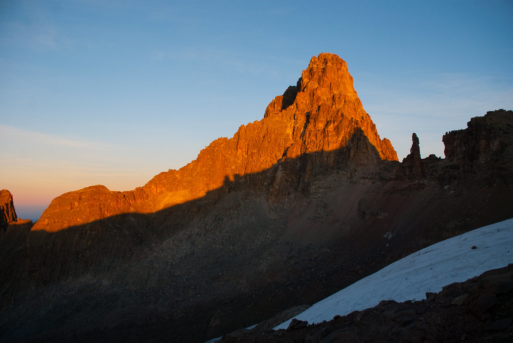
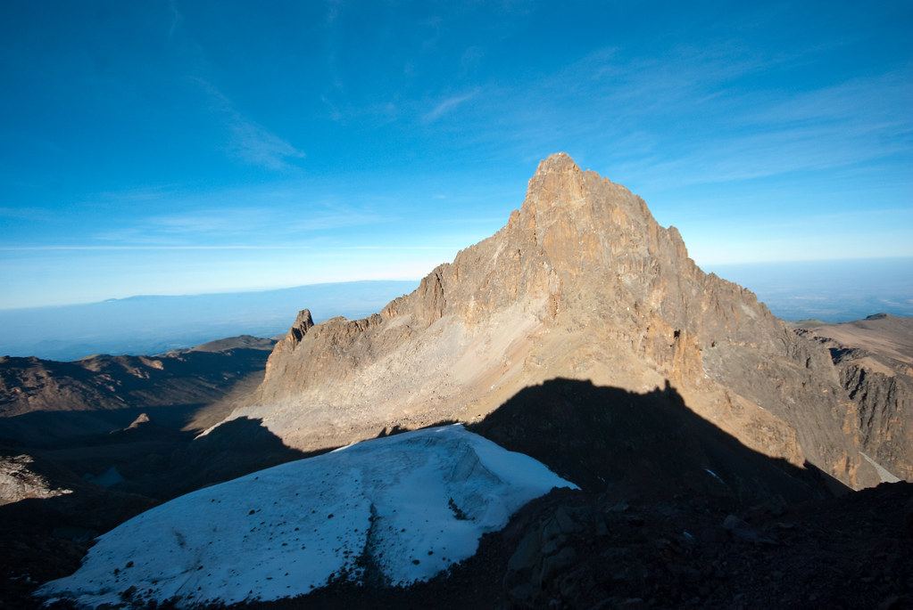
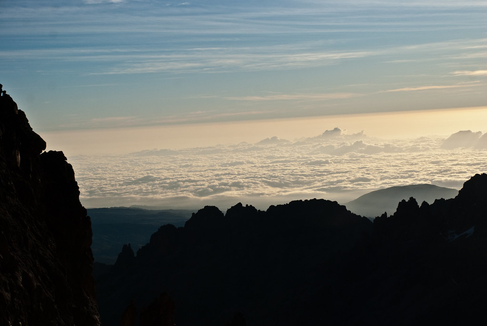
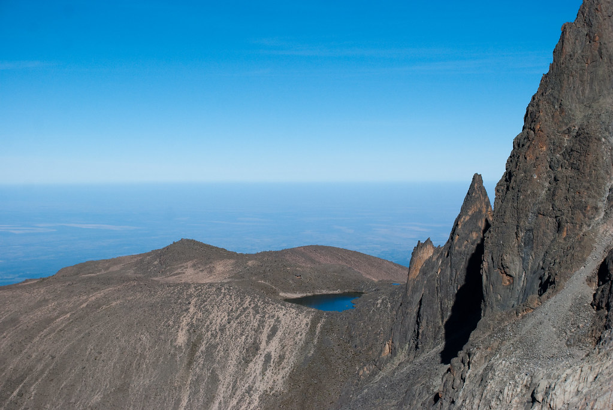
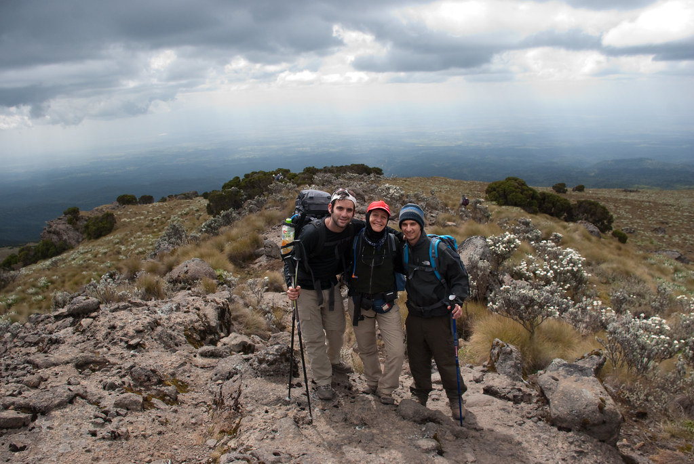
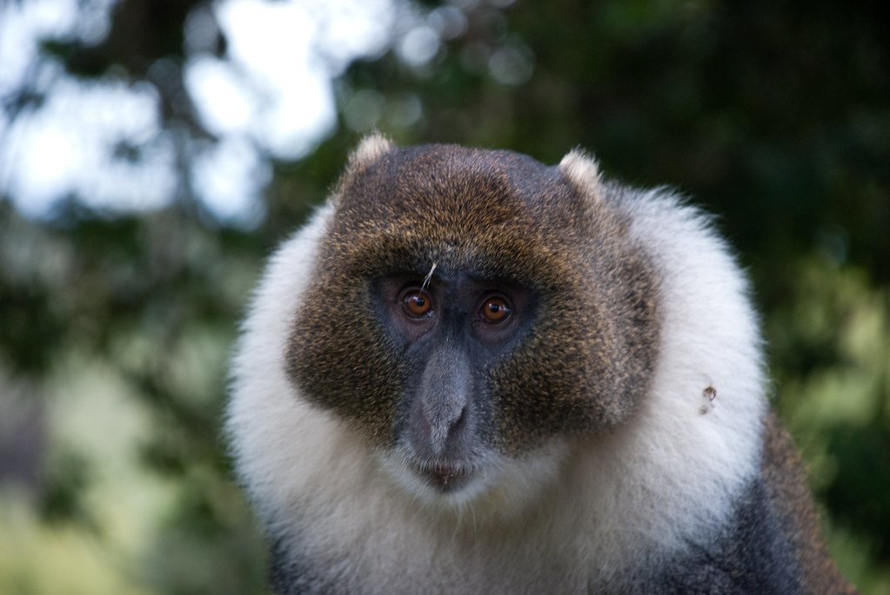

אין כמו השכמה באחת בלילה בקור שלא מאפשר לגעת במד הטמפרטורה מרוב שהוא קפוא.  
אכלנו ארוחת לילה חמה, לבשנו את כל הבגדים שהבאנו ויצאנו לדרך!

**30/01/2010 – עולים לפסגת הר קניה**

כשהירח מלא והשמים נטולי עננים, לא היינו צריכים להשתמש בפנסים שהבאנו.  
הצמחים המוכרים לנו לא התעוררו והיו סגורים בתוך עצמם כדי שלא יקפאו.

 

העליה נהיתה תלולה וקשה ככל שהתקרבנו לפסגה, אבל האוייב האמיתי היה הקור.  
השתדלנו שלא לעשות הפסקות, אבל אפילו בהפסקות של 30 שניות להסדרת נשימה - הגוף עושה את הדבר החכם מצידו ומכבה את עצמו לכדי שינה בעמידה.

העצירה הארוכה ביותר תיזכר לנצח בשל “מופע האימים של א’"  
אולי היה זה הקור, אולי החוסר בחמצן ואולי הירח המלא תיעתע בא’ תיעתועים.  
ללא כל התראה, א’ שבר את השיירה, קיפץ  כשלושה מטרים בלבד הצידה, ופצח בפעילות מעיים מול הקהל שאילולא פחד מהקור היה פוער את פיו עד לרצפה :)  

")

רגע לפני הישורת האחרונה של הטיפוס, השמש החלה להאיר את האופק.  
הזריחה היתה מהפנטת. לקח לי כמה דקות עד ששמתי לב שאני מצלם בלי כפפות וכפות הידיים שלי קפאו.

מסתבר שהזריחות והשקיעות באיזור קו המשווה הן מהירות יותר, ומהר מאד השמש כבר יצאה כדי לבשר על בוא היום.

ברגע של חדות, דניאל המדריך שם לב שניתן לראות את הקילימנג’רו משקיף עלינו מבין העננים כ200 קילומטר(!) דרומה בטנזניה השכנה

עצרנו ב”בקתה האוסטרית” כדי להתחמם ל-5 דק’ ולהמשיך בעליה.  
בבקתה ישנים אנשים שמטפסים לפסגות בטיאן ונליון אליהן נדרש טיפוס טכני (חבלים יתדות ושאר ירקות…)  
הנושרים האחרונים מהטיפוס נשארו בבקתה החמימה ואנחנו המשכנו לעלות ביחד עם השמש שכבר זרחה במלוא הדרה.

בגלל שאנחנו שותים מים בכוסות פלסטיק במשרד, הקרחונים בכל העולם מצטמצמים באופן קבוע – וגם כאן הקרחונים על פסגת הר קניה יחזיקו רק עוד עשרות שנים בודדות.

אף פעם לא הבנתי את כל הנושא ההתחממות הגלובלית והקשר שלנו אליה..  
אני אסביר מייד אחרי ששוב אציין שאני לא מבין כלום באקלים (בערך ברמה של חזאי מזג האויר מן השורה…)  
בכל מקרה, קריאה קצרה על הנושא מאשרת שבכדור הארץ, מאז שהוא קיים, היו המון תקופות של התקררויות והתחממויות עוד לפני שהיתה תעשיה, כוסות פלסטיק ואפילו בני אדם. אז מה בעצם רוצים מאיתנו ?!

 

   
למעשה אם נלך בקו הזה, אפשר להסיק שהדינוזאורים נכחדו בגלל שהם לא השתמשו בכוסות פלסטיק!  
אם הדינוזאורים היו נוסעים בג’יפים ולא היו ממחזרים בקבוקים בסופר, יתכן והיו מונעים את עידן הקרח וחיים איתנו כאן היום!  
לא שאני נגד איכות הסביבה וכל זה.. אבל מכאן לזה שזה משנה את האקלים באופן כל כך קיצוני ?!  
אם כבר להמציא שטויות כדי לחנך את הציבור, אז אני חושב שסדרות ריאליטי גורמות להתחממות גלובלית! (או לפחות לרפיון שכל גלובלי…)  
 

בישורת האחרונה של הטיפוס, למרות שהיה כבר אור יום – הקור היה מטורף.  
כשניסיתי לשתות מקשית השתיה שלי, גיליתי שהמים קפאו בתוכה! 

.jpg "כיבוש הר קניה (4985 מטר + 2 שבדיות)")

.jpg "רגע של ציונות…")

במשך כל העליה לא הרגשתי כאב ראש בכלל – מבנה הטיול עם ימי ההסתגלות הכין אותי לטיפוס בצורה אופטימלית.  
מעכשיו רק יורדים - גמרנו עם הגבהים!

  
הנופים בירידה היו מדהימים, והראות מצויינת.  
לפני שנפרדנו מהצמחיה הטיפוסית של ההר, השארתי את חותמי והעמדתי לובליה חוצפנית אחת במקומה.  
שימו לב שהצמח היה כבר מת מבפנים (– אושר על ידי סמיאן), כך שלא נגרם יותר מידי נזק לשמורה :)  


 *מלחמת הלובליות (פרק ב’)*

   
לא רק מההר אנחנו עומדים להפרד, אלא גם מחלק מהקבוצה, שבקרוב תתפצל וחלק מהאנשים ימשיכו לקילימנג’רו.  
היתה לנו קבוצה מגוונת וטובה. אמנם קצת שיגענו כמה אנשים, אבל בסה”כ היה חיבור מעולה.  
אילנה שימשה לנו דמות אמהית למשך השבוע המדהים הזה.  
 

הירידה היתה ארוכה ולא קלה בכלל, וגם מזג האויר התחיל לאבד את הסבלנות.  
אם נוסיף את העובדה שאנחנו הולכים ברצף מאחת וחצי בלילה עד 5 בערב למחרת – יוצא יום ארוך וקשה…  
ג’קסון, המדריך המקומי, שעד עכשיו תמיד הקפיד שנלך לאט (pole pole), החל לרעות אותנו כמו עדר עיזים - כדי שנספיק להגיע למחסה לפני שיתחיל לרדת גשם.  
הוא חזר כל היום על משפט אחד בלבד – יאררה יאררה, קדימה קדימה (נהוג פה להחליף בין ר’ ל-ל’ בלי הודעה מוקדמת)

לקראת סוף הירידה, המדריכים המקומיים ראו סימנים שהשאירו בפאלו-אים, והכריזו על – נוהל בפאלו.  
כל מה שזה אומר, זה שאף אחד לא נפרד מהקבוצה, ומומלץ לעשות כמה שיותר רעש.

עברנו שוב בין “חגורות צומח” שונות, עד שהגענו לאיזור יער טרופי בו היו הבקתות שלנו.

הבקתות היו נחמדות יחסית למה שראינו עד עכשיו.  
הסתובבו שם קופים שבהתחלה היו אטרקציה נחמדה, ובהמשך הפכו למטרד…  
קוף אחד גנב למישהי את המגבונים הלחים שלה, וכל תיקשלא היה מאחורי דלת נעולה עבר חיטוט ממצה.

היה יום קשה וארוך, אבל ללא ספק, כמו תמיד – הימים האלה הם הימים הכי מדהימים בטיול.

לילה טוב
