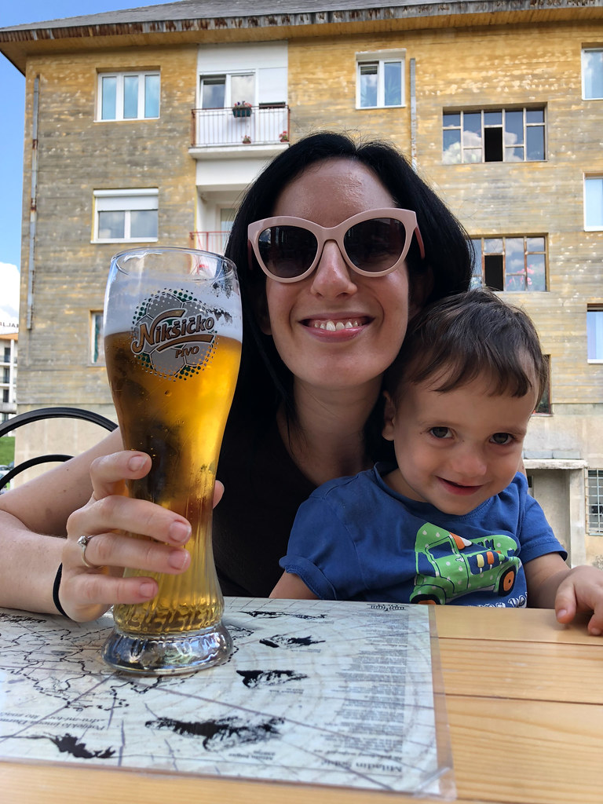
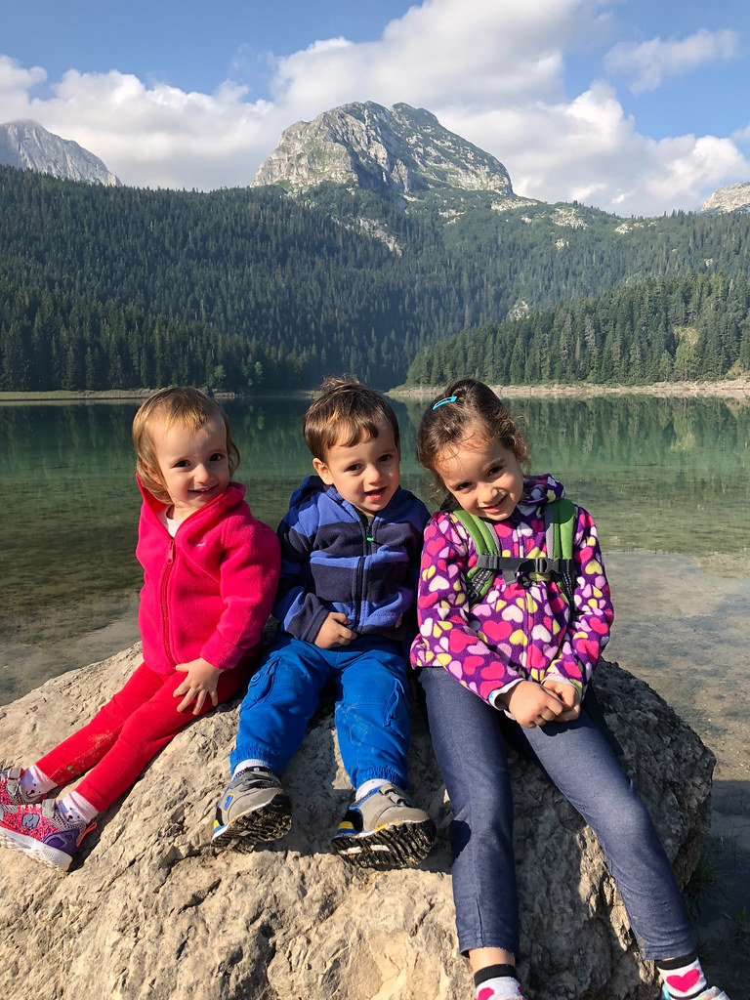
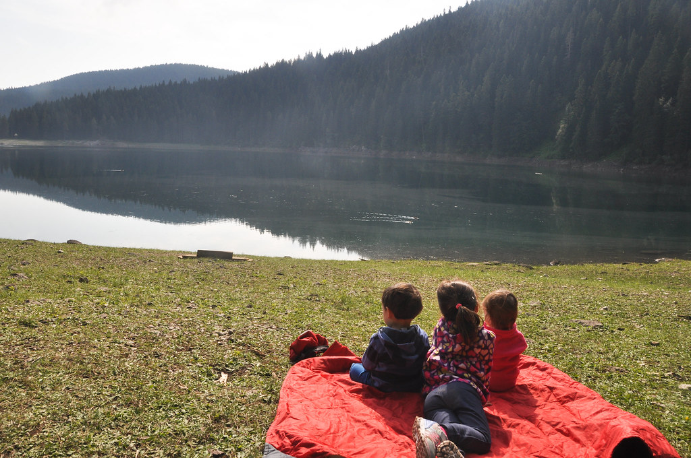

את חופשת הקיץ השנתית של 2018 בילינו במונטנגרו. מדינת ״ההר השחור״, בדומה לשכנותיה שממזרח למסך הברזל, השכילה בעשור האחרון לפתח את ענף התיירות והפכה ליעד זול, קרוב ומרענן. המדינה הצעירה (לשעבר סרביה ← לשעבר יוגוסלביה) אמנם עדיין לא ״מפנקת״ כמו יעדים במערב אירופה, אך מאידך נחבאים בה חבלי ארץ בתוליים אשר טרם ״התקלקלו״ על ידי תיירות המונית. ארבעה שובבים ונמלה עמלנית אחת - שמנו פעמינו אל הכפרים הנידחים של מונטנגרו כדי לקלקל קצת את השלווה באמצעות תיירות המונית!

הטיסה הקצרה עברה בלי ארועים חריגים ומהר מאד יצאנו לדרך ברכב שחיכה לנו בשדה הקטן בTivat  שדמה יותר לתחנת אוטובוס מאשר לשדה תעופה. בעוד אנו ה״גדולים״ שבחבורה התמקדנו במעבר משוכה אחר משוכה כדי להתקדם לקראת תחילתו הרשמית של ה״בילוי״, הילדים הספיקו לחוות כמה רגעי שיא בסימן כלי תחבורה: נסיעה במונית, באוטובוס (בשדה התעופה), טיסה במטוס (המכונה ״ארירון״) ואפילו שייט במעבורת בדרך למקום הלינה. הילדים שקראו בעיון את התוכנייה המפורטת שהכינה הנמלה לטיול, נרדמו במערכה הנכונה ואיפשרו נסיעה קלה לצפון מונטנגרו שם נתחיל את הטיול. 

את הטיול חילקנו לשניים - בחלקו הראשון נטייל בצפון ההררי ובחלקו השני נקנח לחופי הים האדריאטי באיזור היותר תיירותי של המדינה. מקום הלינה הראשון אותו שכרנו הוא בקתת עץ ״באמצע שומקום״ שזכתה לכינוי המפוקפק ״בית הנחשים״.על אף ביקורות הגולשים החיוביות, חששנו קצת בגלל המחיר המגוחך והעובדה שהבית באמת מבודד. ״בית הנחשים״ ממוקם כ10 דק׳ נסיעה מŽabljak - עיירה פצפונת שמשמשת כבסיס לטיולים לפארק הלאומי ״דורמיטור״. בדרך לבקתה עברנו בŽabljak כדי להצטייד בסופר ולאכול ארוחת ערב. למרות שידענו מראש שהמחירים של מוצרי מזון וגם במסעדות יהיו נמוכים, תמיד כיף לגלות את זה בעצמך. שתינו Nikšićko - בירת לאגר מתקתקה וקיצית  (יורו וחצי לחצי ליטר מהחבית(!)), הזמנו מנת טעימות ממאכלי האיזור שנקראה Durmitor Dinner וסוג של גולאש שהיה מדהים. ארוחת הטעימות הכילה מגוון נקניקים מקומיים מעושנים וטעימים ש״העיפו לפיט את המח״ וגבינות מונטנגריות מסורתיות חסרות חן שמוטב היה אם הוצאו מסדר היום המונטנגרי יחד עם הקומוניזם.

כשהגענו לבית הנחשים בדיוק התחיל לרדת גשם. בבקתה קיבל אותנו אביו החביב של בעל המקום שלא דיבר מילה באנגלית וניכר שעבר דיכוי כלשהו בעברו. החששות שלנו מהמקום התפוגגו ושתינו עם הזקן המשונה כוס רקייה (סוג של ברנדי מקומי שמאד מזכיר גראפה). מלבד בקבוק רקייה, נתן לנו הזקן במתנה גם בקבוק יין מונטנגרי ושק ביצים מהמשק הבייתי שלו. הבקתה היתה מושלמת בשבילנו: חצר ,מטבח וסלון גדול בו אפשר להעסיק את הילדים. כשהתחזק הגשם והפך למבול, התחילו בבקתה הפסקות חשמל. בעל הבית הסביר שככה זה באיזור כשיש מזג אויר סוער ושזה לא קורה הרבה. לא הייתי משוכנע בהתחלה בעיקר כי היו המון נרות משומשים בכל חדר, אבל לפחות לא מצאנו שום זכר למלכודות נחשים... בעיות החשמל באמת לא חזרו והיינו מרוצים בביתינו החדש. הילדים התנהגו מדהים וקיבלו את ״אות הנמלה להתנהגות לפי הפרוטוקול״. מחר מתחילים לטייל!

את יום הטיול הראשון שלנו העברנו ב״אגם השחור״ שצמוד ל בŽabljak. בבוקר שרלוט ״ניטרלה״ את הפיטים באפקטיביות באמצעות מגוון סיפורים והפעלות ואיפשרה לנו להגיע מוקדם לאתר. למרות שהאגם הוא אחת האטרקציות היותר פופולריות באיזור, היו במקום פחות מ-10 מקומות חניה. אמנם לנו זה לא הפריע כי ״פתחנו״ את הפארק, אבל זה עוד סימן לדרך שיש למונטנגרים לעבור כדי להתאים את עצמם לתיירות בקנה מידה רציני יותר.

ברגע שהגענו לאגם והתחלנו את ההתארגנות ליציאה, אלכס החליטה להתחיל את הרומן שלה עם מימי האגם וברגע אחד של טיפשות תינוקית חסרת פחד, נכנסה פנימה ונרטבה עד הגרביים. תלינו את הנעליים והגרביים לייבוש על התיק והתחלנו לצעוד!

האגם באמת קסום כפי שמספרים. המסלול סביבו לא קשה במיוחד, אבל כולל כמה טיפוסים וירידות שלא איפשרו לפיטים ללכת את כל המסלול ברגל (במיוחד לא כשאלכס יחפה 😀). מזג האויר היה נעים והילדים נהנו להשתולל בטבע ולאסוף ״מבולבלים״ (איצטרובלים). עשינו הרבה הפסקות כדי לספור ברווזים ששטים באגם, לנשנש וקצת להרגע מהחיים האלה...

באחת ההפסקות הורדנו כולנו נעליים יחד עם אלכס ושיכשכנו רגליים באגם. אלכס, שצריכה תמיד להיות צעד אחד לפני כולם, החליטה שלא הספיק לה ובלי אזהרה מוקדמת ביצעה צוקהרה מרושלת הישר לתוך האגם. הפעם לא נשאר שום בגד יבש. הלבשנו לה את הנעליים שכמעט התייבשו, חיתול יבש ואת המעיל של פיט. וכך במקום פעוטה מתוקה וחייכנית, סיימנו את המסלול עם ״פליט סרבי״ בעל מזג חם :)

לאחר הצצה בתפריט המסעדה שעל האגם החלטנו לאכול בה. הזמנו ארוחת בשרים ענקית במחיר מצחיק ממנה הילדים מאד נהנו. הפליט הסרבי טרף בשר במשקל גופו וקילל בלי סוף בשפה מזרח אירופאית לא מזוהה. כשחזרנו, רכבים חנו על כל הכביש מהפארק ועד ז׳אבליאק. קנינו פירות יער מהדוכנים שכבר היו פתוחים בכניסה וחזרנו לנוח ולשחק בביתינו הקט. בבית הנחשים חיכו לנו עדר פרות שרעו בחלקה השכנה והפכו לטקס היומי של קריאות מחרישות אוזניים ״לילה טוב פרה״!

")

