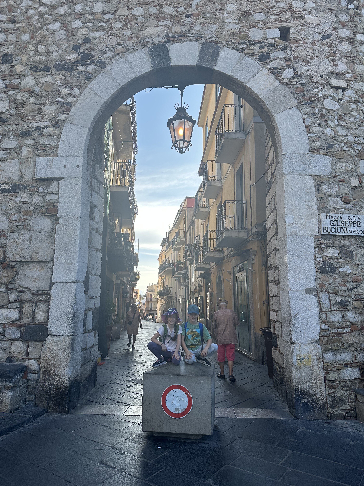
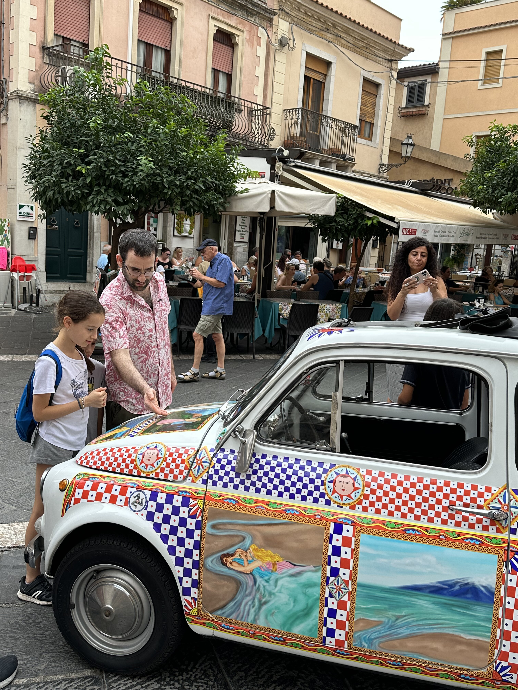
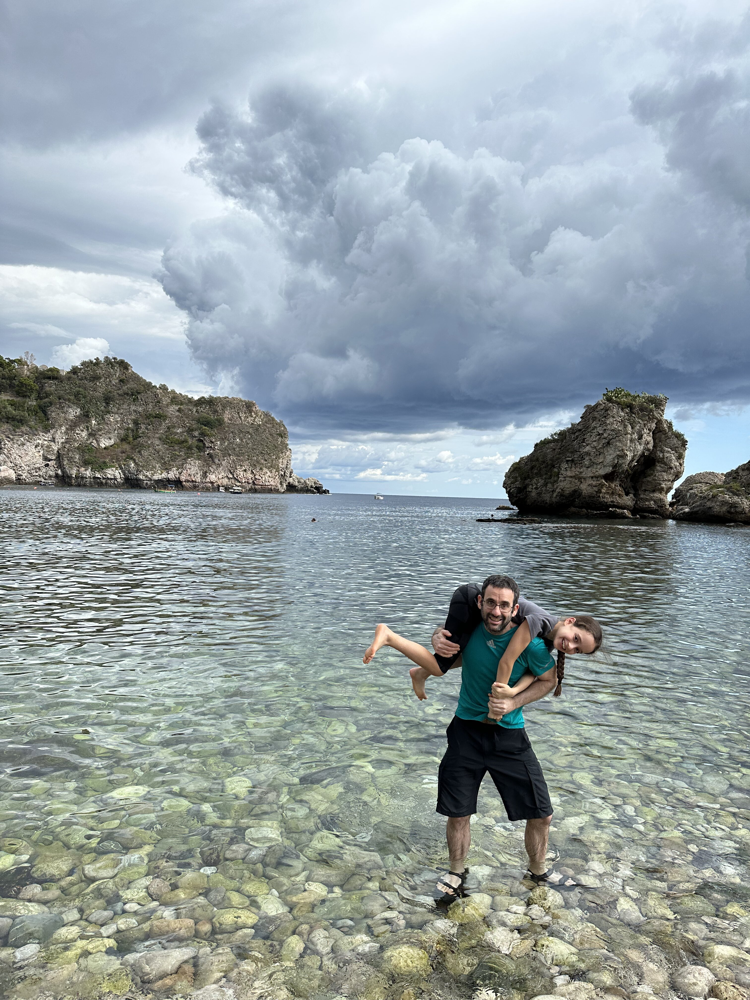

שוב יוצאים לדרך, והפעם לסיציליה!

בשונה מטיולים רבים בהם טבע היה מרכז הטיול, הפעם, עם התבגרות הילדים בחרנו יעד קצת שונה. הרבה יותר עיירות, כפרים, גסטרונומיה וחופים ולא ממש ידענו איך זה יהיה. היה לנו קונקשן קצר ברומא בו הספקנו לטעום ארנצ׳יני, פיצה ואפילו גלידה, אותה אלכס הצליחה ללקק בהתלהבות יתר,  להפיל אל הריצפה כדור בטעם תות ולצחוק מזה בצחוק מוגזם במקום לבכות... נחתנו סוף סוף באי שהוא המחוז הגדול ביותר באיטליה.

הילדים שגדלו העסיקו את עצמם במשך כל הטיסה, ולמורת רוחה של הנמלה, שיחקו חתול ועכבר עם ה״דייל הנמוך״. המטוס היה חדש ותאי מטען-היד היו גבוהים בהרבה מהרגיל - הבנות אהבו לפתוח את התא ולראות את הדייל הנמוך מגיע לקפץ ולסגור - או לקרוא לחבר הגבוה שלו! 

לנו בקרבת השדה ולמחרת בבוקר אספנו את האוטו ויצאנו לדרך! כבר במעמד איסוף האוטו הורגש שוני בין האי ותושביו לשאר יושבי איטליה. לאחר ששכנעה אותנו הפקידה שכדאי להוסיף ביטוח ספציפי למקרה של גניבת האוטו משום שזה דבר שלצערה קורה לא מעט, היא הגישה לנו את הקבלה ואמרה : ״ This is for the 'protection'״. מעולם לא שמעתי פקיד מתייחס לביטוח כיסוי בתור ״פרוטקשן״(!). גם אם זה בניגון איטלקי (או כמו שהילדים אומרים ״קול רוקד״), זה עדיין נשמע קצת מאיים :)

משם נסענו לדירתנו בעיירה Giardini Naxos ולעיירה Taormina. כבר בסיור הראשוני בעיר הבחנו בעוד תופעה סיציליאנית משונה: בהרבה מהעיירות פשוט אין מדרכות - לא קיים. בניגוד לארה״ב שם המצב קיים לפעמים משום שאנשים לא מעוניינים ללכת, כאן פשוט הולכים על הכביש! פרט להבדלים המוכרים בין אופיים של מחוזות הדרום מול הצפון באיטליה - מסתבר שלסיציליה יש תת קטגוריה משלה עבור ״אופי דרומי״. לומר שסיציליה היא שילוב בין איטליה ל״עזה״ זאת אולי קצת הגזמה, אבל זה בהחלט ממחיש את מצב... כשהולכים בעיר תמיד חשוב להשמר מפני מכוניות או מפני הגרסא הסיציליאנית ל״קורקינט החשמלי״ - ה״וספות״ הקטנות שלפחות עושות רעש גדול כשהן מתקרבות. למרות הדימויים, טאורמינה אכן יפה וכיף להסתובב בה. ערכנו סיור היכרות עם העיר ועברנו בכל האתרים בהם כתוב שצריך... העיר היא שילוב קלאסי בין ״ישן״ ל״עלוב״ (קשה לומר ״חדש״ על משהו פה...)

")  

  
  
  
  
  

אך בסופו של יום, הכוכב האמיתי של כל טיול באיטליה הוא האוכל. לסיציליה השפעות יווניות וערביות מובהקות שבאות לידי ביטוי במטבח המגוון שלה. הילדים כבר גדולים ו״זורמים״ עם יותר סוגי מאכלים. לצערי חטפתי מחלה קשה עם חום וחולשה, כך שנאלצתי לתבל את כל המנות בימים הללו במנה גדושה של אספירין מקומי שהצלחתי לחלץ מהרוקח הסיציליאני המטופש. לשמחתי שום מחלה לא מסוגלת לקחת ממני את התאבון כך שגם אני שמחתי להתנחם בשלל המאכלים המקומיים שיש לסיציליה להציע: קנולי ממולא ריקוטה משובחת, גרניטה ופיסטוק משולב בכל מנה (קטגוריה שלמה בתפריט של ״פיצות פיסטוק״) וכמובן - מגוון מאכלי הים המשובחים.

  
  

  
  
  

מקום הלינה שלנו בGiardini Naxos היה מפנק יחסית עם נוף מושלם. מלבד העובדה שכדי להגיע לדירה היה צריך לעלות בכל פעם 99 מדרגות (שנספרו בקפידה על ידי הילדים), זאת היתה דירה מושלמת לקדוח בה מחום ולהתקלח 3 פעמים בלילה :) אם המחלה הזאת עזרה לי לכפר על כל חטאי השנה הקודמת, אז היא בהחלט ״שווה את זה״. הילדים אהבו את הדירה והעבירו בה ״טקס סליחות״ ייחודי במקום רכיבה על אופניים. כמו תמיד, אנחנו אוהבים למצוא סופרים/מעדניות מקומיים ולבשל אוכל מקומי, אם כי הפעם הורדנו את כמות ההשקעה בשל מחלת השף פבריציו. יפה לראות את היחס השונה באזורים בסופר - מסדרון שלם מלא מקררים רק בשביל פסטה טריה - שקיות של פסטה של 5 קילו וכמובן - אינסוף גבינות ונקניקים מגרים בכל מקום.

  

  
  
  

באחד הבקרים השמשיים עשינו טיול מקסים שיוצא מהעיירה טאורמינה אל ה״בולבוליאדה״. המסלול המתואר [כאן](https://www.alltrails.com/trail/italy/sicily/sentiero-dei-saraceni-taormina-castelmora) נקרא Sentiero dei Saraceni מטפס מתוך הכיכר המרכזית של טאורמינה. לאט לאט נעלמים הרחובות (ללא המדרכות) ונפרש לפנינו נוף קסום של המפרץ. המסלול אמנם הוא עליה מונוטונית אבל ממש לא קשה אפילו עם קצת חום :) המסלול מסתיים בכיכר משונה שמה שמייחד אותה הוא אוסף הבולבולים המפואר המקשט אותה. אני לא מתבלבל. מסעדה/גלידריה בשם Turrisi bar מכילה אוסף גדול ודבילי של פסלי בולבולים בכל הצורות והגדלים. התפריטים הם בצורת האיבר הזכרי וכך גם ידיות הדלתות. למה? כנראה כדי למשוך תשומת לב - דבר שאלפי זרגים בהחלט מצליחים לעשות. אחרי החוויה המשונה, ירדנו חזרה לעיר. בדרך אלכס הצליחה איכשהו, ממש כמו בסרט מצוייר, להתנגש בקקטוס ולהתמלא כולה בעשרות קוצים מרושעים (הפעם היא כבר בכתה במקום לצחוק!).

  

  
  

משם המשכנו לחוף המפורסם של טאורמינה - Isola Bella. בשל מיקומה של העיירה על ההר, החוף מונגש באמצעות רכבל שיוצא ממרכז העיר. החוף מפורסם בעיקר בזכות האי שממוקם ממש מולו. אל האי, כתלות בגאות, אפשר לצעוד במים (או לשחות) ולשוטט על חופיו ובטירה העתיקה שבו. כיתתנו רגלינו אל האי - חלקנו מרצון וחלקנו בכח :) החוף באמת נחמד ויפה. אחרי שהיה קצרה בחוף החל גשם, מה ש״הכריח״ אותנו ללכת לאכול ״גלידת גשם״. החיים טובים! המשך יבוא.

  
  
  
  

