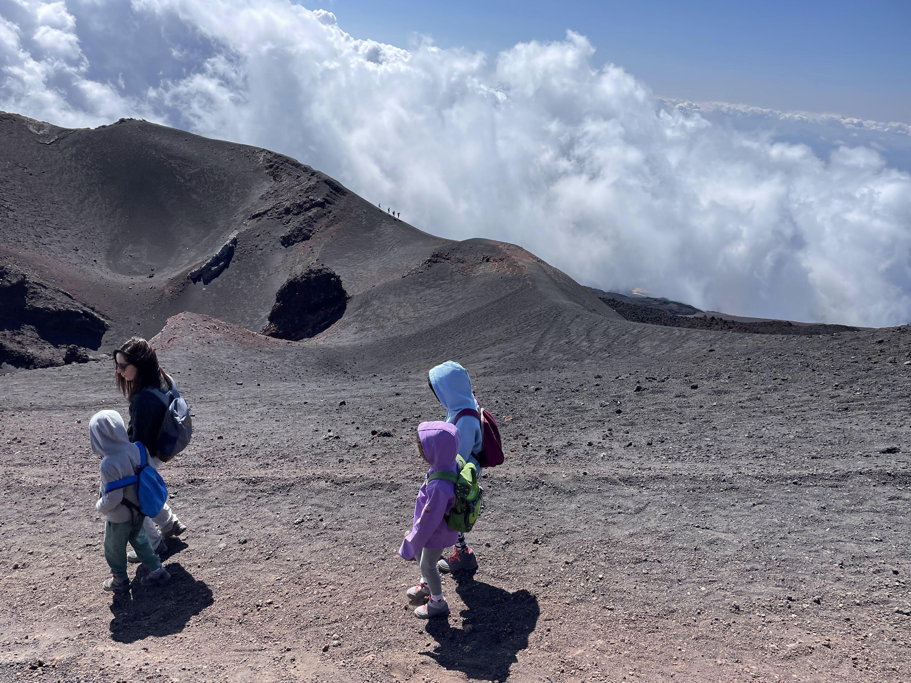

ממקום הלינה בGiardini Naxos, יצאנו לשתי גיחות יומיות לחקור את הפעילות הגעשית של איזור קטניה (Catania). האיזור כולו ממוקם על תפר בין לוחות טקטוניים. הלוח האפריקאי שוקע מתחת ללוח האירו-אסייתי ומאגמה לוהטת פורצת את קרום כדור הארץ.

הר האטנה המפורסם של סיציליה הוא הר הגעש הפעיל הגבוה באירופה ואחד מהרי הגעש הפעילים ביותר בעולם. ההר מתפרץ כמעט בכל שנה ומידי פעם משמיד את הרכבל ואתרי התיירות הסובבים אותו. נקודת היציאה לרכבל נמצאת בגובה 1910m. טיפסנו עם הרכב מגובה פני הים עד לנק׳ היציאה. כשחנינו ההר כולו היה מכוסה עננים וגם אנחנו, כך שלא ניתן היה לראות כלום. בחוץ היה קפוא, ונוסף לכל עדיין הייתי חולה עם חום. החלטנו לעלות בכל מקרה - לא בכל יום יוצא להגיע למקום כל כך מפורסם. העליה השתלמה מאד מפני שבעזרת הרכבלים ורכבי ה 4x4 נסקנו מעל העננים שם התגלו מכתשי ההר במלוא הדרם והשמש זרחה וחיממה אותנו. בדרך כבר חשבתי להשאר באוטו ולא לצאת אל ההר, אבל אחרי שהילדים כיסו אותי בסווטשרטים שלהם מרוב שרעדתי מקור - לקחתי מנת יתר של אספירין סיציליאני ויצאתי לאויר הצונן מלווה בשמש מלטפת. 

  
  

הנופים בהם חזינו בסיור הרגלי בין מכתשי האטנה היו מרהיבים (עד כמה שאני זוכר מטריפ האספירין והחום בו הייתי). ההסברים של המדריך לא היו מעניינים מספיק, אבל מי צריך אותו... מעניינת העובדה שסביב ההר יש לא מעט ישובים שלא מוכנים לעקור: הטענה היא שהאדמה הפוריה מצדיקה את הסכנה, וגם שקצב זרימת הלבה מגובה האטנה הוא איטי יחסית ויהיה להם מספיק זמן להתפנות. מההתרשמות שלי עד כה, הסיציליאנים הם די ״ישראלים״ במובן ה״חאפרי״ של המילה. לא מן הנמנע למצוא בעתיד כפרים של איטלקים צלויים ובהם נערכים סיורים עם הסברים הרבה יותר דרמטיים - ואולי גם סרט טוב.

  

  
  

את המשך הסיור הגאותרמי בסיציליה העברנו בשייט לאיים האאוליים (נקראים גם האיים הליפאריים) בראשם האי שהוא הר הגעש המפורסם סטרומבולי! הר הגעש סטרומבולי מפורסם בזכות ההתפרצויות התכופות שלו שמזמינות מאות אלפי תיירים בשנה לחזות בפלא. סוג ההתפרצות הגאולוגית התכופה הזה מכונה בפי גאולוגים על שמו ״התפרצויות סטרומבוליות״. בעיני יש פה פספוס נוראי: השם סטרומבולי הרבה יותר מתאים למאכל איטלקי בצקי ממולא בגבינה ובשר מאשר להר געש. המטבח ה״איטלקי-אמריקאי״ למעשה יצר כזה מאפה - ובאופן נדיר אני נאלץ לצודד באמריקאים. ממש חבל, כל כך מתחשק לי סטרומבולי! את ההפלגה הזמנו עוד מהארץ - היציאה בצהריים והחזרה בלילה אחרי השקיעה. כשאני כבר בשלבי החלמה מהמחלה לקחנו את הבוקר באיזי עם ארוחת בוקר איטלקית של גואנצ׳אלה עם ביצים. 

  
  

אך לים היו הבוקר תוכניות אחרות בשבילנו. הים בשיט לאי הראשון Panarea היה סוער, ומסתבר שהנמלה (בנוסף לגן שאחראי להולדת תאומים) הורישה לעלמה ופיט את מחלת הים שלה. לאורך הנסיעה כולה הנמלה ושני ה״ירושלמים״ התפרצו כל כמה דקות בהתפרצויות סטרומבוליות סדירות ממש כאילו אכלו סטרומבולי מקולקל! השיט היה קשה מאד. כשהגענו סוף סוף לאי הילדים התאוששו די מהר והנמלה התרסקה על ספסל ו״נכבתה״. נתנו לה לנוח והלכנו ״לחפש צרות״ באי. מצאנו מקום שמוכר גרניטה סיציליאנית והתרעננו עם גרניטה בטעמי לימון, פיסטוק וקפה (עם קצפת!). הגרניטה היא בגדול ״ברד״ עם יחסי ציבור, אבל מצד שני כל דבר בו נוגעים האיטלקים עם חומרי הגלם שלהם הופך למופלא.  

  
  
  
  
  

ההפלגה לאי סטרומבולי כבר היתה הרבה יותר רגועה, והתחזיות שלי להתפרצויות בטעמי גרניטה התבדו לחלוטין. בסטרומבולי, לפני הפלגת הלילה הסתובבנו קצת ומיהרנו למצוא מסעדה. כולם היו כבר מורעבים אחרי שלא ממש אכלו מהבוקר. לקחנו טרמפ משודד מקומי שהסיע אותנו בצורה פרועה ב Piaggio Ape שלו (הרכב המצחיק עם שלושת הגלגלים שמכונה גם ״אוטו וספה״ ושגור בפי הילדים בתור ״האוטו כמו ב׳מיסטר בין׳״). מצאנו פיצריה נחמדה וביקשנו מהמלצרים, שלא דיברו מילה באנגלית, להביא לנו את הפיצה ״הכי טובה שיש להם״ ואת הדג הכי טרי שדגו. אני לא יודע איך בדיוק זה קרה, אבל רצה הגורל ולשולחן הוגש מאפה שהוא חד משמעית ״הסטרומבולי האמיתי״! זללנו הכל ויצאנו להפלגה הלילית האחרונה לשמה הגענו עד הלום.

  
  
  
  

  

בנסיעות המשפחתיות אנחנו אוהבים לשמוע פודקאסטים. האזנו לפודקאסט על הרי געש בו כמובן כיכבו האטנה וסטרומבולי. הר געש מתפרץ הוא לא מראה שיוצא לראות הרבה - השיט האחרון היה מלהיב ולא פחות חשוב - שקט. לקראת ערב הים רגע וההתפרצויות היחידות היו של מאגמה רותחת עמוק מבטן הסטרומבולי. ההר לא איכזב וסיפק שלל התפרצויות מדודות שנראו בבירור לאחר השקיעה. חוליית חולי הים ניצלו את העדר הגלים והתרסקו לשינה בהפלגה חזור. 

  
  
  

  
 

בעקבות המחלה שלי, שינינו קצת את התוכניות ונאלצנו ״לחתוך״ טיול טבע בנקיק Golle Alcantara אליו נאלץ לחזור בפעם אחרת. מכאן נעזוב את מקום הלינה המפנק ב Giardini Naxos ונמשיך להרפתקה שלנו בסיציליה.

המשך יבוא...
