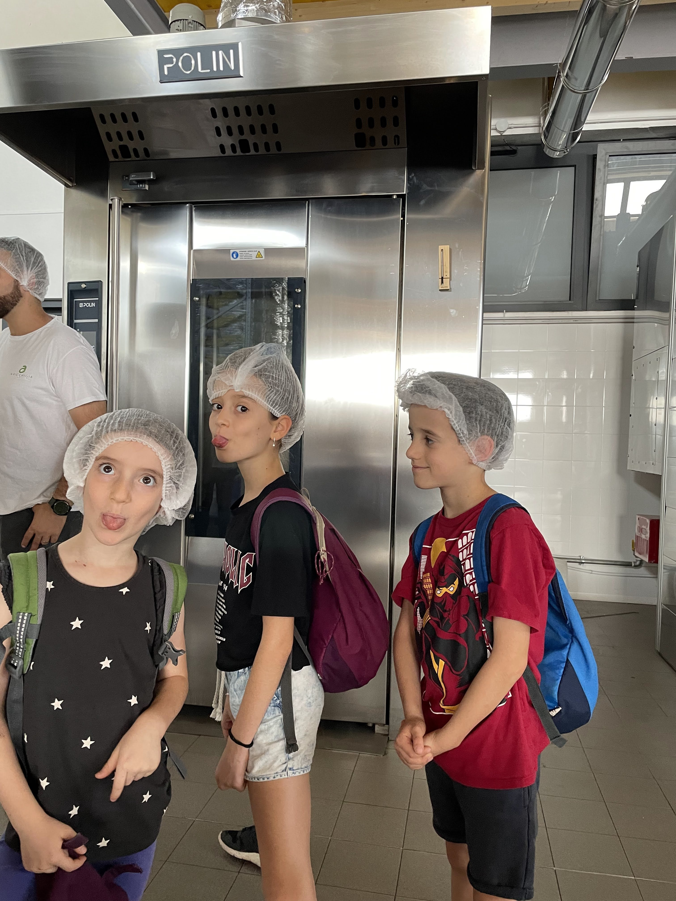
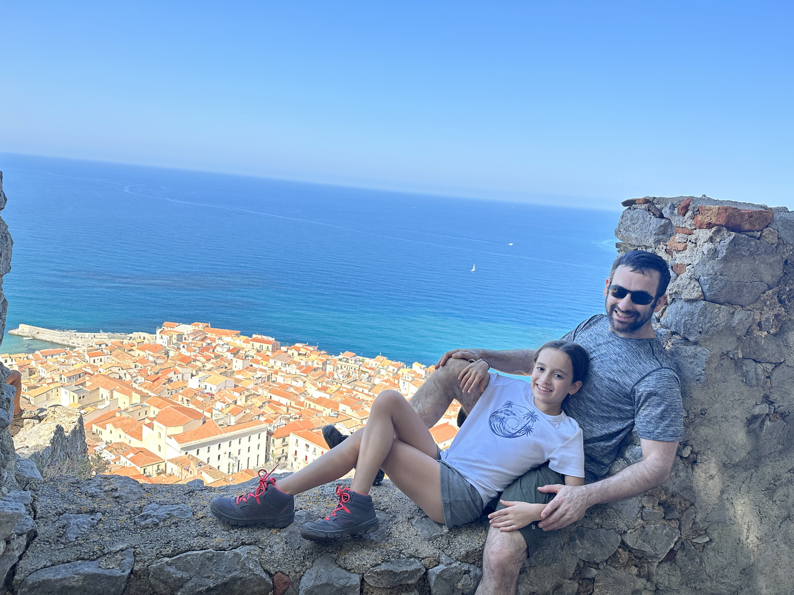

מאיזור הר האטנה וטאורמינה נדדנו למקום הלינה הבא שלנו - בצ׳פלו (Cefalù). הדרך אורכת כ3 שעות נסיעה ובאמצא אין יותר מידי דברים לעשות. לא שאנחנו מפחדים מנסיעות ארוכות (בטח לא אחרי הטיול הארוך בארה״ב), אבל ניסינו לשבץ משהו לעשות על הדרך. האופציה היחידה שנראתה מעניינת בדרך היתה העיירה Bronte, שכל מה שמיוחד בה הוא שבאיזורה ממוקמים כל שדות הפיסטוק הסיציליאניים. בהתחלה היינו קצת ציניים לגבי אטרקציות שנראות מאולצות אבל החלטנו לנסות לעשות סיור מודרך בשדה פיסטוק הכולל ארוחת צהריים מפנקת בשילוב פיסטוקים. הזמנו סיור ב[A Ricchigia](https://www.aricchigia) ולא התחרטנו.  

  

משום שהסיור הוא באנגלית, וכדי לייצר ערך מוסף התכוננו ל״חגיגת הפיסטוק״ בהאזנה לפרק בפודקאסט ״לדבר זה לא משמין״ שחופר על פיסטוקים. הילדים להפתעתי התעניינו ובאו מוכנים לסיור. הסיור היה מותאם לאמריקאים כך שלא התעמקו מספיק לטעמנו בהיבטים הקולינאריים - מה שהתאים לנו כי יכולנו לתרגם לילדים סימולטנית ובשילוב החפירה בדרך, הכרנו כבר את רוב החומר. הצטרפנו לקבוצה של פנסיונריות אמריקאיות מפלורידה שחלקן התקשו להבדיל בין רימון לאגס. הילדים קיבלו מטלה ״למפות״ אילו ניתוחים עברה כל גברת.

הסיור היה בדיוק באורך המתאים והסביר את האתגרים בגידול הפיסטוקים. פרט לעובדה שהעץ המגושם דורש הרבה התעסקות עד שהוא מניב פרי ומניב רק אחת לשנתיים, הקטיף הידני בטמפרטורות שמגיעות ל40 מעלות צריך להעשות בבגדים ארוכים כדי להמנע ממתקפה של השרף הדביק של העץ.  בהחלט אפשר להבין מדוע האגוז כל כך יקר ומכונה פה ״הזהב הירוק״. טכנית בכלל לא מדובר באגוז, וטכנית לולא האמברגו האמריקאי על אירן היה אפשר להוזיל משמעותית את העלויות (באמצעות אירנים קשי יום), אבל זה מה יש.

בנוסף היה מעניין ללמוד שיעור במיתוג מהאיטלקים שחומרי הגלם שלהם נמכרים בכל העולם ומכניסים למדינה המון כסף. המוצרים של החברה מתחלקים ל3 קטגוריות - רגיל - ממרחי פיסטוק וחומרי גלם, יוקרה ואורגני (באיטליה ״ביו״). כמעט אין שום הבדל בין המוצרים פרט לתווית והמחיר. כדי למכור מוצר ״יוקרה״ במעדניות נחשבות, הרוכשים רוצים בידול כך שלא יהיה מוצר זהה בסופר. על מנת לצאת ידי חובה עשו הבדלים זניחים כדי להצדיק עניינית את הבידול. כל התוצרים שלהם אורגניים, ההבדל בסדרה האורגנית הוא בתהליך שהוא עובר על ידי בודקים חיצוניים ושהתוספות שהם מכניסים גם חייבות להיות עם תקן ״אורגני״. נשמע כמו עסקה טובה לקטוף פיסטוקים פעם בשנתיים ב40 מעלות. אם רק היו סוללים פה מדרכות הייתי מוכן לשמוע הצעה.

  
  
  
  
  

הארוחה היתה מפנקת והשאירה טעם של עוד. ההאיטלקים המרגיזים כל כך מתגאים בחומר הגלם הטרי שלהם כך שהם עיקמו פרצוף כשביקשתי לקנות פיסטוקים קלויים מומלחים - אין להם דבר כזה... נו מילא. בנוסף לחמאת פיסטוק לבישול, קניתי שקית פיסטוקים אותם אקלה בעצמי!

משם המשכנו לדירה ששכרנו בעיירה Lascari שליד Cefalù. בנוסף לדירות, בעלות המקום הגרמניות מנהלות גם מועדון חוף קטן (Lido) ומסעדונת כך שהשהות כוללת מקום בחוף וארוחת בוקר. נהננו לנצל את הים ולנפוש קצת. בערב הלכנו ברגל למסעדה מקומית שהגישה מאכלי ים טריים וכמובן גם את מצעד הפחממות האיטלקיות. היה מעודד שיום בלי טיול בטבע או איזו ״אטרקציה״ היה כל כך מהנה. הילדים גדלו וגם מרחב התמרון שלנו והדברים שאפשר לעשות יחד.

  
  
  
  

טונה טריה עם... זהב ירוק

  
  

למחרת העברנו עוד יום מושלם בצ׳פאלו שהתחיל בטיפוס למבצר מימי הביניים [La Rocca di Chefalu](https://www.alltrails.com/trail/italy/sicily/la-rocca-cefalu). בדומה לטיפוס שיצא מטאורמינה, המסלול מתחיל בטיפוס ברחובות העיר נטולי המדרכות והתחמקות מ״וספות״ חולפות. ככל שטיפסנו נגלה לפנינו הנוף במלוא הדרו עד למבצר עצמו, ממנו היה ניתן להשקיף ב360 מעלות על האיזור כולו.

  

  
  

  
       

אחת התופעות הזכורות מהיום הוא כל נושא השפמים. כן.. שפמים! אמנם הסיבה לתופעה לא פוענחה עד עצם היום הזה, אך הם היו בכל מקום: על אנשים, בטבע, בתור הלוגו של הגלידריה שבחרנו במקרה, על פסלוני החרסינה שקישטו את הרחובות - היתה הרגשה שהם מנסים להגיד לנו משהו.

  
  

  
  
  

ירדנו מהמבצר, הצטננו עם גלידת שפם, התחממנו שוב עם פיצה טעימה, ואז הצטננו בפעם האחרונה להיום באחר צהרים ארוך על חוף הים בLido בצ׳פאלו. המים היו בטמפרטורה מושלמת, החול רך והגלים בדיוק בגובה שאפשר לילדים להנות מהם. עוד תופעה משונה שארעה בחוף שלימים כונה על ידי עלמה שרלוט ״החוף המושלם״, היא שעלמה, במשך כ45 דקות, לבדה לגמרי, ביצעה ריקוד משונה ביותר עם הגלים והיתה מאושרת עד הגג.

  
")

  
  
  
  

בערב בישלנו בדירה של הגרמניה. מהיום בו נחתנו בסיציליה היה לי חשק לא מוסבר ל״שניצל דג״. כזה שפריך מבחוץ ועסיסי מבפנים. למרות שזה ממש לא מאכל שקשור לאיזור, זה מה שהגוף שלי רצה... כשראיתי את דג החרב הזה בסופר - ידעתי שזאת ההזדמנות שלי לטפל בחשק הזה בעצמי.

  
  
  
  

למרות ש״על הנייר״, שקלנו לדלג על צ׳פאלו בתוכנית שלנו, מאד נהנינו מהיומיים הללו. התבגרנו כמשפחה וסוג ההרפתקאות אליהן אפשר לצאת עכשיו מגוונות ועשירות - עולם: ראה הוזהרת! אפילו המארחת הגרמניה הקשוחה שנודעה בפי הילדים בתור האישה ״שאוכלת ברק ומפליצה רעם״ התרככה קצת והסבירה לנו פנים בארוחת הבוקר. 

  

מכאן - נוסעים דרומה: המשך יבוא...
