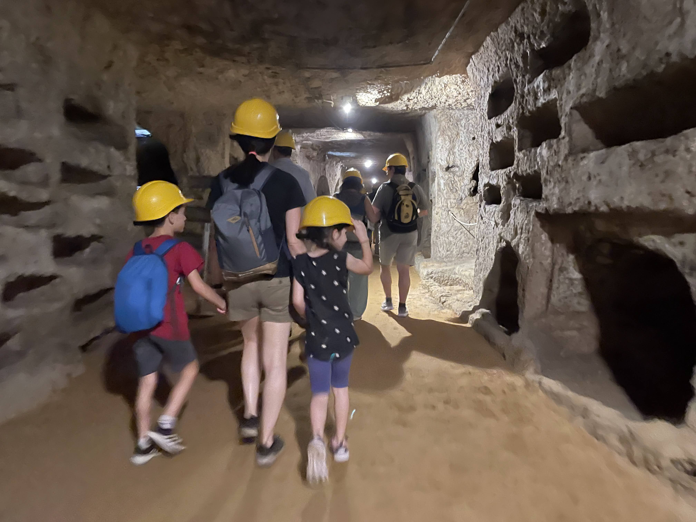
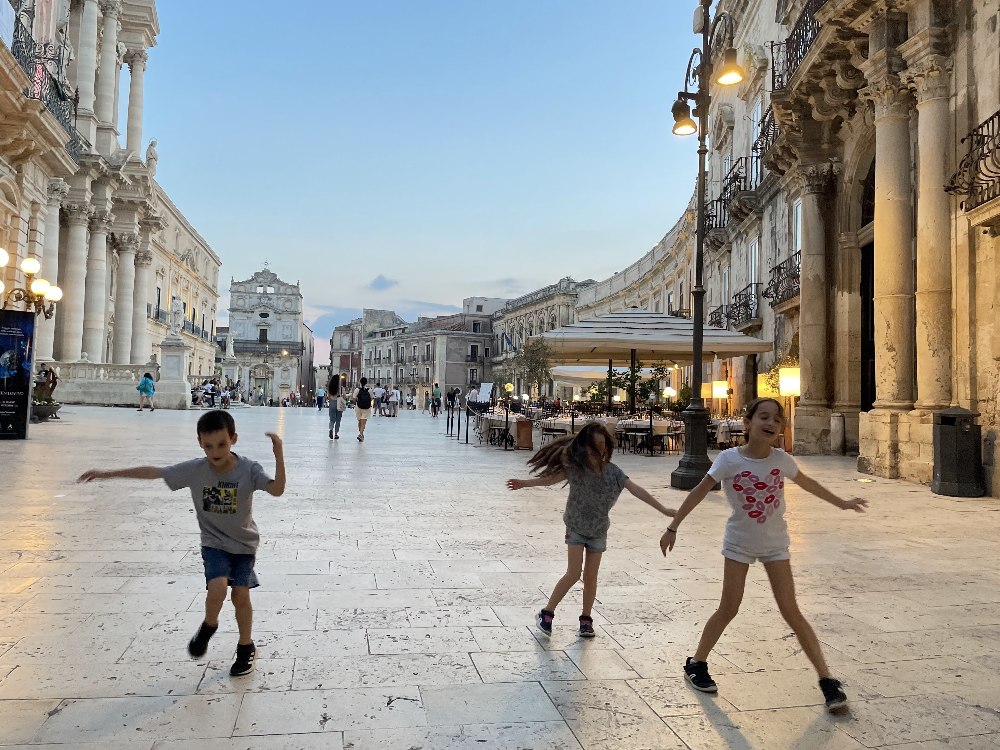
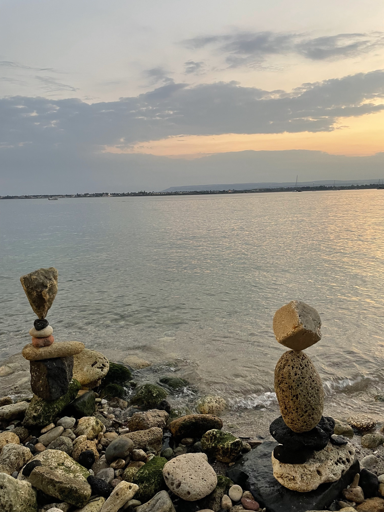
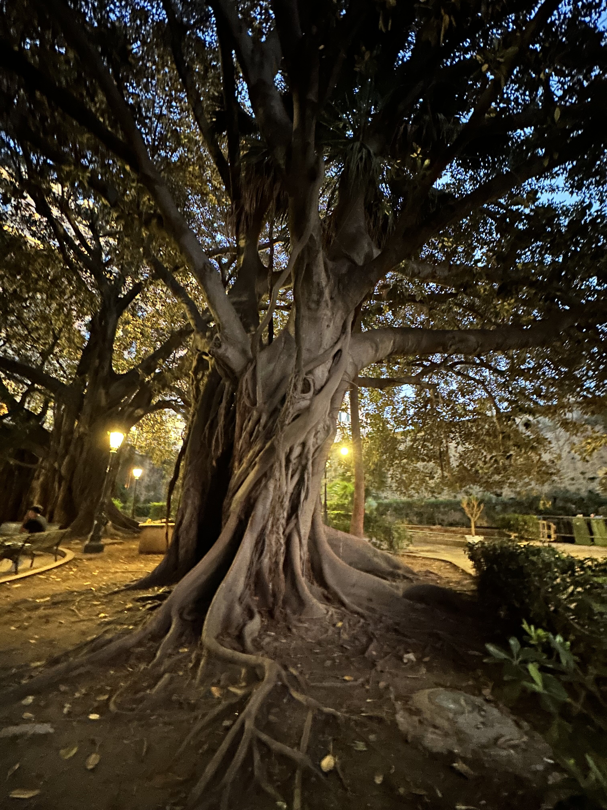
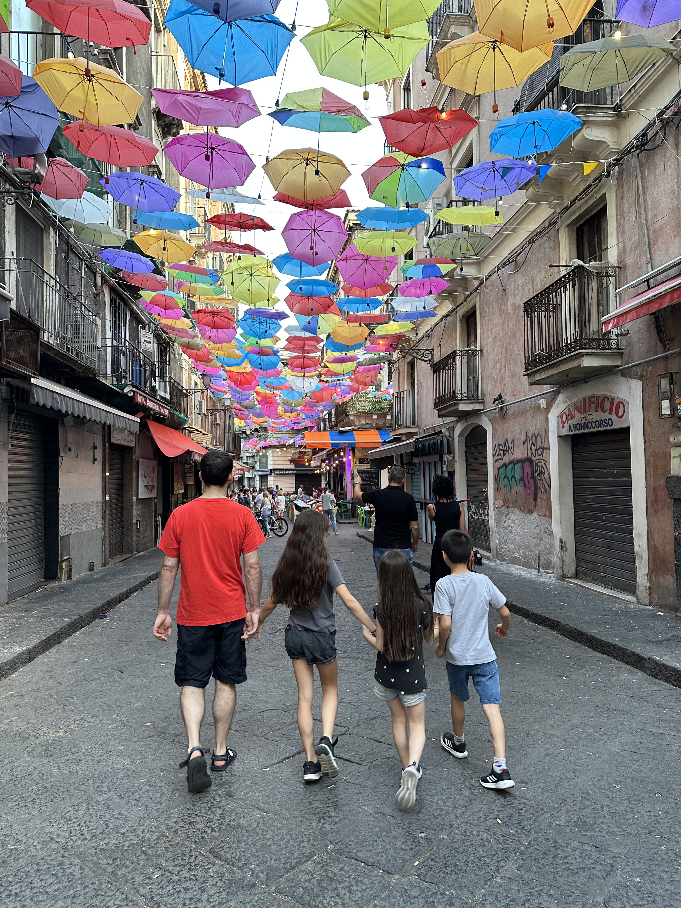

את הטיול בסיציליה קינחנו בעיר הנמל סירקוזה. העיר העתיקה הזאת מושכת אליה המוני תיירים בעיקר בזכות ההיסטוריה העשירה שלה. התמקמנו בדירה ששכרנו מ״אנטוניו החמור״ - איש נפלא עם המלצות שהוכיחו את עצמן בכל פעם, לו הילדים התעקשו לקרוא ״החמור״ בלי שום סיבה. התלונה היחידה על הדירה היא שהפחים ממוקמים במסדרון מחוץ לדירה מה שאילץ אותנו להסתובב במסדרונות כך ולזמר:

  

ריווחנו את כל ״נושא העתיקות״ וההיסטוריה על פני 3 ימים שונים כך שלא יהיה ״כבד״ מידי והאמת היא שהיה נחמד מאד. האתר הראשון בו ביקרנו היה הקטקומבות של סן ג׳ובאני. המערות המטורפות הללו מכילות כ 40,000(!) קברים שונים ומשונים. האתר שהוקם במאה הרביעית לספירה לא מכיל כרגע קברים מכיוון שהוא נבזז במשך השנים, אך לגמרי יש הרגשה של "סקובי דו" באוויר. אל המערות ניתן להכנס בסיור מודרך בלבד ורק לאיזורים מסויימים - אחרת בקלות אפשר ללכת לאיבוד במבוך העצום. המדריכה הסבירה באנגלית ובאיטלקית כך שהספקנו לתרגם סימולטנית לילדים בזמן בו המדריכה דיברה באיטלקית. מידע חיוני למבקרים: המדריכים לא אוהבים שיושבים בתוך הקברים, או שבפתאומיות מזמרים ״הקאטאקאטאקאטאקומבה״!

 

  

בערב ביקרנו באי ״אורטיג׳ה״ שמחובר לעיר באמצעות גשרים ומהווה את האיזור העתיק והתיירותי ביותר בעיר. עברנו בין כמה מנקודות הציון ה״חשובות״ באי אך בעיקר נהננו להילכד במלכודות התיירים ולבלות ערב משפחתי באווירה קלילה ומשמחת.

  

  
  
  

  

למחרת בבוקר השקמנו קום, חמקנו ליד הפחים וביקרנו בפארק הארכיאולוגי ניאפוליס. בפארק מספר אתרים כולל אמפיתאתרון יווני ורומי. הפארק הוא בעצם מחצבה ישנה ממנה חצבו את האבנים שמהן נבנתה העיר. האתר מפורסם ביותר בפארק הוא ״אוזן דיוניסוס״: מערה שמזכירה תעלת אוזן ובעלת תכונות אקוסטיות מרשימות. האגדה מספרת שדיוניסוס (הרודן לא האל) היה משתמש ב״אוזן״ כדי לשמוע ולרגל אחרי מתנגדיו. כיום המערה משמשת קרקע פוריה לצרחות ילדים והשמעת קריאות שונות ומשונות. כדי להפוך את הסיור לחווייתי יותר ניסינו להעניק לאתרים האחרים גם כינויים מתוך גופו של דיוניסוס. כשיצאנו מהפארק בדיוק נכנסה חבורה משונה של תיירים לבושים בבגדים מהמאה ה18. לא הצלחנו להבין במה מדובר, אבל לגמרי נראה כמו סיור מגניב (או כת רצחנית).

  
  

״אוזן דיוניסוס״

  
  
  

משם נסענו לכיוון העיירה Marzamemi, בה הזמנו סיור וארוחה ביקב [Ramaddini](https://www.ramaddini.com/). העיירה מפורסמת בעיקר בשל עברה המפואר בו דיג דגי טונה כחולת הסנפיר (bluefin) היה חוקי. כיום העיירה מתקיימת בעיקר מתיירות ונראתה קצת נטושה. לילדים זהו סיור ראשון ביקב, כך שיכלו ללמוד על תהליך ייצור היין המסורתי. היקב הקטן מאוייש רק בקומץ עובדים ושני חתולים.

  

המדריכה האיטלקיה סיפרה שיש עליה גדולה בביקוש לסיורי יין באיזור כולו ולכן הם עורכים שיפוץ ובונים אולם אירוח חדיש. בנוסף התפארה בכך שקיימת תוכנית שתוך שנתיים תפעל ״רכבת היין״ של סיציליה - יוזמה שנשמעת מעולה: שחזור קו רכבת עתיק שיאפשר לתיירים לעבור בין יקבים בלי לנהוג  ברכב, על גבי רכבת משוחזרת. מהיכרותי עם הסיציליאנים עד כה, אני מוכן להמר שב5 שנים הקרובות לא ניתן יהיה לנסוע בכזאת רכבת - אבל מתוך אותה הכרות, אני גם יודע שמכינים פה יין ואוכל מעולים! הארוחה היתה מפנקת וכללה שלל נקניקים וגבינות, ריקוטה טריה עם העגבניות המיובשות המפורסמות של האיזור, ומאפים מקומיים לילדים. לקינוח, מלבד קנולי מעולה, ״סגרנו״ עוד פינה וקיבלנו ״שוקולד מודיקה״. באזור יש עיירה בשם זה שמפורסמת בייצור השוקולד בצורה המסורתית של בני האינקה. בתקופה בה האיזור נכבש על ידי הספרדים הובאו הפולים והטכניקה מאמריקה ונשתמרו עד היום. השוקולד מעניין - מיוצר בטכניקה ללא חימום כלל כך שגרגרי הסוכר לא נמסים ויוצרים מרקם גרגירי מעניין. קנינו בקבוק יין שאהבנו והמשכנו לדרכנו ללא הרכבת...

  
  
  
  

בערב עשינו עוד סיבוב באורטיג׳ה. הפעם נמנענו מלחפש המלצות ברשת ולקחנו את המלצתו של אנטוניו החמור לפיצריה מקומית בשם Piano B. כל הסימנים על המקום נראו טובים: המקום פתח בשעות שאיטלקים רגילים לאכול (רק החל מ7), לא היו תפריטים באנגלית ולא היו תוספות שאינן מקומיות - למרות עושר האפשרויות לא היו כלל פטריות בתוספות. אך ההוכחה צריכה להיות בפודינג, או לפחות בפיצה במקרה הזה... הפיצה היתה מעולה, הילדים טרפו אותה ורצו עוד. שיחדנו אותם עם עיסקה של צ׳יפס-במקום-קינוח וכולם היו מרוצים. טעמנו לראשונה בירות קראפט מקומיות במקום היין אליו התרגלנו.

  
  
  
  
  
  
  
  
  
  

למחרת הלכנו בעקבות האישיות המפרוסמת ביותר של סירקוזה - ארכימדס. לאחר ששמענו פודקאסט ארוך ומעניין בנסיעה לסירקוזה יכולנו להתנסות ולראות מקרוב את כל ההמצאות המפורסמות שלו ב״טכנופארק של ארכימדס״. מלבד ללמוד על כל הדברים השימושיים כמו ״חוק ארכימדס״ והעקרונות עליהם מבוססים המנוף שהוצגו בצורה מרתקת, ניתן היה לראות גם את ההמצאות המפורסמות שלפי הסיפורים הכריחו אותו לתכנן כדי להגן על העיר מפני הפולשים הרומאים. בסיום הסיור שהיה מעולה התנסינו במשחק VR שאיפשר לנו להגן על סירקוזה מפני פולשים באמצעות ההמצאות של ארכימדס. בהחלט מומלץ.

  
  
  
  

אחרי הלחימה ברומאים נחנו קצת בחוף עליו המליץ החמור. החוף היה מפרץ קטן ומוגן מגלים עם מים צלולים - עוד הברקה חמורית. נפרדנו מסירקוזה לקראת הערב האחרון בסיציליה, אותו העברנו בקטניה. על אף שהעיר מלאה בתיירים, היתה לראשונה הרגשה של חוסר ביטחון. מיד שחנינו מול הדירה ששכרנו קפץ עלינו איש שלא נראה ידידותי והציע לנו לשלם לו כדי ״לשמור״ על הרכב שלנו. כששאלתי מפני מה יש צורך לשמור - הוא עשה מחווה של שריטה מסביב לאוטו ואמר ״שלא יבוא מישהו ויעשה לך ׳ככה׳״. את הפרוטקשן שלנו שילמנו כבר להשכרת הרכב, ויתרנו על שרותיו והמשכנו הלאה. ממש מתחת לדירה שלנו היתה דלת פתוחה ובפנים מלא מאפיונרים משחקים קלפים. עברתי שם וניסיתי לצלם בלי שיראו ומייד התחרטתי ונבהלתי... ממש סופראנוס.

  

הספקנו לעשות סיבוב קצר בעיר ועשינו ארוחת פרידה מוקדמת מאיטליה כדי שנספיק לישון לפני הטיסה. שוק הדגים המפורסם של קטניה היה סגור (יום ראשון), אבל ריח הדגים היה בכל מקום. הצטלמנו עם מרצ׳לו ליפי בכיכר העיר - פסל של פיל סביבו יש אגדות שונות ומשונות (את הכינוי המושלם אנחנו הדבקנו לו). המסעדה היתה מוצלחת ופרט לעובדה שהמלצר ייעץ לנו להצניע את הטלפונים כדי שלא יגנבו, היתה אווירה מעולה. קינחנו בגלידה אחרונה בהחלט.

  
  
  
  

הדירה בקטניה נראית מעולה, אבל כל דבר בו נגענו לא עבד כמו שצריך... מצורפת ההקדשה לבעלי הדירה שהשארנו ביומן המבקרים.

  
")

להתראות סיציליה, נתראה בהרפתקה הבאה
