אחרי התלבטות קשה בין מגוון האופציות שנותרו לנו, החלטנו להעביר את היום השישי והאחרון בטיול בסלובניה ב״מעבר הרים ורשיץ׳״ (Vršič Pass)  אותו כינינו על שם אגדת כאבי הגב ״מעבר ווייצ׳יץ״. יש המון מה לראות בסלובניה - בהחלט מספיק כדי לחזור לכאן שוב.

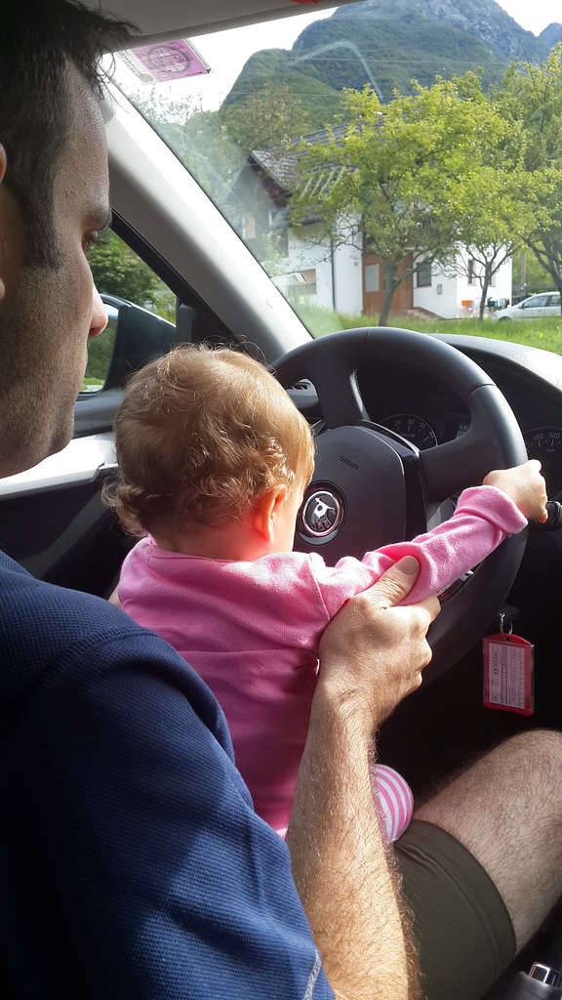
מעבר ההרים אשר נכרה על ידי אסירים רוסים במלחמת העולם הראשונה מפותל ותלול. פרט לעונת הקיץ המעבר סגור לכלי רכב - אסירים רוסים יחפים כמובן מוזמנים לעבור בכל עונות השנה. פרט לנוף הנשקף מהדרך הארוכה, באיזור המעבר קיימים מסלולי הליכה קצרים ומגוונים.

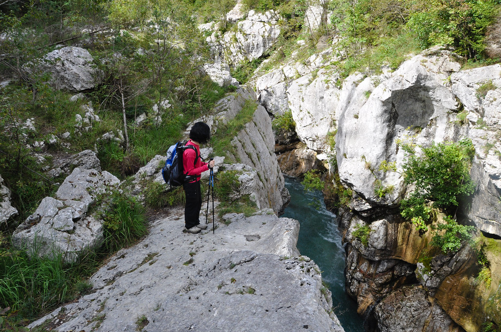

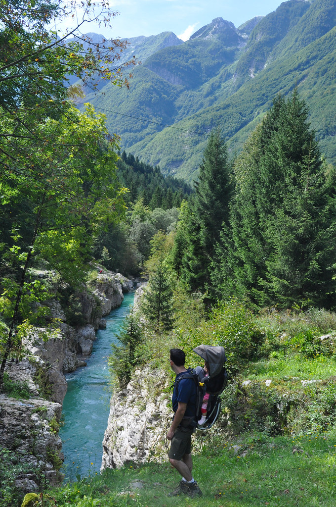

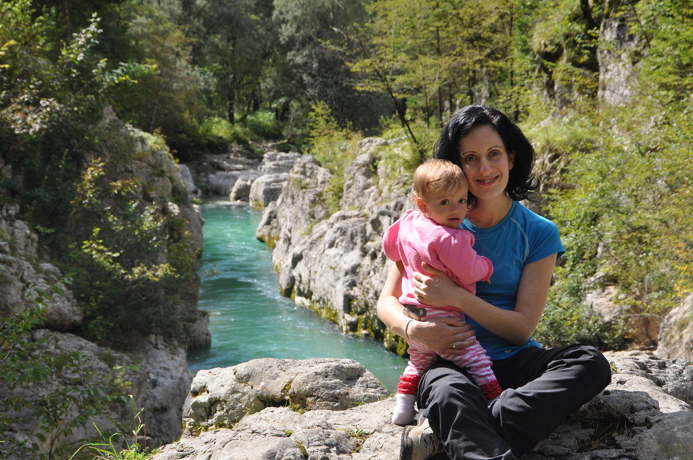

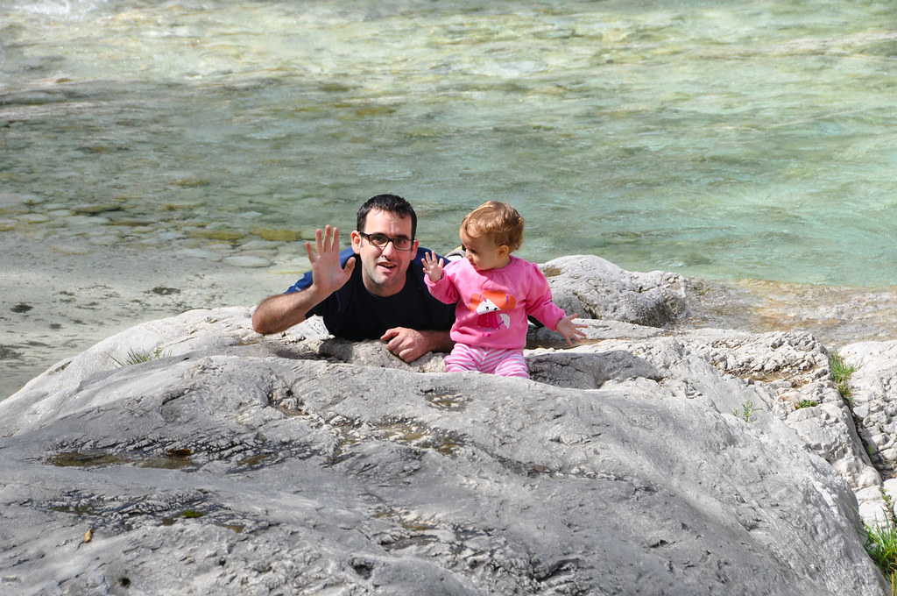

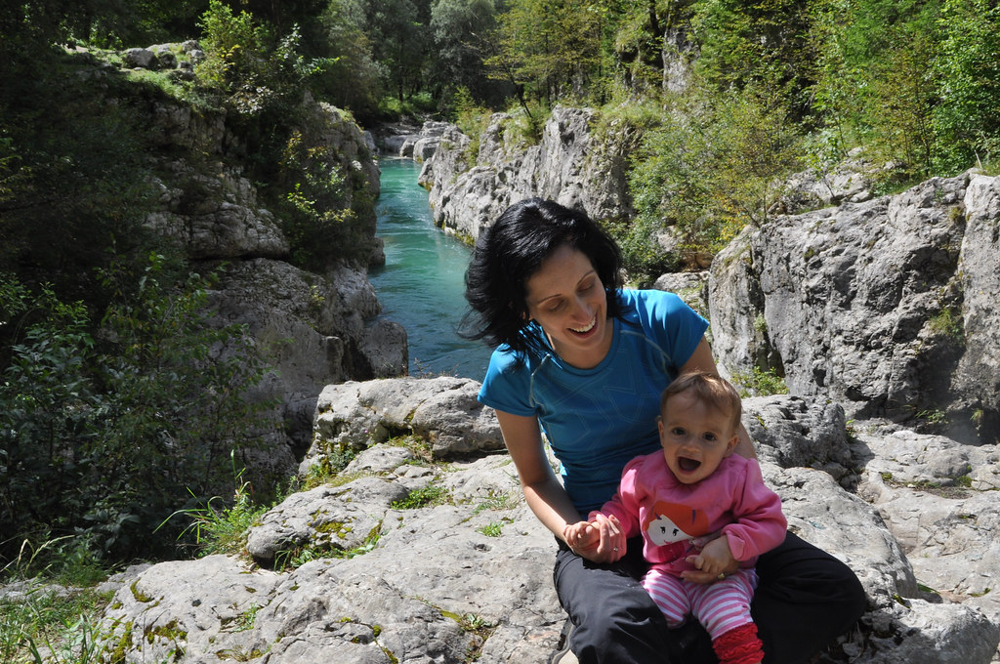

בנקודת המעבר עצמה הסתובב עדר כבשים חברותיות שסיפקו אטרקציה לעלמה שרלוט לא פחות מכפי שהיא סיפקה אטרקציה עבורן.



את ארוחת הצהריים אכלנו באחת מנקודות העצירה הרבות בעליה למעבר ומיהרנו חזרה לדירה להתארגן לקראת הטיסה חזרה הביתה.

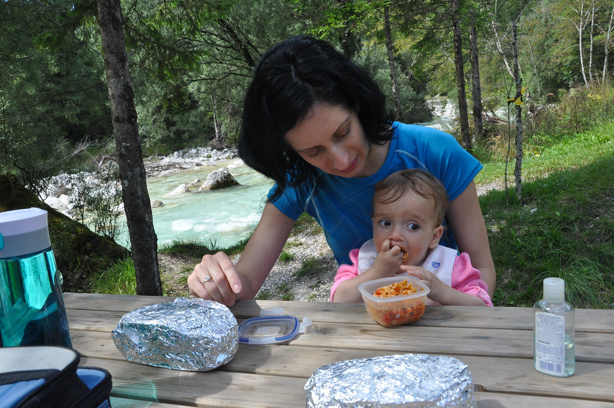

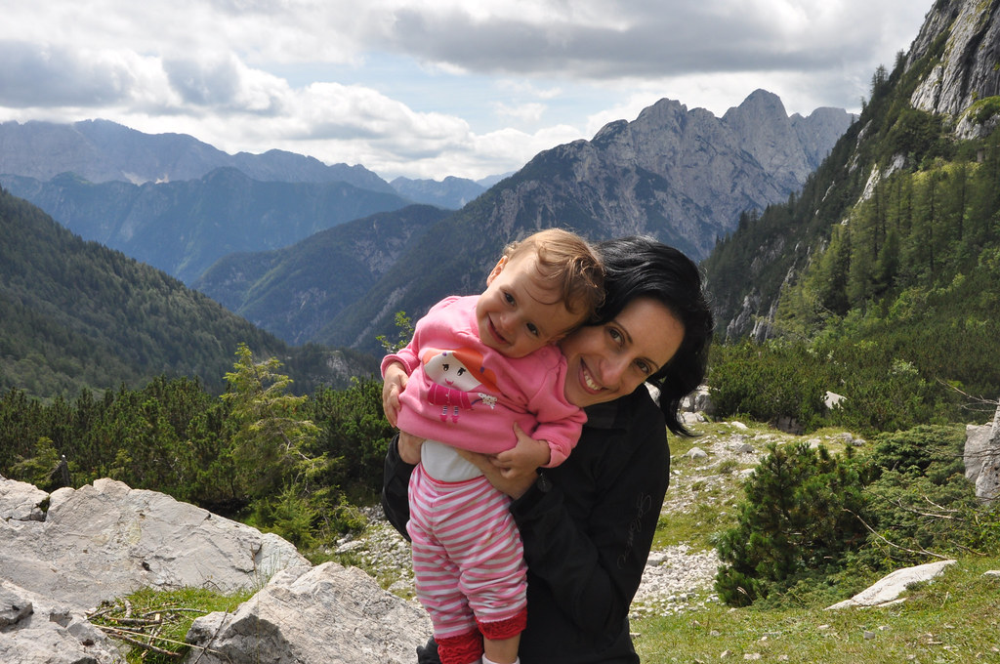

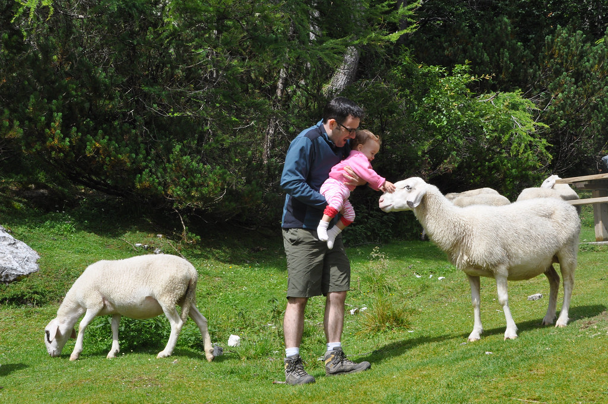

זהו, עלמה שרלוט ואני עשינו סיבוב קצר באגם כדי שאמא תספיק לסדר את הדירה ואת המזוודה. איכשהו הצלחנו לחזור בלי הטלפון של אבא, שכנראה כוייס על ידי ברבור. המארחת המקסימה שלנו חילקה לנו שוקולד סלובני שמיוצר בבלד לפני הטיסה ונפרדנו בנשיקות. הגענו לשדה התעופה רק כדי לגלות שהתעכבה לנו הטיסה חזרה בשעתיים. בשביל מה בכלל לחזור... סיימנו את השבוע המופלא הזה בסלובניה עם טעם של עוד לטיולים, טעם מתוק של שוקולד, וטעם חריף לנקמה בברבורים הגנבים של אגם בלד :)

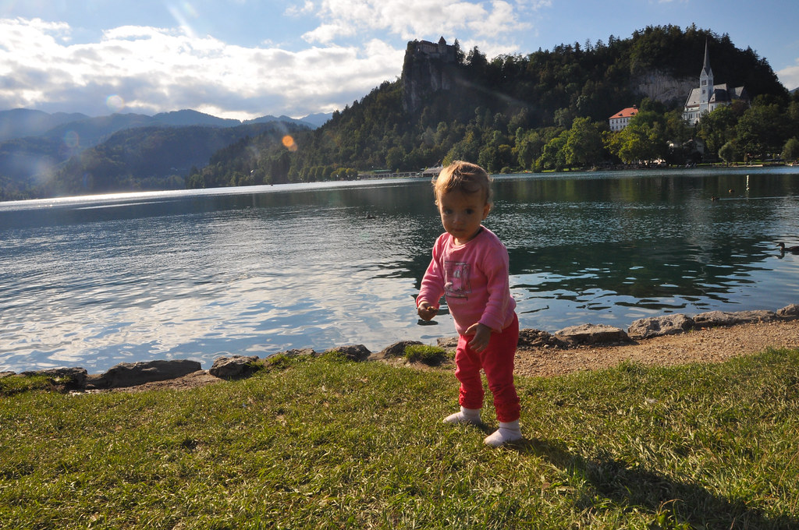
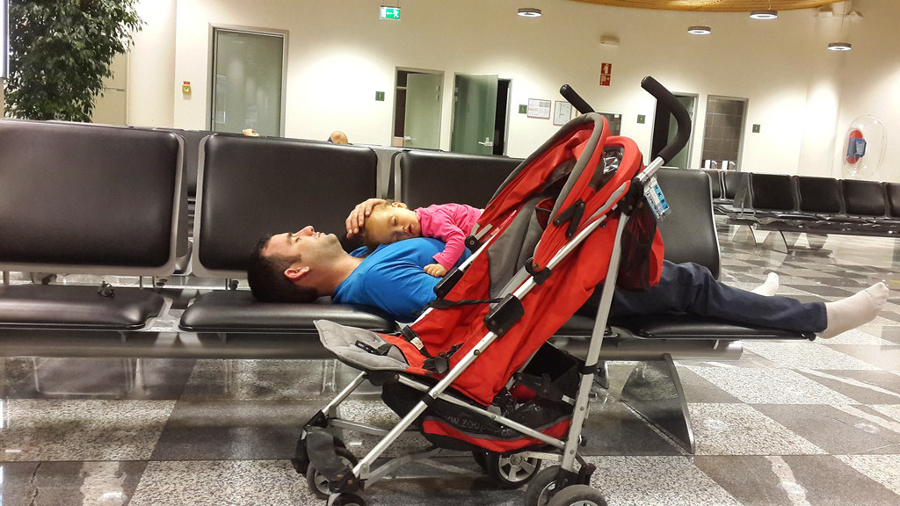
