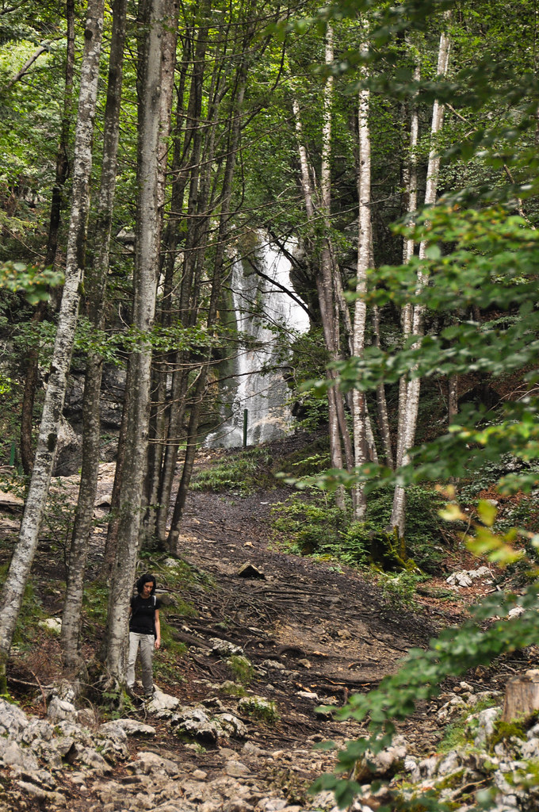

היום הרביעי לטיול בסלובניה! שוב השקמנו קום ויצאנו מוקדם לקראת עוד יום מלא הרפתקאות. הדירה ששכרנו הפכה ממש לבית בשבילנו וכיף לחזור אליה בסוף כל יום. קסניה, בעלת המקום המקסימה נתנה לנו המון עצות והבן שלה קצת התחיל עם עלמה שרלוט כשהביא לה סוכריה ענקית ובקבוק קאווה ליום ההולדת.

היום חזרנו לאזור אגם בוהין כדי לטייל בקניון מוסטניצה (Korita Mostnice). הקניון המרשים מתפתל בין אבן הגיר בה הוא חוצב ללא לאות. קיימת אפשרות לעשות מסלול מעגלי קצר ולסיים יחסית בזריזות אבל אנחנו בחרנו להאריך ולהגיע בסוף למפל גדול ולמסעדה מקומית עליה קיבלנו המלצות חמות.

המסלול מגוון ועובר ביער יפה בין נקודות תצפית שונות ומשונות על הערוץ. בדרך למפל יש גם כרי דשא גדולים בהם אפשר לנוח ו\\או לתת לתינוקי לשחרר אנרגיה פראית אופיינית.

ביקרנו במפל ומיהרנו למצוא את המסעדה המדוברת כי תינוקי כבר התחיל להכבות. המסעדה היתה הרבה יותר ממה שהבטיחו ההמלצות. הבעלים היה חביב ו"זרם" עם השטויות שלי ושל ע"ש. המנות היו מדהימות אחת אחת! עלמה שרלוט זללה בכמויות מכל מה שהוגש לשולחן והתרגשה מעושר האפשרויות והמנות הלא מזוהות שקיבלה. איזה אושר!

")

המטבח הסלובני נהדר. הוא משלב מכל הטוב שיש באזור. השפעה איטלקית עם טוויסט מזרח אירופאי. הכוסמת מאד פופולרית פה וה"תוספת" הלאומית היא משהו בין פירה לפתיתי כוסמת שנקרא žganci. באופן כללי מאד התרשמנו מהמדינה. קשה להאמין שימשיך להיות פה זול בהשוואה ליעדים אחרים אירופה לעוד הרבה זמן. בדרך חזרה עצרנו למנוחה לצד אגם בוהין היפה לפני שחזרנו "הביתה".

