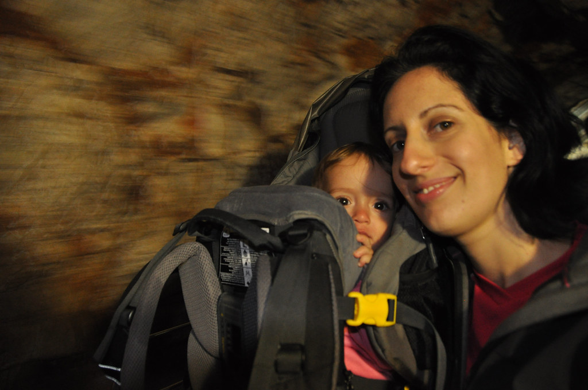

היום, ביום החמישי לטיול בסלובניה - זה קרה. כמעט והצלחנו להתחמק, אבל זה קרה! היום היה גשום מאד בסלובניה כולה - אף לא פינה אחת יבשה. אין לאן לברוח - חייבים ללכת למערת האיימים! מה עלמה שרלוט חושבת על זה ?

מערת פוסטוינה היא אתר התיירות מספר אחת בסלובניה. המערה מושכת אליה אלפים רבים של מבקרים ביום והיא מכונת תיירות משומנת היטב. אין לי שום דבר אישי נגד מערות נטיפים, אבל מטיולינו בעולם למדנו כבר ש "ראית אחת - ראית את כולן"... ויצא שראינו כבר יותר מאחת.. בכל מקרה, אין ברירה, עדיף להיות כלוא במערת נטיפים מתחת לחמישים אוטובוסים מלאי תיירים יפנים מאשר בדירה קטנה יחד עם תינוק היפר אקטיבי בעל יצר השמדה עצמית. נלכדנו ברשתה של מערת פוסטוינה!

המערה היתה באמת גדולה ויפה מאד (בדיוק כמו מערות נטיפים אחרות) ועלמה שרלוט נהנתה מאד מהסיור פרט לקטעים בהם נסענו ברכבת בתוך המערה. הנסיעה בת עשר הדקות ברכבת התחלקה לפרקים בהם ע"ש נשפה כמו קטר בשמחה "טווו טווו טווו" לפרקים בהם צרחה כאילו עוקרים לה שן עם כפית. הסיור לא היה אינפורמטיבי במיוחד - מה כבר אפשר לספר עוד על נטיפים חוץ מ-״הביטו, צביר הזקיפים הללו מזכיר תרנגול, וזה... פיל״ - סיפור אמיתי :) משהו שמיוחד במערה (למרות שלא באמת היה אפשר לחוש בו) הוא שגילו במערה הזאת דו חיים מעניין אנדמי לאזור המערה שנקרא פרוטיאוס (המקומיים קוראים לו ״דג אדם״). הפרוטיאוס חי כל חייו בחשכה מתחת למים ובשל כך העיניים שלו התנוונו במהלך האבולוציה. עיניו לא בשימוש וממוקמות עמוק מתחת לעורו כך שבכלל אינן נראות. היצור המעניין הזה פיתח שלל חושים מעניינים המסייעים לו להתמצא בחשכה על ידי שימוש בקולטנים כימיים וחשמליים.

זהו, נסענו חזרה לדירה הכיפית שלנו להתייבש, מחר מזג האויר ישתפר. ניצלנו את המשך היום כדי לנוח קצת ביחד.

