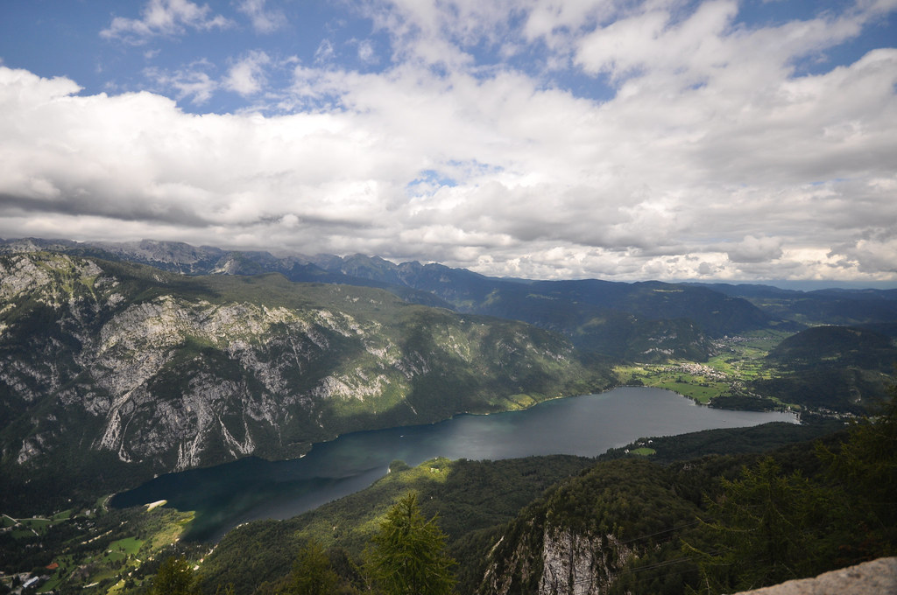

את היום השלישי של הטיול הקדשנו לאזור אגם בוהין (Bohinj). האגם שוכן בין רכסי הרים ומהווה בסיס מעולה לטיפוסים למיניהם. השכמנו קום ונסענו לפתוח את הרכבל להר ווגל (Mt. Vogel).

ממש בקצה הרכבל חיכו לנו בסבלנות מי שהפכו בעל כורחן להיות הפסקול היומי. עדר כבשים סקרניות עמדו בתור לטעום את הלחיים הרכות של עלמה שרלוט הקטנה. הו.. מה רבה השמחה. מההה מההה מההה אבא מהה מהה מהה :)

מזג האויר היה מעולה, המסלול נופי ויפה וע"ש פעתה לי באוזן בלי הפסקה :) פסגת הר ווגל מתנשאת לגובה של כ2 קילומטרים ובחורף המקום משמש כאתר סקי. מסביב ניתן לראות את רכסי ההרים הגבוהים של סלובניה ביניהם הר טריגילב - שאת הטיפוס אליו נשמור לביקור הבא בסלובניה.

כחלק מהמסלול שהמליצו לנו בנק' המידע שבתחנת הרכבל, לקחנו רכבל סקי לרכס אחר ממנו תכננו לרדת דרך כפר קטן חזרה לנק' היציאה. באתר ניתן לטייל במספר מסלולים בכל מיני אורכים ודרגות קושי. השבילים ברובם הם מסלולי הסקי ומסומנים בצורה סבירה.

אחרי ארוחת עשר קלה בשטח ע"ש התרסקה והתחלנו בירידה התלולה חזרה לכיוון תחנת הרכבל. אני לא אנצל את פלטפורמת הבלוג להטחת האשמות, אבל "נוצר מצב" בו הגענו לנקודה שכוחת אל ממנה נאלצנו לעשות אחורה-פנה ולטפס חזרה בטיפוס קצת לא ידידותי :)

אחרי מנוחה קלה לצד האגם התקפלנו וחזרנו לדירה בבלד. דילגנו על אטרקציה נוספת שתכננו לעשות ליד האגם לטובת מנוחה ואגירת כוחות להמשך הדרך.

בערב חגגנו לעלמה שרלוט יום הולדת ראשון בעולם הזה. מאחל לך שכל ימי ההולדת שלך יראו כמו היום הזה עלמה שרלוט (אולי למעט ה"מהה מהה מהה" באוזן של אבא)

")

