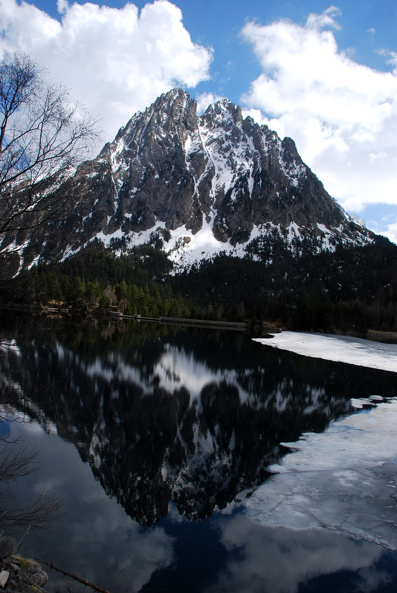
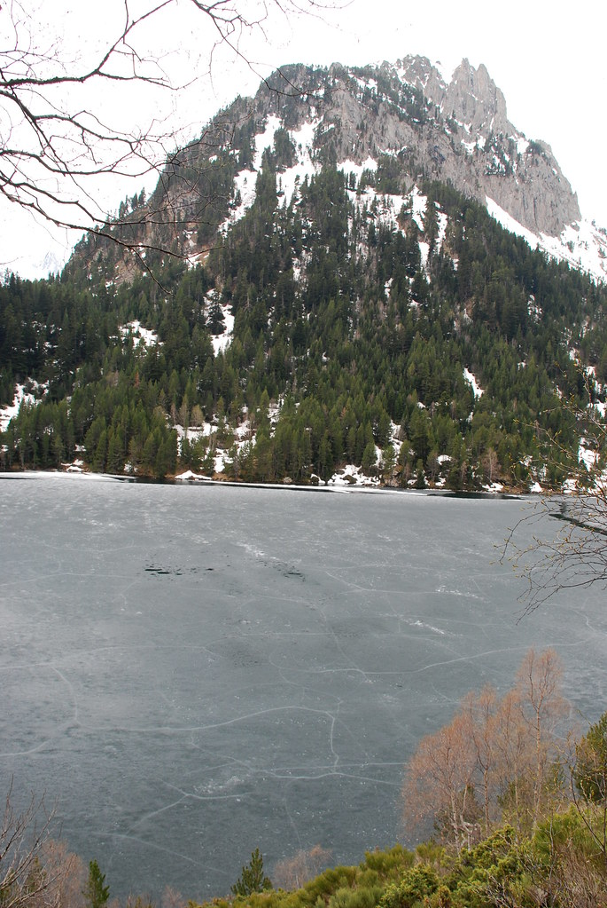
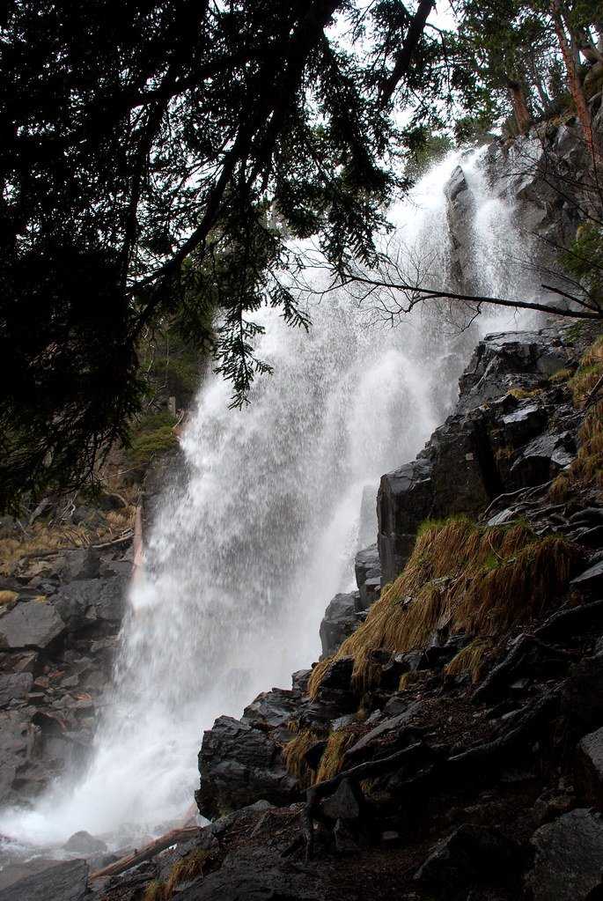
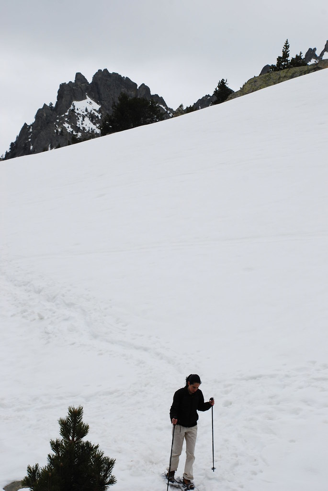
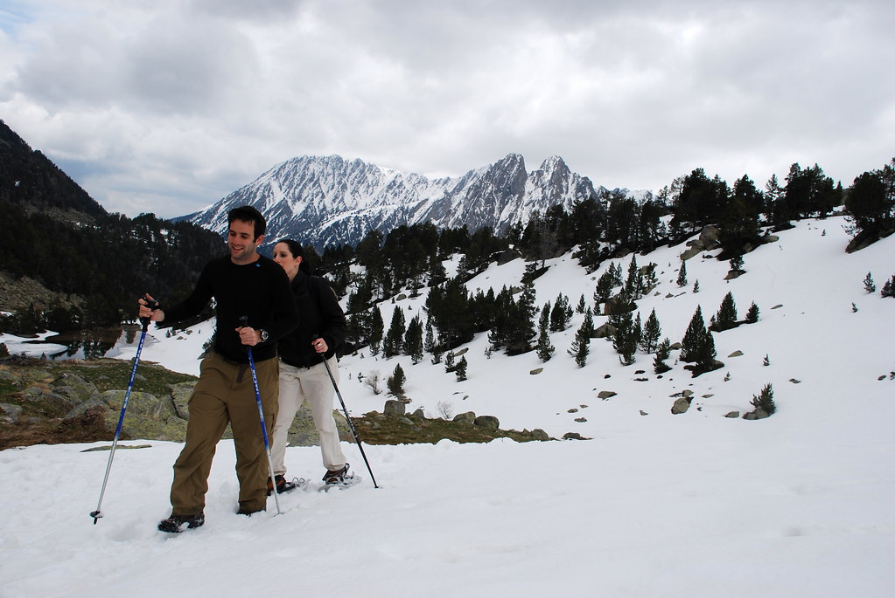
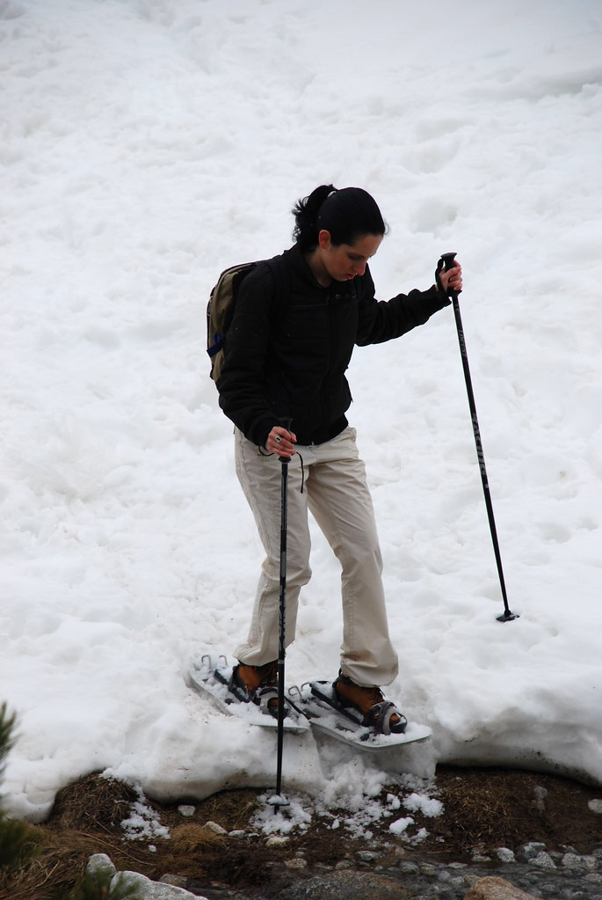
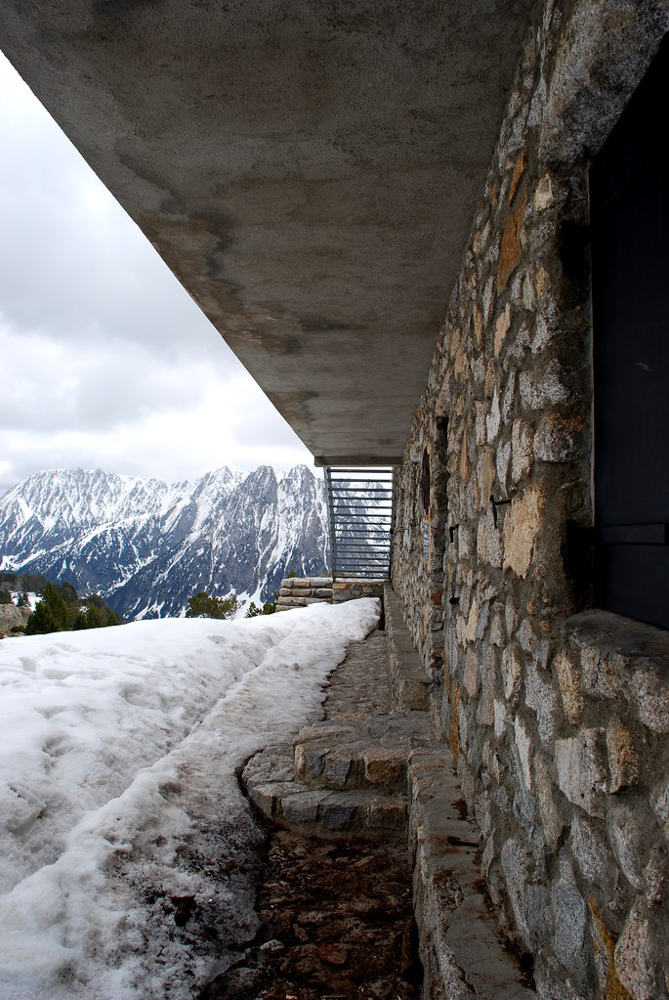
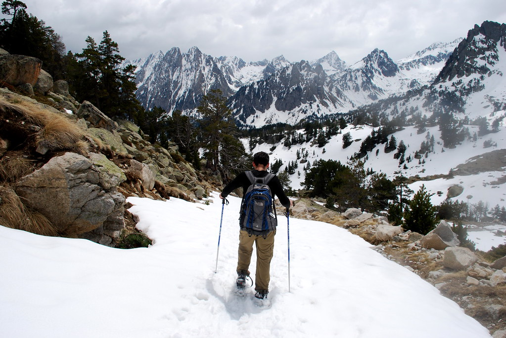
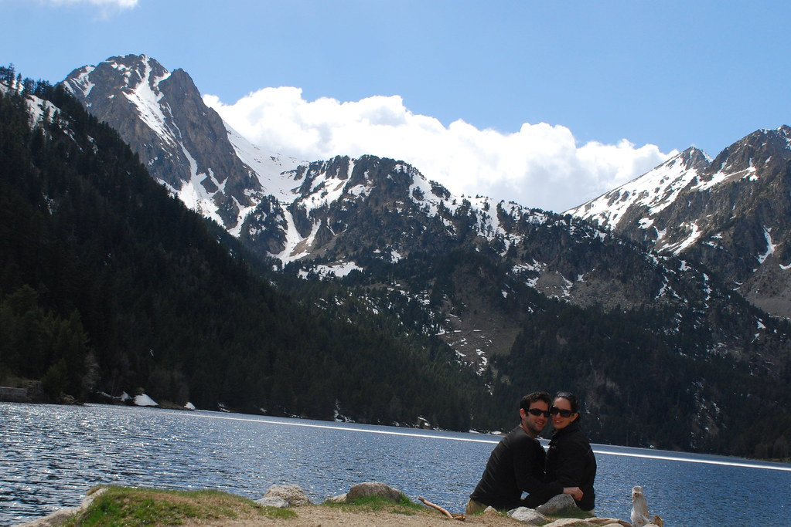
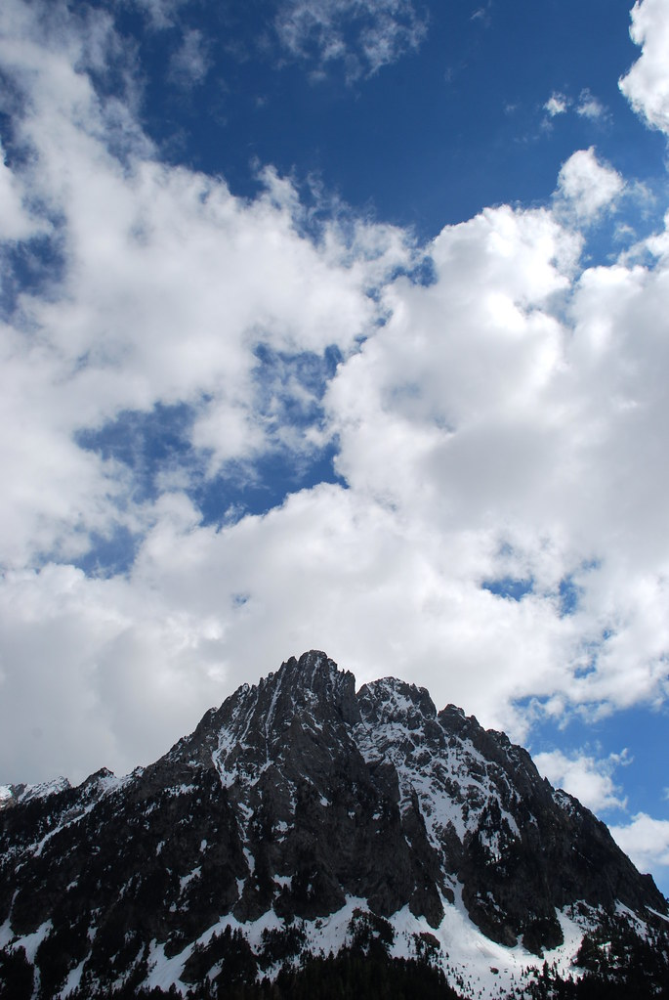

**12/05/2008 – פארק Aigüestortes – הצד המזרחי**

היום ומחר נטייל בפארק Aigüestortes שבפירנאים הספרדים. אחרי כמה ימים הפכפכים היום אמור להיות, לפחות עד הצהריים המאוחרים מזג אויר טוב לטיול. מפני שאנחנו מטיילים לפני העונה, אין כמעט מטיילים בפארק וחלק מהשבילים עדיין מכוסים שלג. אנשי מרכז המבקרים המנומנמים של הפארק (casa de park) התפלאו לראות זוג מגיע מיד עם שעת הפתיחה (המאוחרת כשלעצמה – 9:00). הם הסבירו לנו שהמסלול אותו אנחנו רוצים לעשות מכוסה רובו בשלג ולא נוכל ללכת בו בלי נעלי שלג (crampones) ומקלות הליכה. השכרנו מהם את הציוד ותיאמנו ג’יפ שיקח אותנו לתחילת המסלול (Estany Sant Maruric). הנהג העצלן ניסה לחכות כדי שאולי יגיע עוד זוג - שחס וחלילה לא יסע פעמיים ולבסוף התחלנו את המסלול רק ב10:30… קבענו עם הנהג שיאסוף אותנו מאותה הנקודה ב16:00 ויצאנו לפארק היפה ביותר בטיול לספרד.

התחלנו את המסלול ליד אגם Sant Mauric שהיה מכוסה ברובו בשכבת קרח דקה. מבין הסדקים בקרח השתקפו ההרים המושלגים של הפארק במלוא הדרם.

אחרי קצת הליכה ביער הגענו למפל שוצף שמימיו מזינים את האגם.

משם המשכנו ללכת כחצי שעה ביער כשבינתיים אין זכר לשלג שהובטח. בהתחלה התרגשנו כשראינו שאריות שלג נמס מסביב למסלול, אחריו ערימות שלג שעוד יכולנו לעקוף – וכשהמשכנו לעלות הגענו לקטע שממנו הכל מכוסה בשלג. קילומטרים על קילומטרים של יער מושלג בין הרים, אגמים ונחלים – מדהים!

הרכבנו את נעלי השלג על גבי הנעליים והמשכנו בעליה. העליה היתה לא קלה בשלג החלק. הפרש הגבהים במסלול הוא יחסית גדול (עליה של כקילומטר) וכשיעל התחילה להתבכיין עשינו הפסקת בננות קצרה והמשכנו לטפס. יעל היתה גיבורה היום וטיפסה כמו גדולה על אף כל הקשיים. המסלול אמנם לא היה קל – אבל בהחלט שווה כל רגע – הקיטורים של יעל מהר מאד עברו לmute – לפחות עד הירידה חזרה :)

בשלב מסויים התחיל להיות מאוחר, ופחדנו שלא נספיק לחזור. אני כמובן התעקשתי להגיע עד לנק’ שרצינו (Refugio Frey). השארתי את הנמלה עם התיקים וטיפסתי במהירות רק כדי לגלות שאין בקצה שום דבר מיוחד… הRefugio היה שומם מאדם, ולא ניתן היה להשקיף לצד השני של ההר כפי שקיויתי..

מכאן הסתובבנו והתחלנו בירידה התלולה חזרה. הירידה היתה מאתגרת, אבל השמש יצאה ומזג האויר הפך מושלם. אם בעליה נעלי השלג היו מועילות – בירידה הן היו הכרחיות. אם רק היה לי סנובורד… (אז כנראה שהייתי מרסק עוד איבר…)

השמש שיצאה הכריחה אותנו להרכיב משקפי שמש ולהצטער על כך שלא קנינו קרם הגנה –השלג צרב את הפרצופים הלבנבנים שלנו. הספקנו להגיע חזרה לאגם Sant Mauric בדיוק בזמן כדי להינות מארוחת הסנדביצ’ים המסורתית ליד האגם כשהשמש מלטפת אותנו חמימות. במהלך המסלול כולו ראינו רק שני צרפתים. הפארק המדהים הזה ריק מאדם!

הג’יפ לקח אותנו חזרה לEspot וקצת אחרי 5 יצאנו אני והגופה של יעל לנסיעה בת כשעתיים לכיוון Boi דרך Vielah. מחר אנחנו מתכננים לעשות מסלול נוסף בפארק – והפעם מצידו המערבי.

בBoi מצאנו מלון אחד בלבד שפתוח בכל האיזור בעונה הזאת - “Pey”. אכלנו במלון ארוחת ערב שבה קיפדו את חייהן כבשה ו”חיית בולונז” מיסתורית. בלי להתחכם כיוונו שעון ל9:30 שעות שינה – כשכל דקה בהן היתה נחוצה.
