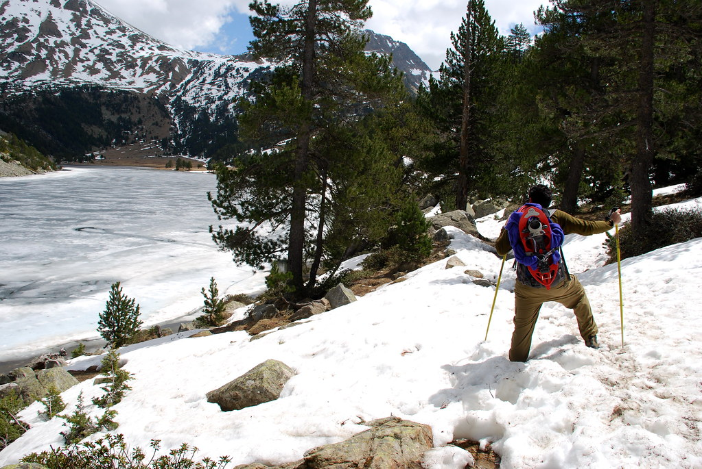

**13/05/2008 – פארק Aigüestortes – הצד המערבי**

זהו היום השני שלנו בפארק היפיפה הזה. את היום התחלנו בעיירה Boi. אחרי ארוחת הבוקר שוב הגענו למרכז המבקרים כדי לתאם ג’יפ שיסיע אותנו לשמורה. המסלול שעשינו הוא הליכה מAigüestortes plateau עד Estany Llong. היום מזג האויר היה שמשי ומושלם לטיול.  

גם כאן האגם היה קפוא. המסלול היום היה ברובו סביב האגם. באגם שטו שני ברווזים שליוו אותנו בכל הדרך מקווים שנזרוק להם איזה פירור. בתשובה להולדן קולדפילד – הברווזים, לפחות כאן, לא הולכים לשום מקום – הם פשוט נשארים גם כשהאגם קפוא…

בגלל השמש החזקה השלג בכל רגע שעבר נהיה יותר ויותר מיימי וקשה להליכה. העמודים שהיו אמורים לסמן את השביל היו מכוסים בשלג – כך שלפעמים היה צריך לאלתר.

 by shpandrak, on Flickr") העמודים שהיו אמורים לסמן לנו את הדרך…

הגענו עד לאגם הRedo – שהיה גם הוא קפוא לגמרי רק כדי להסתובב ולמהר לחזור. בדרך חזרה עצרנו שוב לאכול את ארוחת הסנדביצ’ים המסורתית ליד האגם בשמש מפנקת

בדרך חזרה קרתה “הטרגדיה”. לא בדיוק הצלחנו לאתר את השביל המקורי ממנו הגענו וחזרנו מדרך מאולתרת. השלג התחיל לקרוס לנו מתחת לרגליים – ומה שבהתחלה היה משעשע התחיל להיות קצת מפחיד. בעוד אני מאושר מהסיטואציה ומצלם את יעל שוקעת בשלג קרס השלג מתחתינו בקול פיצוץ ושנינו טבלנו במי קרח. מסתבר שבדיוק מתחת לדרך בה בחרנו היתה זרימה של מים ש”גירדה” את הקרח מלמטה. משיתי את הנמלה מהמים וזחלנו קצת בשלג עד שהגענו לפיסת דשא בטוחה. רטובים אך בטוחים סיימנו עוד יום מופלא בפארק הנהדר הזה.  

איך שהגענו לנק’ האיסוף של הג’יפ התחיל מבול רציני. אנחנו שני בני האדם היחידים בעולם שראינו היום את אגם Redo. הגענו ראשונים בבוקר לשמורה כך שלא יתכן שראו אותו לפנינו – וכשיצאנו התחיל המבול הזה – אז לא סביר שמישהו יתקרב בכלל לאזור בשלג החלקלק הזה. כשהגענו עייפים למלון Pei ב Boi ניסינו להתייעל ולהתקדם למלון קרוב יותר ליעדים הבאים – אבל זה היה ביזבוז זמן מיותר. לא היה שום מלון פתוח ברדיוס של עשרות קילומטרים – הכל סגור! חזרנו עם הזנב בין הרגליים למלון Pei בBoi ואפילו קיבלנו את אותו החדר :) יעל, שעומס החוויות מהטיול גמר אותה כבר ישנה. אני יושב בפאב של המלון ושותה כבר את ה Estrilla Damn השניה שלי – בירה ספרדית מעולה! מחר מתוכנן יום חופש אחרי שני ימי הטיול האינטנסיביים שעברנו
