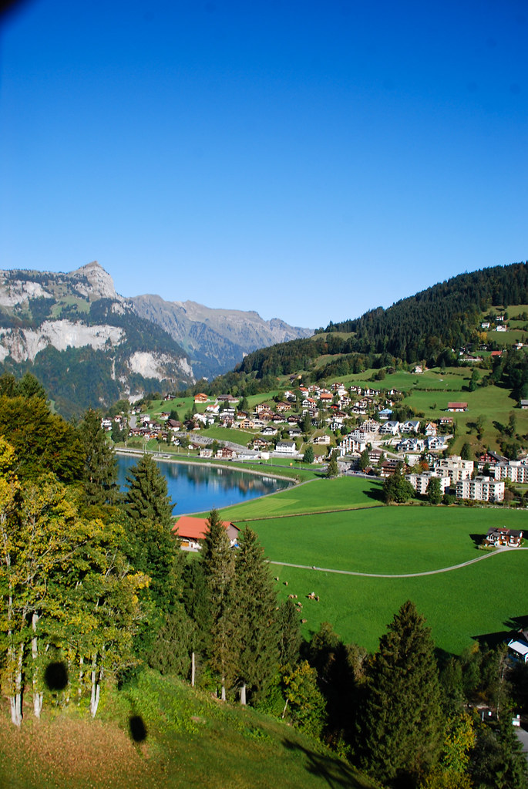
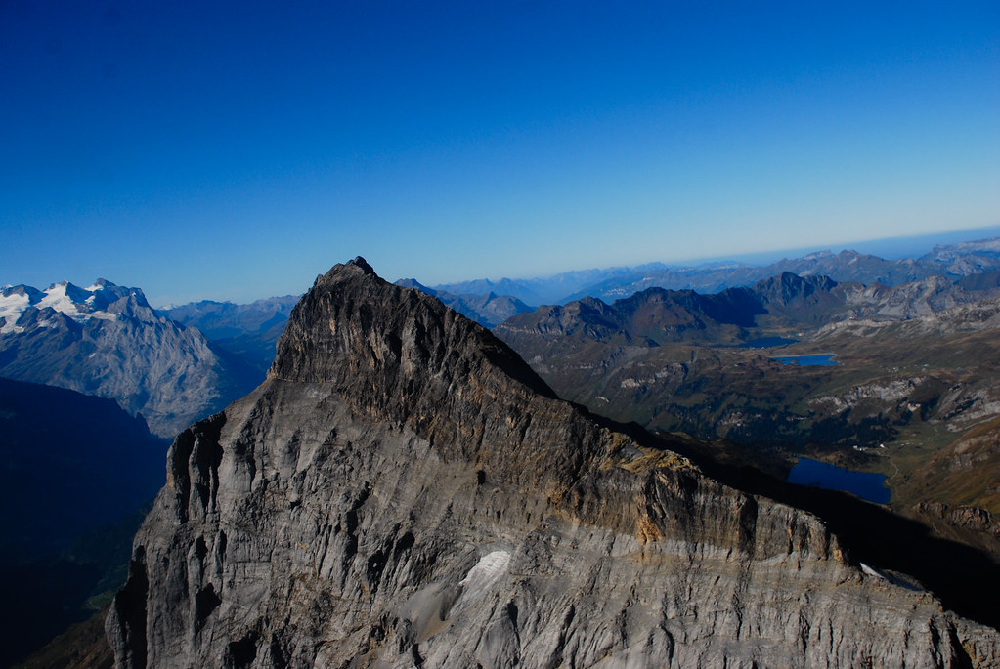
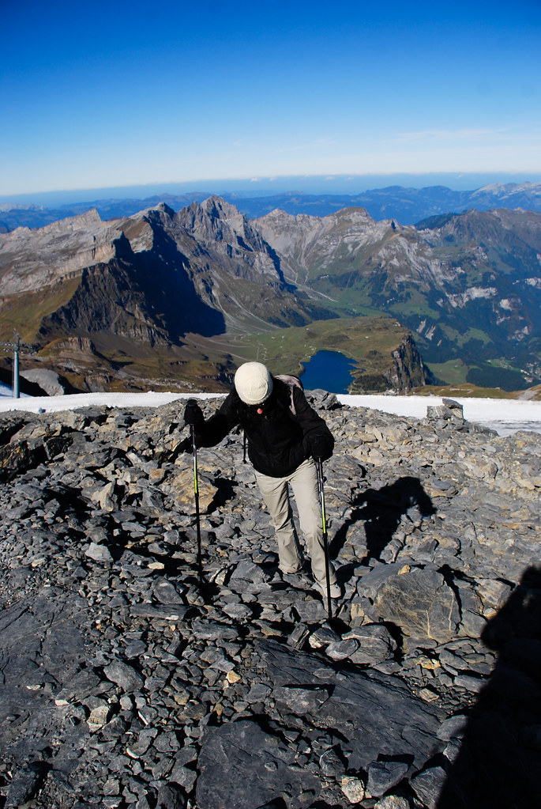
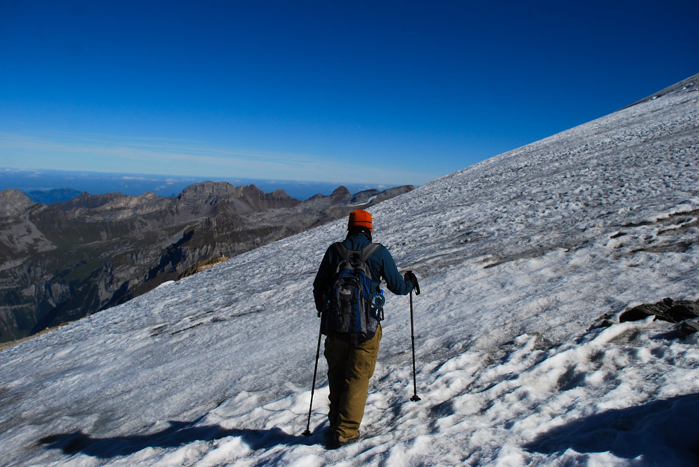
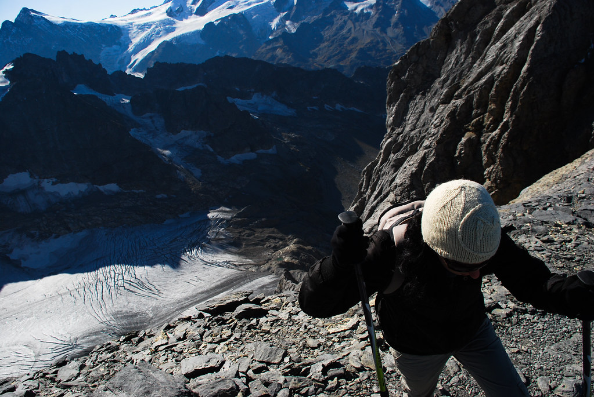
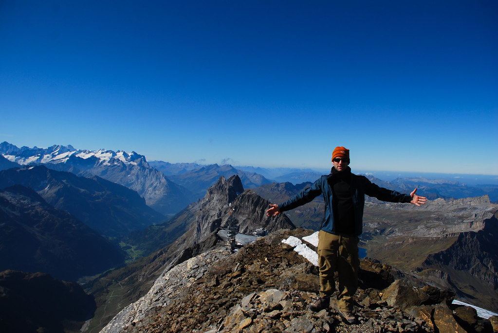
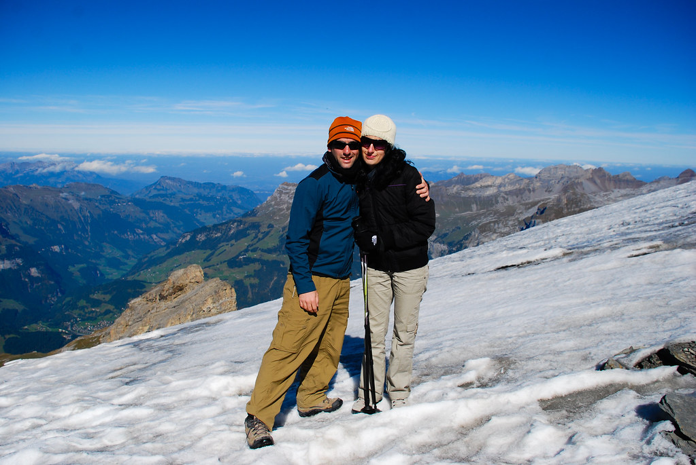
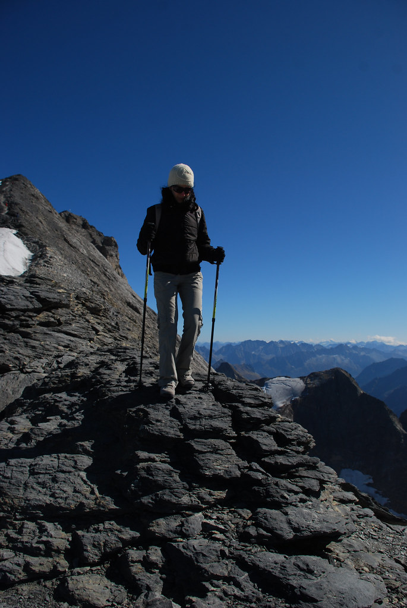
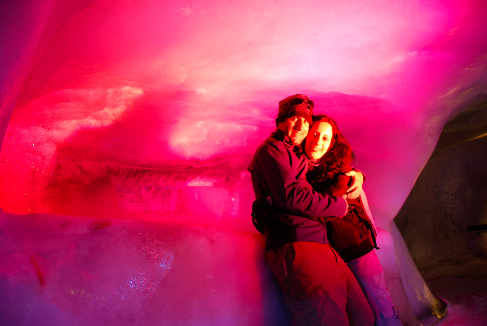

**04/10/2009 – טיטליס (אל תיגע לי ב..)**

היום ביקרנו בהר הגבוה ביותר במרכז שוויץ – הטיטליס (3,238 מ’).  
עזבנו את Littau ונסענו לכיוון Engelberg.  
חנינו את הרכב בחניון וקנינו כרטיסים לשלושת הרכבלים שיביאו אותנו אל הנקודה הכי גבוהה בהר אליה אפשר להגיע באמצעות רכבל.

באזור הרכבלים הכל היה מאד תיירותי – יקר ועמוס יחסית. מה שהפתיע אותנו היה כמות לא פרופורציונית של הודים שהגיעו דווקא לכאן.  
הרכבל לטיטליס יזכר לעד בתור הרכבל עם הריח העז של חנות תבלינים חנוקה.  
ברור מאוחר גילה, שהרבה מההפקות של Bollywood משתמשות בהרים בשוויץ כאתרי צילום. הטיטליס משמש כתחליף להרים של הודו בהם מסוכן לצלם, וההודים שראינו, הגיעו לכאן במסע מטופש בעקבות כוכבי הסרטים האהובים עליהם.

הנוף מהפסגה מעורר השתאות. ברחנו מאזור הרכבל ההמוני, שם היו אטרקציות לא ברורות בסגנון – חנות השעונים הגבוהה בעולם (?!) ו- “המקום הגבוה בעולם בו לא מתביישים לעשוק יפנים”.

בעונת הקיץ, בה הפסגה מכוסה ביותר שלג, יוצאים טיפוסים מודרכים עם ציוד שלג לפסגה. מכיוון שעכשיו זאת לא ממש העונה, מרבית מהשלג נמס, ולא ממש היה צורך בציוד מיוחד, לא ראינו סיורים מאורגנים שיוצאים. התחלנו לטפס עצמאית לכיוון הפסגה.

הטיפוס אמנם לא היה טיפוס טכני, אבל הוא היה קשה ועירב הליכה על שלג חלק וטיפוס תלול על סלעים. הנמלה מלמלה לעצמה כל הדרך בצורה מונוטונית- “איך אני ארד את זה, אני לא אוכל לרדת את זה…” :)  
אחרי טיפוס קצר יכולנו להתרשם מהקרחון העצום של הטיטליס, שגם הוא כנראה יעלם בעוד עשורים בודדים.

בדרך ראינו אנשים בודדים, חלקם עם מדריכים שכדי להצדיק את עצם ההדרכה ואת גרזני הקרח שלהם הלכו בכל מיני “קיצורים”. דווקא נראה נחמד, ובדיעבד הצטערתי שלא חיפשנו מדריך, שאולי היה מרגיע קצת את הנמלה, כי הטיפוס באמת התחיל להיות לא קל.

ואכן, אחרי כמחצית השעה של טיפוס, ולקראת הישורת האחרונה של הטיפוס (או שמא יש לומר התילולת האחרונה) הנמלה הרימה את מבטה אל הפסגה והכריזה “עד הלום”!

יעל התלבשה בכל מה שהיה לנו ללבוש, וישבה לקרוא קצת על המשך הטיול בזמן שאני עושה “קפיצה לפסגה”. בלי תיק, דילגתי חיש מהר אל הפסגה ממנה נשקף נוף פנורמי אינסופי של רכסי הרים מכל כיוון. הראות היתה מצויינת ואיתה מצב הרוח!

חברתי מחדש אל הנמלה והתחלנו לרדת בחזרה. שמחתי שהיא החליטה להשאר, כי הטיפוס האחרון באמת היה קשה וקצת מפחיד.

ירדנו בירידה לא קלה חזרה לאיזור הרכבלים. בסה”כ כל הטיפוס הזה לקח לנו בסביבות השעה ו 45 דק’. כאשר בלי נמלים אני מניח שאפשר לעשות את זה בשעה. (אין צורך לציין שלא כיף ולא מומלץ לעשות כלום בלי נמלים!)

מאיזור הרכבלים עשינו עוד מסלול מישורי קצר ופחות אתגרי שהיה כולו מושלג, והיה נחמד למדי.  
חזרנו לאזור הרכבלים, כדי לראות את “מערת הקרח” לפני שיורדים.  
במערת הקרח, איכשהו הצלחתי לאבד את משקפי השמש שלי (כנראה היו על הכובע שהורדתי מהראש). מה שגרם לעיכוב לא קטן בגלל שהסתובבנו לחפש את המשקפיים – שעכשיו כנראה נמצאות בהודו אצל חובב סרטים כלשהו בריח כורכום.

 

*תמונת אובדן המשקפיים המסורתית ראה* [אובדן משקפיים - גם באירלנד](http://shpandrak.blogspot.com/2007/09/2007-1.html)

לראשונה שמחתי ששוויץ היא מדינה תיירותית מידי, כי יכולתי למצוא חנות ספורט ענקית בEngelberg בה קניתי משקפי שמש חדשים.

מEngelberg יצאנו לכיוון Grindelwald שם נישן את ארבעת הלילות הבאים.  
גם את הלילות הללו הזמנו דרך האינטרנט מראש, כאשר משם נהיה עצמאיים בשטח.

הB&amp;B בGrindelwald נקרא Chalet auf dem kapf.  
[http://www.chalet-auf-dem-kapf.ch/](http://www.chalet-auf-dem-kapf.ch/ "http://www.chalet-auf-dem-kapf.ch/")

למרות הדימיון בשם, את הכינוי שהדבקנו למקום “מיין קאמף” הוא קיבל בעיקר בגלל אופיים של הבעלים שלו. לראשונה בטיול יצא לנו להכיר מקרוב את השוייצרים האמיתיים לטוב ולרע.

בגלל “דרמת המשקפיים” יצאנו קצת באיחור, והגענו לGrindelwald ב 19:15 במקום ב19:00. למרות שהתקשרנו להודיע שאנחנו מתעכבים, עדיין קיבלו הזעפות פנים. בעלת הצימר Erika  שזכתה לכינוי “השטן” יכולה לגרום למייק טייסון לשקשק מפחד :)  
בעלה Ulrich הוא איש ענקי עם קול עמוק ומפחיד.  
כשהגענו הוא ליווה אותנו אל החדר, ונאם בפנינו על חוקי המקום בפרצוף חמור סבר. בין היתר – מהשעה 22:00 יש להיות בשקט מוחלט, מותר לפנות לבעלי הבית בשעות מאד מסויימות, אחרת יש להשאיר מכתב פניה, ועוד כל מיני היתרים והגבלים ברוח זו :)

לארוחת הבוקר יש להתייצב בדיוק ב 8:30 מפני שהזמן שמוקצה לארוחת הבוקר הוא 8:30 – 9:00 בלבד(!)  
מגיע לי אות גבורה על כך שביקשתי לבוא מוקדם יותר לארוחת הבוקר!  
כששאלתי את “אולריך האיום” על הקדמת ארוחת הבוקר, באמצע נאום האיסורים שלו, פניו התכרכמו ויכולנו לראות בזוית עיניו, רק לרגע, את הפחד מהשטן!  
סיכמנו שהוא יודיע לאישתו שנגיע ב8:15 (לא הייתי נכנס לכל זה, אבל אנחנו צריכים לצאת מוקדם לטיולים, ואנחנו פה 4 לילות…)

הם לא באמת היו אנשים רעים, ואת כל הנאומים שלהם הם העבירו בצורה מנומסת ומדוייקת. המידע שהם נתנו לנו היה מועיל ומדוייק, כנראה איפשהו באבולוציה הם איבדו את השריר ההוא בפרצוף בו משתמשים אנשים כדי לחייך…
