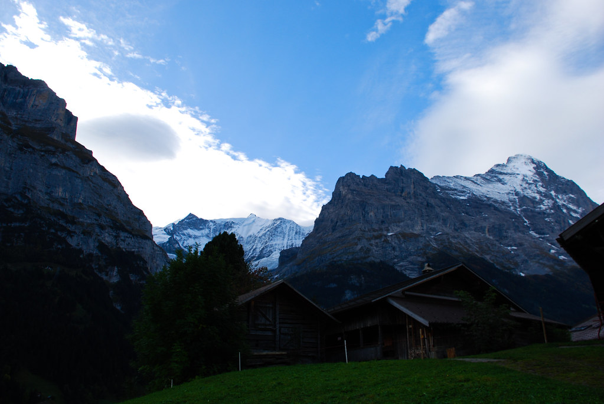
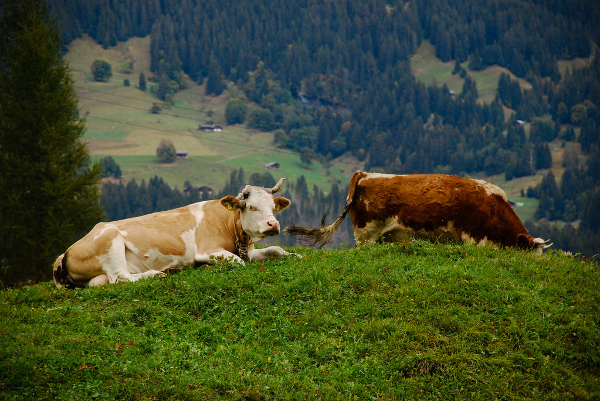
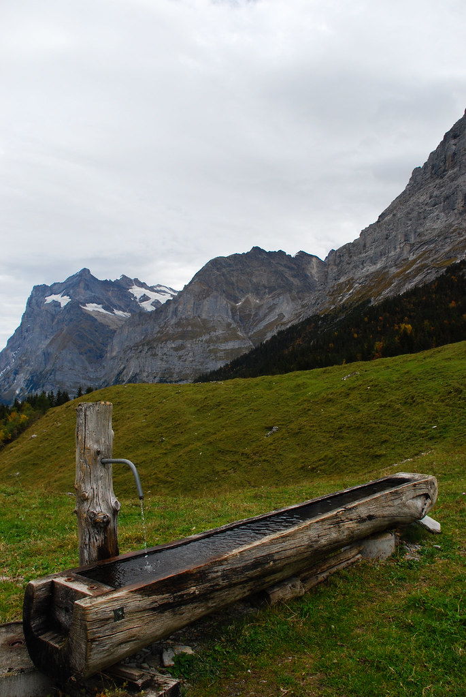
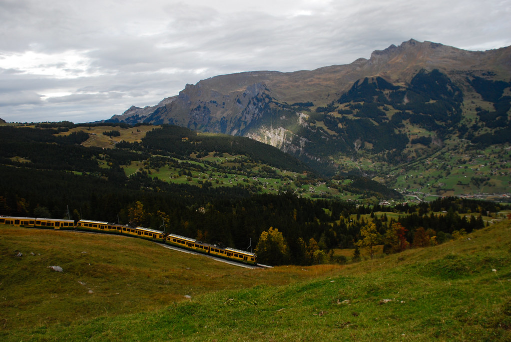
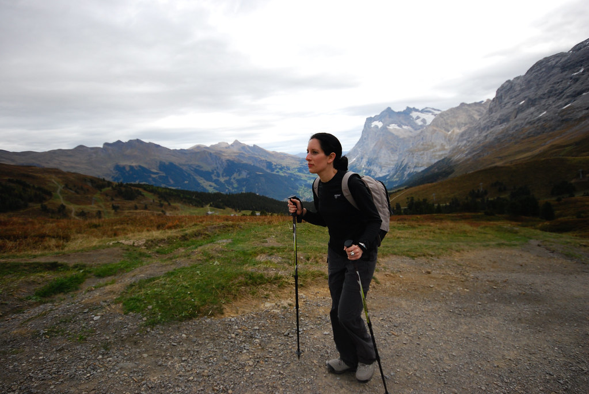
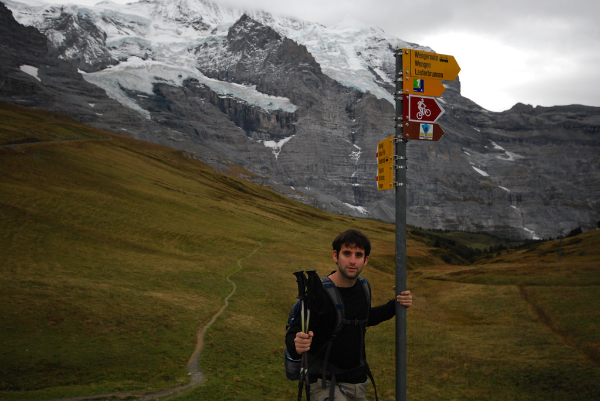
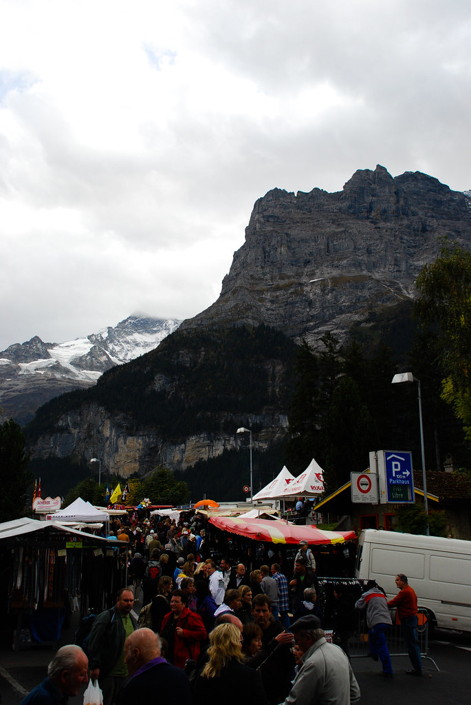
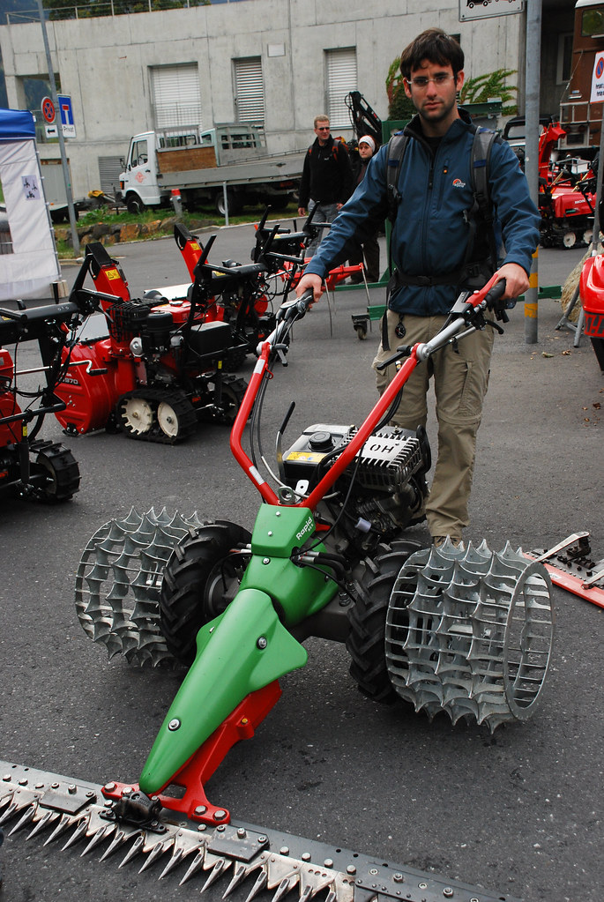

**05/10/2009 - Kleine Scheidegg**

בוקר טוב.  
היום מטפסים אל ה Kleine Scheidegg, מעבר הרים בין הEiger ל-Lauberhorn במסלול שיוצא מתוך העיירה Grindelwald.

את הבוקר פתחנו ב”ארוחת בוקר אצל השטן”.  
בנוסף להערה שקיבלנו על כך שאריקה לא רגילה להגיש ארוחת בוקר כל כך מוקדם(הקדמה של רבע שעה), מיד הבחנו שביצענו עבירה על “החוקים”:  
מפני שלא ידענו שארוחת הבוקר מוגשת בסלון של השטן בכבודה ובעצמה, התייצבנו לארוחה עם נעלי הטיולים – הפרה בוטה של חוקי המקום.  
מלבדינו, היו במקום רק אירופאים שהגיעו עם גרבים :)  
בכל פעם שהשטן התקרבה, דחפנו את הרגליים מתחת לשולחן בתקוות שוא שהיא לא תשים לב.

מבלי שתכננו, יצא שהיום הוא יום מיוחד בGrindelwald. פעם בשנה, בכל יום שני הראשון של אוקטובר יש יום שוק.  
בגלל בלגן השוק המליצו לנו לא להתקרב עם האוטו לתחילת המסלול.  
בנוסף, כמות האוטובוסים דלילה יחסית מחוץ לעונה, כך שהחלטנו ללכת ברגל לתחילת המסלול.

התחלנו בירידה מהצימר שלנו שבTerrassenweg עד ל Grindelwald grund.  
ניצלנו את ההליכה כדי להכיר קצת את Grindelwald – הבית שלנו לימים הקרובים, וכדי לדגום את השוק, בו נבקר יותר לעומק בדרך חזרה.

אחרי כ40 דקות של ירידה ושוטטות בעיירה, הגענו לנק’ ההתחלה - Grindelwald Grund.  
המסלול אל ה Kleine Scheidegg עובר דרך חלקה מיושבת, ולא כ”כ מתויירת של Grindelwald. יכולנו לראות איכרים אמיתיים, שלא מתפרנסים מB&amp;B, עורמים את החציר בעזרת כל מיני מכונות משונות, ומעבירים את החיים בקצב קצת אחר.  
אפילו הפרות נראו נינוחות, אולי מלבד הפעמונים העצומים והכבדים שתלויים להן על הצוואר.

הטיפוס היה קשה, והנופים יפים. יכולנו לראות את הWetterhorn, Eiger, Mönch, Jungfrau, ההרים המפורסמים של איזור הBernese Oberland.  
אין צורך לקחת מים לטיול, מפני שלכל אורך הדרך יש עמדות עם מים שזורמים בשפע.

מה שיפה אך גם מכוער בשוייץ, זה שאת אותו המסלול בדיוק, אפשר לעשות גם ברכבת. אמנם אנחנו היינו היחידים שהלכו את המסלול ברגל באותו היום, אבל בכל חצי שעה, כמו שעון שוויצרי, עברה רכבת עמוסה ביפנים שראו בנו אטרקציה ראויה לצילום.

הטיפוס נמשך, ואיתו גם נגלים עוד הרים.  
התחלנו להרגיש בכושר טוב, כאשר לראשונה בטיול הקדמנו את הזמנים הרשומים בשלטים הצהובים. בטיפוס של היום היה הפרש גובה מטורף של כ1100 מטר. נוסיף לזה את הירידה הארוכה מהצימר שלנו, מצטבר לנו קילומטרז’ יפה.  
המסלול כולו עליה אחת רצופה, והיווה אתגר ספורטיבי מעולה.  
בעונת הקיץ, המדרונות מכוסים בפרחים. עכשיו נשארו מהם רק נציגים בודדים, ואת הצבע הירוק החליפו צבעי הצהוב והאדום הסתוויים.

אחרי 3:30 שעות לא קלות, הגענו אל ה Kleine Scheidegg.  
משם ניתן היה להשקיף אל את הצד השני לכיוון עמק Lauterbrunnen. לפתע נגלה לעינינו קרקס תיירות קטן, כשיחסית הרבה אנשים יושבים לזלול ולרכוש מזכרות בכל מיני חנויות ודוכנים. אנחנו הסתפקנו בארוחת הגבינות המסורתית שלנו וכוס בירה צוננת.

את ההתלבטות האם להמשיך לכיוון Wengen פתר לנו בקלות הגשם שהחל מיד כשסיימנו לאכול. עלינו על הרכבת וחזרנו במהרה לכיוון Grindelwald.

השוק בGrindelwald היה בדיוק הפינוק שהיינו צריכים אחרי העליה המפרכת. התפנקנו במאכלים מקומיים: גוש בשר חם וטעים, גבינות למיניהן. כאשר הכי טעימה היתה ההRaclette - סוג של גבינה חצי-קשה, שמתיכים אותה על חתיכת לחם, או תפוחי אדמה. לא מתוחכם מידי, אבל עושה את העבודה נאמנה.

השוק במקור נועד להיות שוק חקלאי, בו מוכרים מכונות חקלאיות לאיכרים מכל האזור. עם הזמן, כמו הרבה דברים כאן, הכל נהפך ממוסחר, והשוק התאים את עצמו להרגלי הקניה של התיירים.  
חלקו המזרחי של השוק, שמר על אופיו המקורי, כך שיכולנו להסתובב בין מכונות שיכולות לקצוץ אותנו לחתיכות בכל מיני גדלים – תלוי כמה מוכנים לשלם.

את היום סיימנו בזלילת הפונדו הראשון שלנו בשוויץ, במסעדה Memory.  
המסעדה היתה נחמדה, למרות שהפונדו היה בינוני לטעמנו.  
הפונדו מוגש עם חתיכות לחם ותפוחי אדמה קטנים לטבילה.  
בטעות הזמנו מנה זוגית של פונדו, שהיתה יקרה וגדולה שלא כצורך…

בצימר שלנו “מיין קאמפף”, יש מטבח מאובזר עם מקרר וכלים, כך שיכולנו לקנות קצת מצרכים. עם הקניות מהסופר, וכמות של גבינות בתוך הבטן, עשינו טרק קטן של כרבע שעה עליה תלולה בחזרה אל הצימר בTerrassenweg.  
עייפים אך מרוצים מהיום הראשון שלנו באיזור Grindelwald, הלכנו לישון, כשמהחלון מציצים אלינו ההרים העצומים של האיזור, מתגרים בנו לקראת הטיול של מחר.
