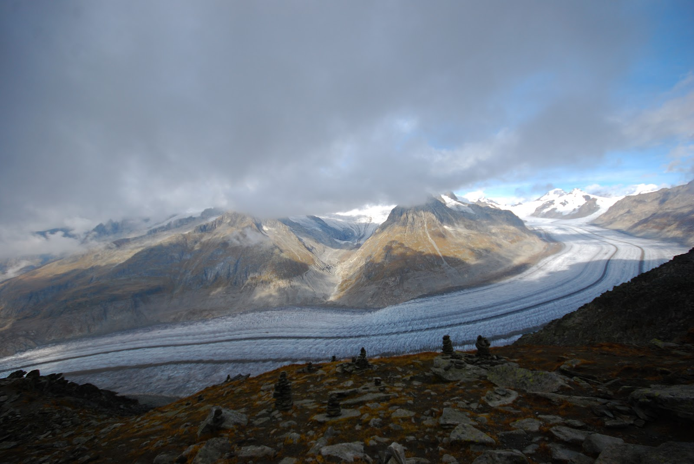
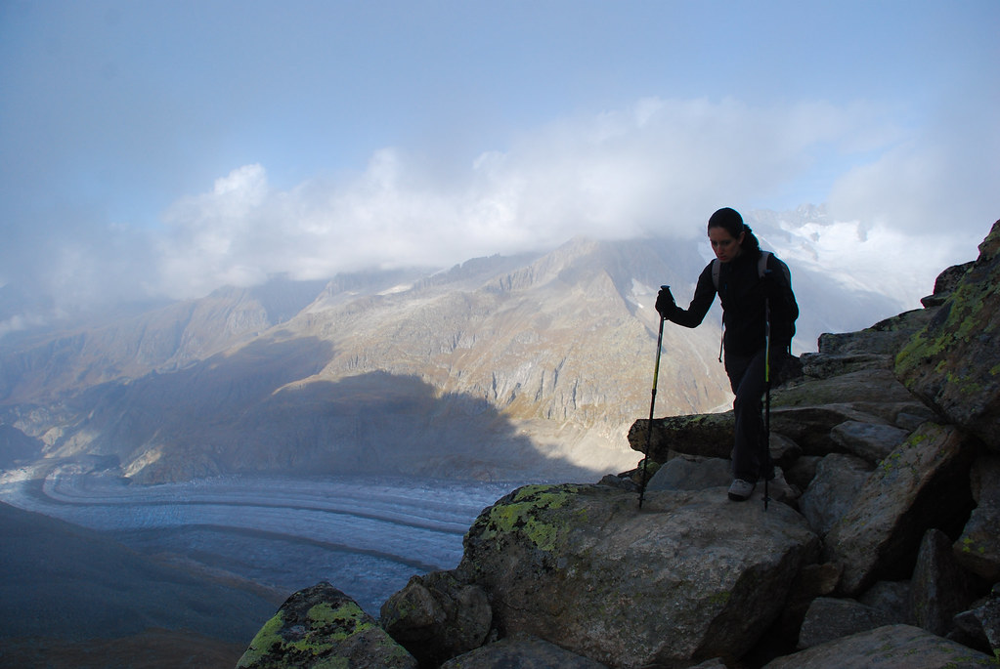
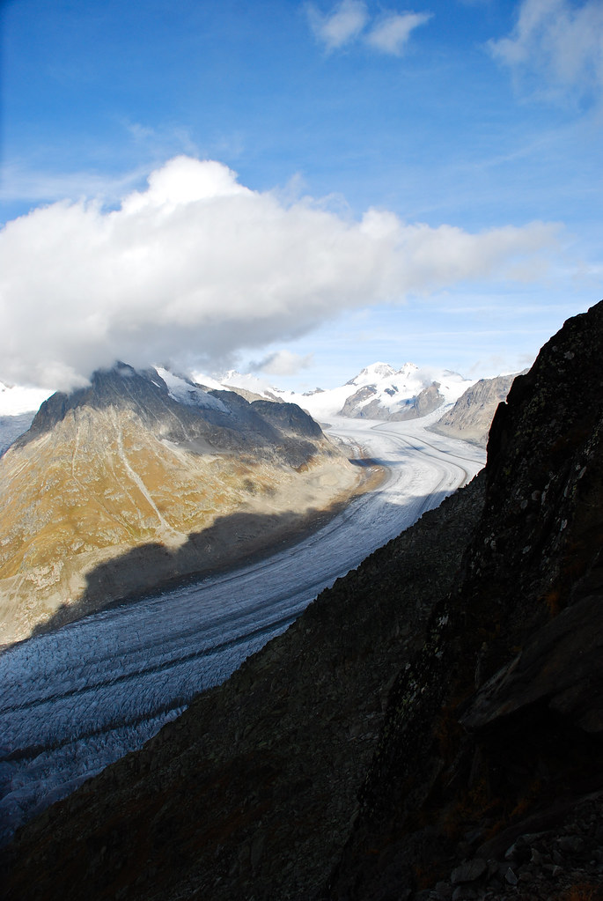
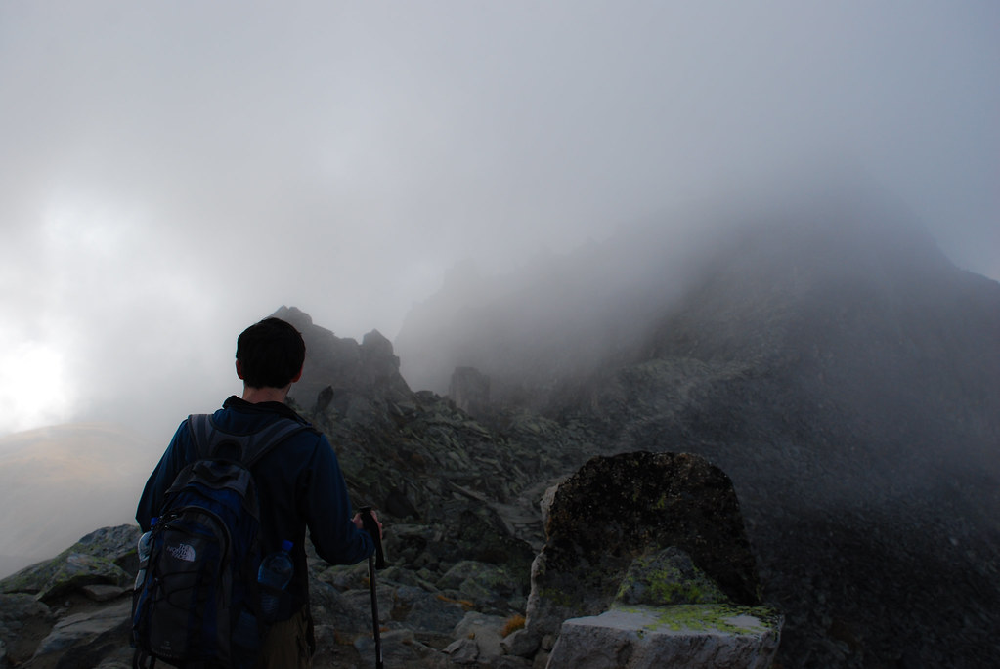
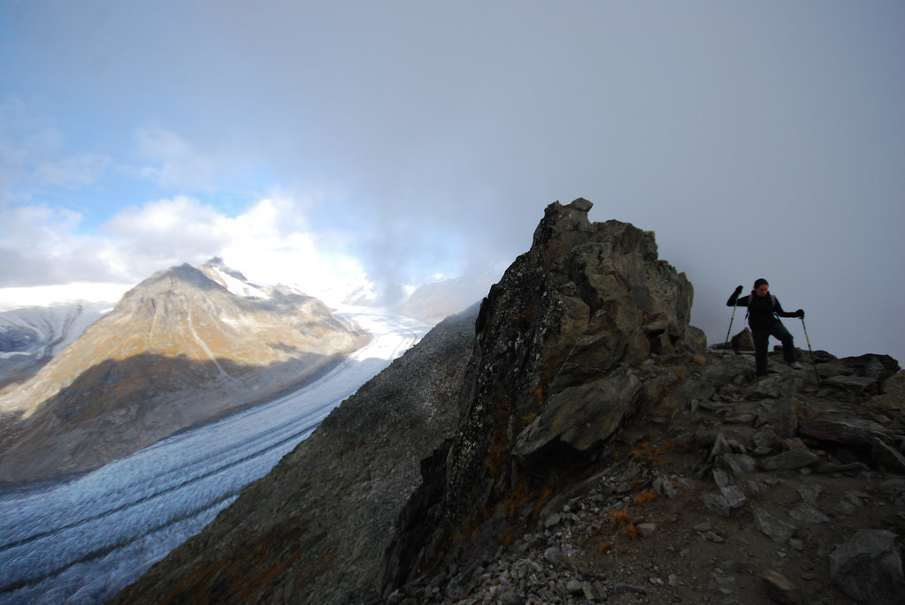
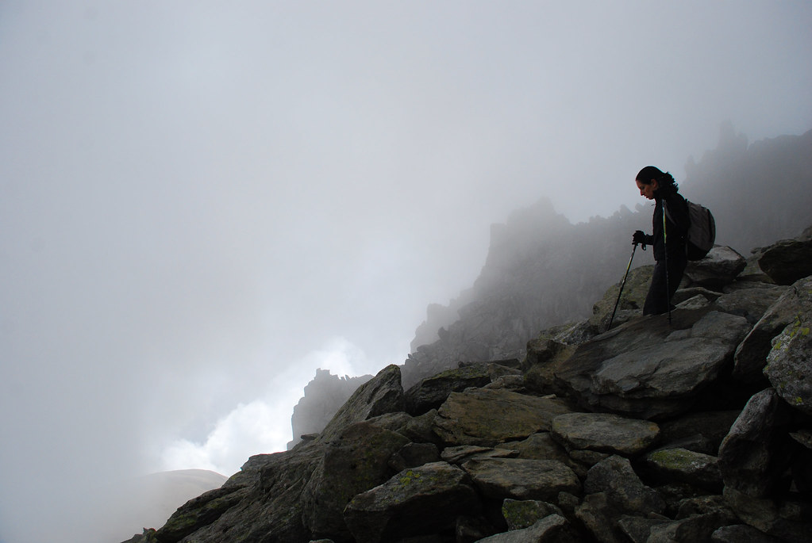
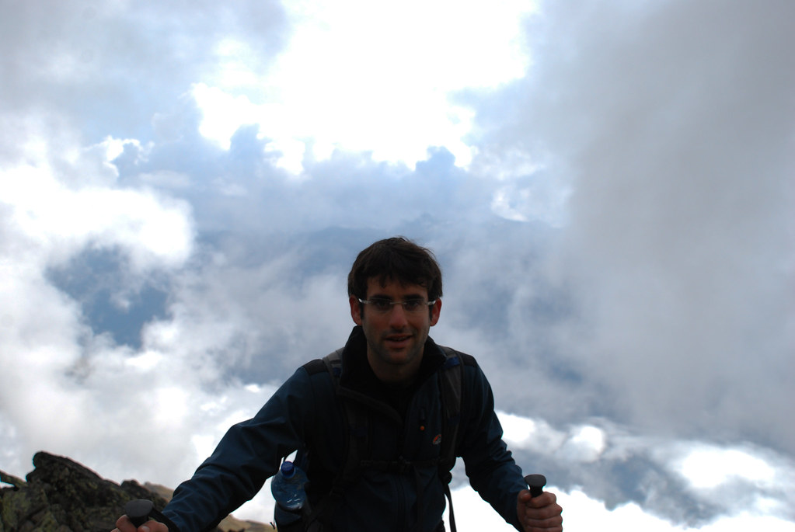
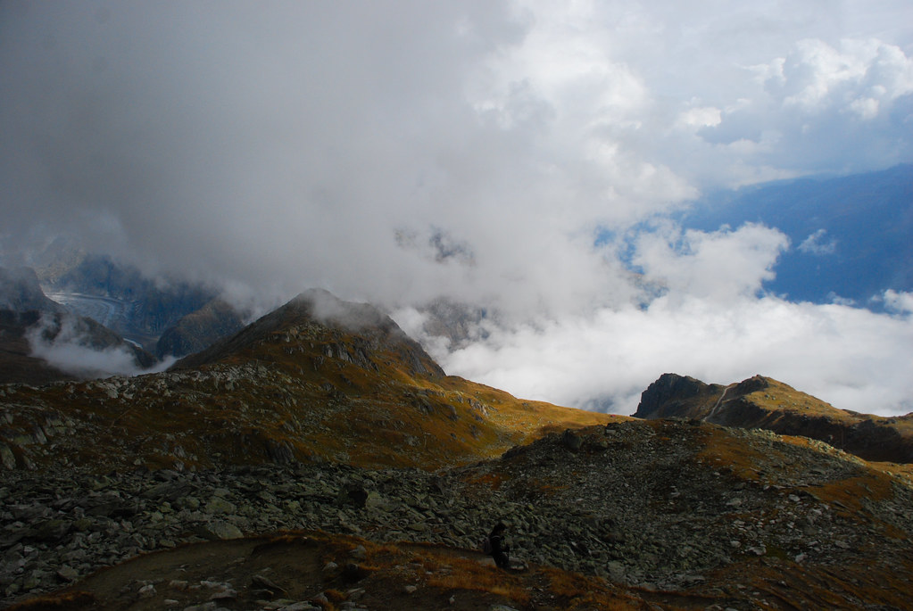
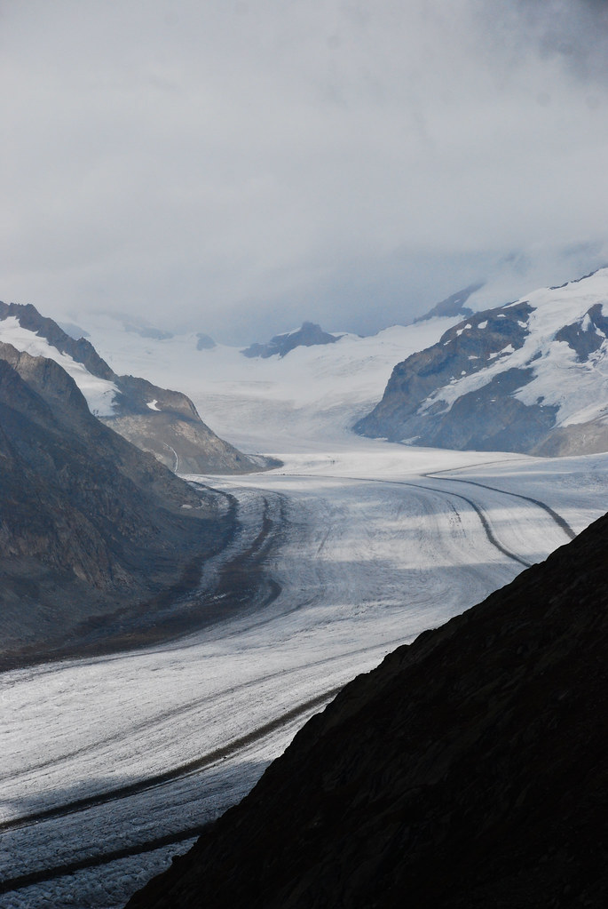
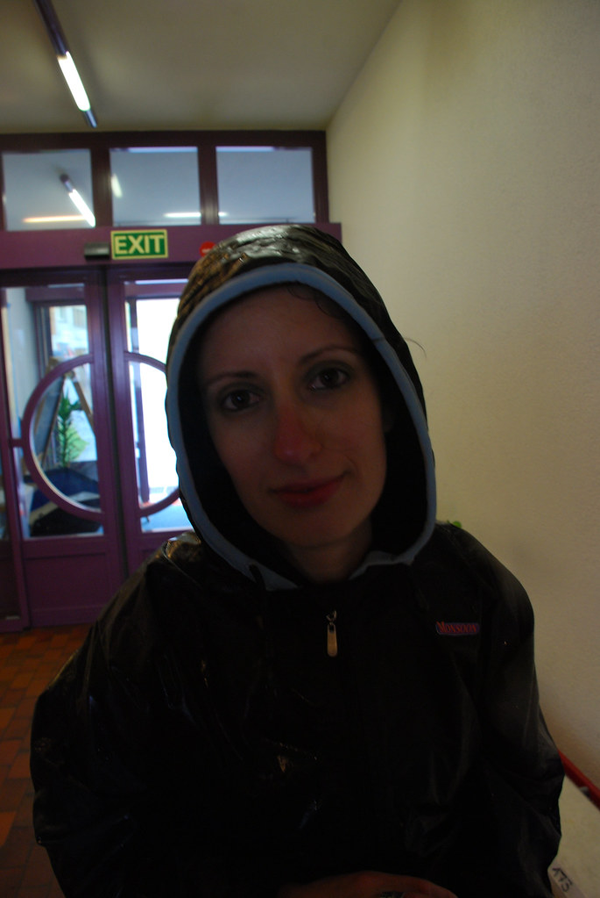

**09/10/2009 – Aletsch Glacier**

התעוררנו בLeuk המנומנמת לצלילי פעמון הכנסיה העתיקה. אכלנו את ארוחת הבוקר וניסינו לברר מה יהיה מזג האויר.  
האיש בקבלה הראה לנו בפרצוף משועשע, שבעיתון צויירו כל הicon-ים של מזג האוויר שקיימים – שמש, עננים, גשם ושלג :)

התוכנית היום היא לטפס לאיזור ה[Aletsch Glacier](http://en.wikipedia.org/wiki/Aletsch_Glacier) והחלטנו לא לשנותה.  
ה[Aletsch Glacier](http://en.wikipedia.org/wiki/Aletsch_Glacier) הוא הקרחון הגדול ביותר באלפים (באורך של 23 קילומטרים), נמצא בין שרשרת הרים בגובה ממוצע של 4000 מטר, ואמור להיות מרשים באופן חריג.  
הקרחון בדומה לשערו של יזהר אשדות, נמצא בנסיגה מתמדת וצפוי להעלם בעוד X שנים - תלוי את מי שואלים. (כשבכל מקרה X גדול ממש ממספר השנים שנותרו ליזהר שלנו להתפאר ברעמתו)

לא התעכבנו כל עוד השמש בשמיים, ונסענו לכיוון Fiesch שם השארנו את הרכב בחניון, כדי לעלות ברכבל לEggishorn.  
מיד עם הירידה מהרכבל נשקף בפנינו נוף בלתי נתפס של קרחון שנראה כמו אוטוסטרדה בת 6 נתיבים שמתפתלת בין ההרים.

Aletch Glacier – אוטוסטרדה קפואה בת 6 נתיבים

לאורך כל העליה ברכבל לא ניתן היה לראות את היעד שלנו, מפני שזה היה מכוסה כולו בענן עצום ומעורר חשדות. כשירדנו מהרכבל הענן החל לברוח כאילו שבחיים הוא לא ראה יהודונים, ונראה היה שמתחיל להתבהר.  
התחלנו לטפס לכיוון פסגת הEggishorn בדרך שמאד הפחידה את הנמלים שביננו מפני שהיא היתה צרה, סלעית וקרובה מידי אל התהום :)

תהום או לא, הכל זוטות לעומת הקרחון האינסופי המדהים הזה. פשוט קשה לתפוס שדבר כזה באמת קיים.

אותו ענן שקודם ברח מאיתנו, בסך הכל הלך לקרוא לאחיו הגדול, ובדרך חזרה לתחנה בEggishorn כיסו עננים את כל הדרך ביסודיות מרשימה. אם נסתכל על חצי הכוס המלאה, לפחות לא ניתן היה לראות שאנחנו הולכים על סף תהום :)

הממ.. אני בטוח שלפני רגע היה כאן שביל

הדרמה היתה ביננונית למדי, כשיצאנו מהענן והגענו חזרה לנקודת היציאה. לרגע שוב נראה היה שמדובר בסתם ענן בודד שחולף עם הרוח.

החלטנו שכל המשחק בו העננים באים והולכים הוא קטע מגניב, והתחלנו לרדת במסלול רגלי יחסית תלול לכיוון Fiescheralp.

יורדים לכיוון *Fiescheralp*

לאורך כל הירידה עננים באו וחלפו, בכל פעם שקצת התבהר נחשף בפנינו נוף חדש ויפה של האיזור, של אגמים ושל הקרחון האדיר הזה, שפשוט שאין לו סוף.

המשחק שלנו באש הגיע לקיצו הידוע מראש בדיוק כשהגענו לנקודת התצפית האחרונה על הקרחון בדרך למטה. אם אקדחים קיימים בשביל לירות, עננים כדי להרטיב…  
המלאך שאחראי על חדר הבקרה של האקלים התעורר באיחור, ורק עכשיו ראה את התחזית המגוונת עליה המליצו לו בעיתון.

אותו מלאך בירוקרט בנזונה התחיל ללחוץ על כל הכפתורים, ומה שהתחיל כטיפטוף התפתח מהר מאוד לגשם חזק, והתחלף לפרקים בברד משוגע :)  
לבשנו את מעילי הגשם, כיסינו את התיקים בכיסויי הגשם, והתחלנו לרדת בנחישות למטה.

לא משנה בכמה Gore-Tex תצפה את הנעליים שלך, אם המכנסיים הם לא מכנסי גשם, אחרי שעה הליכה בגשם המכנסיים ייספגו, דרכן הגרביים ומשם הדרך לשלוליות בנעליים קצרה ביותר. למזלנו היינו מצויידים בכפפות טובות, שבילעדיהן הברד ממש הכאיב על כפות הידיים החשופות והקפואות שלנו.

הדבר הטוב שיצא מחווית הירידה הזאת, הוא שהנמלה סוף סוף עשתה סימנים של התגברות על פחד הירידות המפורסם שלה, וירדה בקצב מרשים על אף הגשם!אחרי קצת יותר משעה, שהרגישה כמו קצת יותר מנצח, הגענו אל המבנה המחומם בFiescheralp שם חיכה לנו מרק חם עם בירה שהחזיר אותנו אל חיקם של בני האדם.

ירדנו חזרה ברכבל לFiesch שם שמחנו למצוא את האוטו המאובזר שלנו, והפעלנו את מחממי המושב למקסימום. בדרך לLeuk עברנו עם האוטו להציץ על הארמון של Brig שבמילא היה בדרך.  
אחרי מקלחת טובה בLeuk רצינו לפנק את עצמנו הערב – וכמו שכבר הבנו אתמול - זה אומר בהכרח ללכת למקום של צרפתים.

נסענו לSalgesch, עיירה פיצפונת שמפורסמת ביינות ובייקבי הבוטיק שלה.  
העיירה כולה נראית כמו יקב אחד גדול, כשכל דבר פה מריח ונראה איכשהו קשור ליין.  
לראשונה בטיול לבשנו בגדים שאינם “בגדי טיולים” וישבנו במסעדה מעולה.  
פילה בקר ומנה מיוחדת מכבש מוגשים לצד רושטי לוהט, ליוו יפה את הPinot Noir, שהגיע היישר מיקב מקומי בבעלותו של השכן של בעלת המסעדה.

המשך יבוא…
