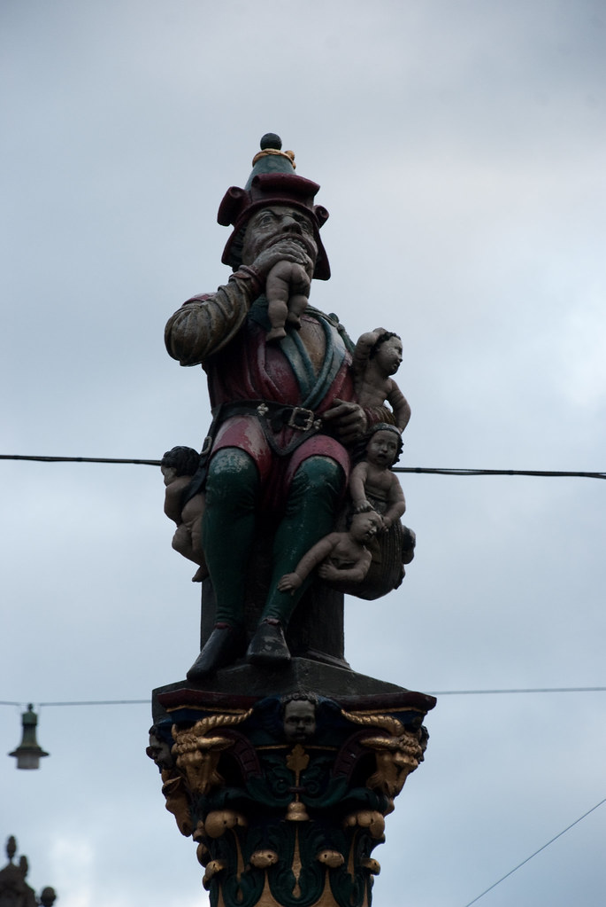
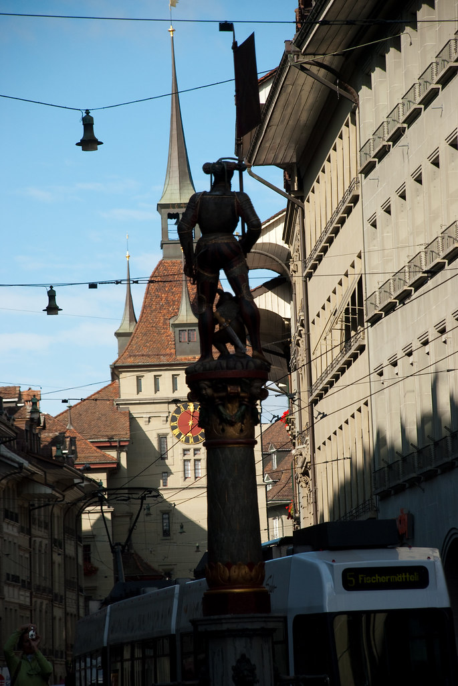
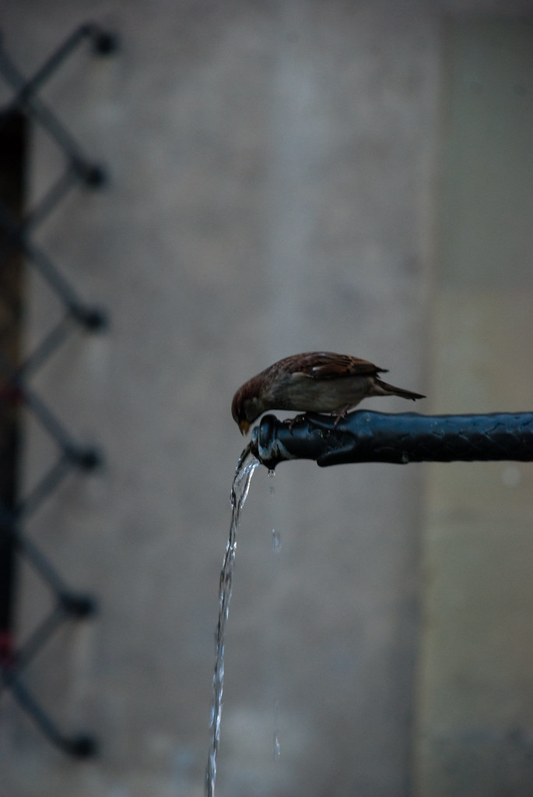
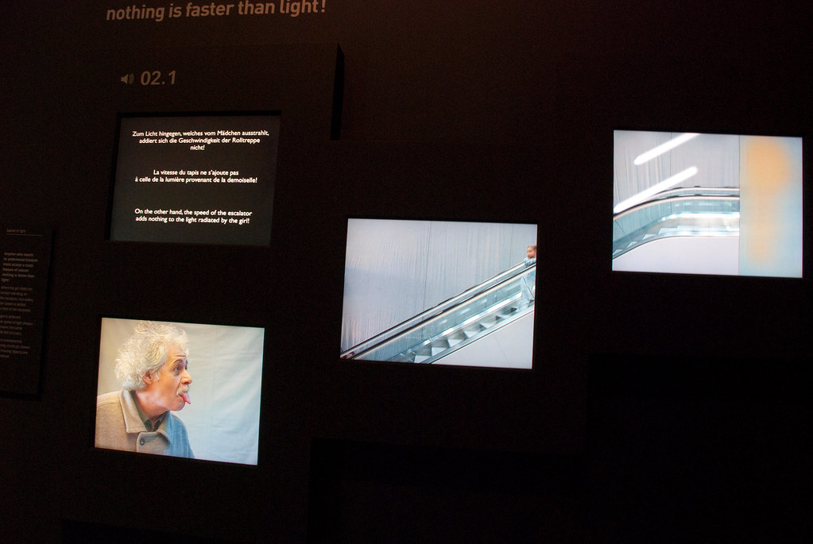
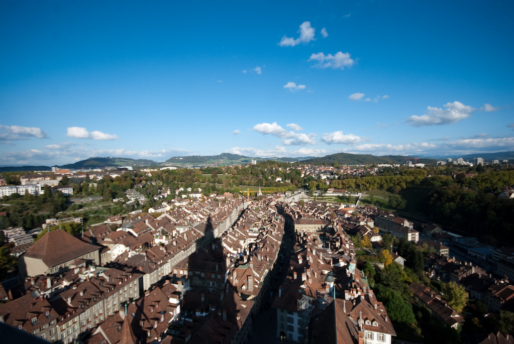

**13/10/2009 – ברן**

יחסית להיותה עיר, ברן לא נוראית בכלל וכיף להסתובב ברחובות היפים שלה.  
אחת האטרקציות הידועות של העיר היא שפע המזרקות העתיקות המפוזרות בכל פינה.  
גולת הכותרת של המזרקות היא פסל-מזרקה של ענק שזולל את ילדי העיר.  
אני לא בטוח מה המשמעות ההיסטורית של הפסל, אבל הפרשנות האישית שלי שופכת אור על הסיבה לכך שהמקומיים פה נראים כל כך מאושרים:  
כולם מכירים את הבעיה - יש את הגיל הזה, בו ילדים מפסיקים להיות חמודים, ומתחילים להיות קוץ בתחת – יש לי הרגשה שבברן מצאו לזה פיתרון…

ויתרנו על סיור בפרלמנט השוויצרי, מכיוון שלא היה היום סיור באנגלית.  
בגלל שעיקר התיירות עכשיו היא תיירות פנים, וגם ככה מדברים במדינה הזאת ביותר מידי שפות, יש סיור באנגלית רק פעם בשבוע.

*”להתעשר על גב התעצמות הטרור העולמי” – **בעד***

*“לאפשר רצח של מיליוני יהודים” - **נייטרלי***

הסתובבנו בשווקים הצבעוניים של העיר וקנינו כל מיני שטויות שבאותו הרגע נראו מאד נחוצות.

בברן יש שעון שאמור להיות מרשים ודומה לזה שבפראג. לא זכור לי שהתרשמתי במיוחד מהשעון בפראג ובכל מקרה – השעון מכוער ומיותר למדי..  
גם הסיפורים וההמצאות על כך שהשעון הזה היה ההשראה של איינשטיין בחקר תורת היחסות לא הוסיפו לשעון יותר מידי. מקווה שיסיקו פה מסקנות ובביקור הבא שלנו יוצב כאן פסל של ענק שזולל שעונים…

במוזיאון ההיסטורי של ברן, ביקרנו בתערוכה הקבועה של אלברט איינשטיין.  
התערוכה היתה הפתעה נהדרת, ואסור לפספס אותה בשום אופן.  
חוץ מסיפורים מעניינים על חייו של איינשטיין, שהיה אדם די מגניב בפני עצמו, היו בתערוכה הסברים אינטראקטיביים מעניינים על חלק מהתיאוריות והגילויים שלו.  
בין הייתר למדנו על תורת היחסות הפרטית, הכללית, מסעות בזמן, והכי חשוב – איך להפוך מאות אלפי יפנים לאבקה!

> משם המשכנו אל ה-Münster של ברן. כנסיה נחמדה ובה מגדל שאליו ניתן לטפס ברגל ולהשקיף על העיר.  
> הטיפוס החזיר אותי לילדות, וממש לא בגלל שגדלתי בברן. כבר כשהתקרבנו לקומות העליונות תקף אותי פחד גבהים – הרגשה שכבר הספקתי לשכוח.  
> לדעתי יש לי “פחד גבהים אורבני”, כי בכל מה שקשור לטבע, אני ממש לא מפחד… מוזר…

berner münster *– פחד גבהים אורבני*

לסיכום - מומלץ לבקר בברן, העיר באמת נעימה, ולא כל כך דומה לערי בירה אחרות באירופה בהן יצא לי לבקר.

המשך יבוא…
