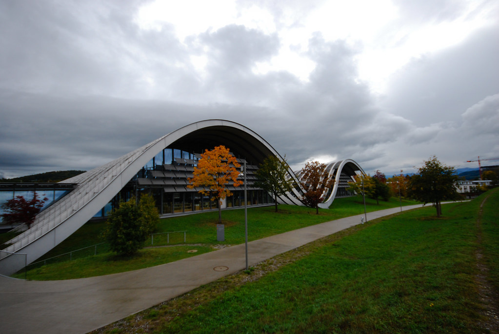
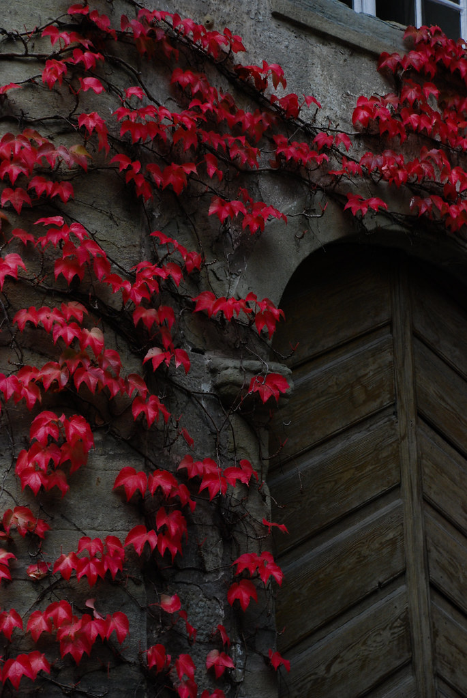
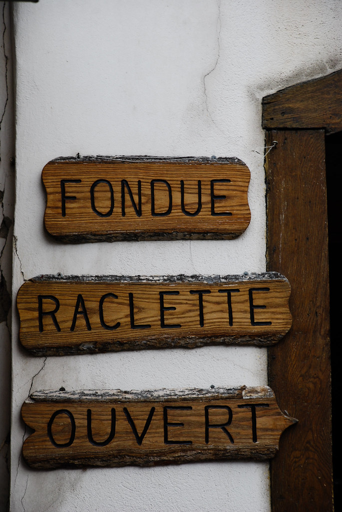
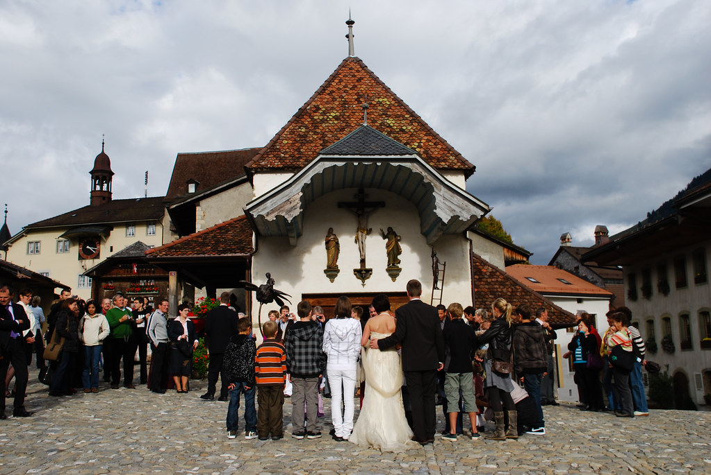
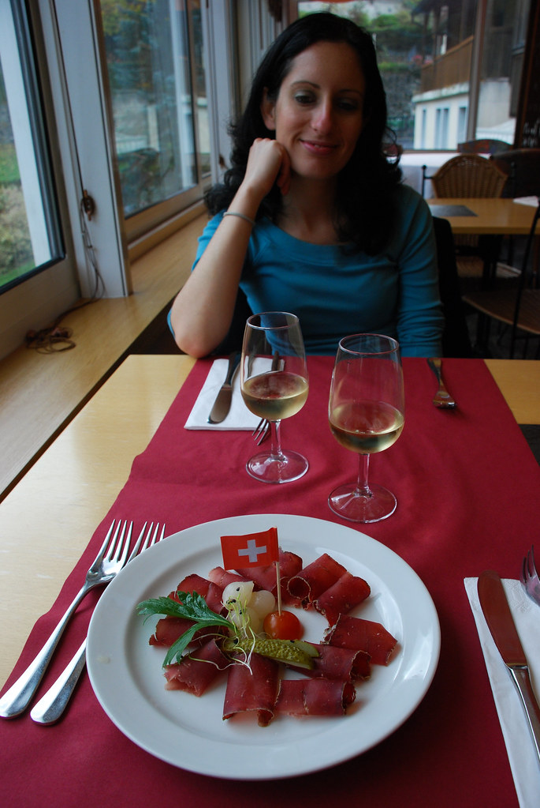
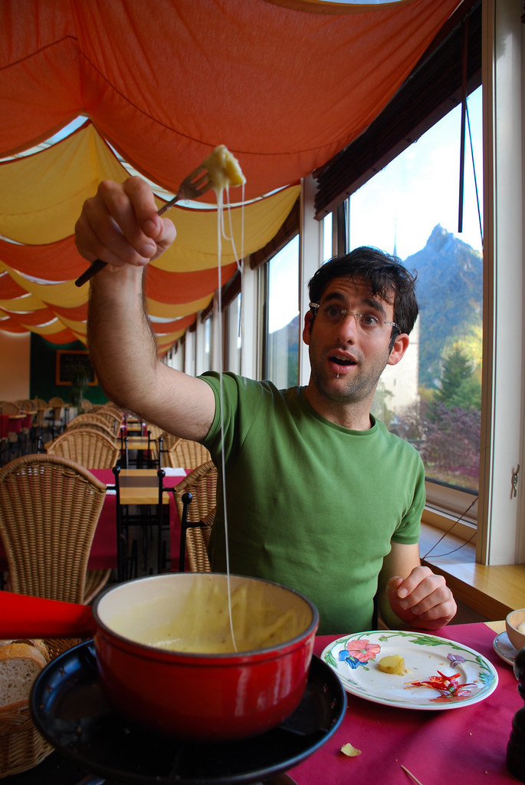
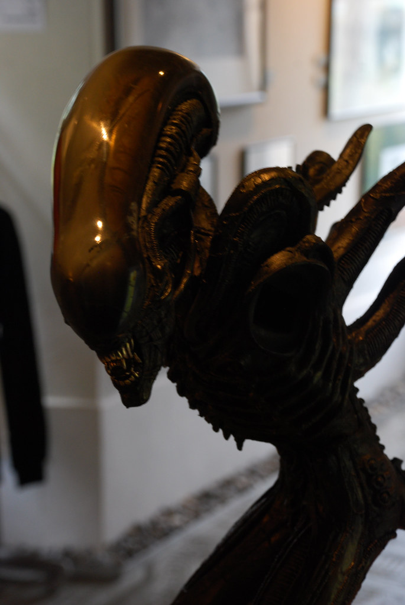
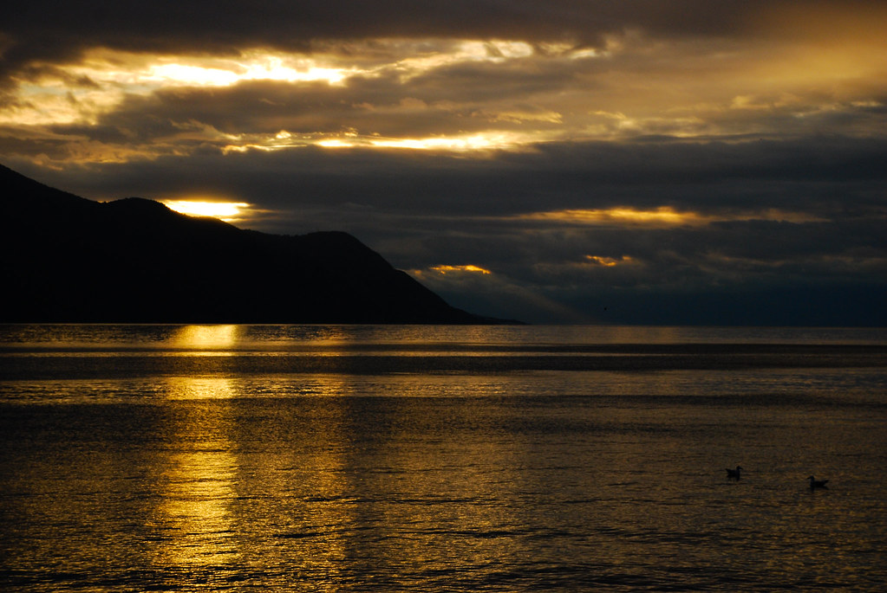
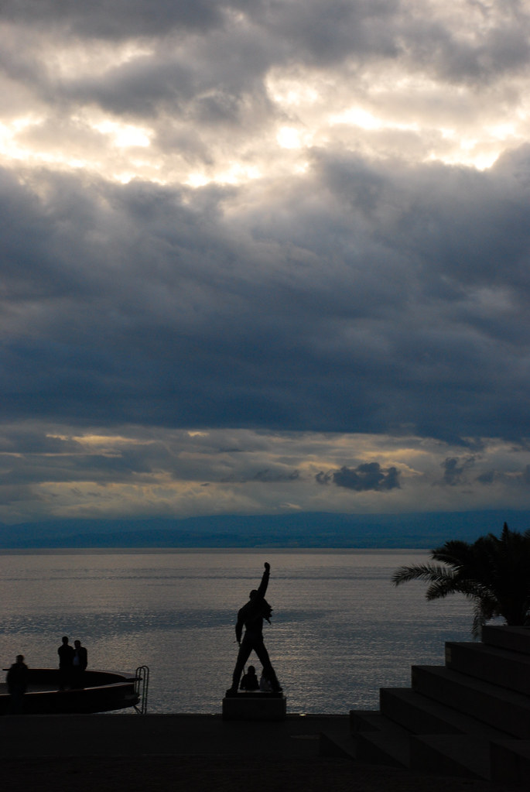
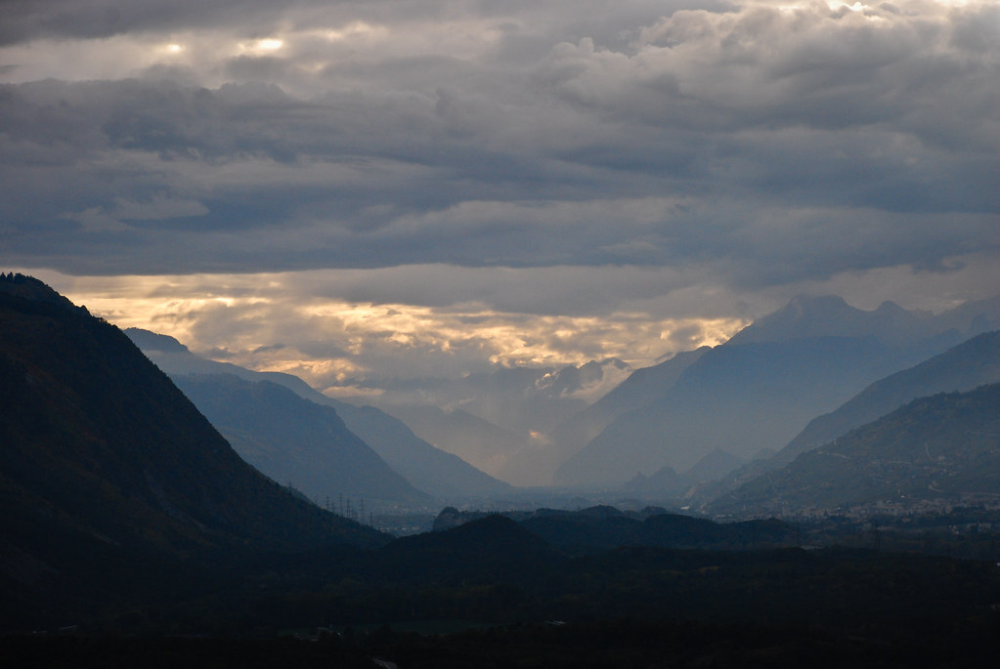

**10/10/2009 – יום של כל מיני**

היום שוב יחסית מעונן עם סיכויים לגשם, אז שלפנו מהשרוול תכנית ליום גשם.  
חיברנו כל מיני אטקרציות שנמצאות יחסית קרוב, ולא לוקחות יותר מידי זמן כל אחת, וחיברנו אותן ליום טעימות נחמד.

את הבוקר פתחנו כיאה ליום גשם, במוזיאון. נסענו למוזיאון Paul Klee שבפאתי Bern. המוזיאון נמצא ממש על הכביש הראשי, כך שלא נאלצנו להכנס לעיר בכלל.  
המוזיאון היה יפה מאד מבחוץ, וגם מבפנים היו לו כמה רגעים יפים. Paul Klee הוא מהאומנים השוויצרים המובילים, ומחלוצי תנועת הBauhaus שהשפיעה בין היתר על הבניה בתל אביב.

מהמוזיאון המשכנו אל הקנטון הצרפתי Fribourg כדי לבקר בעיירות Bulle ו Gruyères. בBulle היפה עברנו ממש בקצרה. עשינו סיור רגלי, ראינו את הטירה שלהם וחזרנו למכונית.

Gruyères היא עיירה גדולה יותר, עם מרכז יפיפה שנשמר מימי הביניים ומשקיף על נוף שוייצרי טיפוסי.  
במרכז Gruyères הקטן היו די הרבה אנשים, והמון מסעדות עם ריח חריף של גבינה מותכת

בכנסיה שברחבה המרכזית של העיר הייתה בעיצומה חתונה מקומית שנראה שהתאספו סביבה יותר תיירים מאשר אורחים.

אחרי סיור קצר, ישבנו לאכול רעבים מתמיד. זללנו פונדו מנצח, שתינו יין לבן טעים, ובעיקר היינו מאושרים :)  
את הגבינה המפורסמת Gruyère, מכינים ממש כאן מפרות מסכנות עם זרים על הראשים. הצטיידנו להמשך בגבינה טעימה.

ב- Gruyères ממוקם מוזיאון של H.R. Giger, האיש מאחורי האפקטים המיוחדים בסדרת Alien (הנוסע השמיני). החלטנו ללכת על זה. המוזיאון היה מושקע יחסית ומה שבעיקר יכולנו ללמוד ממנו, זה שאותו Giger הוא סוטה מין בין גלקטי. כמה מהמוצגים, שהוחבאו מאחורי וילונות עם הכיתוב “למבוגרים בלבד”, ילוו אותי בסיוטים נבחרים בשארית לילות חיי.

את היום סיימנו בריויירה השוויצרית בעיירת הנופש Montreux.  
Montreux היתה הפתעה נעימה בזכות אוירת החופש הנעימה ששררה בה.  
ניתן כאן לראות אוליגרכים, טרוריסטים, רוצחי עם וסתם עשירים – כולם יושבים בבתי קפה ושוכחים לרגע אחד את הצרות שלהם.

Montreux, מפורסמת בתעשיית המוסיקה שלה (או לפחות היתה מפורסמת). בעיירה יש אולפן הקלטות בו לא מעט אומנים מהשורה הראשונה הקליטו אלבומים.  
לקח זמן עד שעשינו את הקישור לשיר Smoke on the water של ה Deep purple, שמתאר איך במהלך הופעה של Frank Zappa בMontreux היתה שריפה גדולה, והעשן היתמר מעל אגם ג’נבה.  
מסתבר שהDeep Purple היו כאן בהקלטות בדיוק כשארעה השריפה.

רק כשאנחנו באים לא קורה פה כלום! לא שריפה מטופשת, ובטח לא הופעה של Frank Zappa. לפחות לפסל המגניב של Freddie Mercury יש יסודות עמוקים בבטון כך שהוא כבר לא יברח לשום מקום.  
Queen הקליטו פה כמה אלבומים, ותמונת השער של האלבום Made in Heaven צולמה כאן. מספרים שפרדי החזיק כאן בית בו הוא נהג להרגע.

תמיד מצחיק באירופה להכנס לMcDonald's כדי לראות איך עשו כאן את ההתאמה לאותה המדינה (אה, וגם כי מבצע הצ’יזבורגר ביורו הוא פיתוי גדול מידי עבור דוד עמית)  
לשוויצרים אין המון מאכלים שנחשבים שלהם (בעיקר גבינות ושוקולדים), אז בMcDonald’s נאלצו לעבוד עם מה שיש :)

")

נסענו בחזרה למלוננו הצנוע בLeuk כדי לישון בו את הלילה האחרון. מחר שוב נחפש לנו מקום לינה חדש בדרך מזרחה.  
אהבנו את המלון שלנו בLeuk, הוא התאים בדיוק לצרכים שלנו כאן.

המשך יבוא…
