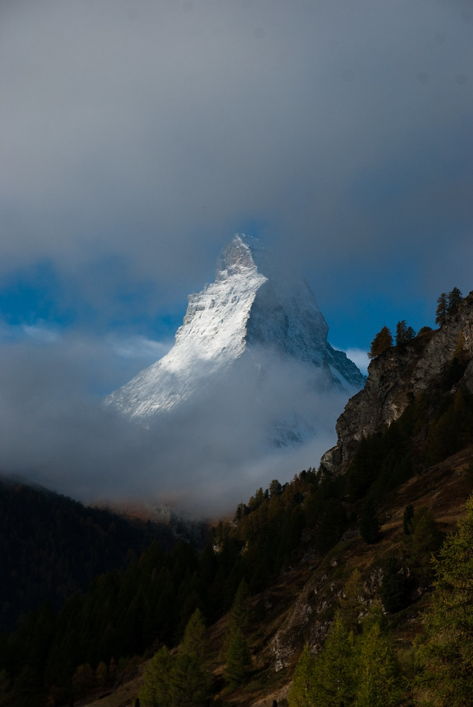
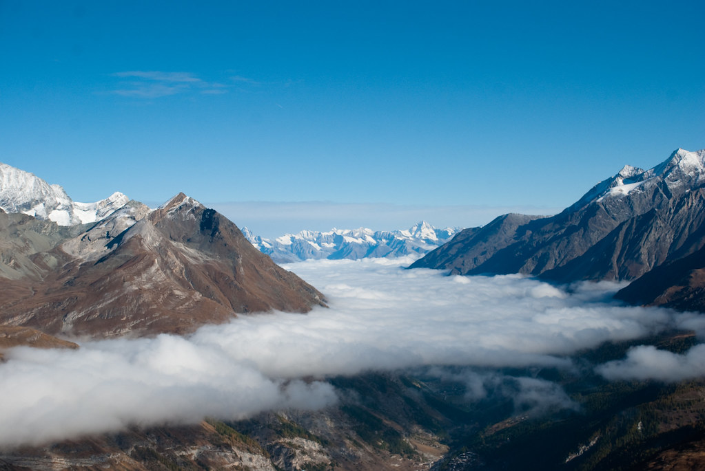
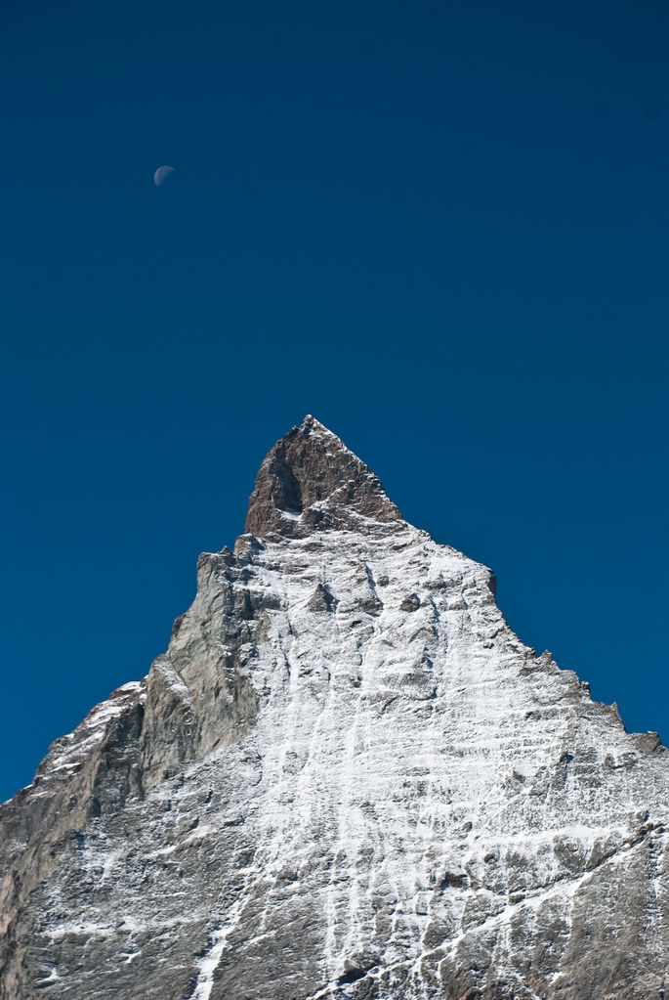
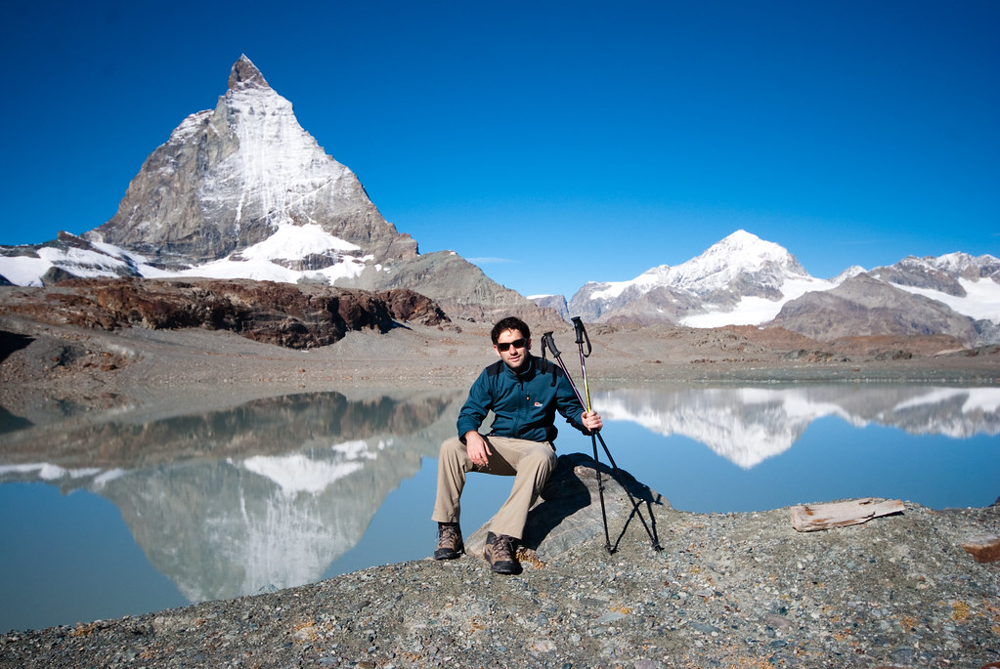
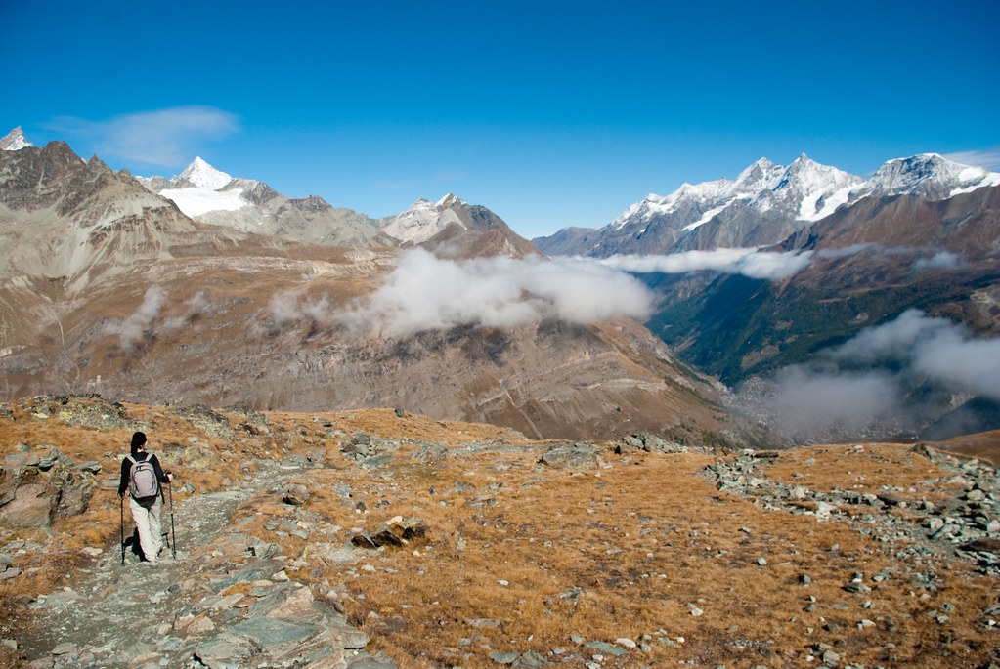
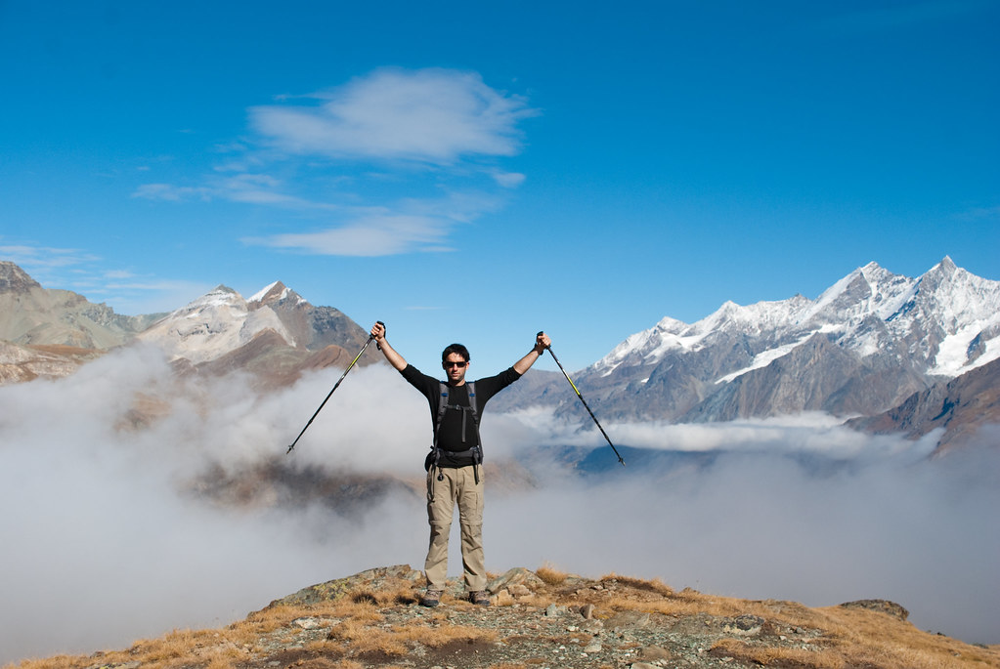
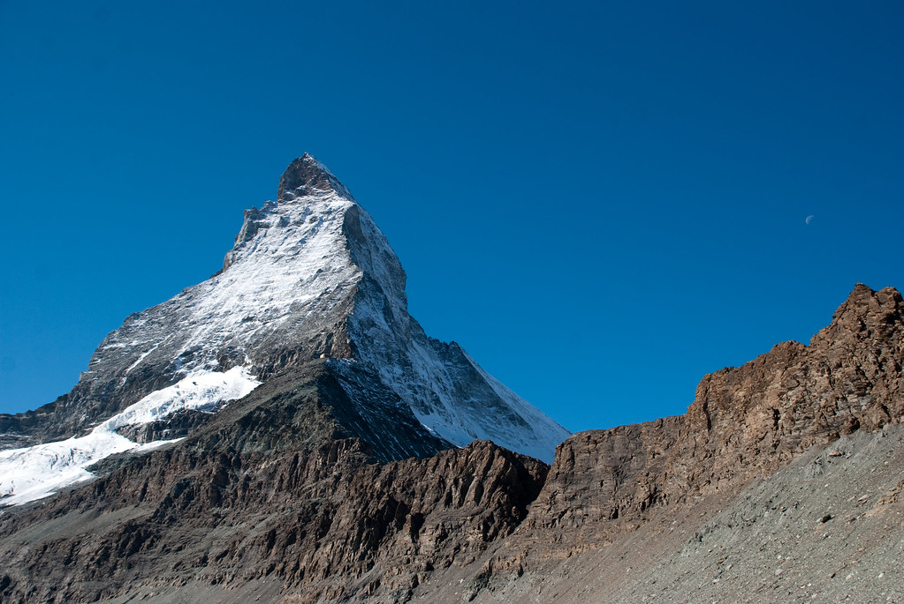
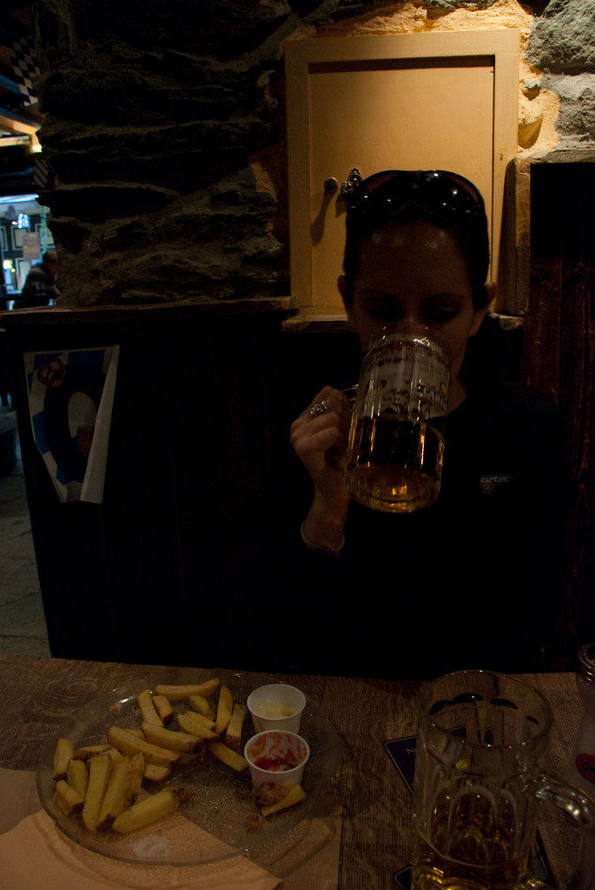
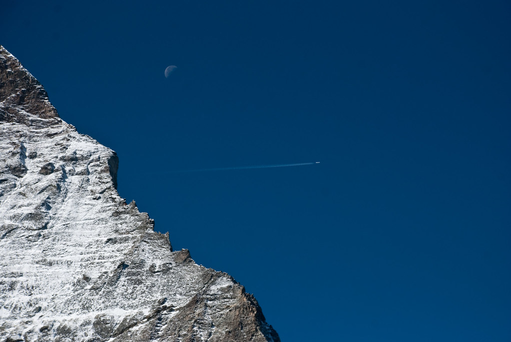
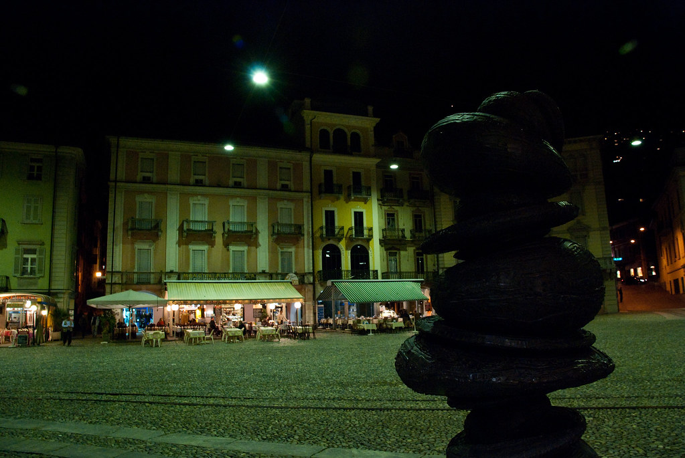

**11/10/2009 – Zermatt אהובתי!**

היום קמנו מוקדם, ארזנו את כל חפצינו אל תוך האוטו ועזבנו את Leuk לכיוון “עיר החניונים” Täsch.  
תושבי Täsch לא גוועים מרעב רק בזכות העובדה שTäsch היא העיר הכי קרובה לZermatt אליה ניתן להגיע באמצעות רכב. כל תושב כאן הפך את החצר האחורית שלו לחניון, וגובה תשלום לפי ההיצע והביקוש.  
למזלנו, בעונה זו הביקוש דל, כך שמצאנו חניה יומית ב4 SFR(!) – לא ידענו אפילו שהשוויצרים מכירים שטרות של פחות מ20.

הבנת הנקרא מלמדת של-Zermatt לא ניתן להגיע עם מכוניות. ואכן, Zermatt הוכרזה כCar-free והסיבה הרשמית לכך היא שהתושבים לא מעוניינים שזיהום האוויר יהרוס להם את הנוף.  
אפילו 6000 התושבים של Zermatt יכולים להגיע אליה ברכבת בלבד.  
קיים כביש המוביל ל-Zermatt בו ניתן להשתמש עם מכוניות חשמליות בלבד לצורך העברת סחורה, או במקרי חירום.  
אני עדיין חושב שבסך הכל מדובר בתעלול עסקי גאוני שיצר מקור הכנסה ל”עיירת החניונים”…

בכל מקרה, עלינו על הרכבת לZermatt, שנכנסה למנהרה חשוכה, ובתוכה התרחשה תאונה קטלנית בה נהרגו כל הנוסעים ואנשי הצוות של הרכבת. אני די בטוח שבדיוק כך זה התרחש, מפני שהדבר הבא שאני זוכר אחרי שנכנסנו למנהרה זה שהגענו לגן עדן!

כל עניינה של Zermatt הוא טיולים וסקי! בתי העסק היחידים בZermatt הם חנויות טיולים או ספורט חורף וכמובן פאבים מגניבים!  
אני מתנצל על ריבוי סימני הקריאה היום, יש ימים שבהם פשוט מתחשק לי לקרוא! בכל מקרה תסתמו את הפה שלכם, זה הטיול שלי ואני אפסק אותו איך שאני רוצה* !!!  
** כפוף לאישור הנמלה*

מזג האויר הצפוי בZermatt היום הוא מעונן לאורך כל היום, אבל אל דאגה, אין שום קשר בין מזג האויר בZermatt לבין זה שבהרים של Zermatt, לשם העננים נמוכים מדי מכדי להגיע.  
בהרים של Zermatt יש שלג כל השנה, ואתר סקי הקיץ כאן מאד פופולרי.  
השתמשנו ברכבל הסקי כדי לברוח מהעננים של Zermatt ולהגיע לנק’ המוצא של המסלול שלנו.

מטיילים מכל העולם מגיעים ל-Zermatt כדי לחזות בהר ה-Matterhorn (מ4478) שהוא אחד מהסמלים של שוויץ.  
הLonely planet מתאר אותו ככזה שמתגרה בטריגונומטריה. לי הוא נראה כמו שן של כריש ובכל מקרה אם מישהו מתכנן לטפס עליו, אני לא ממליץ לשבת כשמגיעים לפסגה כי הMatterhorn יכול להיות חתיכת קוץ בתחת :)

המסלול שבחרנו נקרא Matterhorn Glacier Trail. מסלול שיוצא מTrockener Steg ומסתיים ב Schwarzsee Paradise. למזלי הרכבל ב Schwarzsee Paradise היה בשיפוצים, ולכן לא היתה לנו ברירה אלא להוסיף למסלול קטע נוסף שיביא אותנו עד לרכבל הבא. בקיצור – יום ארוך וכיף :)

המסלול נקרא בשם זה מפני שהמסלול מתחקה אחרי מסלול נסיגה של קרחון שעבר כאן די מזמן. במסלול מפוזרות כ20 עמדות עם הסברים על התופעות הגיאולוגיות שיצר הקרחון, ועל החיות והצמחים בסביבה.  
המידע הוסיפו הרבה לטיול שגם ככה היה מדהים.

להפתעתי היינו כמעט לגמרי לבדנו במסלול. למרות שזאת לא העונה, מזג האויר היה מושלם.  
באחד השלטים היה כתוב שהקרחון במהלך נסיגתו לפעמים פולט חלקי גופות. מאותו הרגע כל אבן נראתה כמו אצבע כרותה :)

בגלל כל העניין עם הקרחון, המסלול היה מגוון מאד. במקומות מסויימים הקרקע עדיין לא מסוגלת להצמיח כלום אז הנוף היה דומה למדבר קפוא. בהמשך עברנו בין אגמים ונכנסנו לעמק מלא סלעים גדולים אותם הקרחון “סחב” תוך כדי הנסיגה שלו.

הדבר היחיד שהיה קבוע במהלך כל המסלול היה הMatterhorn. מכל מקום בו היינו יכולנו לראות אותו מתנשא מעלינו.

מ-Schwarzsee לכיוון Zermatt היתה ירידה ארוכה. במהלך הירידה נכנסנו בין יערות אלפיניים בהם אמורים להיות נקרים. נזכרנו ב-Woody woodpecker הנהדר. חלקינו חשבנו שזה מאד נחמד להמשיך את ההליכה תוך כדי הכרזות חוזרות של: Guess Who ? ומייד לפצוח בצחוק נקרי מתגלגל ונטול רסן :)

כשהגענו ל-Zermatt אחרי ירידה קשה ויום ארוך, היינו תמימי דעים שמגיע לנו פיצוי בדמותה של התחזרות קולינרית. בנוסף לבירת סוף-המסלול המסורתית שלנו, הזמנו בפאב גם צלחת צ’יפס עצומה ומלאה בנחמה.

התאהבתי ב-Zermatt ממבט ראשון, ויש לי הרגשה שזאת לא הפעם האחרונה שאני אבקר בה. יש כאן כמות לא הגיונית מסלולי טיול מגוונים, וזה עוד מבלי להזכיר סקי!  
עזבנו את Zermatt לפני שהחשיך בדרך לטיול חדש. מכאן הטיול יהיה אורבני יותר - ארזנו את מקלות ההליכה, להם לא נזדקק עוד בטיול הזה.

ל[כל התמונות](http://www.flickr.com/photos/shpandrak/sets/72157622599029913/) מ-Zermatt

נסענו ברכבת חזרה ל-Täsch, שם חזרנו אל מכוניתינו האהובה. במטרה לקצר מרחקים לקראת מחר, התחלנו בנסיעה מזרחה לכיוון קנטון Ticino האיטלקי בו נטייל מחר. בגלל השעה המאוחרת לא לקחנו סיכון והתקשרנו להזמין מקום לינה בLocarno. מצאנו מקום שנראה סבבה ב-Lonely Planet בו היתה בעיה של מקום.

הגענו ל-Locarno בשעה מאוחרת. המלון היה נחמד. שוב המקלחות היו מחוץ לחדר, ושוב היינו לבדנו בכל הקומה כך שבעצם היתה לנו מקלחת פרטית…  
יצאנו לסיבוב לילי בעיר, ולמרות שידענו את זה מראש, זה עדיין היה מפתיע איך שבין רגע פתאום אנחנו כבר לא בשוויץ, ואפילו לא בצרפת – זאת איטליה, עם כל הפיאצות הפיצריות והשפה האיטלקית בכל מקום.

 המשך יבוא…
