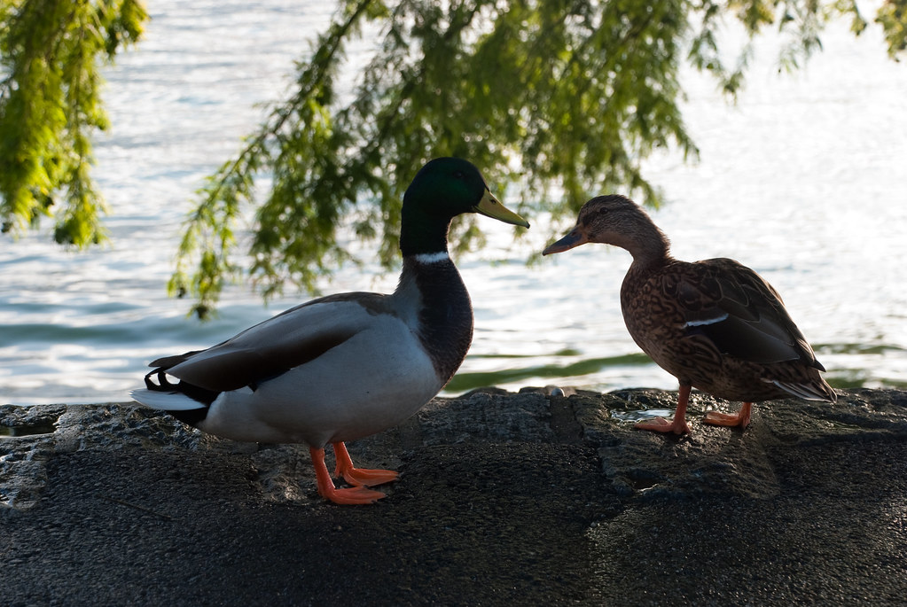
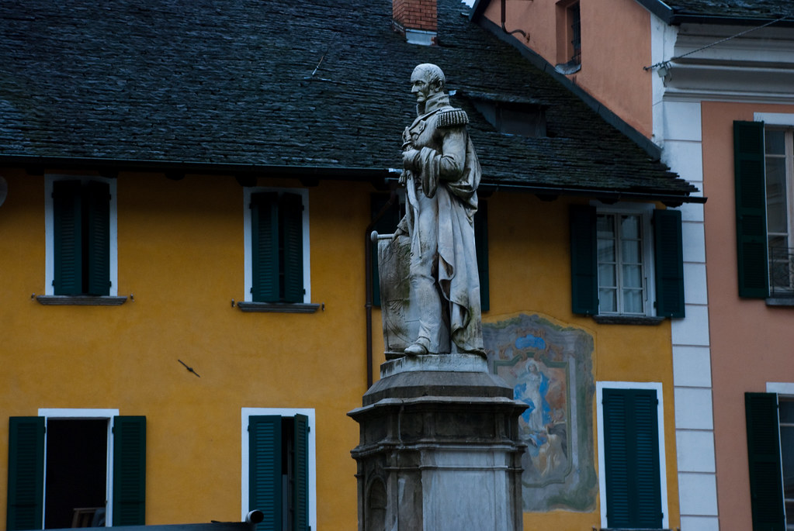
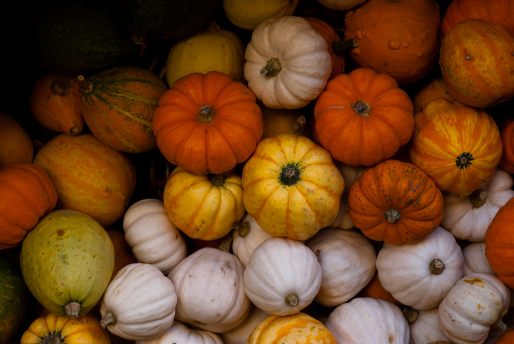
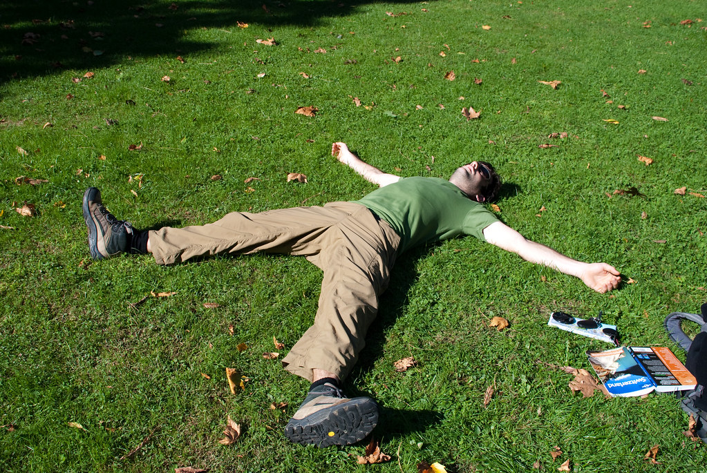

**12/10/2009 – טעימה איטלקית**

היום עשינו טעימה מטיצ’ינו - הקנטון האיטלקי של שוויץ .  
כשאני אומר טעימה, אני לא מתכוון באופן מטפורי, אלא יותר באופן פטיפורי...  
לא צריך להתבייש.. באנו לפה במטרה ברורה לאכול אוכל איטלקי!  
ככל שקראנו במדריך על האיזור, לא הצלחנו למצוא שום סיבה טובה לבוא דווקא לכאן ולא לאיזור שוויצרי אחר, אבל בשם הגיוון בלבוש של “אוירה של איטליה” הכרענו את הכף.

בבוקר הסתובבנו בלוקרנו. הריחות והשפה האיטלקית אכן נתנו הרגשה שונה (מעיין דיגדוג\\גירוד\\קרקור באיזור הבטן).  
האטרקציות בעיר הן כנסיה, טירה קטנה, כיכרות וכרגיל אגם עצום ויפה.  
שוטטנו להנאתנו ברחובות בין פיצריה אחת לשניה.

משם המשכנו לLugano, בירת הקנטון. אני חושב שהדרך הכי טובה לתאר את Lugano זה: כמו Locarno, רק יותר גדולה כשהתוספות על הפיצות כאן אולי קצת יותר מגוונות…

שוב הסתובבנו בעיר בעקבות האטרקציות התורניות – כנסיה, פסל וכו..  
הרחובות היו מלאים בתיירים והיתה אווירה נעימה של חופש.  
השמש יצאה ומזג האויר היה מושלם. ניצלנו את ההזדמנות כדי לשכב על הדשא בפארק היפה של העיר על שפת האגם.

זלילת הפיצות והגלידה יכלה רק לדחות את הקץ לקראת האטרקציה המרכזית של היום – ארוחת הצהרים!  
אחרי התלבטות קלה, בחרנו במסעדה שהומלצה על ידי ה-Lonely planet והיתה במקום אסטרטגי על אחת מכיכרות העיר היפות.

אין כמו הסלט האהוב עלי ביותר סלט קפרזה בצבעי הדגל האיטלקי כדי לעורר את התאבון (שבמילא היה ערני היום יתר על המידה). ריזוטו פטריות מדהים, ורביולי בשר פיקנטי כיכבו בארוחה לצד בקבוק יין איטלקי טעים.  
המטבח האיטלקי אמנם פשוט יותר מהצרפתי, אך לטעמי אינו נופל ממנו.

אילו חיים שלוים יש להם פה, כל כך רחוקים מהחיים בישראל…  
בדיוק כאן כל כך קל לראות שמה שקובע את אורח החיים הוא לא המקום או הנסיבות, אלא האנשים. אם במקום שוויצרים ואיטלקים היו יושבים כאן יהודים וערבים, הכל היה משתנה. אלו היו רוצים להתפלל דווקא על שפת האגם של האחרים, ואלה מנגד, היו מתפוצצים בפיאצות בתחושת שליחות אלוהית מפגרת..

לא ממש הבנתי איך הגיעו אדמות איטלקיות או צרפתיות לידי השוויצרים, אבל בכל מקרה, אהבתי מאד את הפתרון של לשפוך יין במקום לשפוך דם…

את Lugano היפה עזבנו כשלפנינו נסיעה ארוכה לכוון Bern.  
בדרך, כשעברנו באיזור גבוה, תפסה אותנו סופת שלגים שאמנם לא נמשכה יותר מידי זמן, אבל הספיקה לכסות את האיזור בשלג.

הגענו לBern לקראת ערב, והתמקמנו ב-Backpackers המקומי שהיה מעולה מכל הבחינות, והכי חשוב גם מבחינות המיקום והמחיר (108 sfr לחדר עם מקלחות משותפות).  
[http://www.bernbackpackers.ch/](http://www.bernbackpackers.ch/ "http://www.bernbackpackers.ch/")  
במקום היו מכונות כביסה, מטבח משותף עצום ומאובזר, וחדר כיף עם טלויזיות וספרים.

המשך יבוא…
