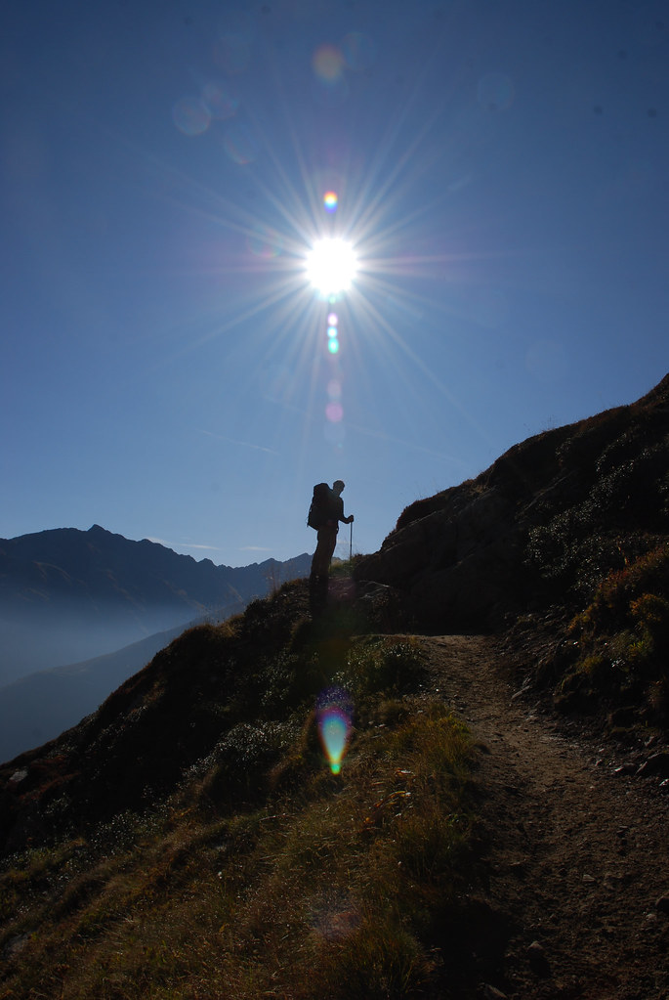
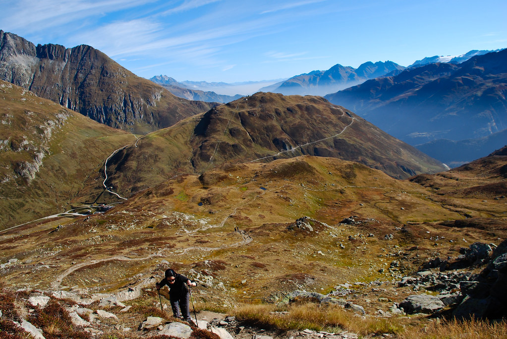
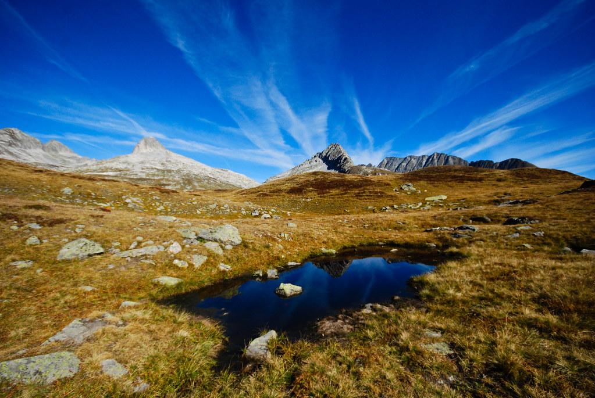
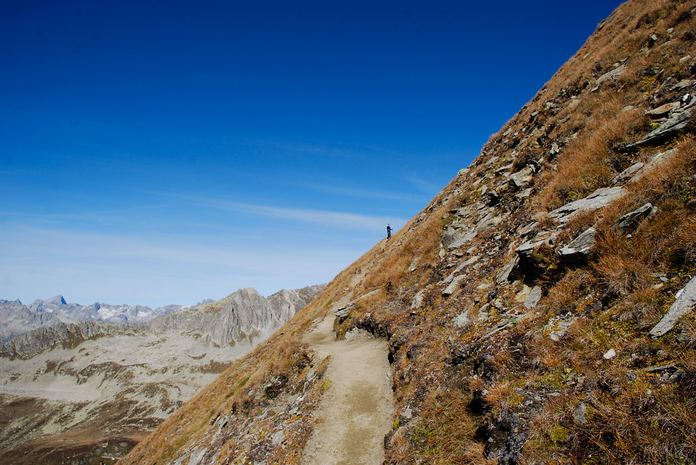
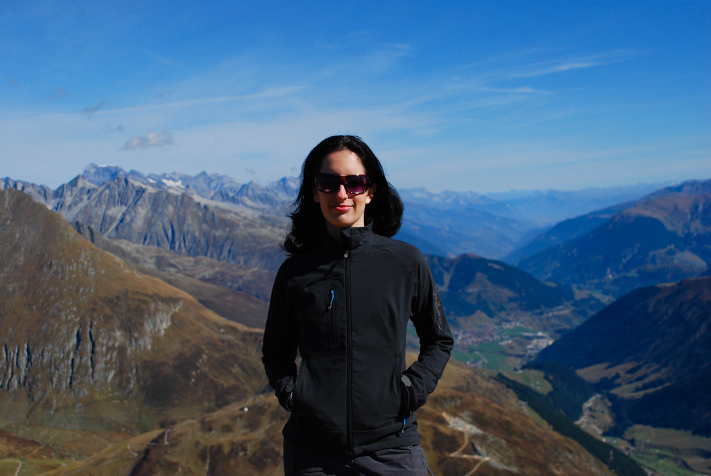
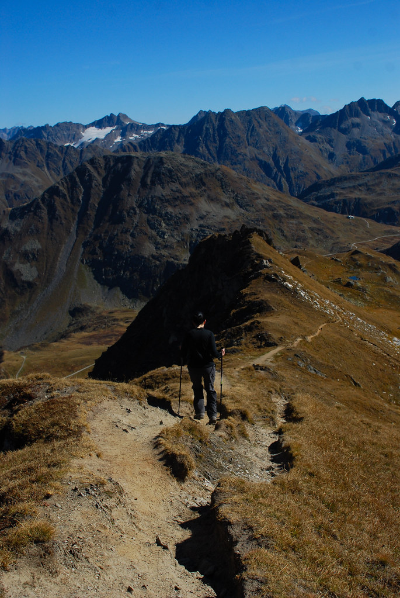
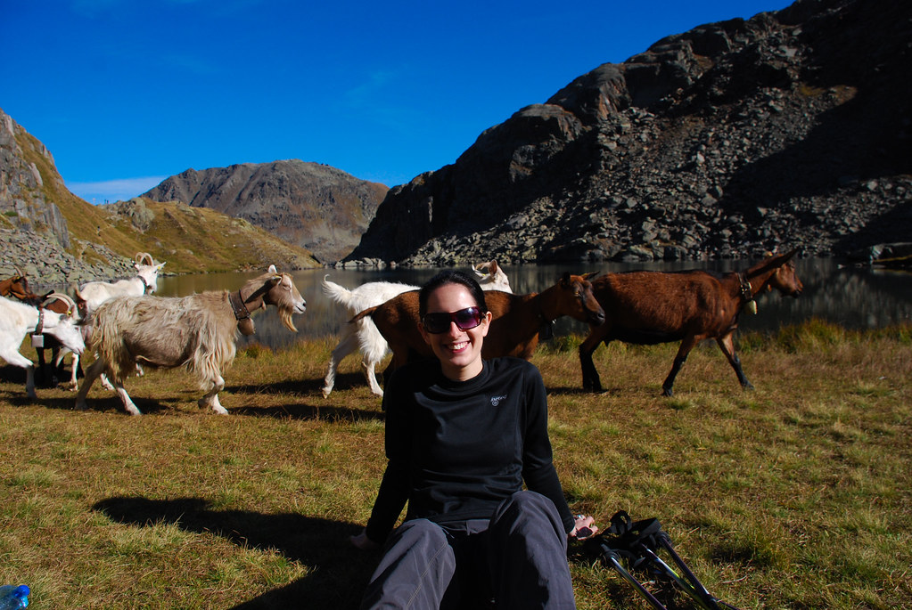
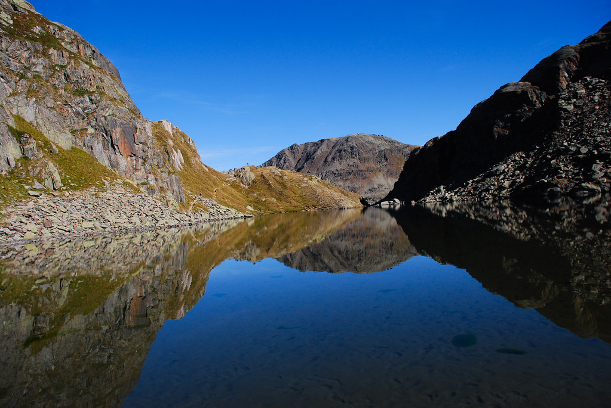

**03/10/2009 - בעקבות מקור הריין**

היום עשינו טיול יום שנקרא Lai da tuma circuit. מסלול מעגלי ארוך באיזור Andermatt שמגיע אל אגם שניזון ממימי קרחונים ונחשב למקור של נהר הריין.  
לאחר כשעה נסיעה מLittau הגענו לOberalp Pass שם מתחיל המסלול.

המסלול נפתח בטיפוס לא קל לפסגת ה (2739 מ’) Pazolastock בעליה רצופה של קצת יותר מ700 מטר.

במהלך הטיפוס, בגלל שהיום הוא יום שבת,  ראינו יחסית הרבה אנשים. כולם מקומיים ומצויידים בציוד טיולים מהשורה הראשונה. אם זה חבורה של מבוגרים עם חולצות של מועדן טיולים, משפחות, יחידים או זוגות – כולם פה מטיילים. אפילו ילדים קטנים מצויידים פה בנעלי טיולים ותרמיל גב קטן וממותג.  
תרבות הטיולים כאן ממש מעוררת השראה, למרות שמקור ההשראה העיקרי כאן הוא הנוף!

אחרי טיפוס של כשעתיים הגענו לפסגה של הPazolastock בה ישבנו לאכול קצת ולנוח. בגלל התחזית לעננות, שגינו שלא מרחנו קרם הגנה – היכונו ל”תמונות אפים אדומים” בימים הקרובים :)

")

מכאן המסלול כולו היה במגמת ירידה. הנמלה, שירידות תלולות הן נקודת התורפה שלה ירדה יפה בלי יותר מידי סצינות :)

אחרי הליכה ממושכת נחשף בפנינו האגם שלשמו הגענו עד הלום המקור של הריין Lai di Tuma.  
האגם יפה מאד, למרות שלא ממש נראה שהוא מקור של כלום..  
ישבנו על שפת האגם לצבור כח ולזלול כשלפתע הגיע עדר של תיישים כדי לנשנש את הדשא סביב האגם.

הופתענו למצוא שרותים יחסית מסודרים ליד האגם (מורידים את המים על ידי שפיכת דלי לתוך האסלה). לשוויצרים מגיע ציון גבוה מאד על סדר, ארגון ונקיון.  
חלק מהמקומות מסודרים קצת יותר מידי כדי שהיפנים יוכלו להגיע בקלות, אבל ממש לא מדובר על המסלול הזה. 

*Lai da Tuma*

מכאן עוד חיכתה לנו הליכה לא קצרה בחזרה לOberalp Pass. הגענו עייפים לסוף המסלול. סה”כ מרגע היציאה עד החזרה עברו 7:15 שעות.  
למרות השמש היה קר למדי, והחלטנו לשבת לצלחת מרק במסעדה שבסוף המסלול. המרק היה מעולה – מרק עם גריסי פנינה וגריסי חיה טעימה כלשהי שעשה טוב על הלב. שתינו בירה מקומית Eichhof שמיוצרת בלוצרן – בירת לאגר קלילה וטעימה.

חזרנו לLittau עייפים אך מרוצים לישון את הלילה השלישי והאחרון שלנו בB&amp;B. הלילה כבר מתארחים במקום 4 כלבים! מינו, הכלב של הבת שלהם ג’פרי, כלב מכוער וחרש של אורחת איטלקיה ועוד אחד שאין לי מושג איך הוא קשור לחגיגה.
