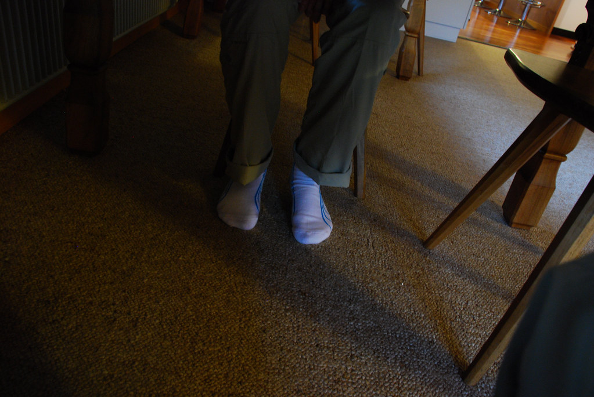
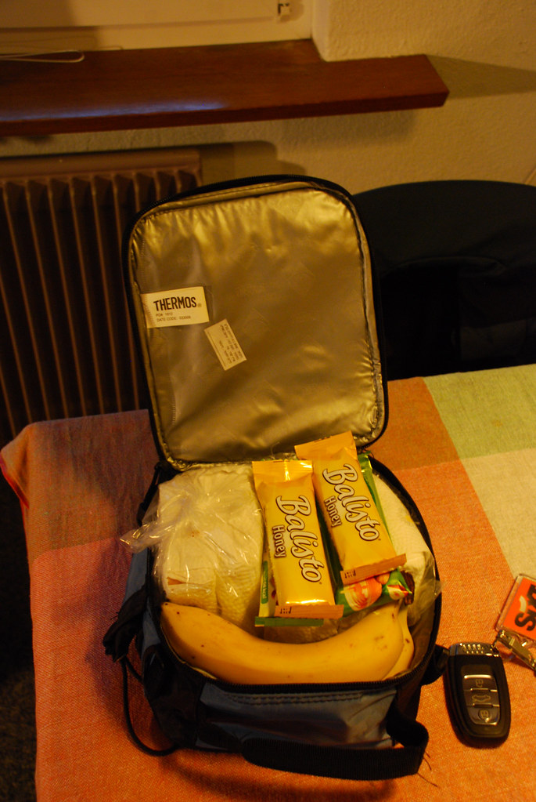
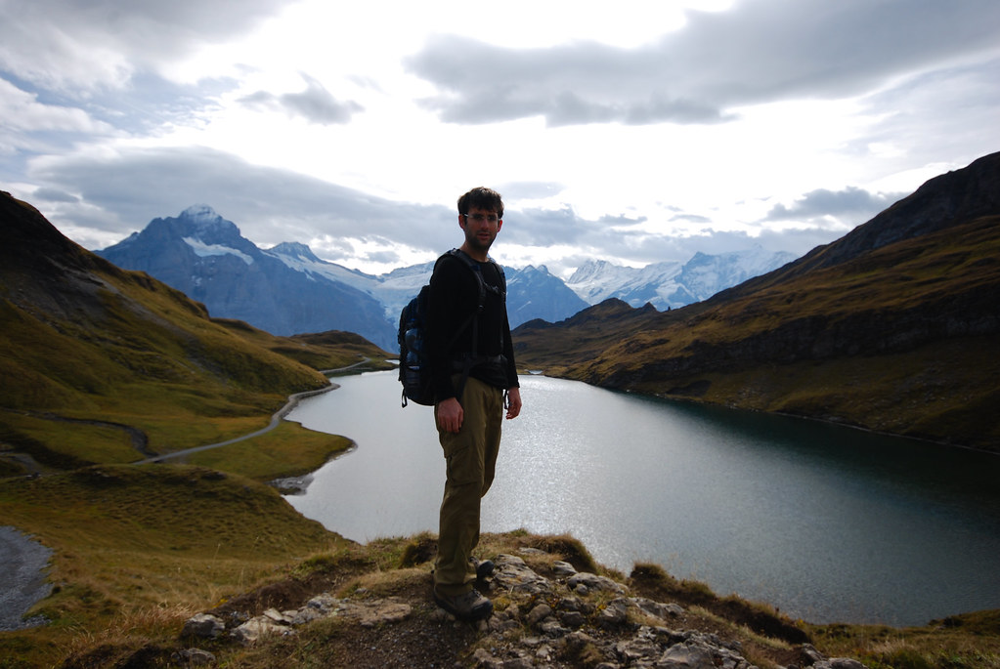
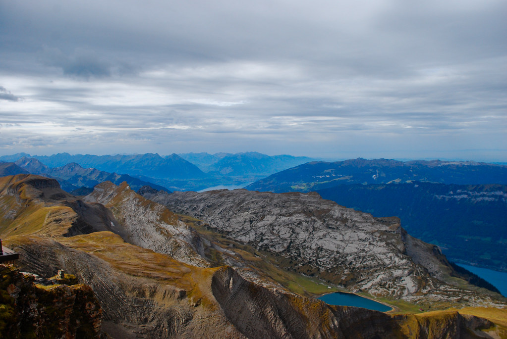
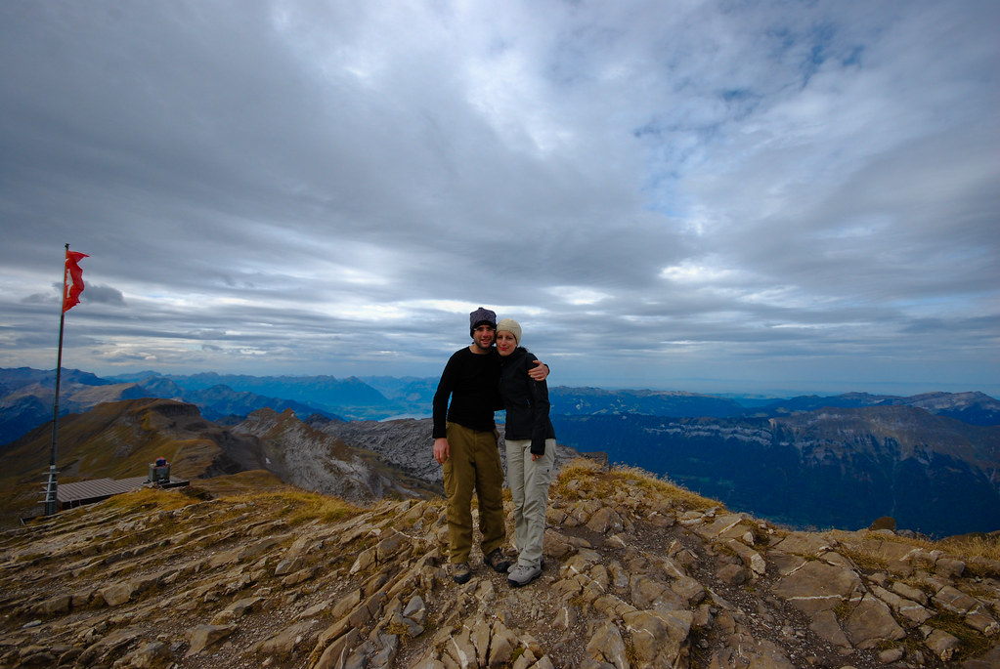
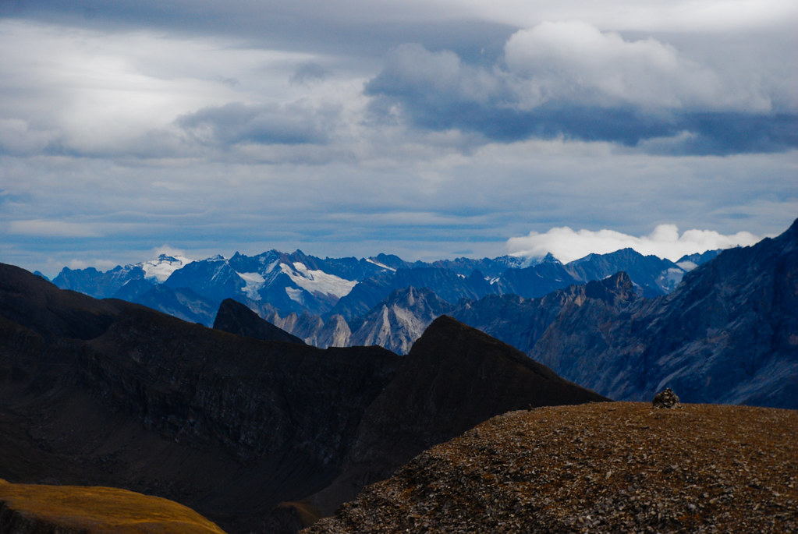
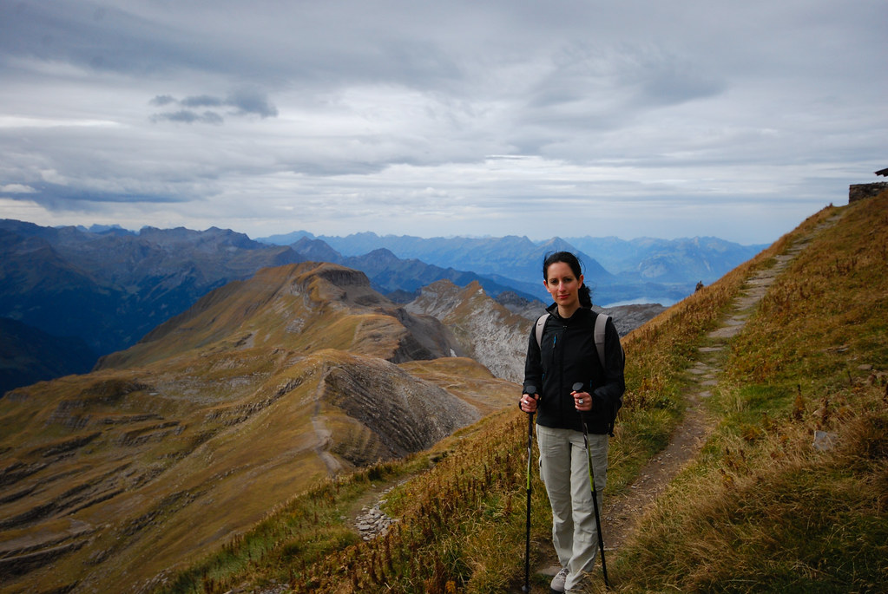
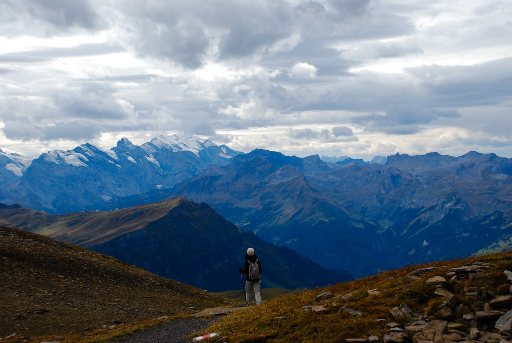
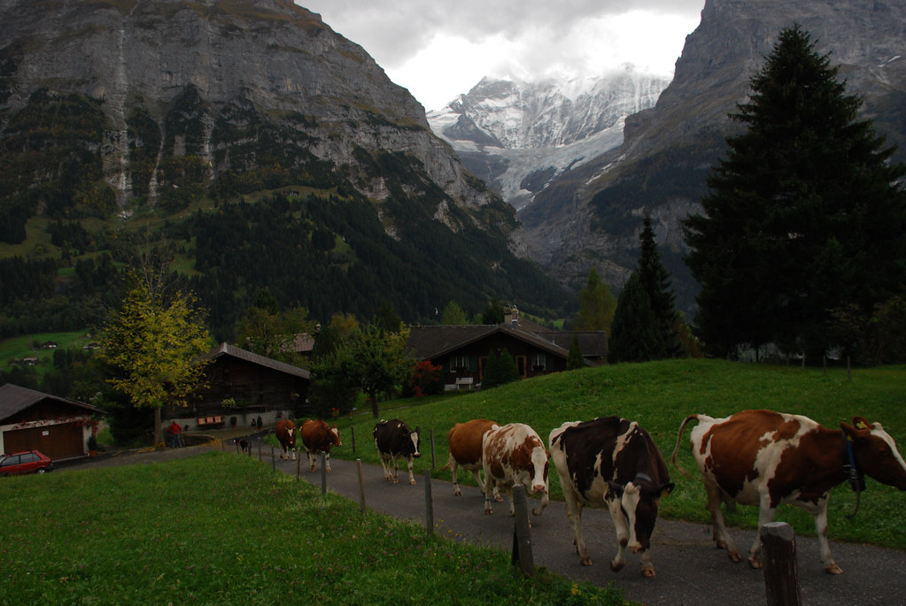

**06/10/2009 – Grindelwald תחילה**

הבוקר אני מתרגש לדווח על תפנית (אם כי מזערית) במערכת היחסים שלנו עם השטן. כמובן שאין צורך לציין שהבוקר כולו עבר מבלי שנפר אף לא אחד מ”החוקים”.

אמנם נשארנו עם הסטטוס קוו של ארוחת הבוקר בשעה שרצינו, אבל לפחות היינו עקביים, והגענו תמיד בדיוק בזמן.  
השטן התקרבה, בחנה אותנו בקפידה, ופסקה: “בוקר טוב”.  
סיפרנו לה מה עשינו אתמול, ומהן התוכניות שלנו להיום, והתנהלה שיחה חיובית למדי.  
בהמשך הארוחה אפילו ניסיתי עליה קצת “חוכמות” וזכיתי בכחמישית החיוך.  
בקצב הזה, ביום האחרון עוד ניפרד בחיבוקים!

אנחנו כבר עמוק בתוך הטיול, וההתארגנות בבקרים הפכה לשגרתית ויעילה.  
כבר לפני ארוחת הבוקר, היינו ארוזים עם בגדים לכל מזג אויר, ופק”ל הזלילות המסורתי של ימי הטיפוס שלנו.

היום נטפס על ה(2,681 מ’)Faulhorn, במסלול שיוצא מGrindelwald First, עובר בBachalpsee, מגיע לפסגת הFaulhorn ומסיים בBussalp. שינויי הגובה במסלול כוללים עליה של 600 מטר וירידה של800 מטר. זמן ההליכה מוערך ב4:15 שעות הליכה נטו.

רשימת המסלולים שקיבלנו בלשכת התיירות הייתה מאד מסודרת, ועזרה לנו לבחור מסלול מתאים.  
התוכנית המקורית שלנו היתה לסיים את ההליכה בSchynige Platte, במסלול קצת ארוך יותר. נאלצנו להתאים את המסלול, בגלל קטע דרך שאינו מומלץ להליכה בגשם (התחזית ניבאה עננות עם סיכוי לגשם)

אל נק’ ההתחלה של המסלול Grindelwald First, מגיעים מרכבל שיוצא מתוך מרכז Grindelwald. כבר מהרכבל נגלה לעינינו נוף מרהיב של אותם הרים מושלגים, אותם ניתן לראות מGrindelwald ומהמסלול ואתו עשינו אתמול.  
איך שיורדים מהרכבל, מפנים את הגב לאותם הרים מוכרים, ומתחילים ללכת לכיוון צפון מערב – לדרך חדשה.

אחרי כ50 דק’ של טיפוס לא קשה במיוחד, מגיעים לאגם Bachalpsee (כש see זה אגם באיזושהי שפה..). האגם שמתארח בחסות הרים מושלגים מרשים ושליו. עצרנו קצת לצלם, והמשכנו בטיפוס כל עוד העננים מצליחים להתאפק עם הגשם.

מכאן העליה נהייתה תלולה יותר, אבל לא משהו שלא ראינו לפני כן, וכמעט בלי עצירות טיפסנו עד למרגלות הFaulhorn. עצרנו לקחת אויר ובמאמץ ממוקד הגענו אל הפסגה.

הפסגה העניקה לנו נוף פנורמי של 360 מעלות, על כל האיזור. למרות העננות אפשר היה לראות בין היתר את אגם בריינץ, והרבה מהפסגות באיזור. לאן שלא מסתכלים נשארים עם הפה פתוח (וקפוא מקור).

על הפסגה ממוקמת אכסנייה שלא ברור איך בנו אותה כאן, בלי שום דרך גישה נורמלית. בעונת הקיץ האכסניה מארחת מטיילים שעושים מסלול של יותר מיום אחד באזור. השתמשנו בשרותים ומילאנו מים ממאגר מי הגשמים של האכסניה, וישבנו כמעט לבדינו בפסגה לאכול את ארוחת הצהרים שלנו. הגבינות שקנינו בשוק בGrindelwald התגלו כהצלחה.

אחרי שיחה קלילה עם אוסטרלי פטפטן, קפא לנו התחת ונאלצנו להתחיל לרדת לנק’ הפיצול של הטיפוס. את הFaulhorn הכבוש החזרנו לשוויצרים בקלות בלתי נסבלת, שעלולה לגרום לשפמו של בשאר לסמור.

מנק’ הפיצול המשכנו במסלול לBussalp. מכאן המסלול כולו היה במגמת ירידה, ולא היה קשה במיוחד. בקטע הזה לא היה ממש שביל מסודר, אבל הסימונים על האבנים היו מספיקים כדי לא לאבד את הדרך.  
אחרי כשעה וחצי של ירידה, הגענו לBussalp שם ישבנו לשתות בירה עד שיגיע האוטובוס לGrindelwald. איך שנכנסנו למסעדה התחיל לרדת גשם – לפעמים מזל זה שם המשחק, והיום ידנו היתה על העליונה!

בטיפוס היומי שלנו לכיוון הצימר, יצא לנו לראות מחזה יוצא דופן:  
אשה מקומית, מוציאה את הפרות שלה למרעה. בהתחלה אמנם, זה נראה כמו סתם אשה שקוראת קריאות מצחיקות, באיזור בו גם נמצאות פרות. אבל מהר מאד הגיע גם הכלב ופתאום כל הפרות הסתדרו בשורה והתחילו לצעוד כמו חיילים. כשהתקרבתי לצלם אותן כמעט ונדרסתי - גם הפרות פה, כך מסתבר, קפדניות להחריד ותמיד יעדיפו עמידה בזמנים על פני חיי אדם.

עוד יום מלא בחוויות נגמר. אני אחטא בקיטש, ואצטט ציטטה שלאחרונה צוטטה בפני, וציטוטה נחרט בזכרוני (ובcopy &amp; paste של מחשבי):

> *מסעות מאיטים את הזמן ומאריכים את החיים, כי לא חשוב אורכם האמיתי של החיים אלא הזכרונות. (אלמוני קיטשי להחריד)*
