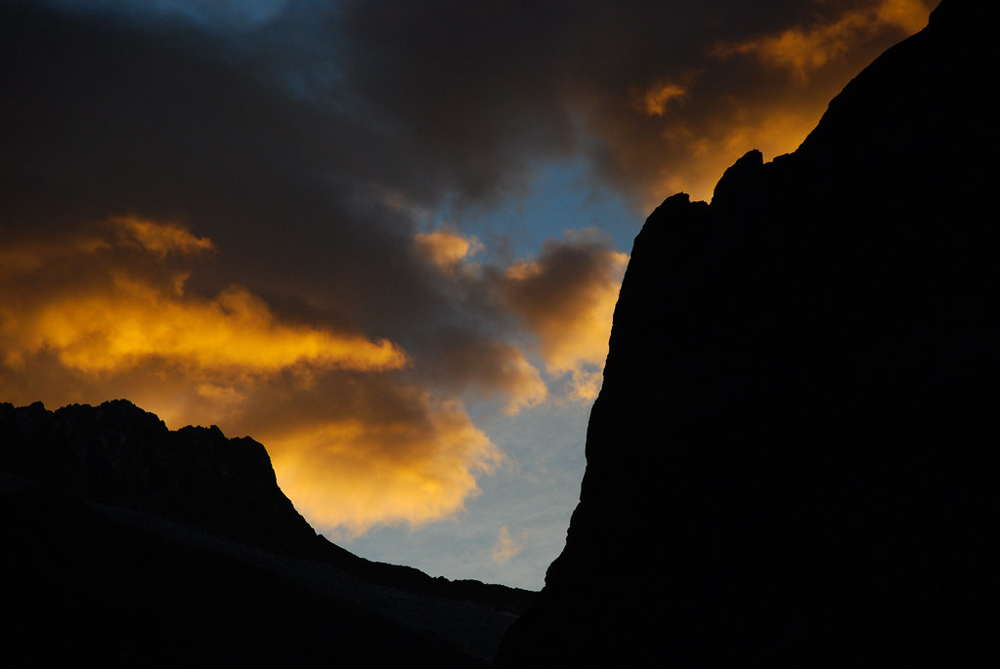
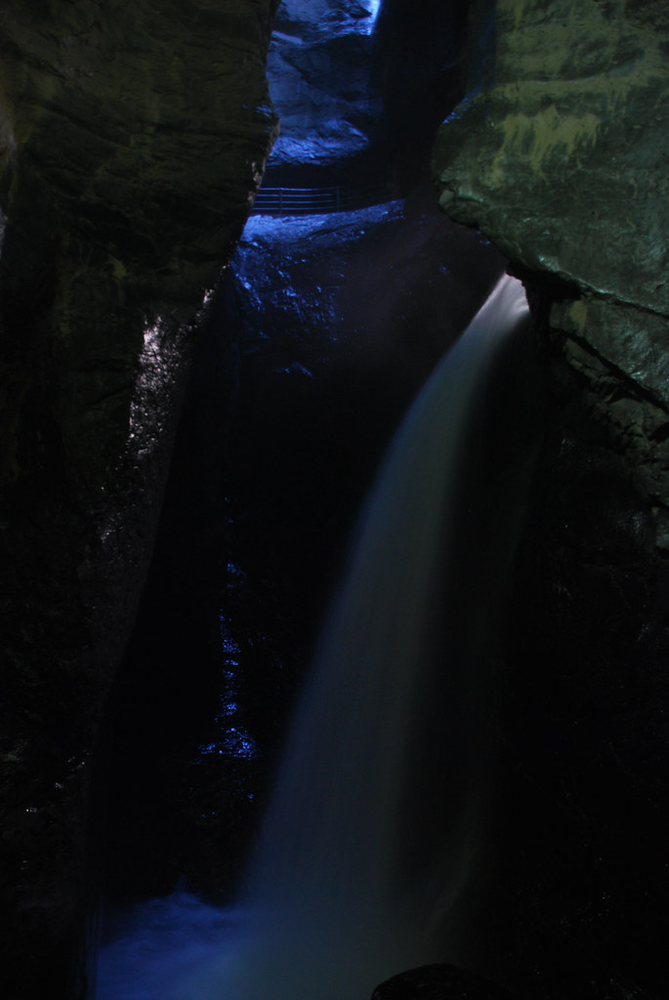
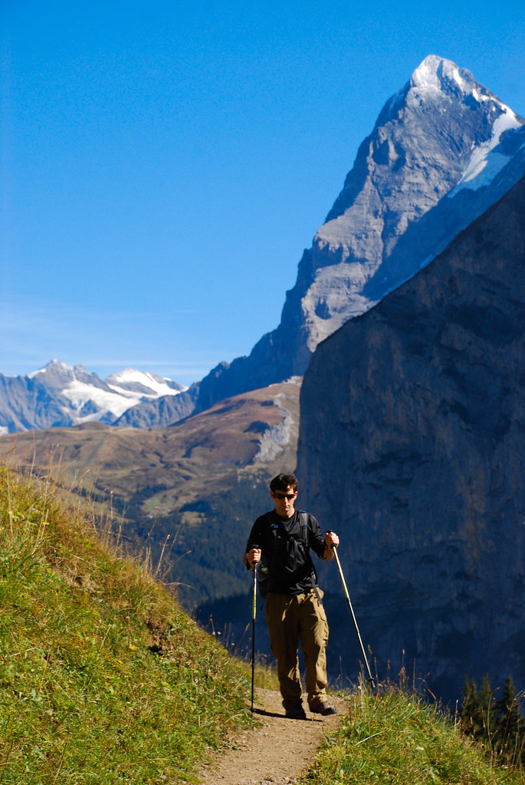
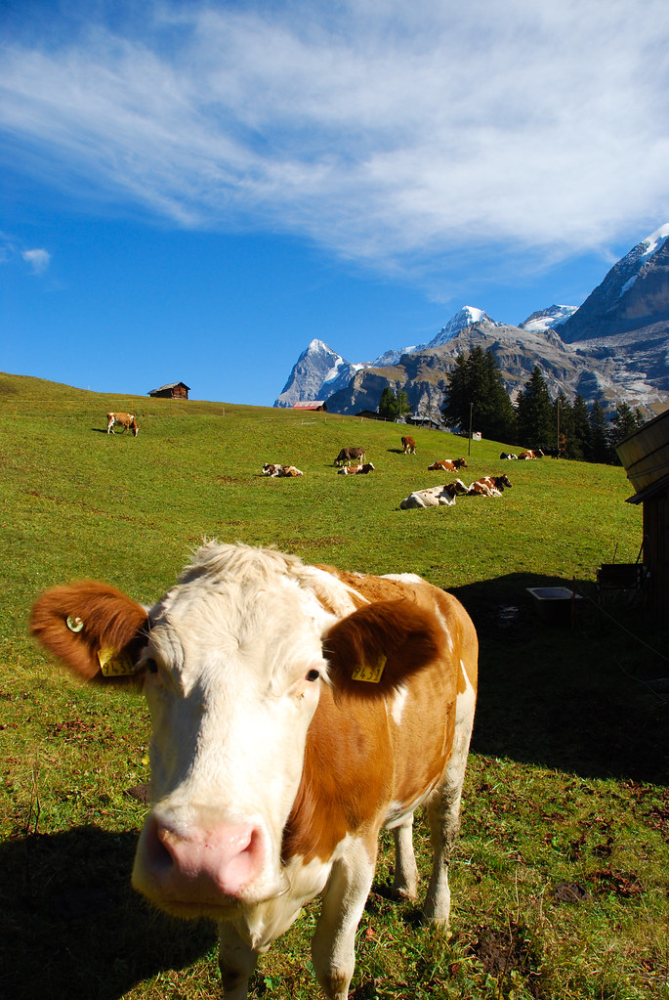
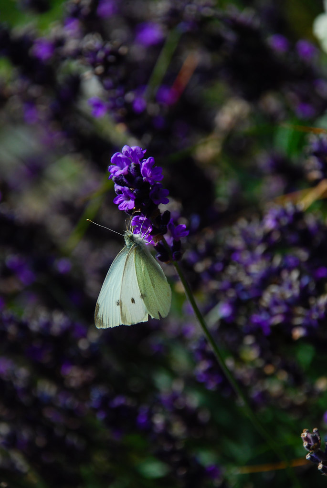
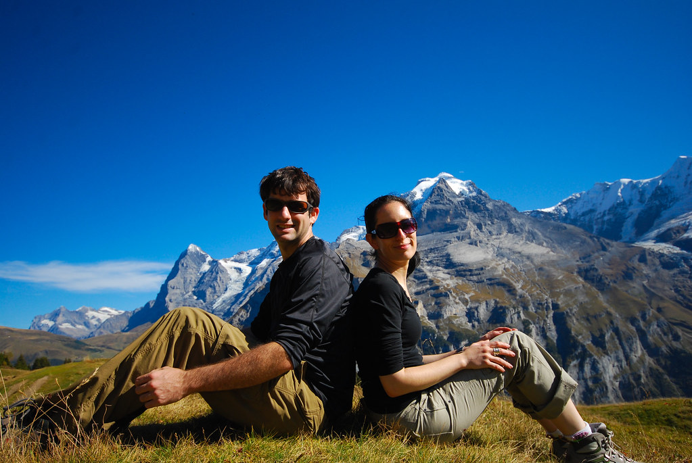
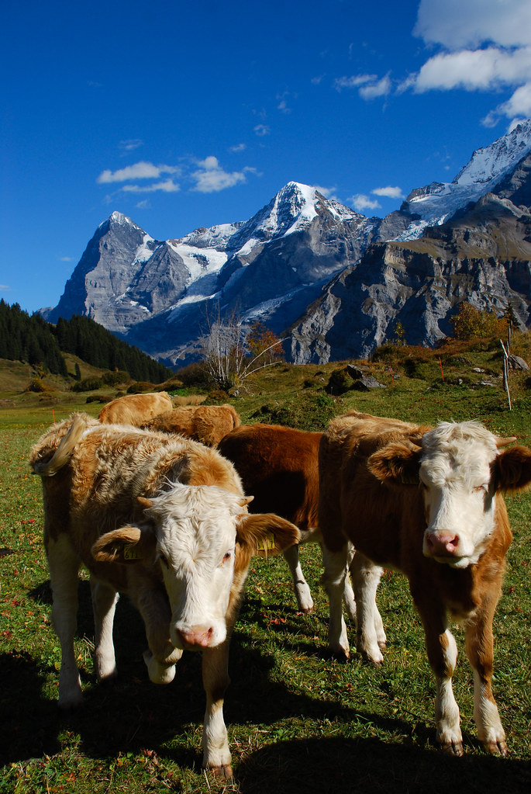

**07/10/2009 - עמק Lauterbrunnen**

הבוקר סוף סוף התעוררנו לבוקר שמשי, והתחזית מנבאת יום נטול עננים. היום נטייל בעמק Lauterbrunnen עליו השקפנו לפני יומיים מ[Kleine Scheidegg](http://shpandrak.blogspot.com/2009/10/2009-5.html).

סוף סוף חזרנו לרכב המגניב שלנו אחרי שהנחנו לו ליומיים, ויצאנו לדרך.  
על הדרך ביקרנו במפלי Trummelbach – מפלים שמקור המים שלהם הוא קרחונים. המפלים נופלים בתוך ההר, ולמרות שבעונת הסתיו הזרימה שלהם מינימלית הם היו נחמדים למדי.

ב”שמורה” 10 מפלים שניתן לטייל בינהם בשבילים מסודרים שהשוויצרים הפליאו לחצוב בסלע.  
בנוסף חצבו כאן מעלית גראנדיוזית שלוקחת אותך למפל הגבוה ביותר – הפקה מיותרת לחלוטין לכל מי שמצוייד בזוג רגליים.  
נהגנו בחכמה כשהתחלנו מהמפלים מוקדם, מפני שזהו יעד שמושך אליו קבוצות מאורגנות. רגע לפני שעזבנו, ראינו בחניון שלושה אוטובוסים פורקים אנשים בכל מיני צבעים.

מהמפלים המשכנו בנסיעה קצרה לStechelberg על מנת לחנות את הרכב.  
מStechelberg לקחנו את הרכבל לMürren – עיירה מקסימה בת כ 450 תושבים אליה אפשר להגיע אך ורק באמצעות רכבל.

מMürren יצאנו למסלול מעגלי שנקרא The north face trail. זהו לא מסלול שכל המטיילים בו חייבים ללכת עם ציוד של חברת הטיולים the north face, אלא מסלול שממנו ניתן לחזות בnorth faces של ההרים [Eiger](http://en.wikipedia.org/wiki/Eiger) [Mönch](http://en.wikipedia.org/wiki/M%C3%B6nch) וה-[Jungfrau](http://en.wikipedia.org/wiki/Jungfrau).  
האטרקטיביות ב”פנים צפוניות” של הרים, טמונה בעובדה שמצפון אף פעם לא זורחת השמש, ולכן השלג לא נמס בכיוון הזה בכל עונות השנה.  
באשר לחברת הטיולים, היא מתהדרת בשם זה, משום שמחירי המוצרים שלה, בדומה לאותן פסגות ההרים, תמיד יפנו צפונה יחסית למחירי המתחרים :)

השביל היה יפה, ומזג האויר מעולה.  
בנוסף להרים שמסביב, השביל היה מגוון למדי – אזורים מיוערים, ובעיקר שטחים ירוקים פתוחים.  
לאורך המסלול כולו הסתובבו פרות. חלקן מזן שאוהב ליטופים, וחלקן מזן שממש לא :)

בדרך פגשנו גם הרבה מאד פרפרים, שהתעופפו להם ביהירות סביב הפרחים הצבעוניים שלהם.

לקחנו את המסלול ממש בeasy, ועשינו המון עצירות קטנות לישיבה בשמש. לקחנו איתנו את הLonely planet, כך שיכולנו לשבת בכיף ולתכנן את המשך הטיול, והחיים בכלל :)

סיימנו את המסלול ב-Mürren אחרי לא מעט ליטופי פרות. ב-Mürren ישבנו לשתות בירה, ומשם המשכנו במסלול רגלי לGimmelwald, שזה מקום שמגיעים אליו אנשים שהקלידו לא נכון Grindelwald, וגם יש בו רכבל שמחזיר אנשים אל האוטו שלהם בStechelberg.

נסענו חזרה לGrindelwald לישון את הלילה האחרון שלנו ב”מיין קאמפף”. מחר יוצאים לדרך חדשה, כאשר לראשונה בטיול הזה, אנחנו לא יודעים איפה נישן.

המשך יבוא…
