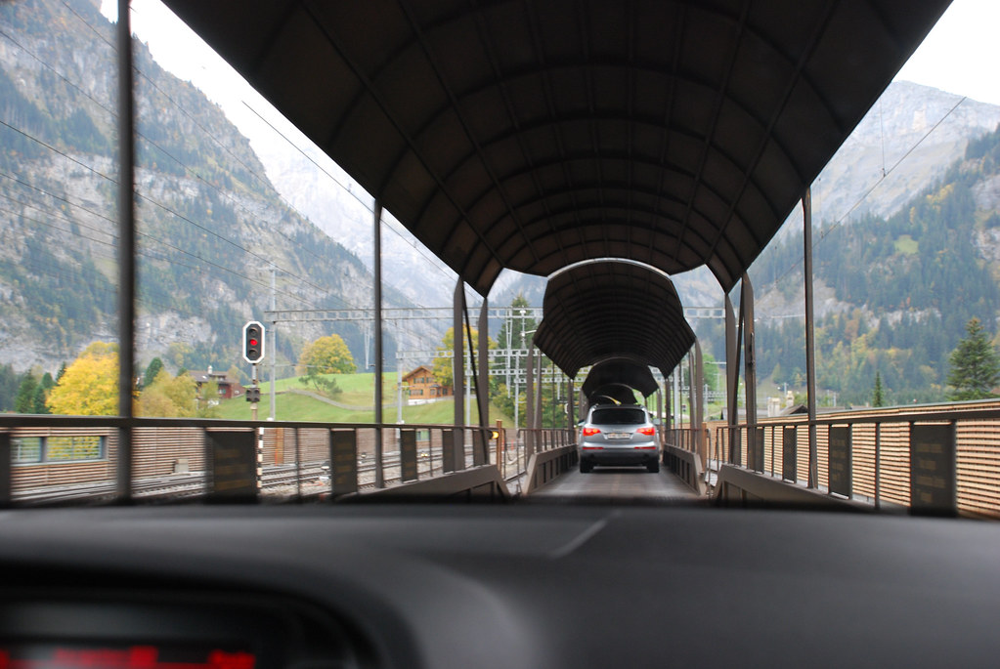
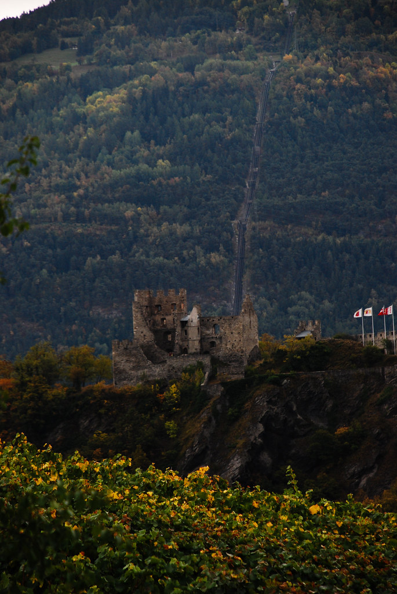
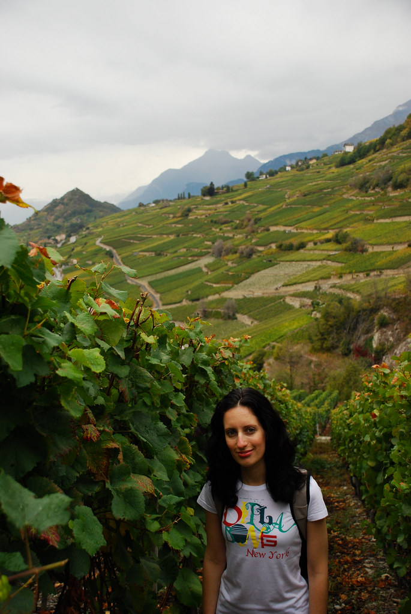
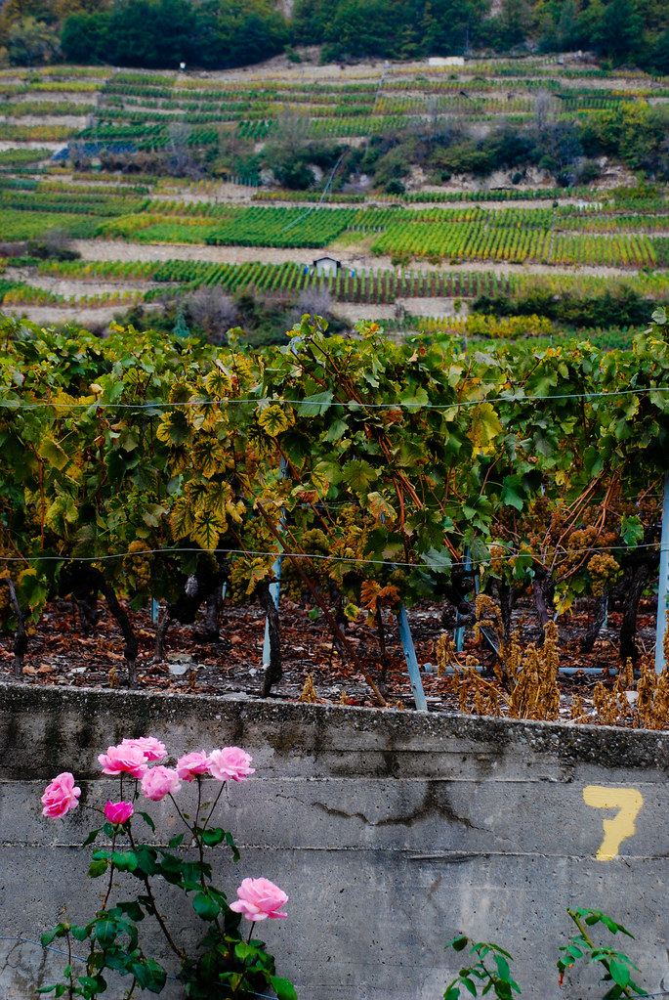
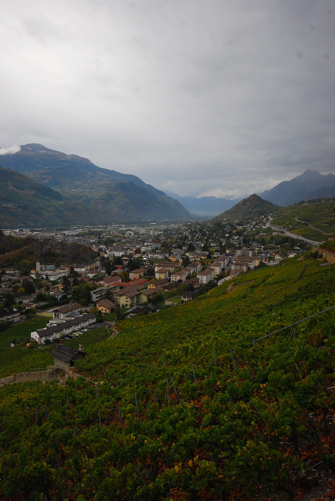
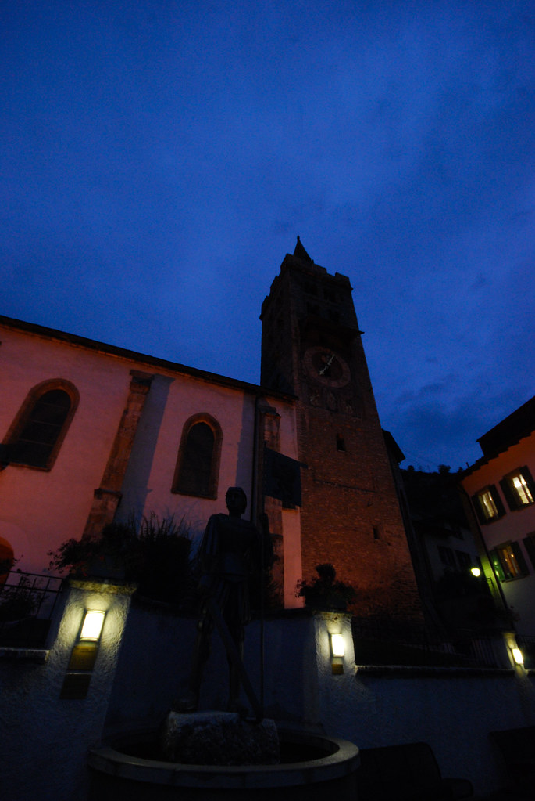

**08/10/2009 – Sion וסביבתה**

היום אנחנו עוזבים את Grindelwald ואיזור ה Bernese Oberland ועוברים לקנטון Valais.  
אמנם על המפה האיזורים נראים קרובים, אבל בגלל רכס הרים עצום שמפריד בינהם, העניינים קצת מסתבכים.

הדרך הכי מהירה לעבור בין האיזורים ברכב היא דווקא ברכבת. אני לא מתבלבל: רכב – ברכבת. השוויצרים, שמערכת הרכבות שלהם קרובה למושלמת, חצבו מנהרות בהר לרכבות בלבד. כדי לעבור עם הרכב לצד השני של ההר, עולים עם הרכב על מעבורת רכבים שתמורת סכום לא סמלי במיוחד, מסיעה אותך דרך המנהרה.

את רוב היום נעביר באיזור Sion שהיא הבירה של קנטון Valais. מה שמייחד את הקנטון, מבלי להזכיר את הנופים, הוא שהאיזור מתחלק לעיירות צרפתיות, וגרמניות.  
חוץ מהשפה, אפשר לראות הבדלים קיצוניים בבניה, באורח החיים ואולי הכי חשוב – במטבח (הו המטבח).

את Sion הצרפתית אי אפשר לפספס מהכביש הראשי, בזכות שתי טירות עתיקות שכל אחת מהן יושבת על גבעה משלה.  
נכנסנו לSion וטיילנו קצת ברחובות העיר. מדהים איך שנסיעה יחסית קצרה, הביאה אותנו למדינה אחרת לגמרי. כיאה לצרפתים הארורים לא היה אפילו עלון אחד בשפה האנגלית במשרד התיירות של העיר. לא שהיינו צריכים מהם משהו – אבל לפחות נעזרנו בהם כדי להזכר לרגע למה בעצם כל כך חשוב לשנוא צרפתים :)

Sion כולה מוקפת כרמים, שניטעו בכדי לספק את צמאונם הבלתי פוסק של הצרפתים ליין. אחרי שיטוט קצר בעיר, יצאנו למסלול קצר שעובר דרך הכרמים של Sion ושמו Bisse de Clavau.

המסלול קל, ירוק, ושונה מאד מהמסלולים שעשינו עד היום בשוויץ.  
במסלול עוברים בין חלקות שונות של כרמים השייכים לכל מיני ברונים צרפתים שאוהבים את הבאגט שלהם קשה, ואת השבלולים רכים.

המסלול ממשיך לעלות ומצטרף לאקוודוקט צר עם מיים שוצפים שנושאים עלי שלכת צהבהבים.  
לעזאזל הצרפתים – חייבים להודות שמשהו הם יודעים לעשות טוב.  
הרומנטיקה מסתבר, לא מתה, היא רק גוססת לה בין גפנים של עיירה צרפתית בשוויץ.

במקום לסיים את המסלול ולחכות לאוטובוס עם שעות הגעה אקראיות, אחרי כשלושת רבעי מסלול עשינו אחורה פנה, וחזרנו על עקבותינו בחזרה לSion.

את ארוחת המטיילים המסורתית שלנו, דחינו ליום בו נהיה באיזור גרמני ודגמנו את המטבח הצרפתי במסעדה קטנה בSion.  
האוכל היה מדהים. מנה אחת של צבי מת עם פירה, כרוב שחור וענבים, ומנה נוספת של פנה עם סלמון בוודקה. את הבירה היומית החלפנו ביין מקומי שנקראFendant (לבן) שעשה רק טוב.

אחרי סיור קטן נוסף בSion ביקרנו במשרד התיירות של האיזור כולו שגם ממוקם בSion ובו כבר היה הרבה חומר באנגלית.  
מה שבעיקר חיפשנו שם זה אופציות לינה. קיבלנו עלון של האתר [www.bnb.ch](http://www.bnb.ch/) בו כבר השתמשנו, ויצאנו לדרך.

אחרי כמה שיחות טלפון ובירורים, בחרנו במלון בLeuk שנמצא במרכז הValais ויכול להיות בסיס טוב לטיולים באיזור.  
המלון שנקרא Hotel Schloss, ממוקם ליד ארמון מימי הביניים ומאד אהבנו אותו למרות מחירו הזול. המקלחות והשרותים במסדרון, מה שלא היווה בעיה גם בגלל כמות המקלחות ונקיונן, ובעיקר בגלל שהיינו כמעט האורחים היחידים במלון.  
בחדרים כמו שמקובל בהרבה מקומות כאן, יש כיור עם מגבות כדי שיהיה אפשר לצחצח שיניים בחדר.

בLeuk פתאום חזרנו לשמוע גרמנית. Leuk הוא כפר קטן ועתיק שנחמד מאד להסתובב ברחובות העתיקים שלו. עשינו טיול לילי קצר בLeuk וחזרנו לישון.
