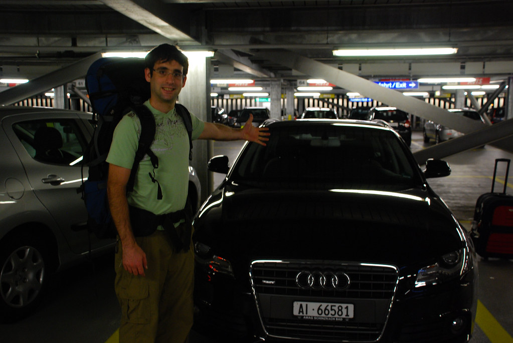
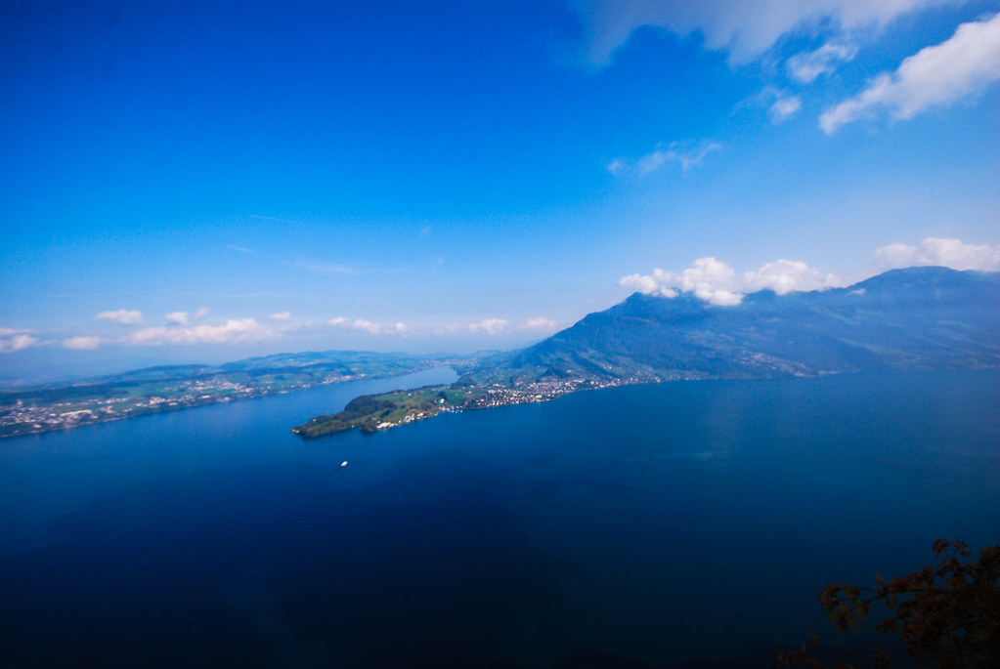
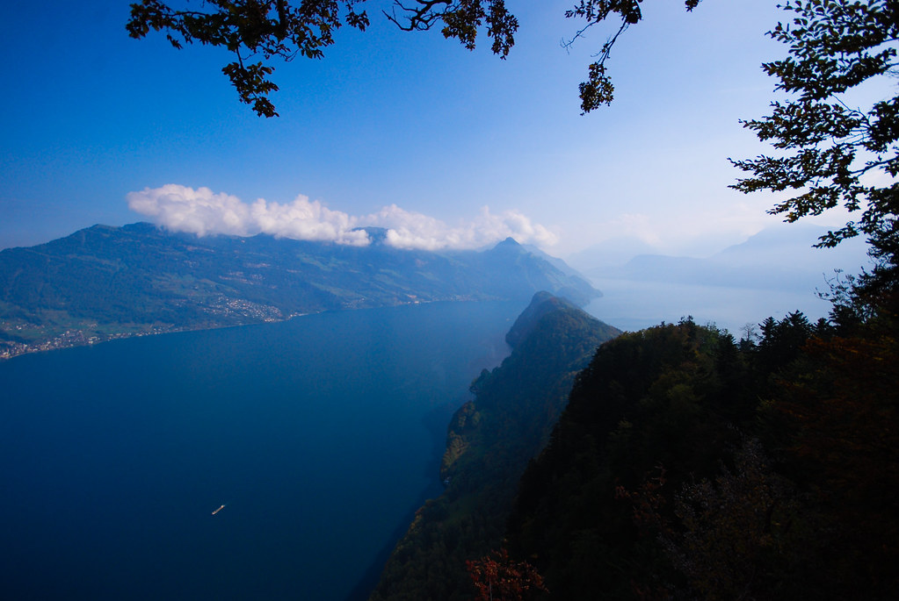
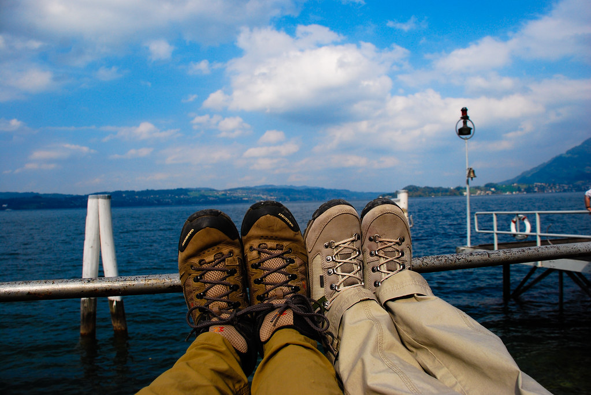
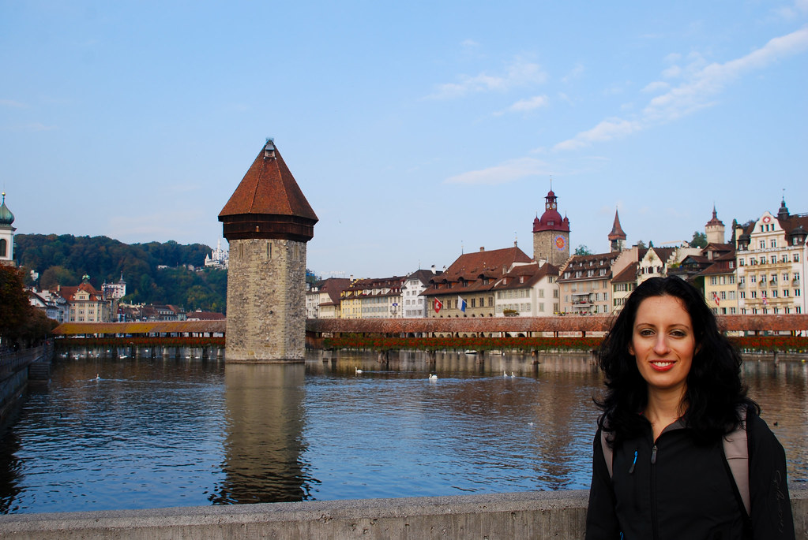

**02/10/2007 – ברוכים הבאים לשוויץ**

אתמול נחתנו     בשוויץ, הנמלה ואני, לטיול של כשבועיים וחצי בארץ היודל!  
כבר בשדה התעופה של ציריך, הטיול התחיל ברגל ימין כשגילינו שבמקום הרכב שהזמנו, קיבלנו Audi A4 שחורה ומגניבה עם מנוע מנופח.  
לימים יתגלה כי היה מדובר בתרגיל עסקי גאוני של משרד התחבורה השוויצרי – הם משלמים לסוכניות ההשכרה על שדרוגי “חינם” למכוניות מהירות, ובונים על הכנסות מוגדלות מקנסות :)

את סידור הלינה לשלושת הלילות הראשונים הזמנו מראש דרך האתר (המצויין):  
[http://www.bnb.ch/](http://www.bnb.ch/ "http://www.bnb.ch/")

הB&amp;B נקרא BnB Haus im Löchli, וממוקם בLittau הצמודה לLucerne.  
הבעלים ג’ני הצ’יף, ריימונד הרומנטי והכלבה מינו היו מאד ידידותיים, ועזרו לנו בכל מה שהיינו צריכים, על אף קשיי השפה.  
המקום נקי במיוחד (5 כוכבי נמלה) וארוחת הבוקר מדהימה וכוללת בין היתר את “רושטי החלומות”!  
רושטי הוא אחד המאכלים המסורתיים של שוויץ. מדובר בלביבה ענקית, שמבושלת בהמון חמאה – מה כבר יכול להיות רע, במיוחד כשכל זה מקושט בביצי עין ובייקון מטוגן.

בחצי היום הראשון, התחלנו להכנס בהדרגה לכושר הליכה.  
עשינו טיול קצר בצוקים של Bürgenstock המשקיפים על אגם לוצרן.  
התכנון המקורי היה להפליג לBürgenstock, ללכת על הרכס עד לEnnetbürgen ומשם להפליג חזרה. אבל, אחרי שהסתבר לנו שהיום הוא יום של איזה קדוש שרלטן ושעות ההפלגה לא  כל כך נוחות, הסתפקנו בטיול מעגלי בBürgenstock.

בבוקר הפלגנו מלוצרן לBürgenstock. משם המשכנו עם רכבת הרים משוננת שלקחה אותנו לתחילת המסלול.  
כבר בתחילת המסלול נשקפו נופים מרהיבים של אגם לוצרן והעננות של הבוקר התחלפה בשמש נעימה.

 *אגם לוצרן – Bürgenstock Felsenweg*

השעה הראשונה של ההליכה היתה יפה וקלה, עם דרך מסודרת ומעקה שמאד מקשה לצנוח אל מותך. למרות שלא היו כמעט אנשים, החלק הזה של המסלול קצת תיירותי מדי לטעמי, כאשר מלבד לשביל המלאכותי, חלפנו על פני לא פחות מ-3 מסעדות בשעה אחת של הליכה.

בהמשך נגמר המסלול המסודר והתחלף במסלול עפר צר ונחמד. המסלול התפתל לתוך אזור מיוער בו פגשנו לראשונה את הפרות המפורסמות של שוויץ, עם הפעמונים הענקיים שלהן.  מלבד צפיפות גדולה של עצים גבוהים, יכולנו לחזות במגוון מינים של פטריות שצמחו על כל משטח מזדמן.

 

*כמות של פטריות Bürgenstock Felsenweg*

המשכנו ללכת עד שיכולנו לראות את צידו הדרומי של האגם, ומשם התחלנו לחזור בדרך מקבילה לדרך בה הגענו.

*חצי האי Bürgenstock*

בסה”כ הלכנו כ-4 שעות. חזרנו אל הרכבת, ומשם בהפלגה ללוצרן.

*מחכים להפלגה על שפת אגם לוצרן*

את חצי היום השני בילינו בלוצרן. לוצרן עיר נסבלת למדי. הגשרים המפורסמים שלה מרשימים וחוץ מזה אין הרבה מה לחפש שם. במיוחד כשאיזה קדוש לא מרשה לפתוח את החנויות.

