למחרת בבוקר קמנו מוקדם כדי להגיע למסלול הבא שלנו לפני המוני המטיילים. ההתארגנות שלנו ליציאה מהקראוון השתפרה, אך יש הטוענים כי הדרך רחוקה מהאופטימום הנמלתי הנדרש. הפעם טיילנו באיזור 

Jenny lake

  (עדיין בשמורת גראנד טיטון). בחרנו מסלול המטפס ל 

Inspiration point 

דרך ה

Hidden falls

. (תאור מסלול <a href="https://www.alltrails.com/trail/us/wyoming/inspiration-point-via-jenny-lake-boat-shuttle?u=m" target="_blank">כאן</a>) 

מכיוון שרצינו להספיק עוד כמה דברים בחצי היום השני, קיצרנו קצת את המסלול באמצעות שייט על האגם

.

שטים על Jenny lake

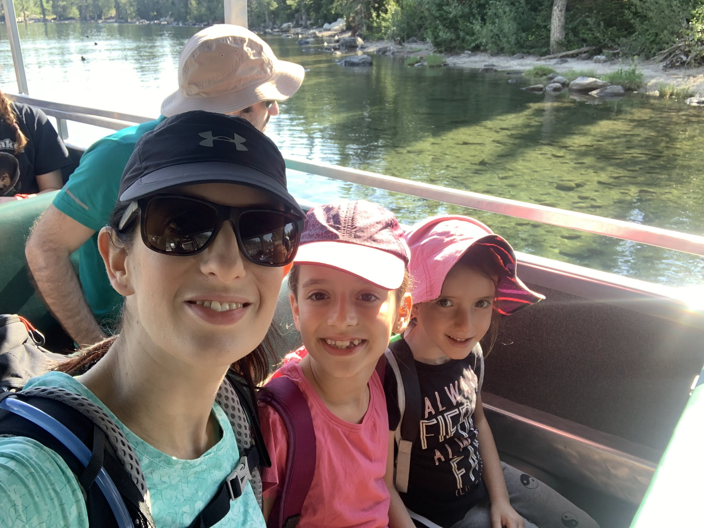

 המדריך בסירה, כמו גם כל ריינג׳ר שפוגשים, תדרך אותנו בכללי התנהגות במפגשים עם עם חיות הבר בכלל ועם דובים בפרט. מחמם את הלב לחוות את תרבות הגנת הטבע בפארקים הלאומיים האמריקאים. אחרי שאנו, בני האדם, הכחדנו כמעט את כל היונקים היבשתיים הגדולים – יפה לראות את המאמצים שנוקטים בשמורות הטבע כדי לשמור על החיות לצד הנגשת הטבע לכל סוגי המטיילים. לגבי דרכי ההתמודדות עם דובים, בגדול הסיכום הוא שאם אתה נפגש עם דב, הוא מחליט לתקוף אותך, ואין ברשותך ספריי דובים - ההמלצה הרשמית היא ״לתקוף את הדב בחזרה״?! אלא אם אגלה שדובי גריזלי רגישים לדגדוגים, אני פשוט אתן לו לסיים עם זה כמה שיותר מהר ושיהיה בתאבון.

המסלול יפה ובכלל לא קשה על אף תאורי המסלול בחלק מהאתרים. יש קטע קצר בסוף הטיפוס שהוא קצת מסוכן, אבל ממש ״בקטנה״. המפלים נקראים ״חבויים״ מפני שהם נופלים ממש באמצע אזור מיוער שמסתיר אותם. במהלך הטיפוס הקצר, ניתן לשמוע את הזרימה, אך רק לקראת המפלים הם נגלים במלוא הדרם.

 ״אחת שתיים שלוש מפלים״ - מצאנו את ״המפלים המתחבאים״

בנקודת התצפית המרהיבה Inspiration point - נפרש לפנינו האגם ונוף השמורה כולה. את תשומת הלב אמנם, חטפו מהנוף חבורה של סנאים חמדנים שהתרוצצו סביבנו וניסו ״לגרד״ מאיתנו קצת נשנושים. 

הילדים, עבורם זהו המפגש הראשון בחייהם מקרוב עם סנאים, מאד התרגשו. בעוד המטיילים המקומיים גירשו את הסנאים כמו חתולי רחוב, הילדים עסקו בניסו וטעיה כדי להבין האם מדובר בחברים חמודים, או בסתם עכברים עם יחסי ציבור... המסלול היה ריק יחסית הודות לשעת היציעה המוקדמת בה התחלנו. בחזור, בדרך להפלגה לנקודת היציאה, ראינו שלט שאומר - ״אם התור לסירה מתחיל כאן - צפה כ45 דק׳ המתנה״. אנחנו כמובן עלינו לסירה חזור ללא המתנה כלל הישר להמשך תוכנית היום. מאד ממליץ להתחיל את כל הטיולים הפופולריים כמה שיותר מוקדם, ובאופן כללי, אם יש לכם גישה לנמלה עמלנית כלשהי שתכין עבור כל אטרקציה היסטוגרמת התפלגות עומס לפי יום ושעה - אשריכם.

למשל - התפלגות העומס לסירה בJenny Lake:

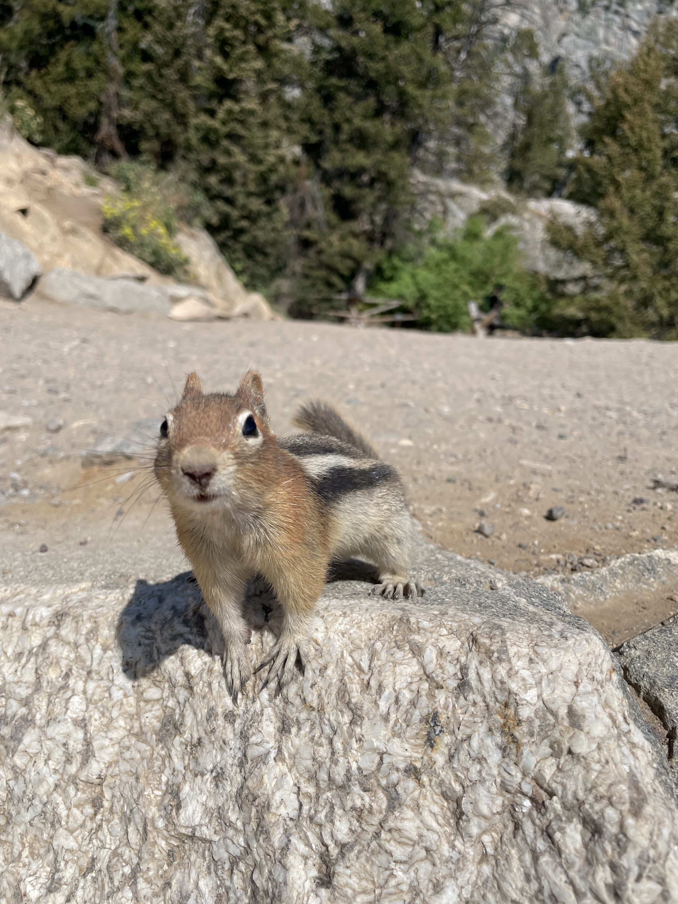

 

בכל מרכזי המבקרים (בדרך כלל בכניסה לשמורות, או באתרים היותר פופולריים) יש עמדת ״ריינג׳ר צעיר״. מלבד תוכנית החתמת ״דרכוני ריינג׳ר צעיר״, יש הסברים וכל מיני הדגמות המתאימות במיוחד לילדים. היום עברנו בעמדה שהציגה עובדות על מיני הדובים בפארק ודוגמאות לפרוות דובים כדי להמחיש את גודלם ולאפשר מבט מקרוב. בלי קשר לתוכנית הריינג׳ר הצעיר, בהרבה מהמקרים מומלץ לקרוא את עיתון השמורה והשלטים שמכילים המון אינפורמציה שמעשירה את חווית הטיול.

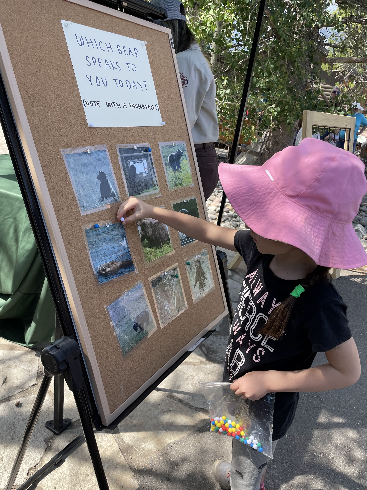

עזבנו את השמורה וחזרנו לג׳קסון לאתר הסקי <a href="https://snowkingmountain.com/" target="_blank">Snow king mountain</a> שמציע בקיץ המון פעילויות ילדים וספציפית מתקני מגלשות הרים. הילדים שמעולם לא רכבו אפילו על רכבת הרים, התלהבו מאד ממתקן הCowboy coaster. אני דווקא ממליץ על המתקן הפחות חדשני עם קרוניות הגלגלים מכיוון שהוא מאפשר לנהג הרבה יותר שליטה ואפשרות לעשות ״חוכמות״... הילדים פחדו, אבל לא כמו שציפיתי. מאד עזר שזייפתי צרחות איימים בסיבובים כדי שפיט יתקרב לקצה קיבולת האימה שהוא מסוגל להכיל :)

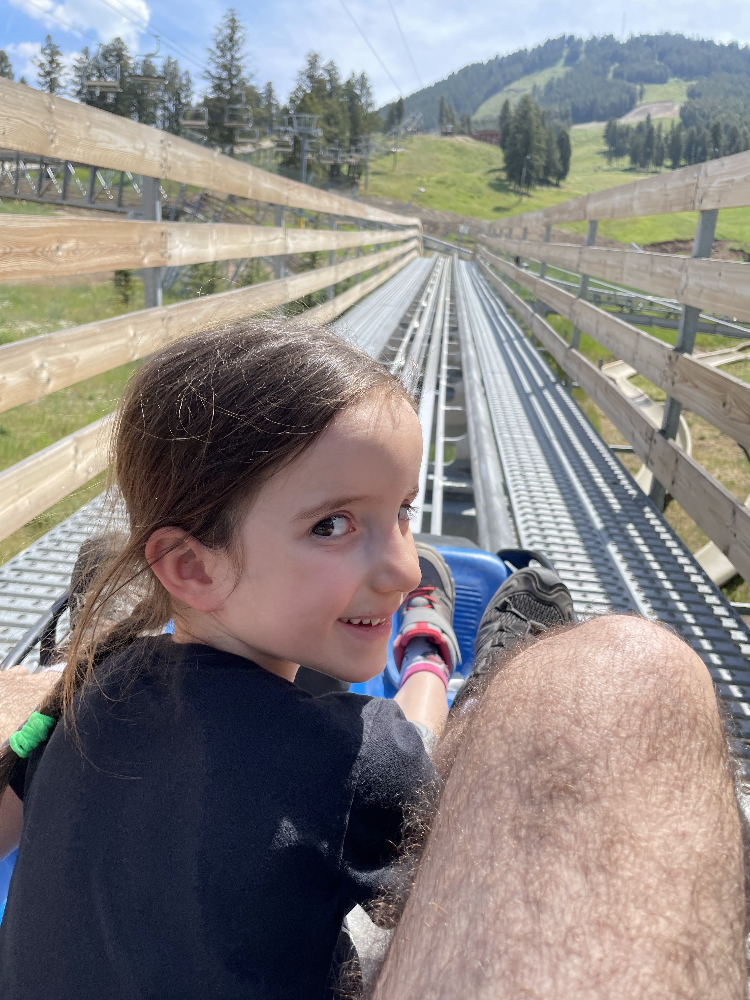

<object class="BLOG_video_class" contentid="6d8f9d3d6a7362ff" height="266" id="BLOG_video-6d8f9d3d6a7362ff" width="320"></object>

היום לנו בVirginian RV Park בתוך Jackson hole שהיה פחות מוצלח ממקום הלינה הקודם, למרות וכנראה בגלל שהיה במרכז ג׳קסון. הילדים ניצלו את הבריכה והג׳קוזי במקום, לא לפני שהשלימו את המטלות שלהם. כדי לשמור על משהו מהשכל המתרופף שלהם, כל ילד לקח איתו מחברת חשבון ומקבל מידי כמה ימים תרגילים לפי רמתו...

 

בערב ניצלנו את העובדה שאנחנו עדיין נמצאים בעיר, לפני כניסה לשמורות ולקחנו את הילדים ל״מסע טעימות״ במסעדת BBQ אמריקאית טיפוסית. הזמנו לילדים לחלוקה 3 מנות דגל אמריקאיות של צלעות, Pulled pork וBBQ Chicken. הילדים התלהבו וליכלכו את כל הפרצופים והידיים ברטבים המתקתקים. טעמנו גם IPA מקומית שהיתה מצויינת. האמריקאים הדביקו את הפער בשנים האחרונות בכל נושא מבשלות הבוטיק. מה שהתחיל ב

קולורדו, התפשט והגיע לכל מקום. גם מבשלות ממוסחרות גדולות, לצד מבשלות מקומיות מעולות.

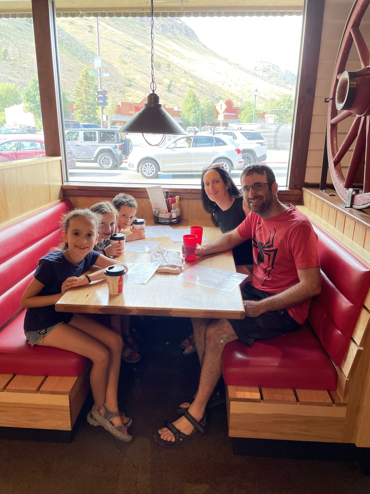

לפני שעזבנו את ג׳קסון, התנסינו באחת ה״אטרקציות״ המבוקשות באזור -   שייט ראפטינג בנהר הSnake River. אחרי חיפושים, מצאתי חברה שמאפשר ליצורים במשקל הפיטים להשתתף בראפטינג שמוגדר בחלקו white water rafting. יש הרבה חברות שלוקחים ילדים בני 5 לראפטינג רגוע, אבל אצל Dave Hansen מאפשרים למספר קטן של ילדים להצטרף לרפטינג שבחלקו סוער יותר ובחלקו שליו. בסירה של 16 איש, רק 10 איש נדרשים לחתור בעוד 6 ילדים/עצלנים יכולים להכנס באמצע בין החותרים. בניגוד ליוטה, הטמפרטורות בג׳קסון גם בשיא הקיץ עדיין קרירות בקצוות היום, כך שעדיף לקחת שייט ב10 ולא את הראשון על הבוקר.  

 

התפלגות טמפרטורה יומית באיזור ג׳קסון בחודשי הקיץ

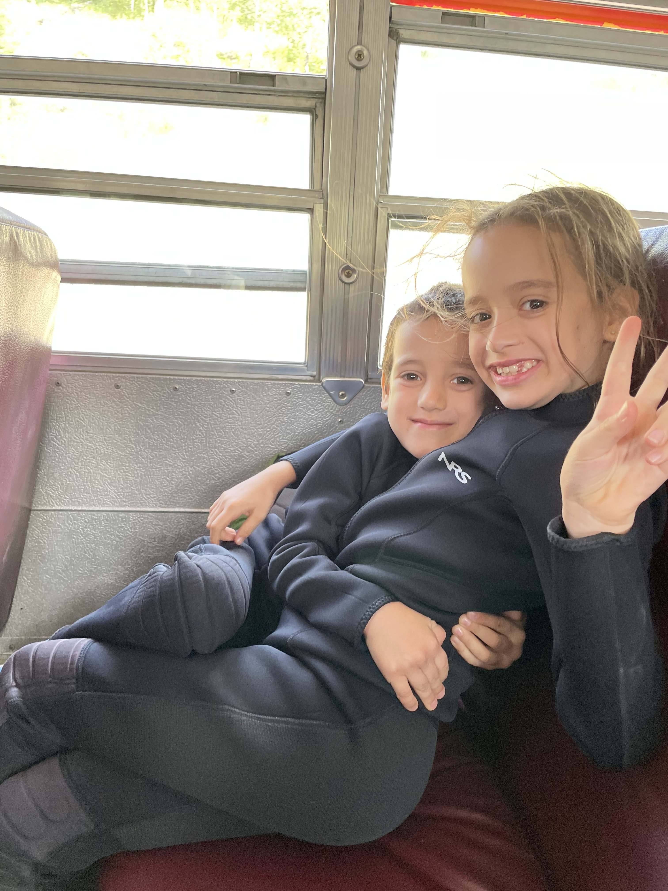

כמו לונה-פארק הילדים מעולם לא עשו ראפטינג - במהלך השנתיים האחרונות הזמנתי פעמיים בנהר הירדן ונאלצתי לבטל בשל סגר קורונה ארור. הילדים היו מאד נרגשים לקראת השייט. המדריך היה נחמד מאד וזרם עם שטויות. אחרי כמה איזורים סוערים בהם הילדים נרטבו וצרחו מהתרגשות, התחילו לקבל קצת אומץ. עלמה הסכימה לשבת איתי על חרטום הסירה (Bull riding) ולהישטף בכל אזור סוער. בדרך, על נהר ה snake, הצלחנו לראות Osprey (בעברית ״שלך״), צבי כלשהו יורד לנהר לשתות מים ועוד עייט קרח שהמתין שה Osprey יאתר דג כדי לחטוף לו אותו. באזור של הזרימה החלשה המדריך הציע לקבוצה לטבול במים, ולהפתעתי כל הילדים זרמו כשבראש אלכס עם המשפט הקבוע שלה - ״מה אכפת? זה כיף!״ הילדים נסחפו בזרם לכל כיוון ואנשים בקבוצה עזרו למשות אותם מהמים לפני שחזרנו לאיזור הסוער.

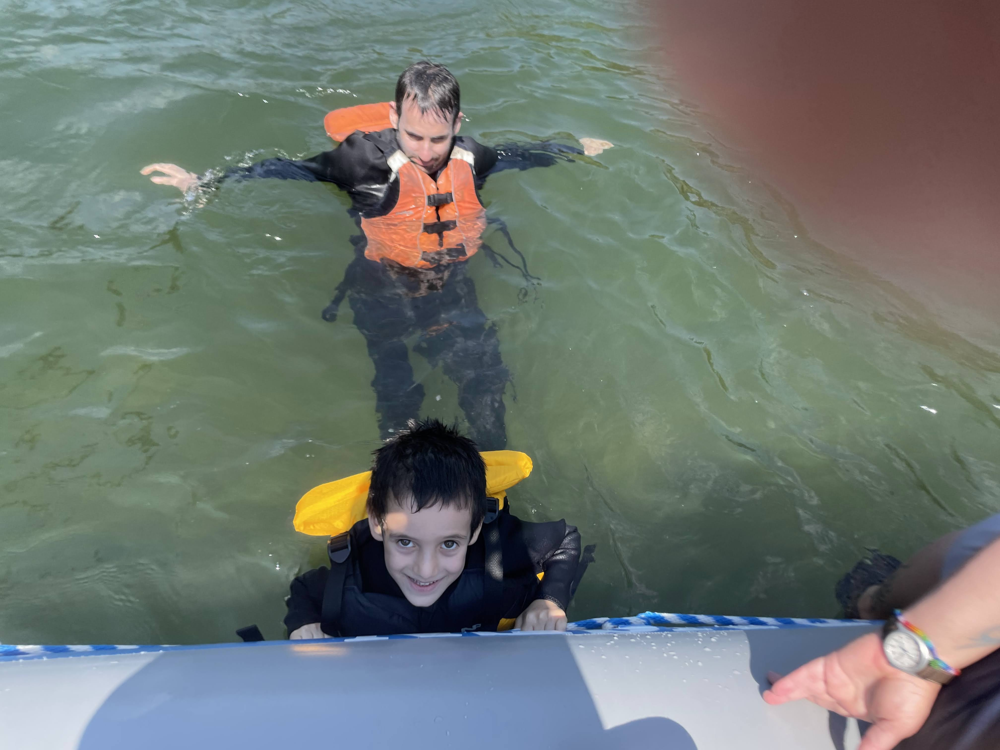

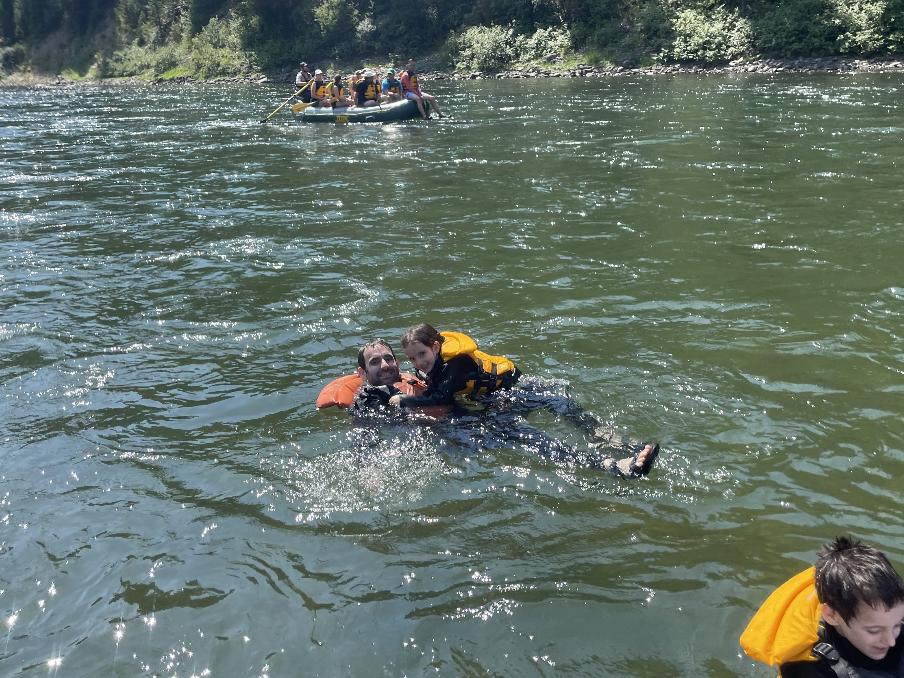

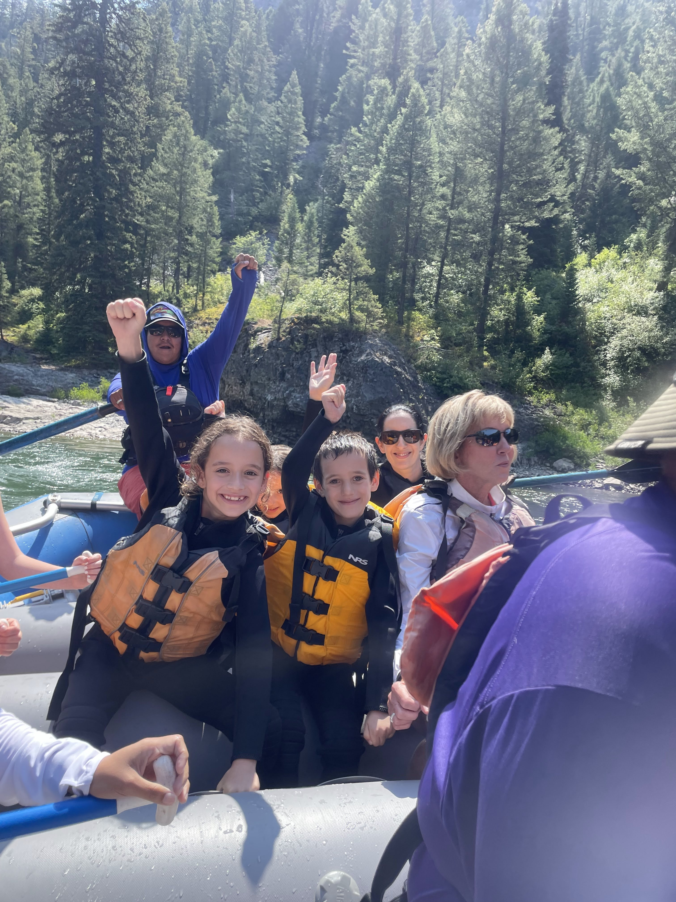

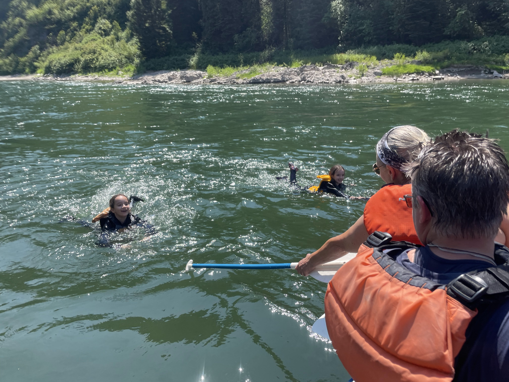

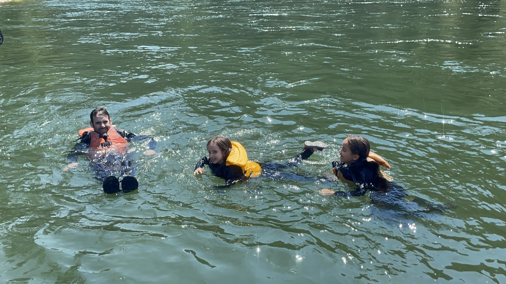

מלאי חוויות ורטובים, עזבנו את ג׳קסון כשפנינו לעבר היעד הגדול הבא - הפארק הלאומי ילוסטון! בדרך הצטיידנו מחדש ב 

whole foods

 – סופר המציע בעיקר מוצרים בריאים ומיוחדים. הסופר מאד  השתפר ב 10 שנים מאז ביקרנו בו בטיול הקודם. מבחר משוגע של מוצרים בריאים וברמה גבוהה, מאד מומלץ לאוהבי הבישול.

נתראה בקרוב
