מה לא נאמר על שמורת ילוסטון. השמורה העצומה שמשתרעת על שטח של כמעט חצי ממדינת ישראל מכילה מגוון עצום של תופעות מעניינות. מצד אחד ריכוז של תופעות גאותרמיות שאין שני לו (בילוסטון לבדה מרוכזים חצי מהאתרים  הגאותרמיות על כדור הארץ!) ומצד שני המגוון הביולוגי ששרד בטבע מושך מיליוני תיירים כל שנה לשמורה הותיקה.

עם כל כך הרבה דברים שרצינו לראות, היינו צריכים לתכנן בקפידה את הפעילויות. הקצנו לפארק 5 ימים. מצויידים בתחזית מזג האויר, מפת העומסים באתרים וב״משל האבנים הגדולות״, התחלנו את הטיול באטרקציה הכי מפורסמת שלו - הגייזר הנאמן הותיק הלוא הוא ה Old faithful. לפני שנכנסים לימים של סוף השבוע, השכמנו קום ונסענו לחניון של הגייזר המפורסם בעולם. 

מיד כשהתקרבנו למרכז המבקרים ראינו אנשים ממהרים. הסיבה לכך היתה שבדקות הקרובות צפוי הנאמן להתפרץ ברוב רושם. מכיוון שהמערכת הגאותרמית ומאגרי המים של הגייזר הם מערכת סגורה, ניתן לצפות בקירוב את שעות ההתפרצות. לData scientists שבינכם בודאי כבר מדגדג בקצות האצבעות  - כן, בודאי, הDatasets של זמני התפרצויות העבר, משך ההתפרצויות ושאר פיצ׳רים זמין במרשתת ואתם מוזמנים לנסות לחזות את ההתפרצות הבאה בעצמכם... אך כל מדעני העולם פספסו עובדה קטנה אחת.

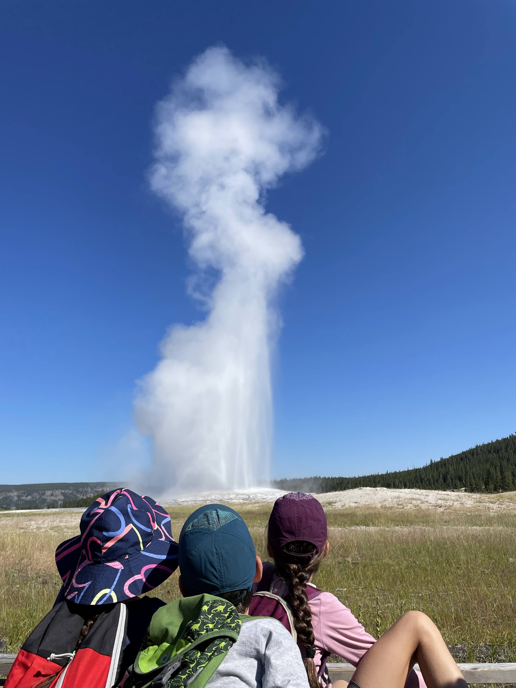הגייזר Old Faithful

השילוט על מרכז המבקרים קבע כי ההתפרצות הולכת לקרות בעוד 5 דק׳ (עם סטיה של 10 דק׳ לכל כיוון). מיהרנו לשבת עם שאר הממתינים להתפרצות המיוחלת. מלאי ציפיה ישבנו ובהינו בזרזיף אדים עולים מן החור הגדול, אך שום דבר לא קרה. עברה דקה, ועוד שלוש. עם כל המדע שעומד לרשותנו בני האדם פספסנו את זמן ההתפרצות של הגייזר הנאמן. ברגע שפקעו 10 דק׳ הסטיה מהתחזית שהוקצו למדענים פתאום היה לי ברור מה היה חסר. חייבים למשוך! למורת רוחה המופגן של הנמלה, ביקשתי מעלמה שתנסה, אך עדיין לא יצא הגייזר. כשפיט אץ לו רץ לו לעזר, החלו לבעבע פני השטח, אך רק כשאלכס, המתוקית הקטנה, החלה למשוך זה קרה: איזה גייזר, גייזר כארז!

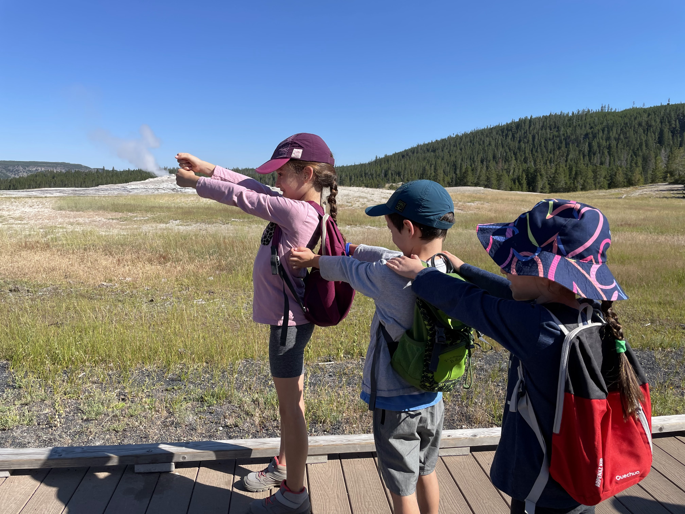

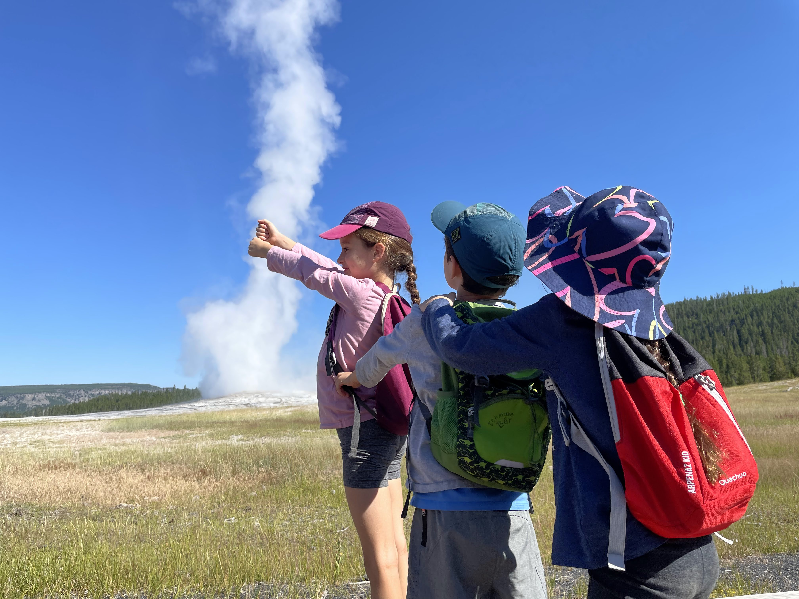

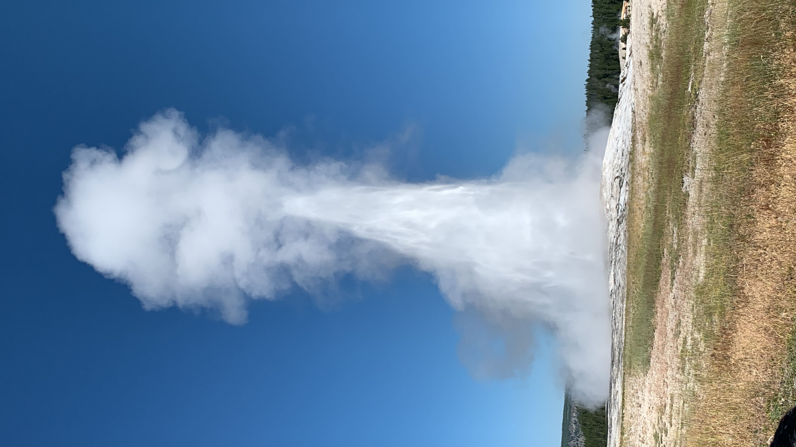

  

הגייזר העצום מגיע לגובה של עד כ-50 מטר ופולט כ30 אלף (!) ליטרים של מים רותחים בכל התפרצות בת דקות בודדות. אולי בשל גודל הציפיה, או רוח השטות, הילדים לא התרגשו מאד מהגייזר עצמו, אך שמחו מאד מהצלחתם בקטיף :). 

מבושמי תהילה, לאחר הצלת כבודם של מדעני הפארק, עברנו למסלול ההליכה היומי. ממרכז המבקרים של Old faithful יצאנו למסלול ההליכה <a href="https://www.alltrails.com/trail/us/wyoming/upper-geyser-basin-and-old-faithful-observation-point-loop?ref=result-card&amp;u=m" target="_blank">Upper Geyser Basin and Old Faithful Observation Point Loop</a>. המסלול עובר כולו על ״רמפה״ מוגבהת, מקיף את ״אגן הגייזרים הצפוני״ ומאפשר לחזות בתופעות הטבע מעוררות השתאות שרוחשות באגן מבלי לשקוע ולהתבשל בתוכו.

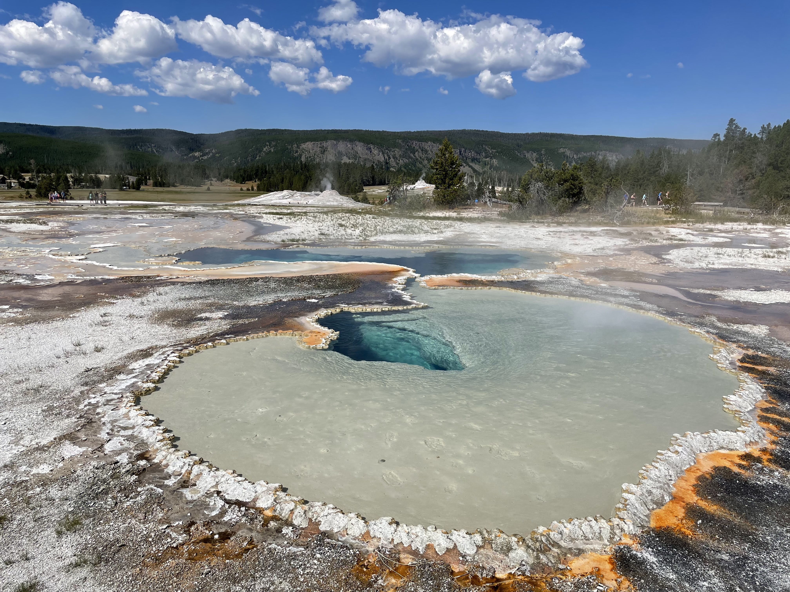

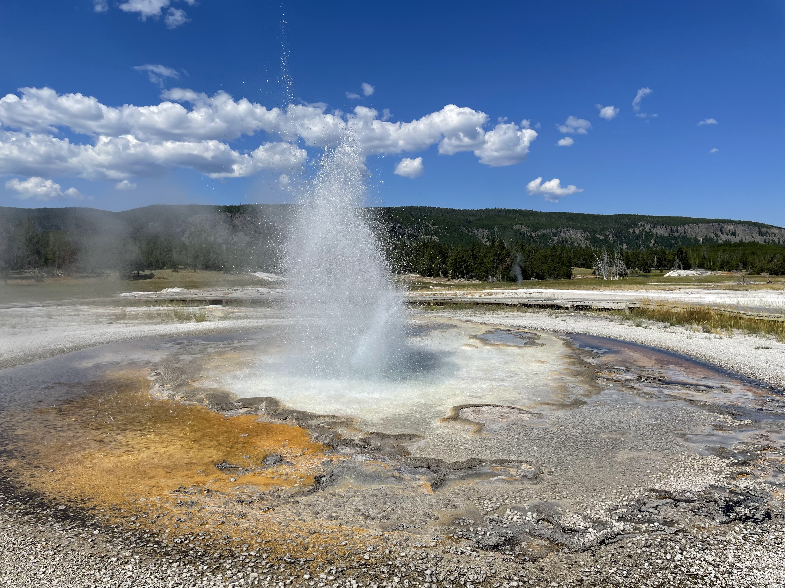

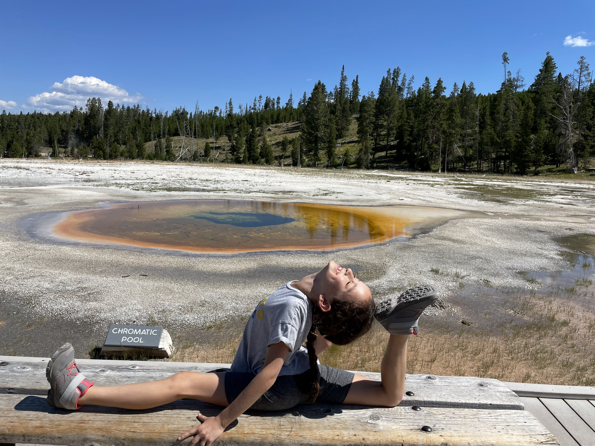

התופעות הגאותרמיות הקיצוניות בהן צפינו במסלול הן תוצאה של פעילות געשית מתמדת שרוחשת מתחת לפני השטח. השמורה, שנוצרה בהתפרצות ענק טריה במונחים גאולוגיים (כחצי מיליון שנה) ממשיכה להיות פעילה הודות למיקומה מעל ״נקודה חמה״ בלוח הצפון אמריקאי. מונח פחות מדעי אך שהניח את דעתם של הילדים ונתן הסבר מעולה לצבעים ולריחות שנתפסו בחושיהם במהלך המסלול הוא ״תה של כדור הארץ״. ממש כמו תיון שנותן את ריחו וצבעיו למים הרותחים כך הפעילות הגעשית חלטה את בטן כדור הארץ וצבעה את מימי הבריכות המשונות. באשר לריח, ממש כמו בני האדם, הריחות שהתבשלו בבטן כדור הארץ מהמינרלים, נפלטו החוצה דרך ״האגן״ בסילון אוויר ריחני.

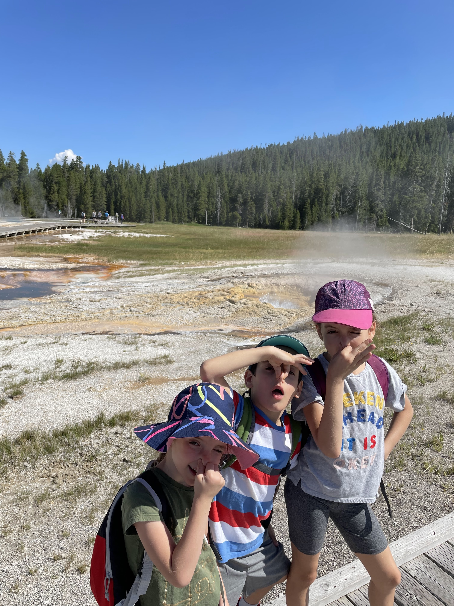

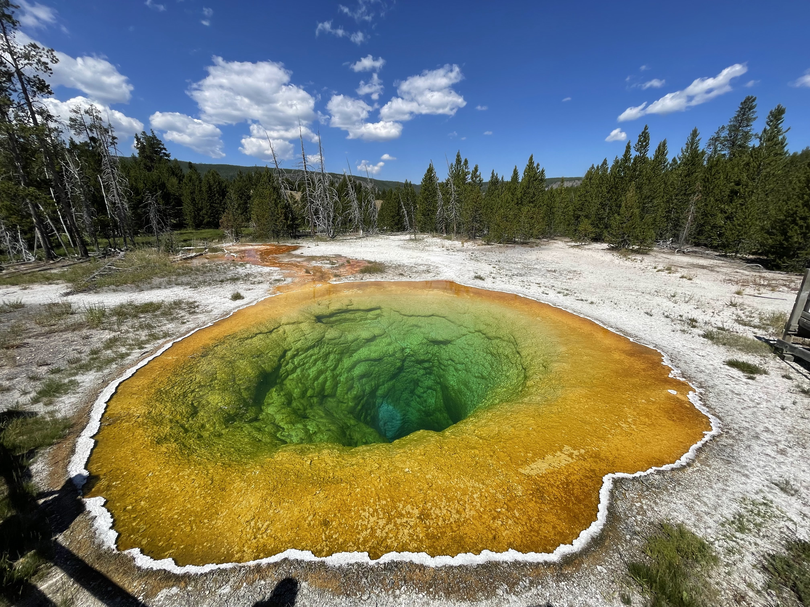

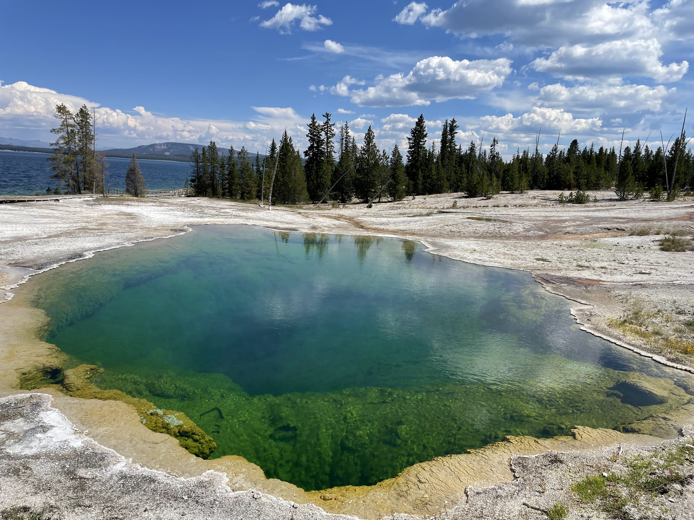

הילדים מאד נהנו מהטיול המגוון. פרט לזה שפיט התלונן שזה ״לא באמת טיול״ כי אין סלעים ואבנים, האטרציות שמרו על עניין לכל אורך הדרך ולא חזרו על עצמן כפי שחששתי.

אינטואיטיביים ככל שיהיו ההסברים הילדותיים שלי, הם רחוקים יחסית מהמציאות. אחרי הטיול המוצלח, ביקרנו במרכז המבקרים שממוקם ליד הOld faithful. מרכז המבקרים מנגיש את המידע בצורה ויזואלית לילדים. על אף השפה הצלחנו לעניין את הילדים כך שבלי לשים לב, אפילו למדו כמה דברים. מערכת התעלות המסועפות, והלבה שרוחשת מתחת לרגלינו צופנת סודות רבים.

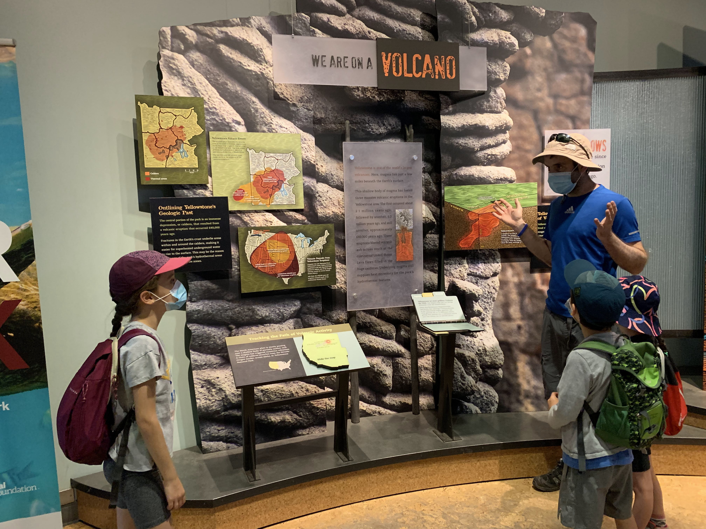

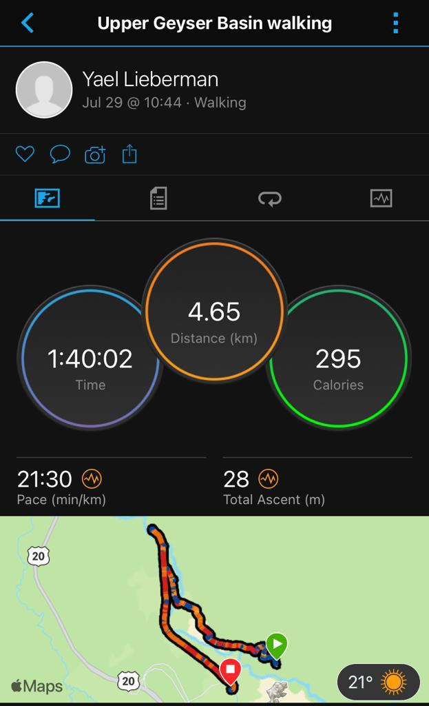

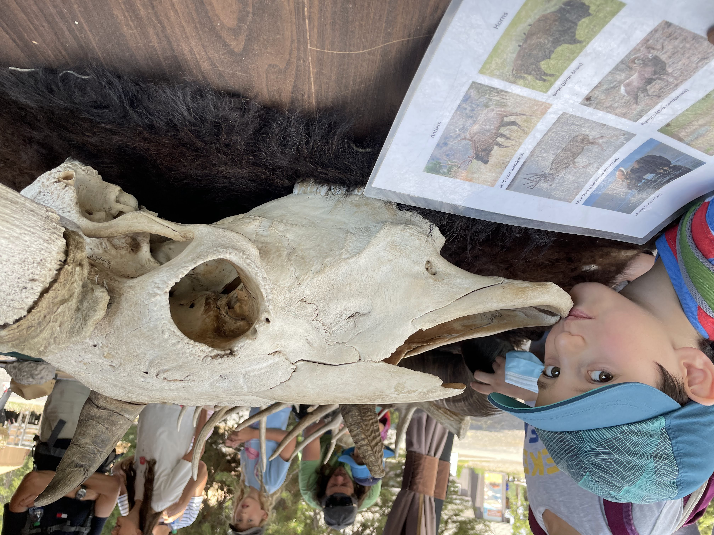

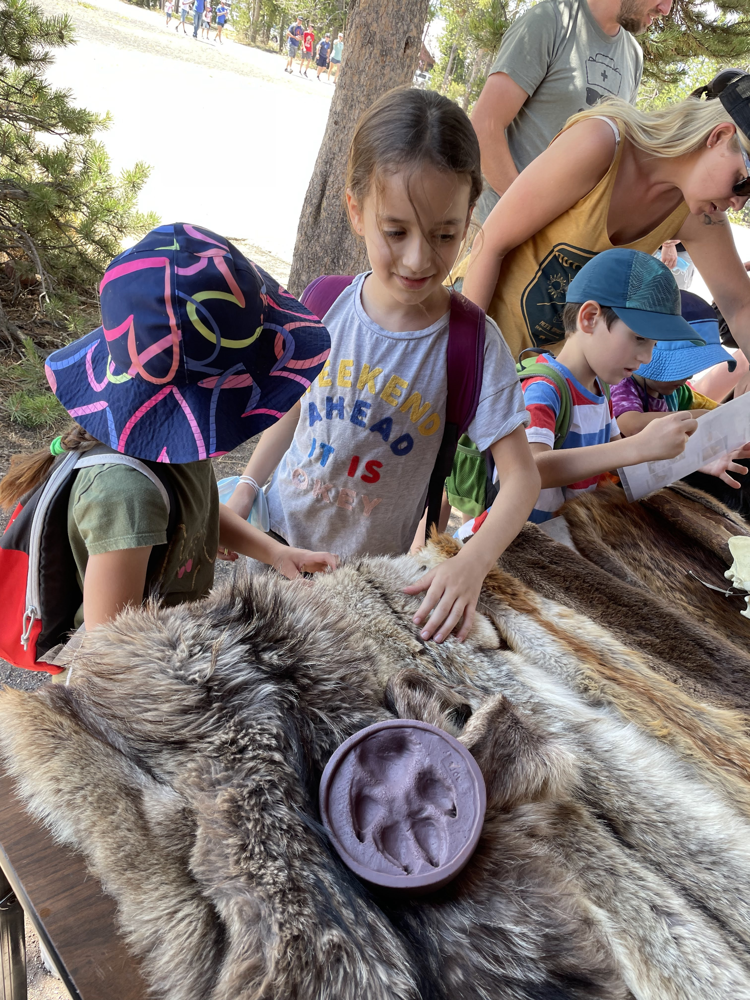

משם המשכנו לWest thumb למסלול קצר שישלים את ה״יום בסימן האתרים הגאותרמיים״. המסלול הקצר (כ1.6 ק״מ) הוסיף לרשימת התופעות בהן חזינו גייזרים שנובעים ממש בתוך האגם (אגם ילוסטון). בחורף, האגם כולו קופא פרט לאזור הפעיל שם הקרקע תמיד מבעבעת. ליד האגם עמדה ריינג׳רית וחקרה עקבות טריות של דב גריזלי. עדיין לא הצלחנו כאן שום דב, אבל שמענו על הרבה אנשים מסביבנו שכן ראו. נקווה שנצליח לפגוש, ולשרוד את המפגש כדי לספר 😎. משם, בדרך חזרה למקום הלינה עצרנו באחת מאינסוף העצירות על שפת אגם ילוסטון כדי לטבול רגליים ולהתרענן.

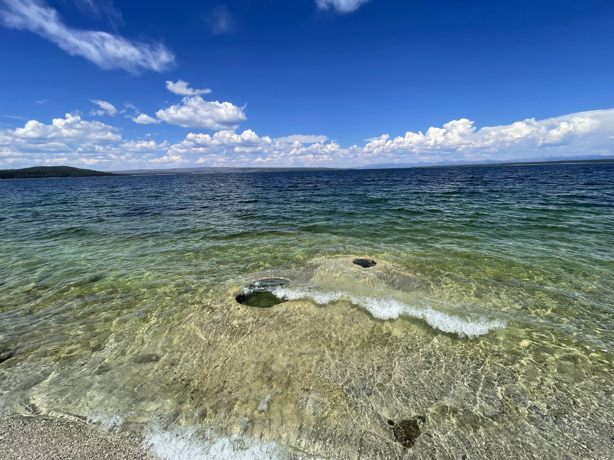גייזרים מבעבעים בתוך אגם ילוסטון

ב3 הלילות הראשונים בילוסטון, לנו בתוך השמורה באתר הקמפינג "Fishing Bridge״. באתר אין כמעט כלום חוץ מטבע, מה שלא הפריע לילדים להשתתף בבניית בתי עץ, ושלל משחקי דמיון. בשמורה כולה אין קליטה סלולארית, מה שאיפשר לנו ניתוק מכל ההסחות והתמכרות לטבע וזמן איכות המשפחתי. איזור הFishing bridge (גשר דייגים עתיק), ידוע כאיזור שורץ בדובים, ועל כן אסור להשאיר שום שאריות מחוץ לקראוון. מה שלא ידענו זה שאסור גם להדליק מדורות, אז הייתי צריך להתאים קצת את התוכנית הקולינרית לתנאים החדשים. במקום תפוחי אדמה במדורה ונקניקיות על האש, אכלנו פירה ונקניקיות ביין אדום במחבת (שהנמלה שלחה אותי לטגן בחוץ בטענה שהיא לא אוהבת שהתחתונים והכרית שלה מריחים מנקניקיות 😝) בהמשך אנסה לרכוש מנגל, אבל בינתיים מסתדרים עם מה שיש - זה חלק מהמחנאות..

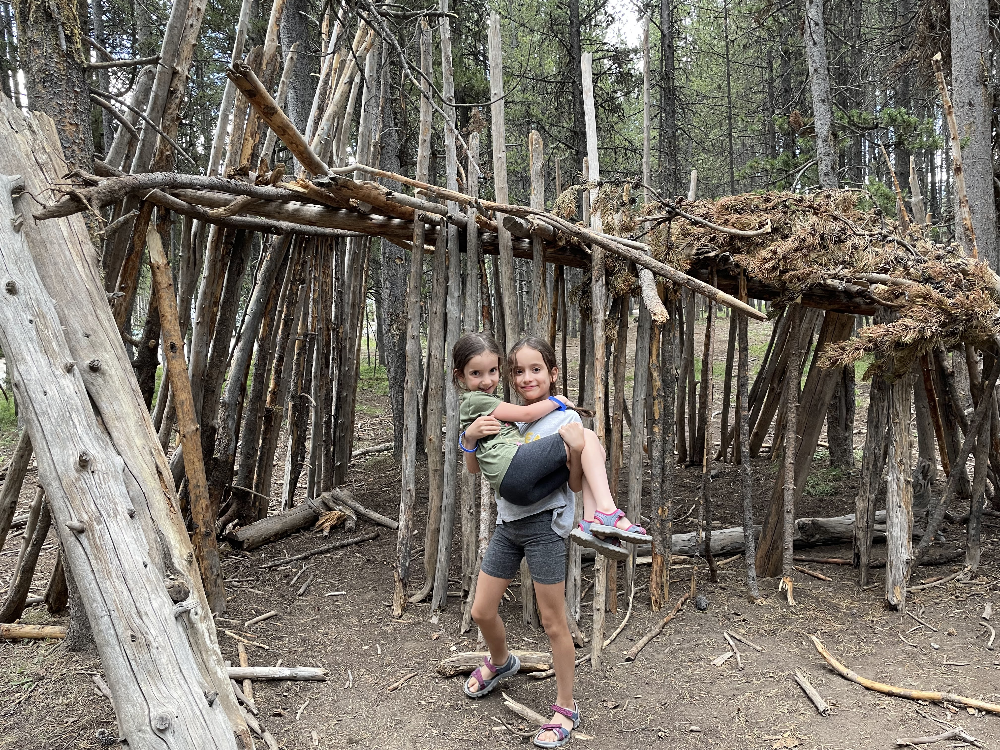

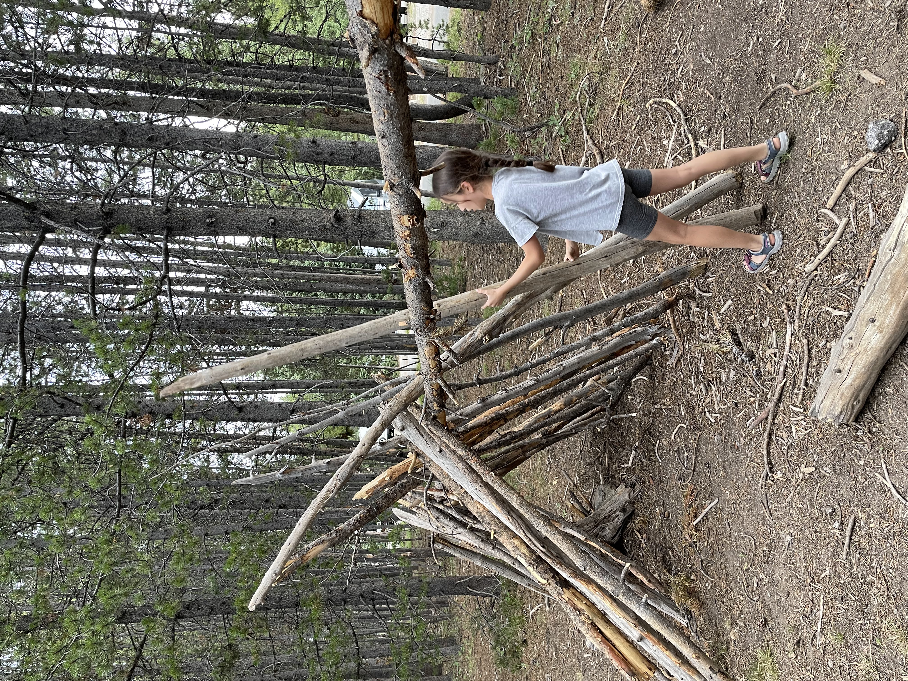

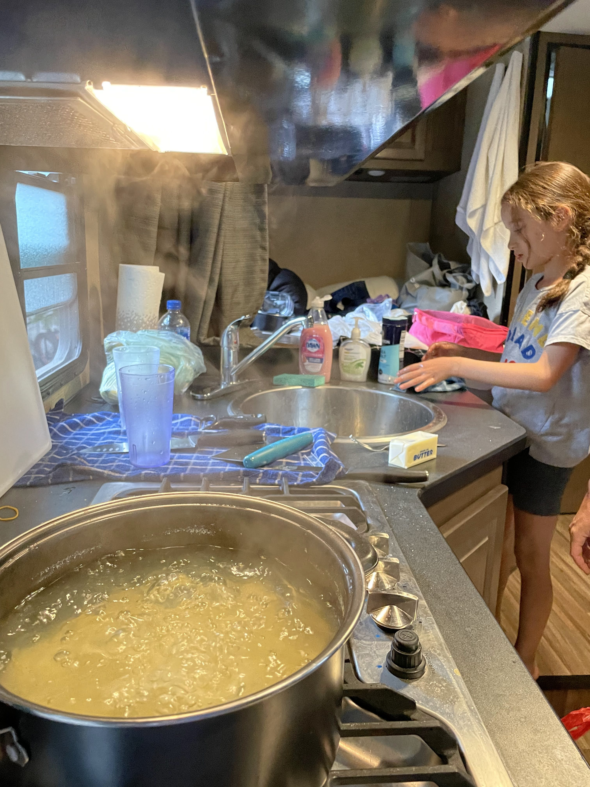

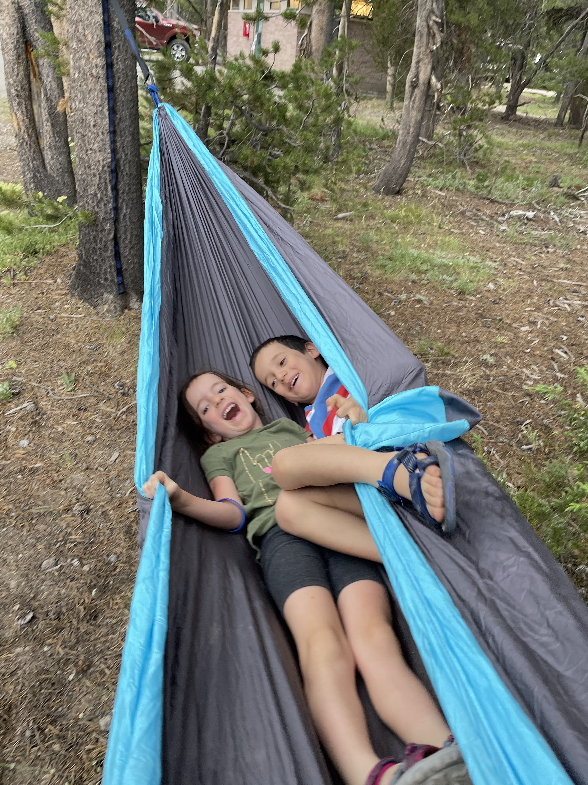

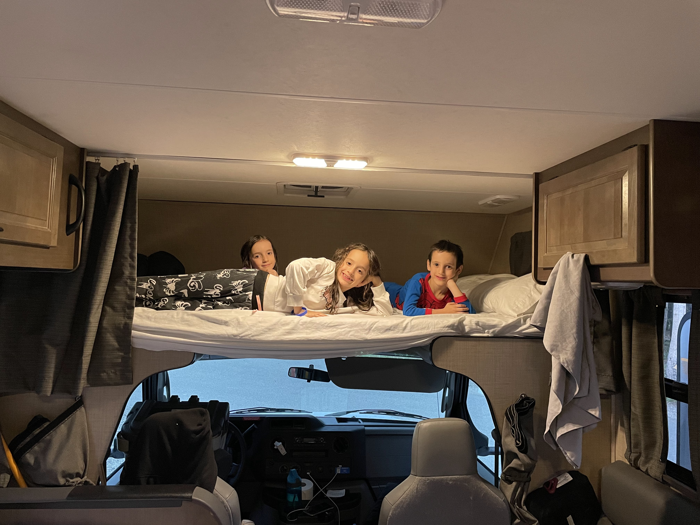

מחר נצפין לאזור ה״קניון הגדול של ילוסטון״. נעדכן בקרוב.
