הלילה הראשון בקראוון עבר בנעימים, השעון הביולוגי של הילדים סונכרן לחלוטין ל"Mountain Daylight Time". הפרשי הטמפרטורה בין זמן הערב ללילה קיצוניים יחסית בתוך המכונית, כך שצריך לכסות את הילדים בעוד שכבה אחרי שהם נרדמים. בבוקר התאמנו לראשונה בטקס  ״מעבר ממצב לילה למצב יום״ בביתנו החדש, הכולל טקסי סדר מדוקדקים בניצוחה של הנמלה. אכלנו ארוחת בוקר זריזה, שטפנו וניגבנו את הכלים (בקראוון הכל חייב להיות מהודק בארונות לפני הנסיעה) ויצאנו לכיוון Jackson והפארק הלאומי Grand Teton. 

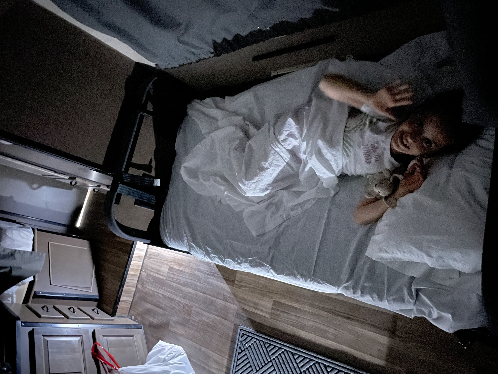

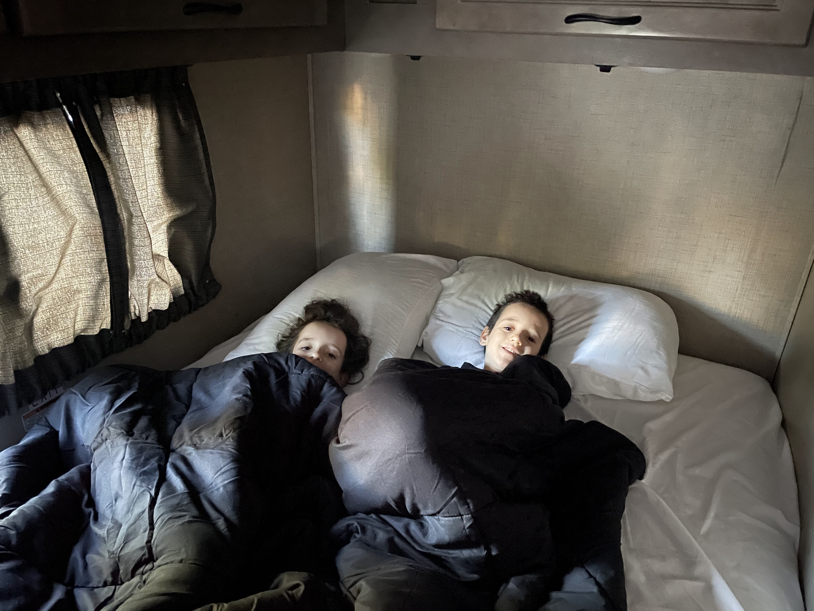

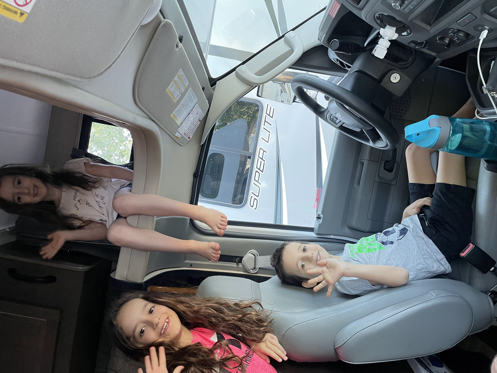

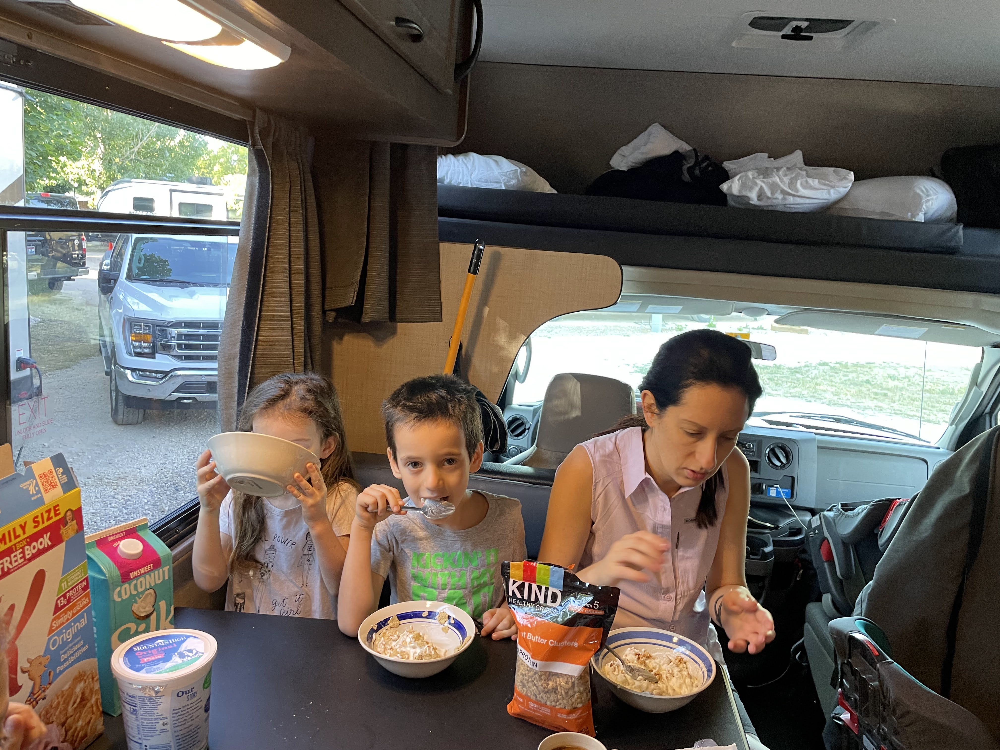

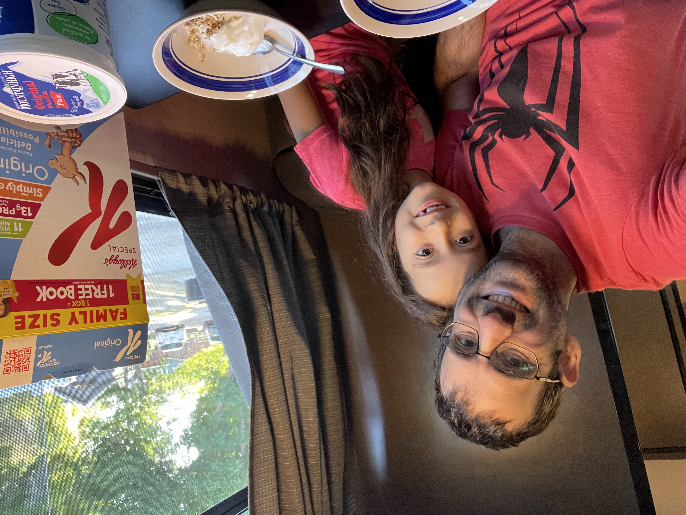

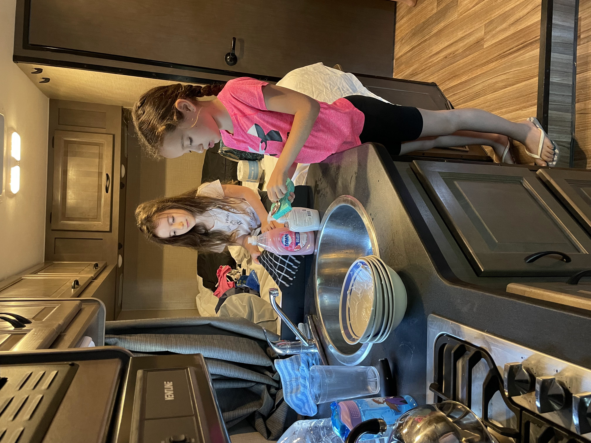

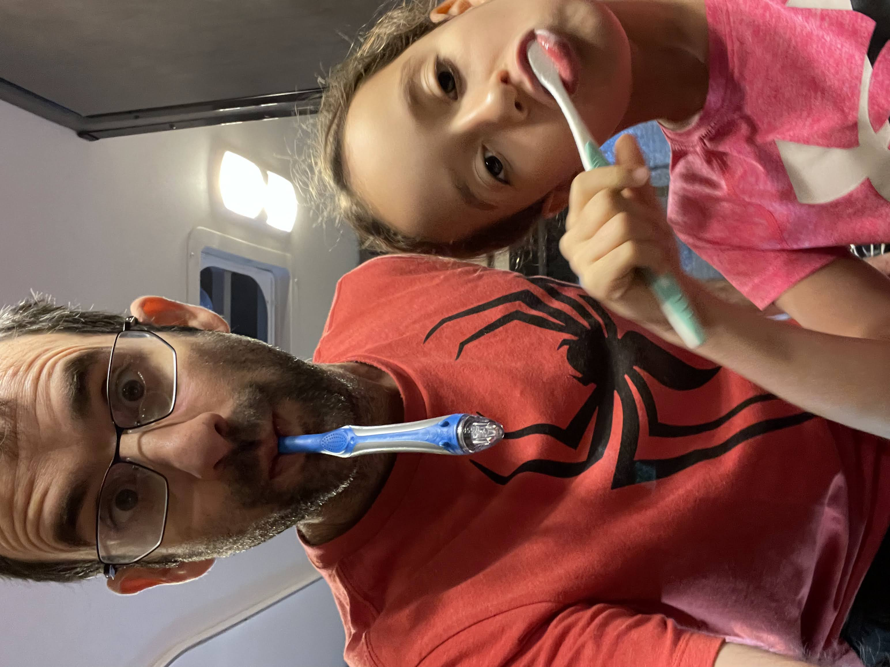

 

נסענו מ

Bear Lake

 הישר אל נקודת היציאה למסלול בתוך הפארק. כבר בנסיעה נשקפו בפנינו רכס ההרים טיטון אשר

 

להפתעתנו פסגותיו עדיין כוסו במעט שלג שטרם נמס. ה

שמורה ״גראנד טיטון״ נקראת על שם ההר הגבוה שנמצא בשטחה באותו השם, שמשתייך לתת-רכס של הרי הרוקי. ההר קיבל את שמו מפי חוקר ארצות צרפתי ילדותי ופרושו מצרפתית הוא.. הציצי הגדול (grand téton

). קשה להוציא מהראש את תמונת משלחת מגלי הארצות השיכורים שיושבים סביב המדורה, משחקים בשפמם וצוחקים כמו מטומטמים במבטא צרפתי מוגזם. "he he he - le grand téton"

 

יריית הפתיחה של מסלולי הטיול בארה״ב היה מסלול לא קשה מידי בשם 

Taggart lake 

 (יציאה מ 

Taggart Lake trailhead, <a href="https://www.alltrails.com/trail/us/wyoming/taggart-lake-loop--2?u=m" target="_blank">זה</a> תאור המסלול). 

הטבע בשמורה מזכיר קצת את השמורות באירופה מבחינת צמחיה וריחות אם כי חלק מהעצים והפרחים נראו פחות מוכרים. הפרפרים שליוו אותנו הם בהחלט פרפרים אמריקאים לפי מידתם ה

XXXL 

 והסנאים החמדנים הם תמיד תוספת נחמדה לטיול.

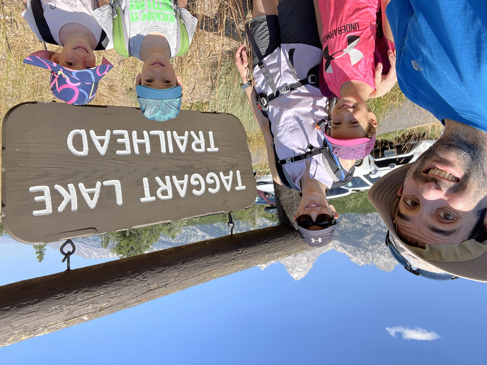

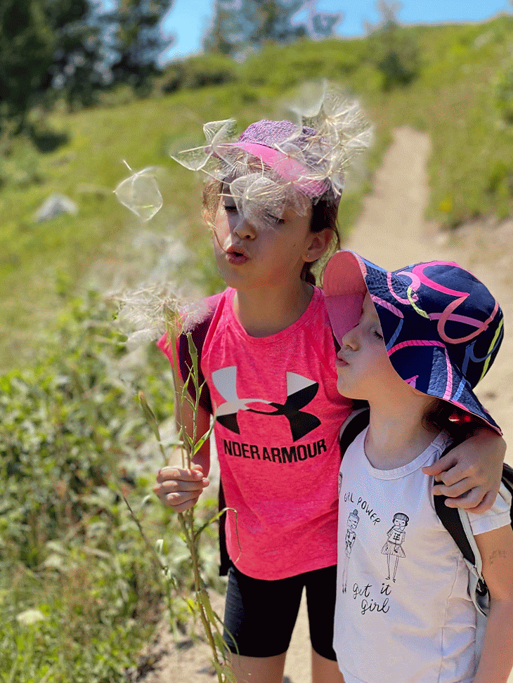

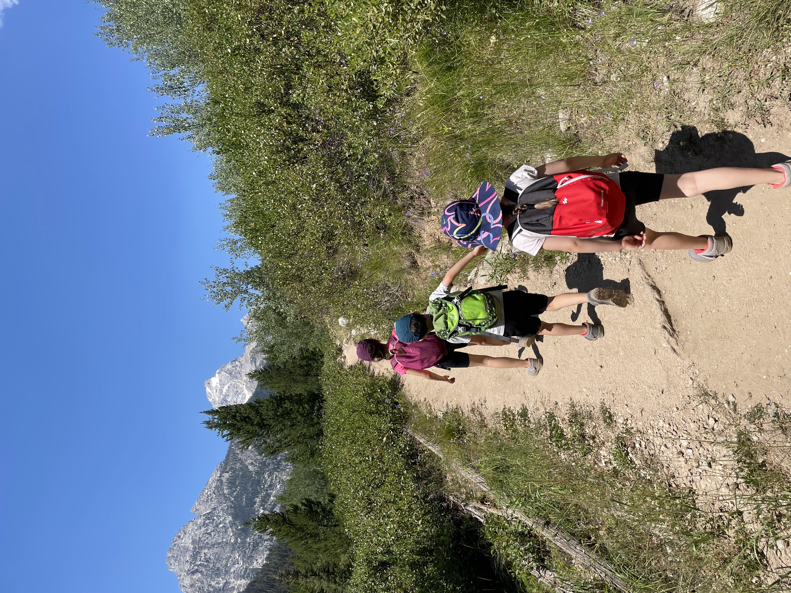

פרפר אמריקאי זולל מזון מהיר

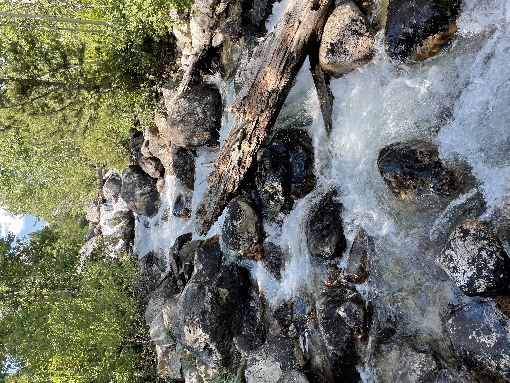

אולי בזכות שיצאנו לטיול דווקא בצהריים בשיא החום קיבלנו ״תסריט״ מושלם מבחינת מבנה המסלול. אין להפריז בחשיבות ״כוריאוגרפיית הטיול״ להצלחתו. התחלנו בעליה לא קשה מידי שעייפה את הילדים בחום הצהריים עד שהאפים הקטנים שלהם החלו להזיע. ואז, עוד לפני שהפיות הגדולים שלהם החלו מתלוננים – הופיע האגם המושלם שאפשר טבילת התרעננות צוננת. מדהים איך רחצה במים וקצת הצקה לדגים (ונוף של אגם מושלם!) משנים לחלוטין את רמת האנרגיה. הילדים ״נטענו מחדש״ באנרגיה אחרי הנסיעה הארוכה והטיפוס והשלמנו את המסלול בדילוגים ובכובעים רטובים.

 

כוריאוגרפייה טיולית מושלמת - מאמץ ושכר בצידו

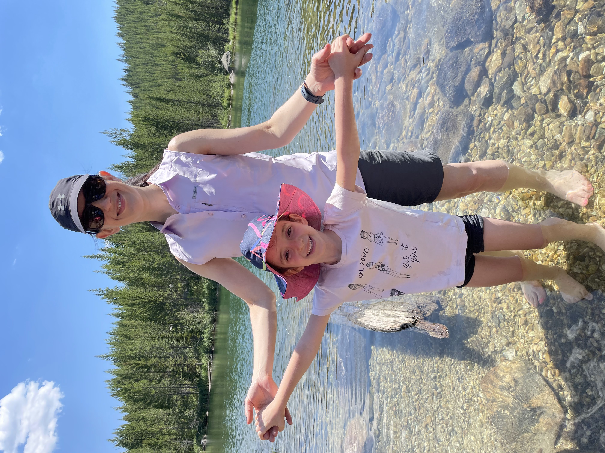

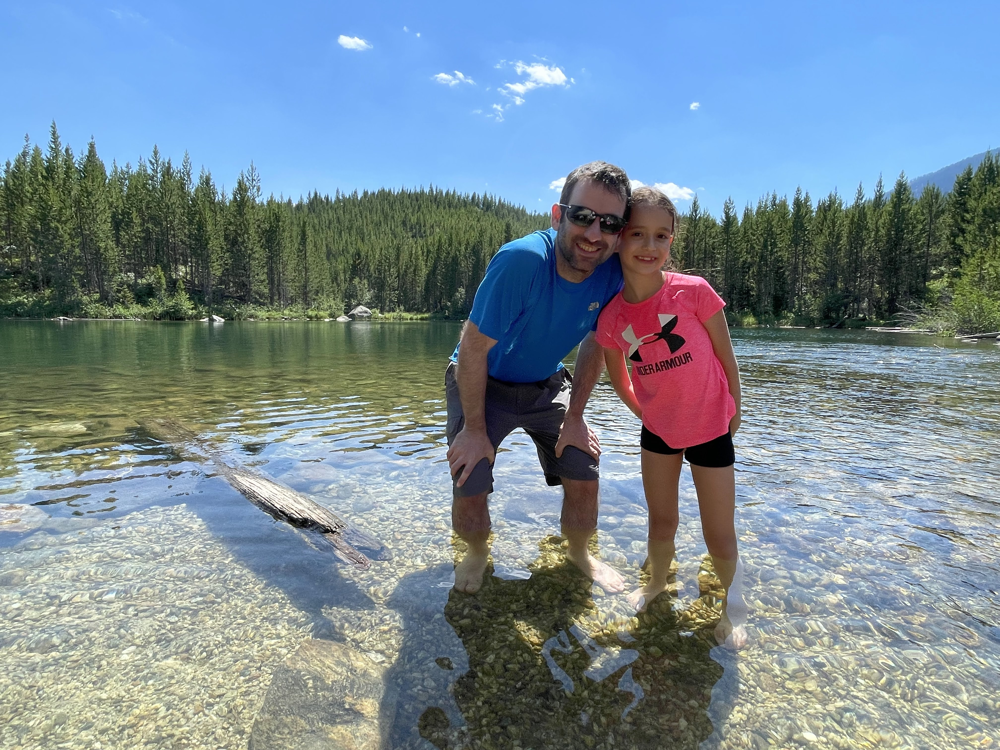

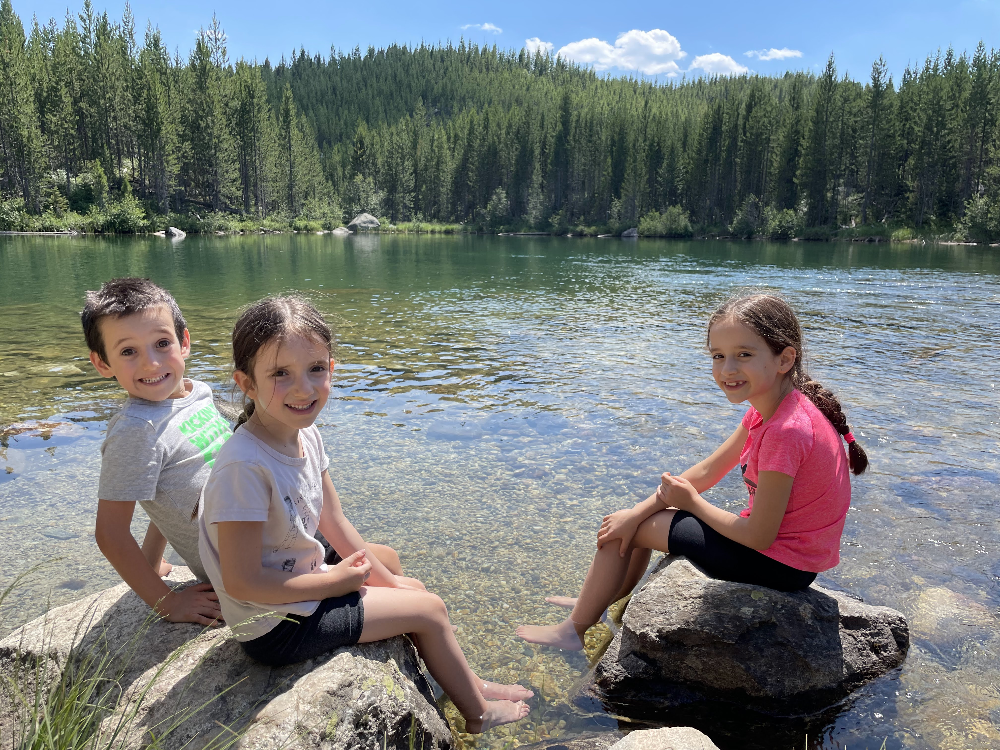

הילדים מאד אהבו להגיד שלום למטיילים שחולפים מולנו בשביל. אחרי התלבטות ונסיונות מצחקקים גמרנו אומר ונפל הפור: מהיום, הברכה המשפחתית הנכונה מול המטיילים הנקרים בדרכנו היא: 

howdy

. 

זה ניצח בגדול את האפשרות השניה '

how’r’ya’doin

משם המשכנו למקום הלינה הבא שלנו 

<a href="https://www.snakeriverpark.com/" style="text-align: left; text-decoration-line: none;">Snake River cabins &amp; RV village</a>. אמנם במחנה לא היו ״אטרקציות״ ייעודיות לילדים, אך התלהבנו מהמקום בשל היותו ממש על הנהר (

Snake river)

. מבחינת הילדים, הם יכלו לשבת שעות מול (ובתוך) הזרם, להקפיץ אבנים ולהביט בדייגים. חלק משמעותי מתרבות הקמפינג (והטיולים בכלל) באזורים הללו בארה״ב משלב דייג. בכל חור אפשר למצוא חנויות לציוד דייג וסביב כל נחל מישהו מנסה לתפוס טרוטה שמנמנה שממתינה בסבלנות לפיתיון כדי שתוכל להגשים את יעודה ולהכנס סוף סוף לג׳אבטה.

הילדים אפילו הצליחו לראות חיית בר - עיט קרח ענק שעף מעל ראשם בנסיון לתפוס דג, הבהיל אותם באמצע המשחק (נקרא בד״כ בטעות ״נשר קרח״). את השורות הללו אני כותב כבר מילוסטון מאתר קמפינג ללא קליטה – כך שאני לא יכול לאמת את זה – אבל אני נוטה להאמין שאלכס בהחלט נמצאת בקטגוריית משקל הטרף של העיט הדורסני.

פתיונות נוחים לעיט הקרח מנסים להקפיץ אבנים על הנהר

את ארוחת הערב בישלנו מול הנחל, כשפכפוכם השליו של מימיו מופר רק על ידי צחקוקי ילדים פרחחים. סוף סוף התנסיתי בבישול ב״סיר הקמפינג״ שהזמנתי למלון עוד מהארץ. בהרבה ארצות התפתח בישול ״באדמה״ בסגנון דומה. בישראל משתמשים בעיקר בצורת ההכנה הדרום אפריקאית שהיא כמובן ה״פוייקה״. פה בארה״ב אפשר למצוא את זה כ c

ast iron Dutch oven

 או 

camping Dutch oven

. גם הסיר הדרום אפריקאי מקורו בהולנד, אבל שיטות בישול דומות התפתחו בכל מיני מקומות בעולם (כמו הדינג בסין למשל).  בתור מי שאוהב להתנסות ולהמציא מתכונים – תבשיל קדרה בשטח הוא גן עדן לאילתורים. בביקור ההצטיידות בסופר הקפדתי לקנות כמה מרכיבים שפחות זמינים על המדפים בישראל כדי ליצור טעמים חדשים. הערב הוגשה קדירת ירקות שורש בבייקון וציר עצמות. הילדים טרפו ושמחו להשתתף בהכנת הארוחה. 

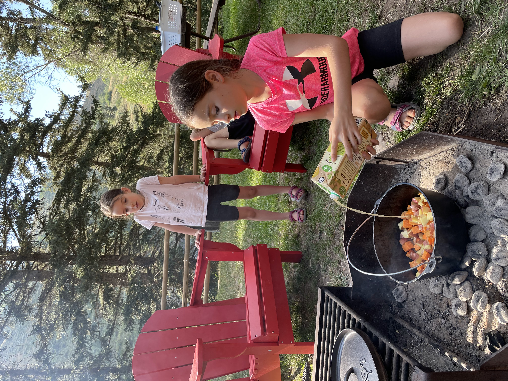

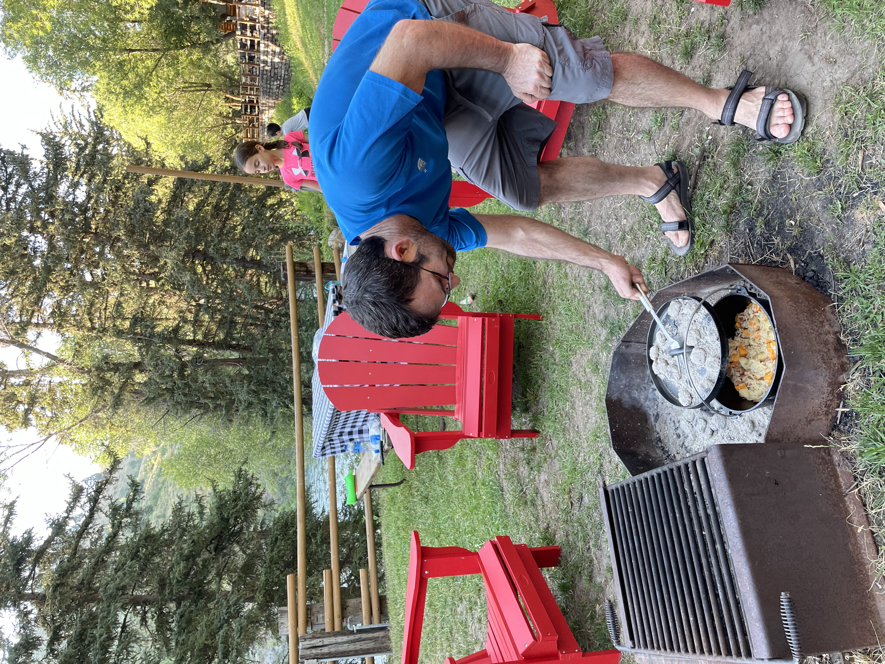

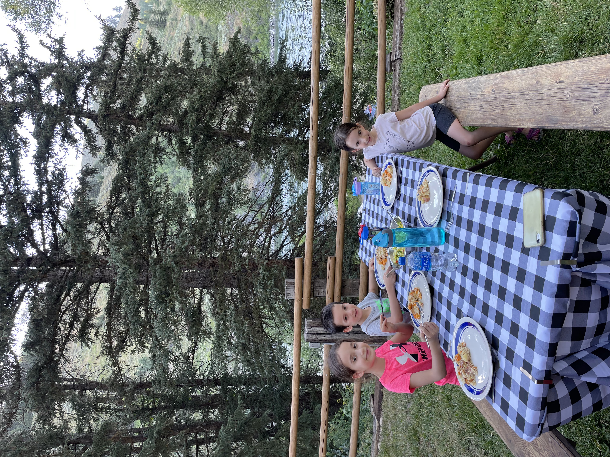

לקינוח התנסינו בעוד ״סטייפל״ מחנאות אמריקאי – מרשמלו על האש בתוך ״קסטת״ ביסקוויטים (או בשמם האמריקאי S'mores). למרות שאפילו הקפדתי להשתמש ב״בראנד״ הנכון של הקרקר (graham cracker כמובן), עלמה סיפרה שלפי סדרה אמריקאית מטופשת בה היא צופה - יש למרוח על הקרקר שוקולד לפני שמוחצים. אח.. הילדים של היום... מסתבר שהיא צודקת ועכשיו אצטרך לתקן.

היינו שמחים להשאר במחנה עוד לילה, אך לצערי דרגת החופש שלנו במקומות הלינה נמוכה מאד. נראה ששנות הקורונה הוציאו את כל האנשים לטבע וראינו כבר לפני כמה חודשים שמקומות הלינה המומלצים מתמלאים.

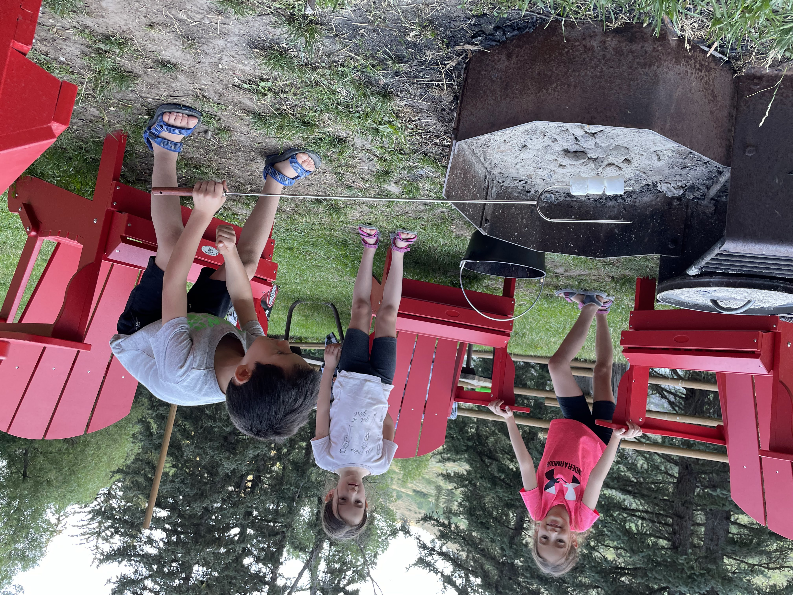

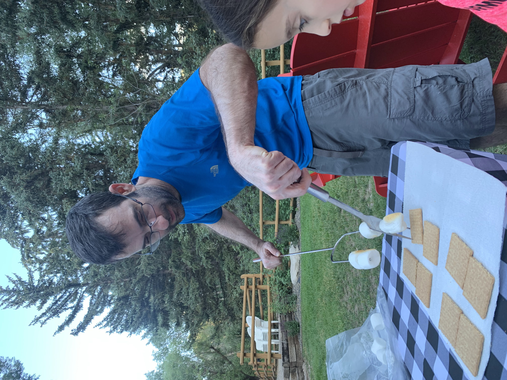

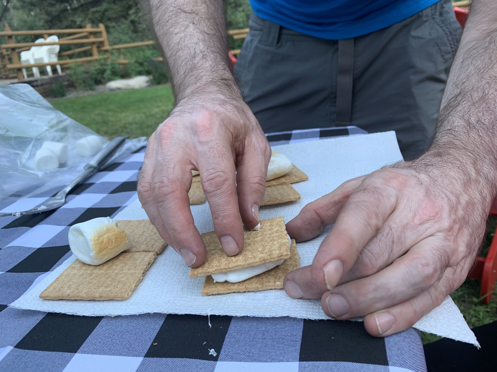

מחר נמשיך לחקור את איזור הנהר, והפארק הלאומי קמור הגוף (צחקוק צרפתי גרוטסקי...)

לילה טוב
