הבוקר שוב קמנו מוקדם כדי להתחמק משעות השיא בפארק במהלך בסוף השבוע, וכדי להגדיל את הסיכוי לפגוש חיות בר בדרכים. הבוקר נבקר Yellowstone

 Grand canyon

 (כן גם לילוסטון יש קניון גדול.

 

וכן, לאמריקאים אין המון דמיון בהמצאת שמות למקומות). בדרך מאתר הקמפינג (

Fishing bridge campground

), תכננו לעבור דרך עמק היידן הפתוח, בו (במיוחד בשעות הבוקר המוקדם והערב) יש סיכוי לצפות בחיות המתגוררות בפארק. ציידנו את הילדים במשקפת, ו

הורינו להם לתצפת מהחלונות ולחפש חיות, אבל הנמכנו ציפיות.

 

לפתע ראינו מכוניות עוצרות. עצרנו את הרכב כדי להבין על מה המהומה וזכינו באחת החוויות העוצמתיות ביותר שהיו לנו בטיול. בהתחלה ראינו יצור חום במרחק. ביזון! התרגשנו ומיהרנו לצלם. יצאנו מהרכב והתקרבנו (לא יותר מידי כמובן). אחרי מספר ארועים שקרו לאחרונה בהם ביזונים הרגו מטיילים שהתקרבו אליהם או סתם היו חסרי מזל, תידרכנו את הילדים היטב על הסכנות שבכל חיות הבר. ביזון אמריקאי, או בפאלו, הוא סוג של פרה עצומה היכולה להגיע לאורך של 3מ׳, רוחב של 2מ׳ ומשקל מעל טון(!). למרות שהיצור מתהלך בכבדות, בעת מתקפה או נסיגה הוא יכול להגיע למהירות של 70 קמ״ש ואף לקפוץ לגובה של כמעט 2 מטרים

. בעודנו נרגשים מכך שהצלחנו סוף סוף לראות חיה גדולה, פתאום שמנו לב לסיטואציה שהכנסנו את עצמנו לתוכה. אנחנו לא צופים בביזון אחד שעומד ליד הכביש – אנחנו נמצאים בתוך עדר ביזונים ענק שחוצה את הכביש ומשבש את כל התנועה. ראינו כמות של ביזונים בכל הגדלים מגיעים מאחורינו. הסתובבנו לחזור לעבר הקראוון ונכנסנו לתוכו בריצה (חלקנו בצרחות אמוק 



).

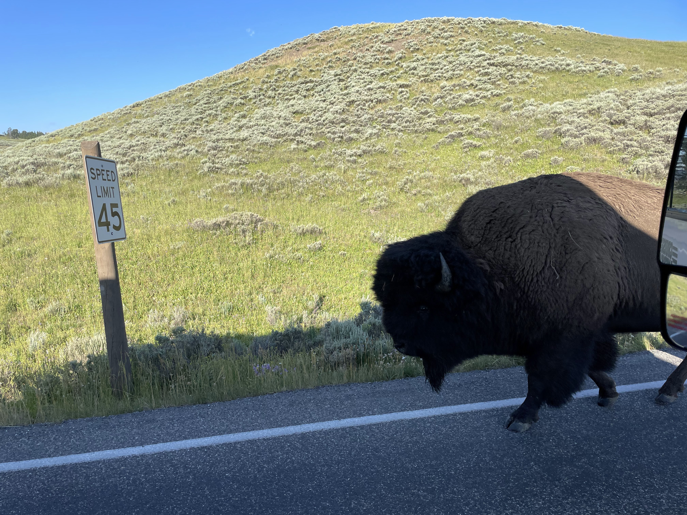

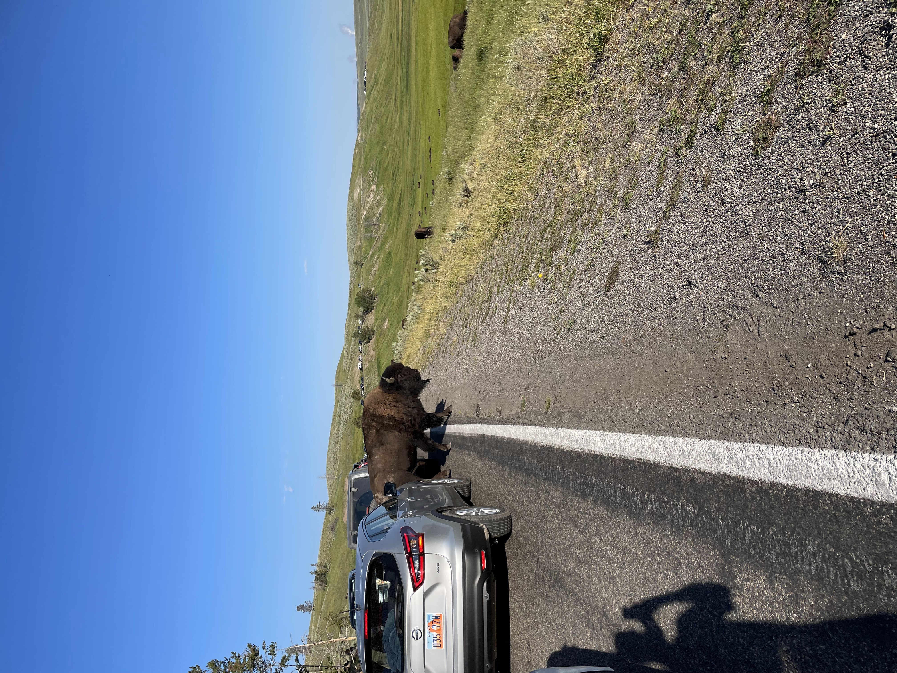

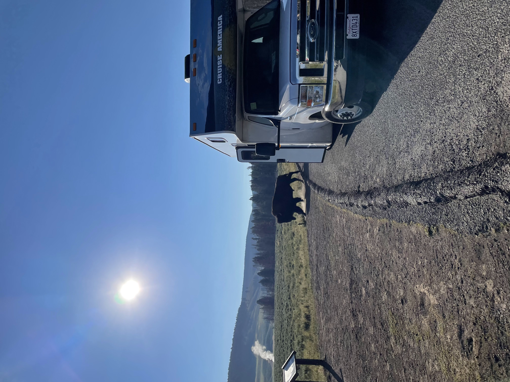

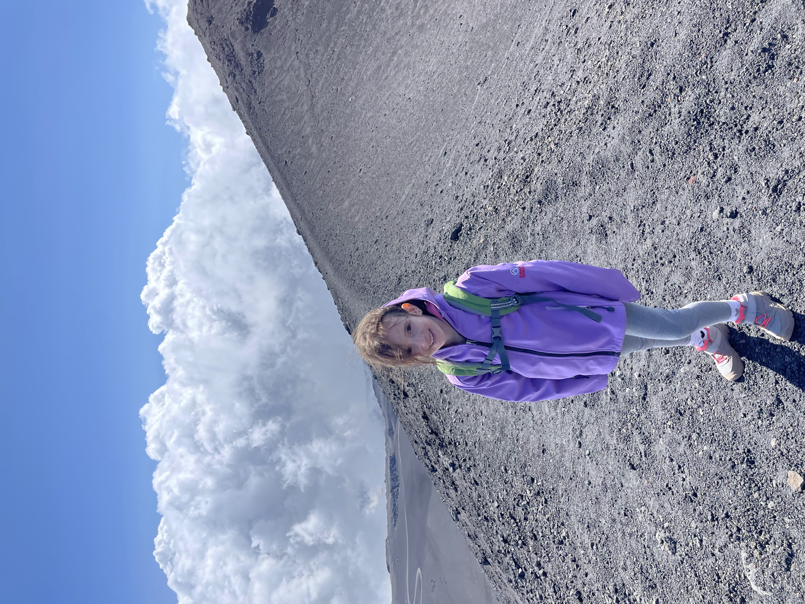

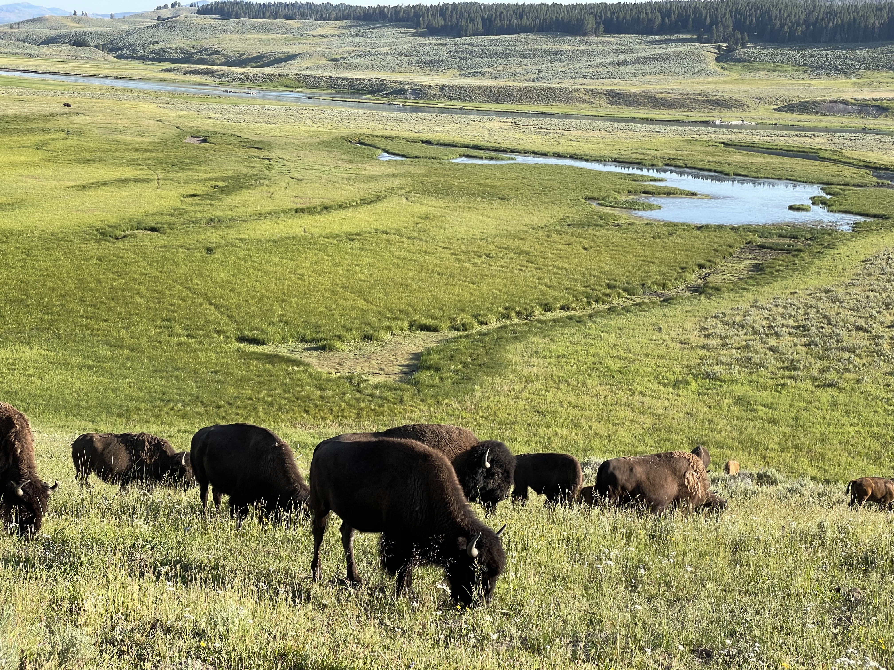

הילדים היו עם אדרנלין בשמיים, צחקו וצעקו עד השמים כמו שילדים יודעים. במקום חיפוש חיות עם משקפת כפי שדמיינו, קיבלנו חווית עדר ביזונים של ילוסטון שלא נשכח כל החיים. הביזונים הקיפו את הקראוון מכל עבר והמשיכו להם הלאה. היו זכרים, נקבות וגורים קטנים וחמודים. בהמשך הדרך, בפיגור אחרי השאר פגשנו ביזון ״מאסף״ ענק שהחליט לשחק איתי 

Chicken

 על הכביש ולהראות לכולם איזה ״גיבור על חלשים״ הוא. 

התכונות הפיזיות ה״מוגזמות״ של הביזון האמריקאי, יחד עם מזגו הנוטה לרגוז, מנעו את ביותם של הביזונים בצפון אמריקה. הדבר לא מפריע בכל שנה למטיילם להתעלם מההנחיות, להציק לביזונים המסוכנים ולעיתים גם להענש ברמיסה.

 

<iframe allowfullscreen="" class="BLOG_video_class" height="422" src="https://www.youtube.com/embed/sUfa2-dRNkY" width="508" youtube-src-id="sUfa2-dRNkY"></iframe>

משחק מוחות ביזוני

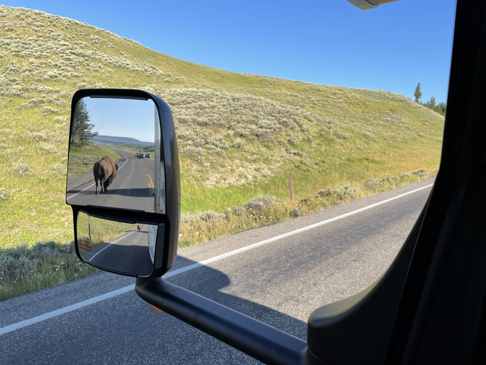

משם המשכנו לכיוון ״הקניון הגדול״ של ילוסטון לחניון הצמוד לנקודת התצפית Artist Point

.

 עשינו את המסלול <a href="https://www.alltrails.com/trail/us/wyoming/point-sublime-trail?u=m" target="_blank">מArtist Point ל Point Sublime</a>. 

המסלול החביב עוקב אחר הגדה הדרומית של העמק ומשקיף אל ״נהר ילוסטון״ הזורם בו בפראות. רוב המטיילים האמריקאים בפארקים הגדולים, מגעים לנקודת התצפית ובדרך כלל לא ממשיכים למסלולי ההליכה. מה שאומר שלמרות שיא העונה, ברגע שמתחילים להתרחק מהחניונים שממוקמים על נקודות התצפית, נשארים כמעט לבד (על אחת כמה וכמה אם מקפידים לקום מוקדם). נקודת התצפית על ״המפלים התחתונים״ (The lower falls of yellowstone) היתה מרהיבה, אך לצערי המפל היה קצת מקולקל ונאלצתי להוציא אותו מהגוף כמה שיותר מהר.

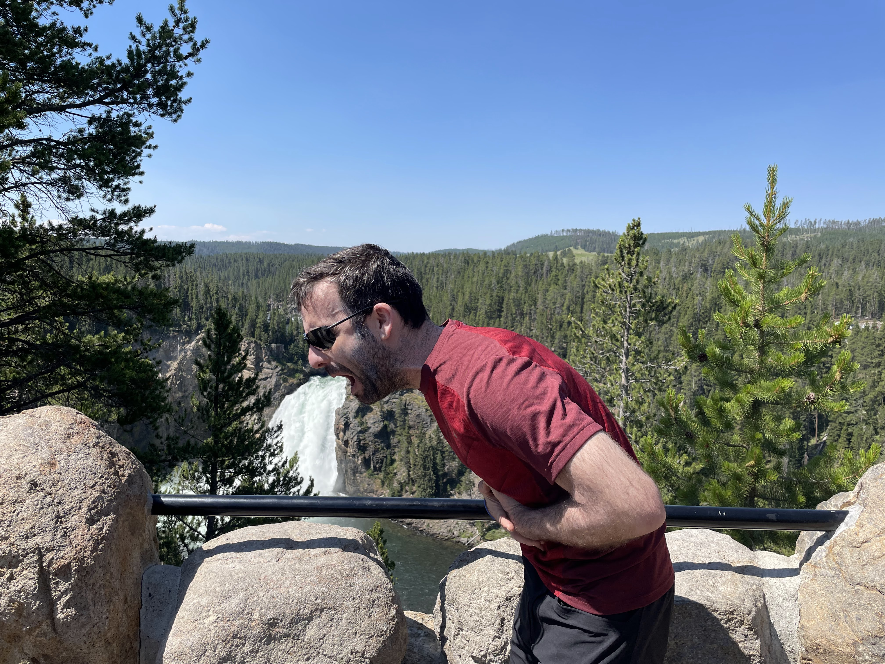

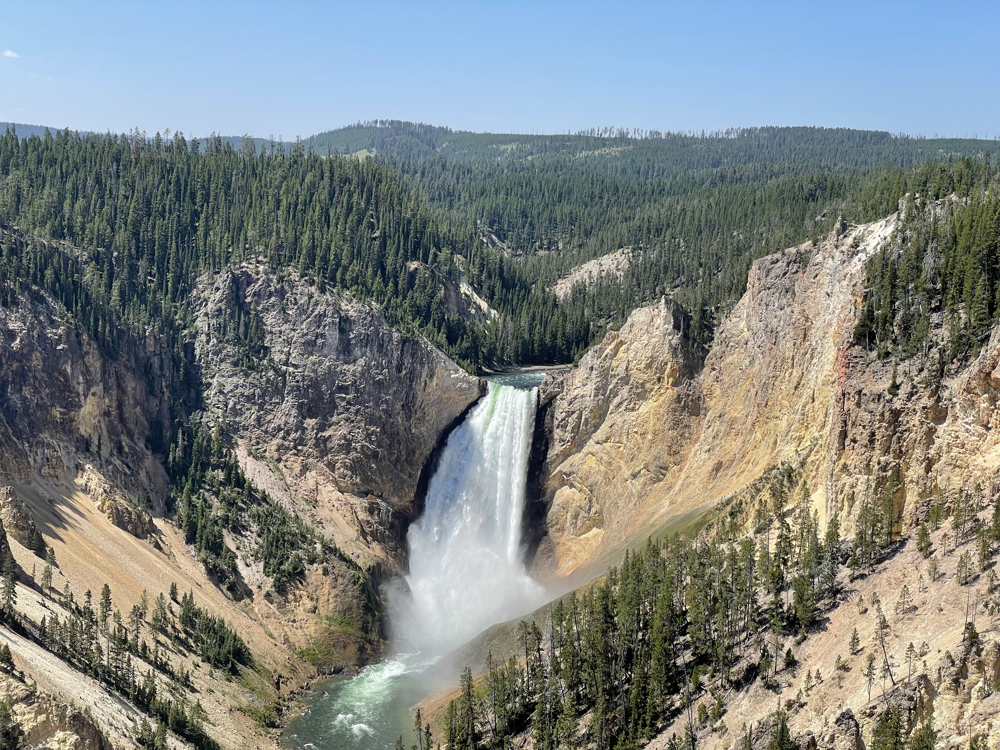

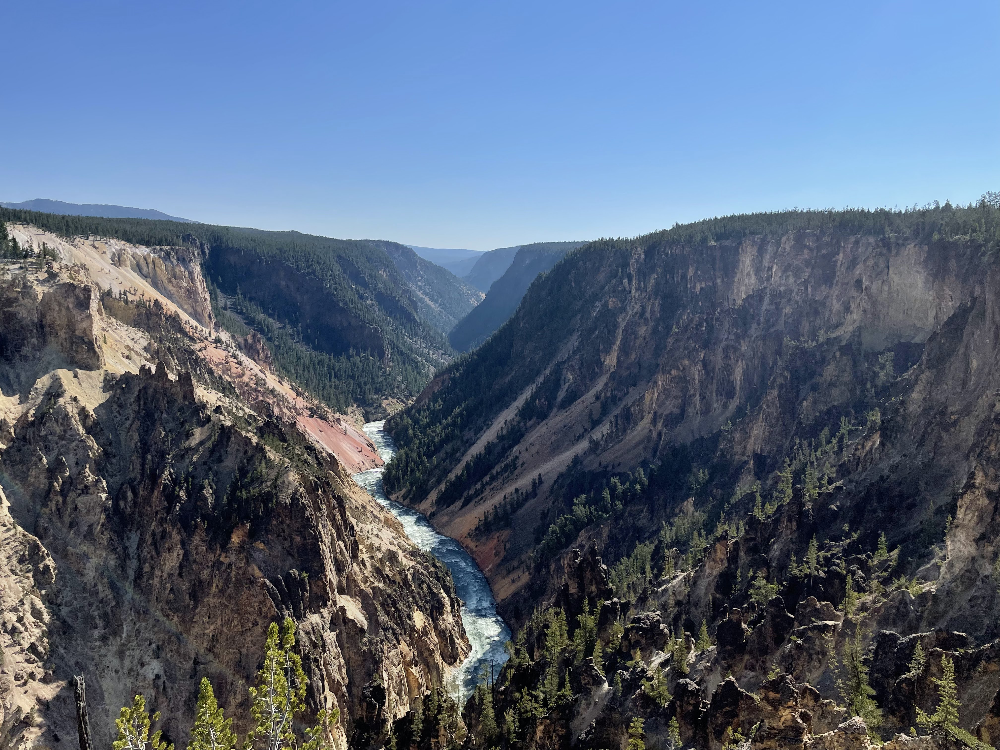

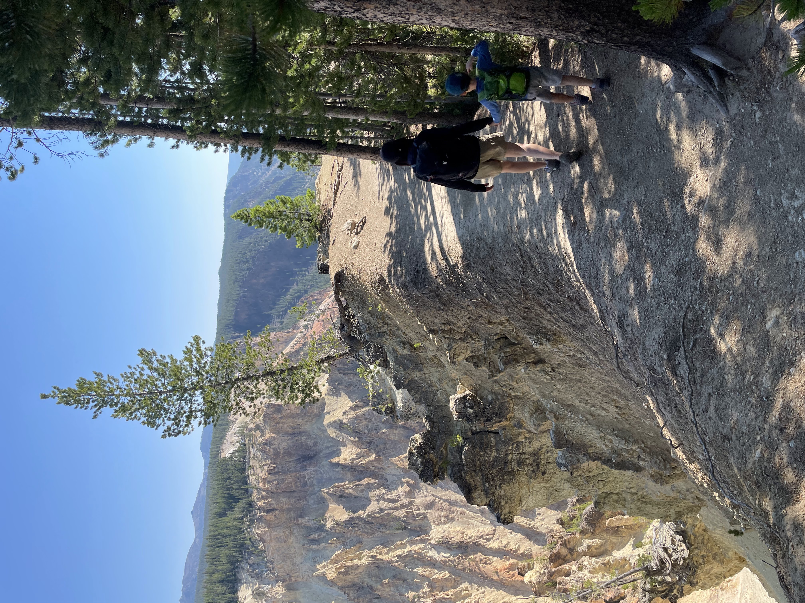

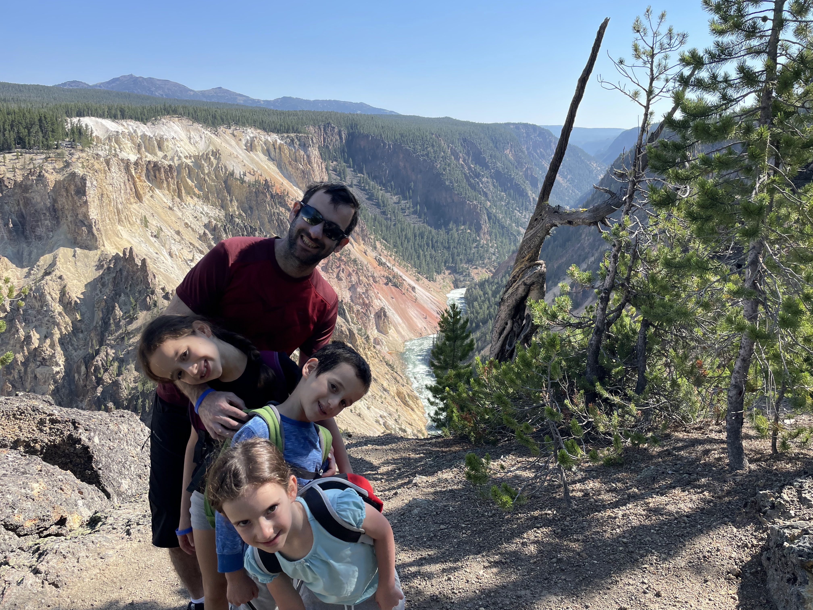

 

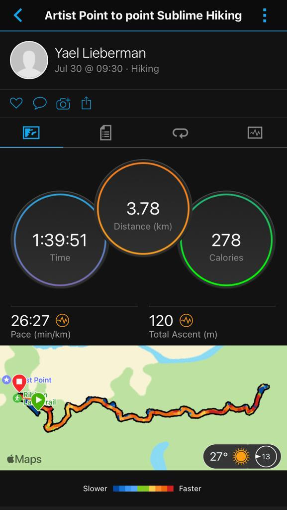

 

אחרי שהוצאתי את המפל מהמערכת, שאר המסלול היה יפה מאד. חזרנו לרכב והתחלנו את הנסיעה דרך 

העמק בחזרה לאתר הקמפינג. בדרך עשינו עצירת פיקניק צהריים קטנה בקראוון ליד אחד הנחלים ואלכס הצליחה לזהות שועל שובב שחומק לו בין העשבים מחפש אווז לטרוף (אלכס כמובן אמרה - הנה חתול משונה!). פיט, הרציני שבחבורה, מיד עדכן את ״רשימת החיות בהן פיט פגש בטיול״. מידי פעם הוא משנן אותה לעצמו ומסדר אותה בראשו (ניכר כי הגנים של הנמלה הצליחו להתבטא אצל פיט באופן חסר שליטה). משם המשכנו למסלולון קצר ב-ב

Mud volcano. ״הר הגעש הבוצי״ קיבל את שמו מפני שכאשר נתגלה לראשונה במאה הקודמת, היה עדיין הר געש פעיל וגדול. מאז הר הגעש התפוצץ וכעת האיזור מתהדר בתואר המפוקפק שלהיותו ״הבריכה הגיאו-תרמית הכי חומצית בילוסטון״. האטרקציה האמיתית סביב בור הבוץ המבעבע (שהיה מרשים אלמלא כל התופעות הדומות בהן כבר חזינו פה), היתה הפתעה 

בצורת ביזון עב בשר שהתחמם לו ונהנה מריח הביצה הסרוחה... למרות כל מפגשי הביזונים, לראות ביזון זה מרגש בכל פעם, החיה העצומה היא ממש לא משהו שמתרגלים אליו בקלות.

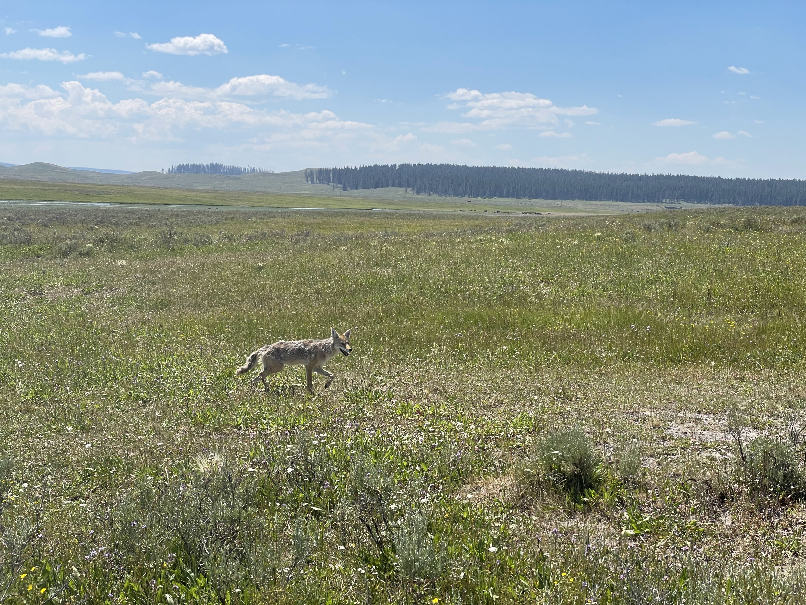

 

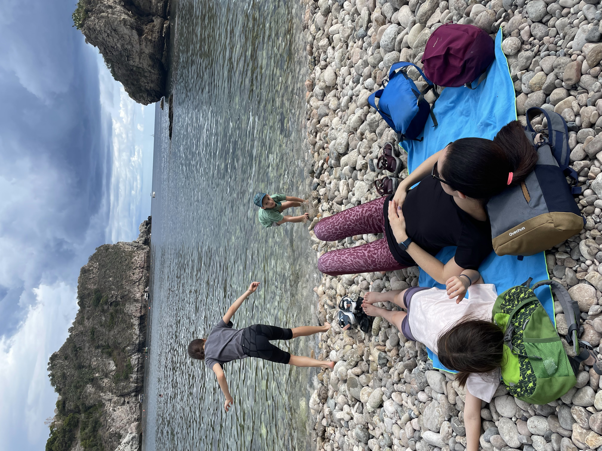ביזון בתור לספא בוץ

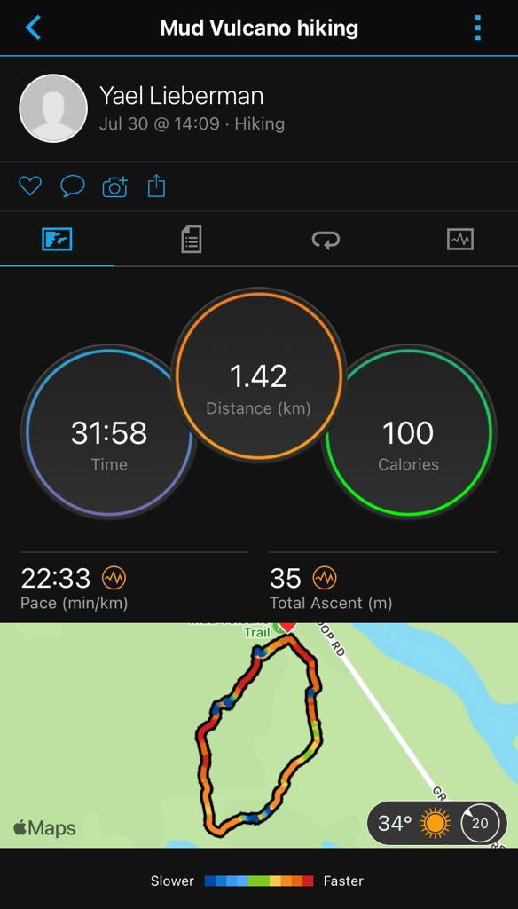

סטטיסטיקת מסלול mud volcano

חזרנו מוקדם יחסית ללילה השלישי והאחרון שלנו ב 

Fishing Bridge Campground

. ניצלנו את הערב להמשך משחקים בטבע, קריאה, משחק ״טאבו״ משפחתי והטמנת ״מטמון״! מכיוון שאחותי ומשפחתה מתכננים לישון באותו חניון לילה, החלטנו להטמין להם מכתב. להלן ההוראות המדוייקות למציאת האוצר:

 

 

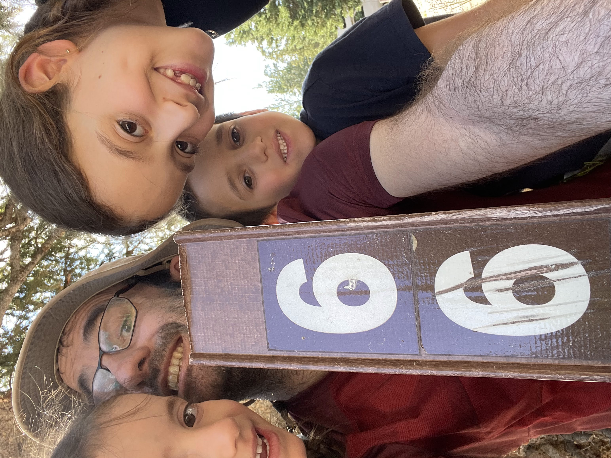

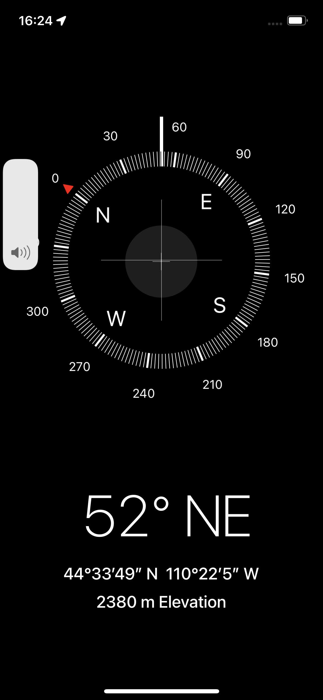

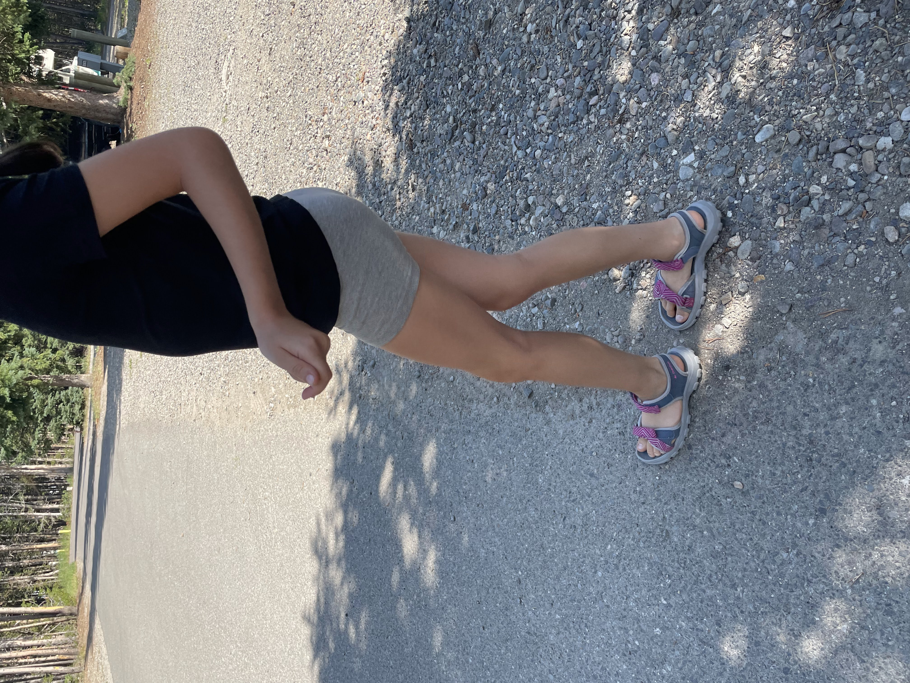

מכאן - חפשו את המטמון! 

נפרדנו מהמחנה, אך המוחות הקטנים של הפרחחים המשיכו לעכל את חוויות היום. בבוקר אלכס סיפרה לנו בצחקוקים שבאמצע הלילה התעוררה בבהלה מסיוט - ביזון רדף אחרי פיט בVisitor Center של השמורה, אלכס עזרה לו להתחמק, ואז כשסגרה מאחוריה את הדלת, עמד מולה הביזון האדיר, פתח את הפה ו.. טרף אותה - ״ואז.. התעוררתי, עשיתי פיפי וחזרתי לישון. חי חי חי...״. מזל שהייתה זאת דווקא ה״מתוקית״, ולא אחד מהילדים האמיתיים - אחרת עוד היו מעירים אותנו בלילה בבהלה 😁 

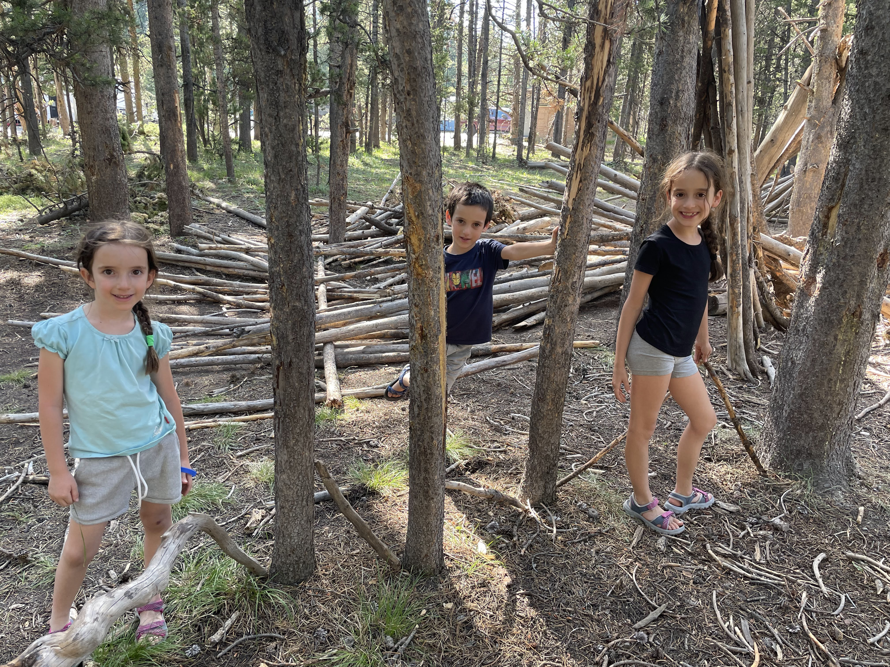

 

לא לפני ״טקס ייבוש הכלים היומי״ בניצוחה של הנמלה
