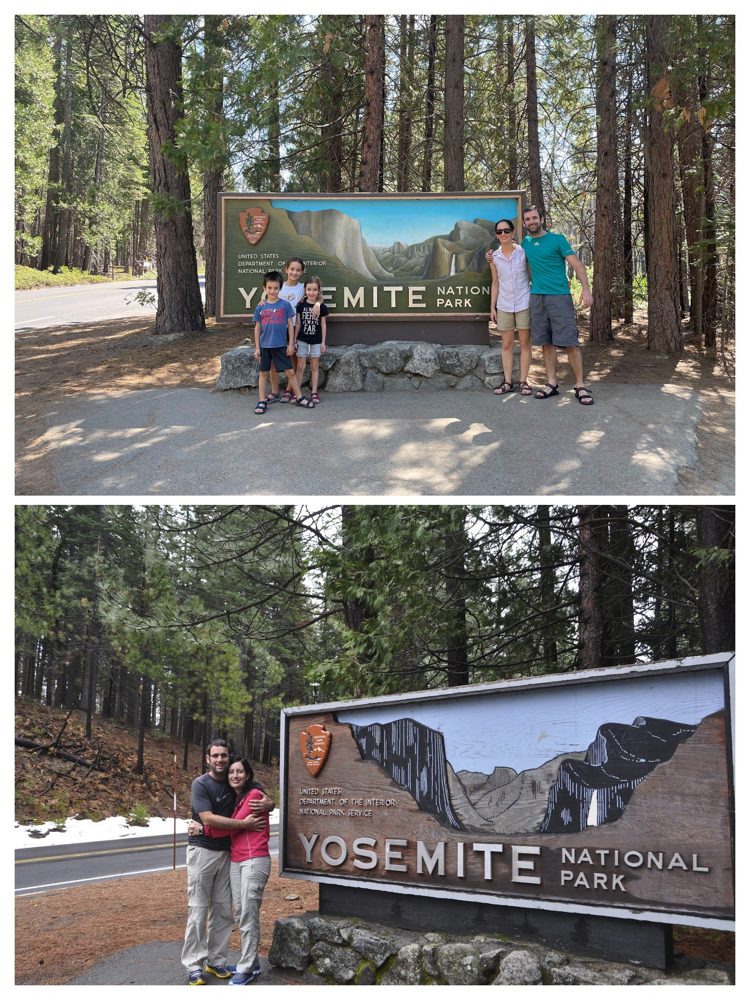

היום התמקדנו בYosemite Valley. העמק של יוסמיטי מתוייר יותר משכנו Tioga pass בו טיילנו אתמול, אך לפחות שנת הלימודים בקליפורניה החלה כך שבטוח יהיו פחות מטיילים אמריקאים. בכל מקרה, לא השארנו מקום למזל והשקמנו קום למסלול המאתגר האחרון במסע שלנו. אחרי עוד יומיים ביוסמיטי יסתיים ״פרק הטבע״ שלנו במסע(!) נחזיר את הקראוון ונקנח את המסע בטעימה עירונית קצרה.

המסלול שהרכיבה לנו הנמלה היה מושלם: התחלנו בהליכה בMist trail, עלינו עד לראש מפל Vernal ומשם המשכנו לClark Point וחזרה דרך John Muir Trail.  

לקחנו את האוטובוס (yarts) לתוך השמורה ומיד התחלנו בהליכה. על אף השעה המוקדמת, בחלק הראשון של ההליכה עד לתצפית על הVernal Falls הלכו בשביל לא מעט מטיילים, אך ברגע שהתחלנו בטיפוס לכיוון המפל עצמו, היינו די לבדנו עם הנופים המרהיבים. הילדים הפגינו כושר טיולים מרשים ו״תפרנו״ את הדרך למפל די בקלות. הנופים הדרמאטיים ביוסמיטי מצדיקים כל מאמץ. בחלק האחרון של הטיפוס נגלה בפנינו המפל המרהיב. על אף שאנו מטיילום ב״עונה היבשה״ והזרימה במפל לא מאד חזקה, הגובה עם כל הצוקים מסביב יוצר תחושה עוצמתית.

אך כדי לכבוש את המפל לחלוטין, המשכנו לטפס על לראשו. הטיפוס היה תלול והנופים המשיכו להיות מרהיבים. מיד בתום כיבוש המפל, שכשכנו רגליים במים ונפרדנו מהם לפני שהם זרמו הישר למלכודת המפל ולצלילה מטה מהצוק. 

  

משם המשכנו לטפס לכיוון Clack point. הטיפוס איפשר גישה לנקודות תצפית נוספות ללא מעקה על סף התהום. בתצפית אחת ממש לא הצלחתי להתקרב, הרגשתי איך הרגליים הופכות לג׳לי. ללא ספק אחד המסלולים היפים של הטיול. משם המשכנו לכיוון ה״כפר האינדיאני״ שם הטמינו עבורינו משפחת נעמן אוצר קסום. הלכנו וחפרנו לפי מפת האוצר שקיבלו, אך שודדי אוצרות אינדיאנים ארורים בזזו את האוצר!

במקום לפצוח בשירת ההמנון הברברי ״שישרף לכם הכפר״, התמקדנו בחיובי והלכנו להעביר את הילדים הסמכת ״ריינג׳רים צעירים״ אצל הריינג׳רית התורנית. ביוסמיטי החלטנו שהפעם נבצע את כל המטלות הכרוכות בקבלת הסיכה הנכספת, והגענו מוכנים לריינג׳רית רגע לפני שהאוטובוס עזב. הריינג׳רית לא רצתה שאתרגם להם את השבועה, כך שמה שנשאר להם לעשות זה לחזור אחריה בחיקוי פונטי מרשים בסופו קיבלו את הסיכות ביושר. חזרנו באוטובוס לנוח מהיום המעייף בחניון הלילה והמשכנו להקפיד על ארוחות הערב בסגנון אמריקאי.

למחרת נסענו לכיוון Mariposa Grove כדי לחזות בפלאי הטבע הם כמובן הסקויה המפורסמים. למרות שכבר ביקרנו בחלק הזה של השמורה [בטיול הגדול שלנו מסביב לעולם](https://shpandrak.blogspot.com/2012/04/blog-post.html), חשבנו שהילדים יתלהבו מהעצים, ואכן כך היה. עצרנו בכל השלטים ולמדנו על עצי הסקויה הפלאיים. העצים בני מאות השנים היו כאן לפנינו וימשיכו להתקיים גם אחרינו - אם רק נניח להם. בנסיון להגן על השמורה, במאה הקודמת האמריקאים הקפידו לכבות את כל השריפות לפני שהן התחילו - כדי לשמור על העצים העצומים. עם השנים התברר שהעצים חייבים שריפות פעם בכמה שנים כדי להתקיים! הזרעים שלהם נפתחים בטמפרטורות מאד גבוהות, ורק ככה העצים יכולים להתרבות. בנוסף, השריפות משמידות את כל ה״מתחרים״ של העצים, כך שעמידותם באש מאפשרת להם לגדול לבדם ולפתח בעלות על הנוטריינטים שבקרקע. 

בדרך החוצה מהשמורה, דווקא כשכבר הפסקנו לחפש, סוף סוף הגיע הזמן שלנו לראות דוב! באמצע הכביש עצר רכב מולנו. כשהאטנו, לחש לנו מטייל צרפתי במבטא כבד - יש פה דוב! מיד עצרנו ויצאנו לחפש. הדוב השחור הביט בנו, לא התרשם במיוחד וחזר לתוך מעבה היער. התחלנו לנסוע לקול צפצופי הרכבים מאחורינו מרוצים למדי


*הדב ״שלנו״*

אחרי המפגש הדובי המרגש עצרנו פעם אחרונה בטבע להפרד מיוסמיטי, לאכול צהרים ולהשתולל קצת במים. פרק הטבע שלנו בטיול תם. מכאן נמשיך לכמה ימים בקליפורניה ומשם חזרה לישראל. יוסמיטי בהחלט נותן תחרות טובה לפארקים האחרים בתור הפארק יפה ביותר. להתראות יוסמיטי - נפגש בפעם הבאה...

הלילה לנו ב[Yoemite Pines RV Resort](https://yosemitepinesrv.com/) לקראת נסיעה מערבה למחרת בבוקר. המקום היה יפה ומרווח והיתה בו  פינת חי שהילדים מאד אהבו. במשך שעה ארוכה עשו הילדים פרצופים ״מי צוחק ראשון״ עם למה מדובללת. 

המשך יבוא... אני מקווה לפחות. אנחנו כבר בארץ ולא קל לכתוב בדיעבד...
