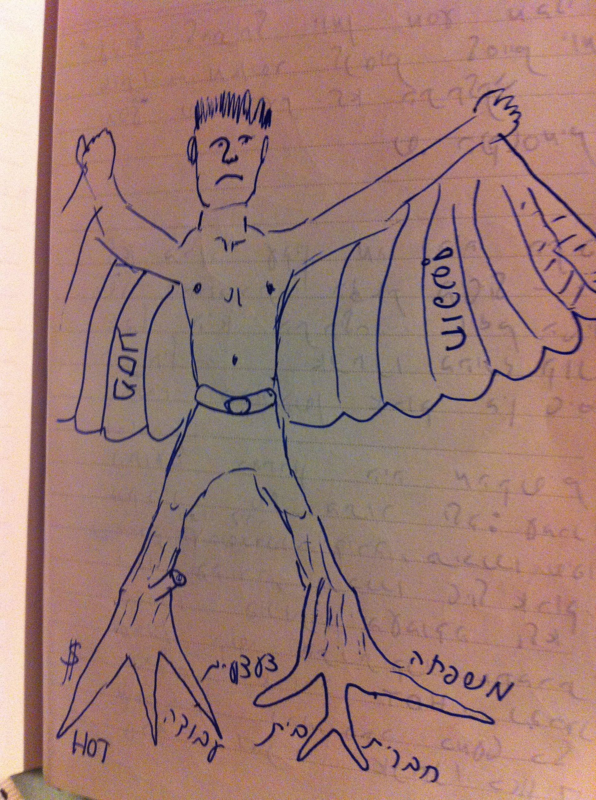
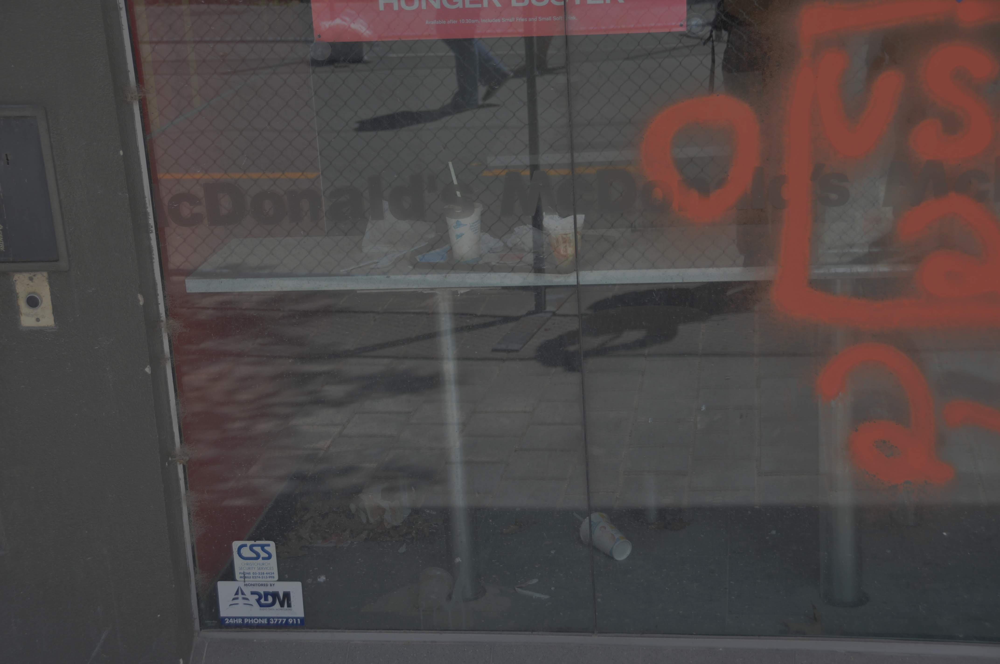
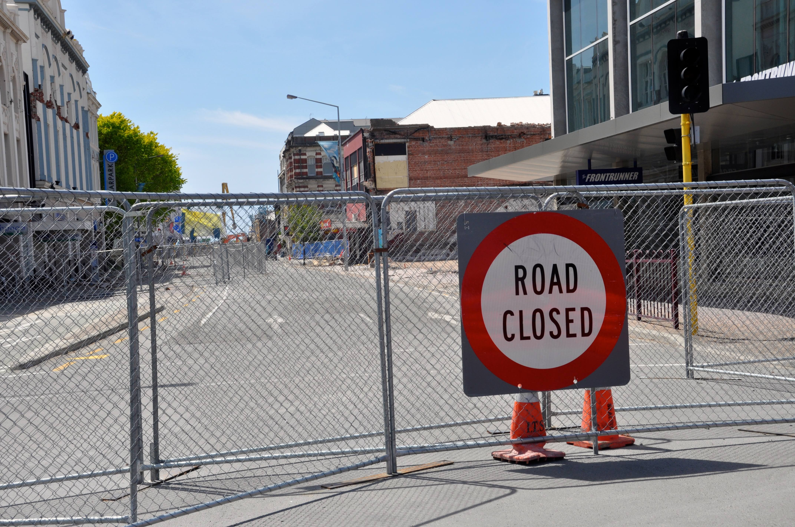
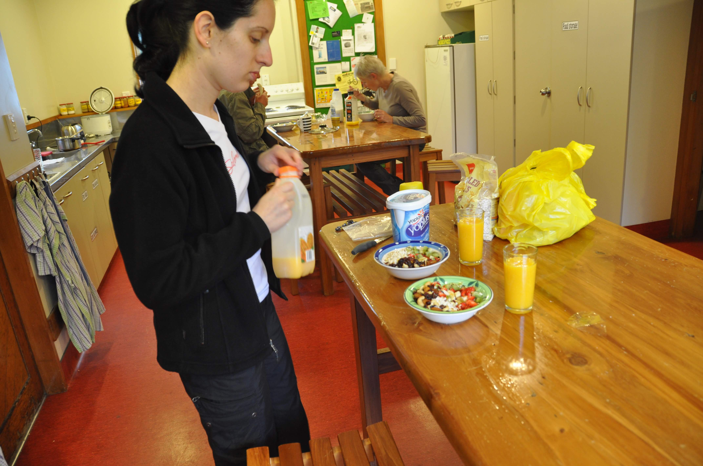
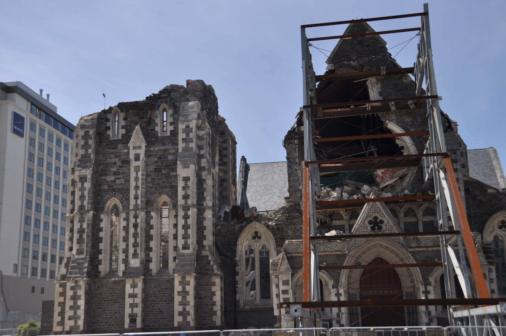

נחתנו בקרייסצ׳רצ׳ - עדיין בשוק מסאגת הטיסות הכל-כך ארוכות. החודשים האחרונים היו קשים אך יעילים - קרוב לודאי התקופה העמוסה ביותר בקריירה הארוכה שלי בתור ילד: עברנו דירה, קנינו דירה, תיכננו שיפוץ בדירה והשכרנו דירה.. תכננו את הטיול, עשינו "משתי פרידה" מחברים ומשפחה סגרנו פינות בעבודה והכי מסובך - התנתקנו לצמיתות מחברת הכבלים הארורה hot... אנחנו לא באמת חופשיים כפי שהיינו רוצים לחשוב - בכלל לא פשוט לקום ולעזוב הכל...

קרייסצ׳רץ׳ סבלה מרעידת אדמה רצינית שהשמידה כמעט לחלוטין את מרכז העיר. הדיוק של הנזק מעורר סימני שאלה - דווקא המרכז נהרס - בדיוק סביב איזור הכנסיה המפורסמת - נראה קצת כמו עונש משמיים... בסוף השבוע פתחו באופן זמני את שערי מרכז העיר כך שמבקרים יוכלו לחזות במרכז ההרוס. אחד הדברים המזעזעים היה לראות סניף של מקדונלדס׳ סגור עם ארוחות נטושות ומגשים הפוכים על הרצפה עוד מאז...

אנחנו ישנו בהוסטל נחמד בשם Foley Towers.   עיקר מעשינו בקרייסצ׳רץ׳ היה לצאת מהשוק, להכין ארוחות בוקר של

 אלופים והכי חשוב - לקנות אוטו ולעוף משם...

[
[

