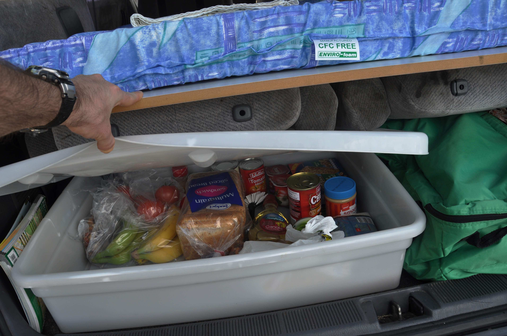
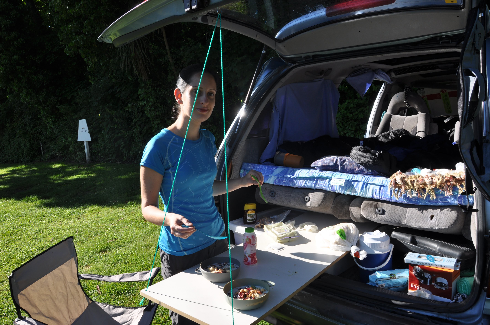
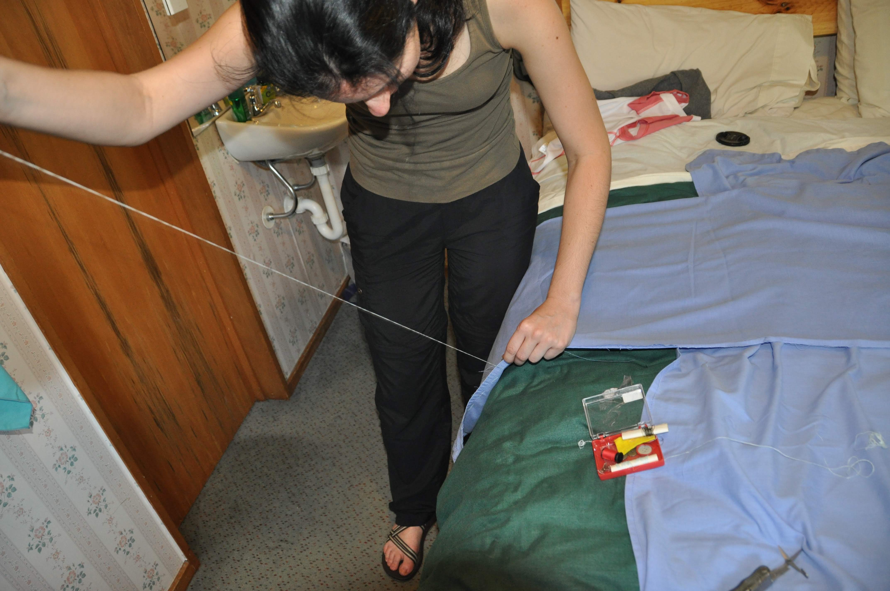

סוף סוף קנינו אוטו - Toyota estima משנת 93 (!) - כן... עוד בקושי היה אינטרנט אז - אבל כבר ידעו לבנות מכוניות :)  
התלבטנו אם לקנות רכב רגיל או ואן עם אפשרות לישון בו - לא ידענו איך זה יהיה. בסוף קנינו ואן שעברה הסבה לרכב טיולים. אחד מבעלי האכסנות כאן עושה קופה כשהוא קונה רכבים בזול, מסב אותם ל"רכב טיולים" ומוכר אותם בשיא עונת התיירות כשהביקוש בשיא.הרכב במצב טוב יחסית - מת'יו - הקיווי הקוקו שמכר לנו אותו הכניס לשם קרש עץ ועליו מזרן זוגי חדש - ועוד כל מיני שיפצורים מגניבים. תמיד נוכל לישון באכסניות - אבל שתהיה את האפשרות אם נראה איזה אגם שקוסם לנו - לישון לידו...זה כיף שיש את ההרגשה שאפשר להסתדר לבד - נגד העולם. את אחד הסדינים שקיבלנו עם הרכב גזרנו באמצע - יעל תפרה (ב"תפירת ילדים") ואני התקנתי וילונות (- ב"התקנת מקגייור"  :)עם האוטו קיבלנו גם גזיה - כיסאות פיקניק וכלי בישול. עשינו קניה בסופר ופוצצנו אות האוטו באוכל להמשך - יהיה כיף!

את השם לאקי - קיבל האוטו כי הוא שרד את רעידת האדמה - כל המכוניות לידו נהרסו ואילו לאקי - על אף הארובה שנפלה ושרטה אותו - שרד את האירוע. את שם המשפחה תומפסון - קיבל האוטו בלי שום סיבה מיוחדת - לא כל דבר צריך סיבה...

