היום ביקרנו בחצי האי בנקס. חצי האי הוא בעצם לוע של הר געש שהתפרץ לפני מיליוני שנים... עשינו כמה מסלולים רגליים קצרים ויפים. רק היום ראיתי יותר כבשים ממה שחשבתי שקיימות בעולם כולו! המשכנו לאקרואה - עיירה קטנטונת וחמודה במרכז חצי האי עם נמל, חנויות ומלא תיירים גמלאים..

ישנו באתר קמפינג מעולה באקרואה עם נוף יפה של הים. הלילה נישן לראשונה אצל לאקי תומפסון... באתר יש מטבח גדול לבישול, מקלחות נקיות ומסודרות - ומלא ברווזים שמסתובבים לך בין הרגליים... הטיול התחיל - נחתנו סוף סוף בגן העדן של ניו זילנד

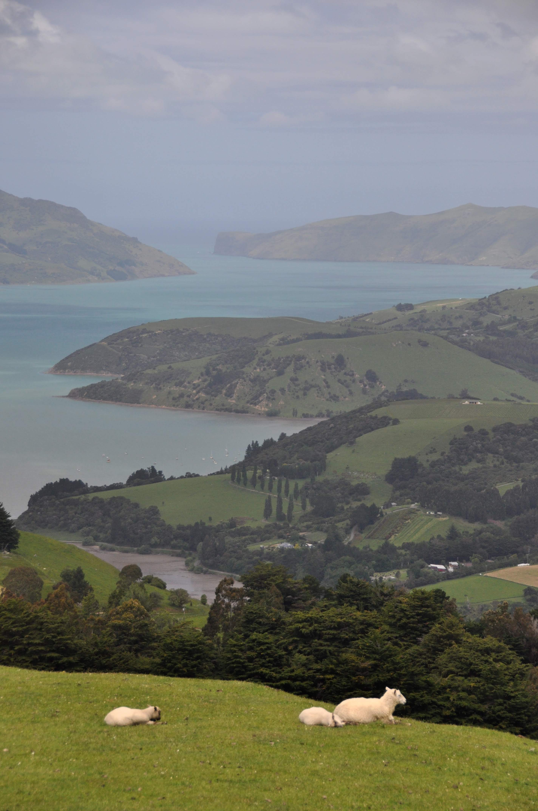

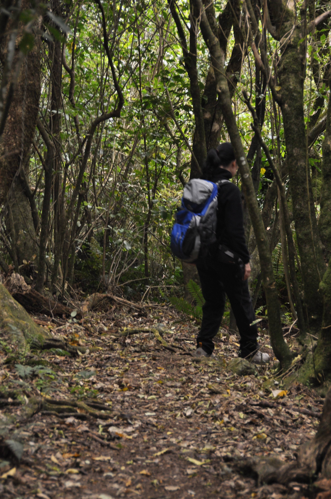

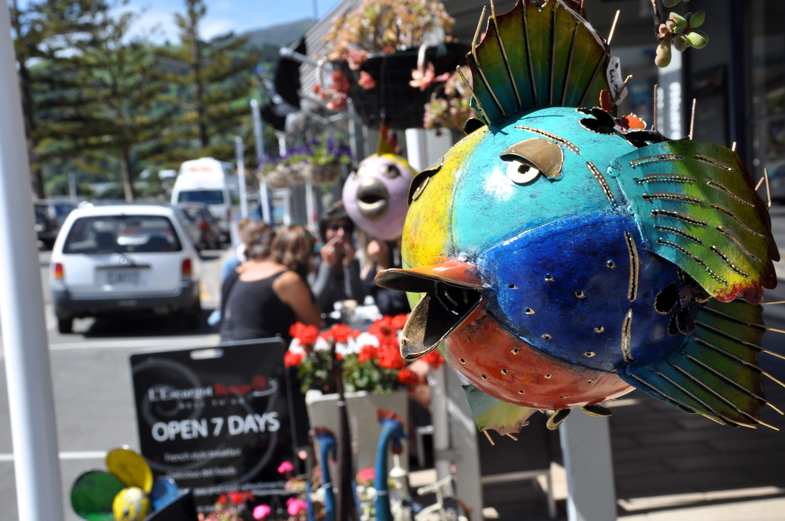

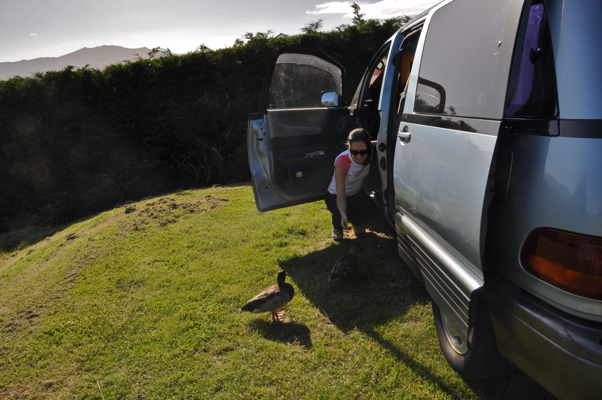

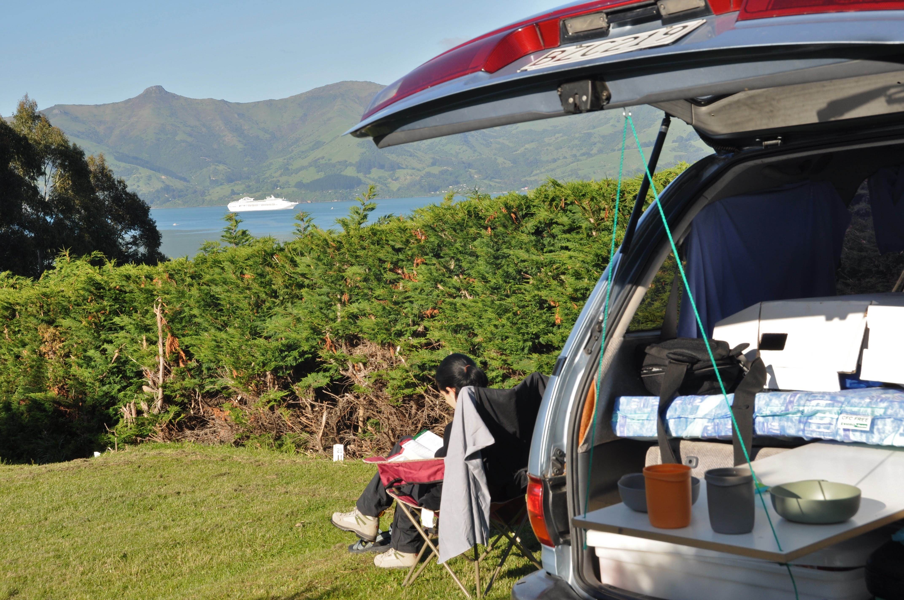

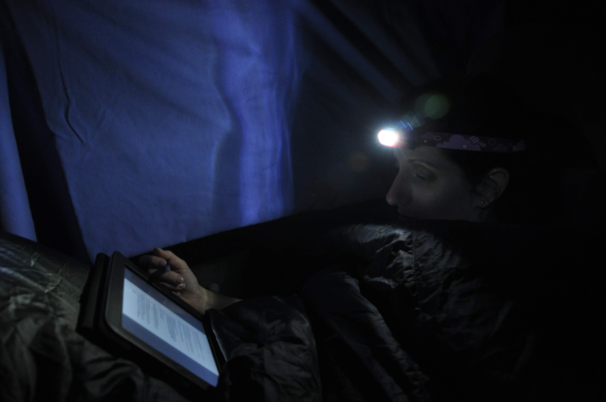

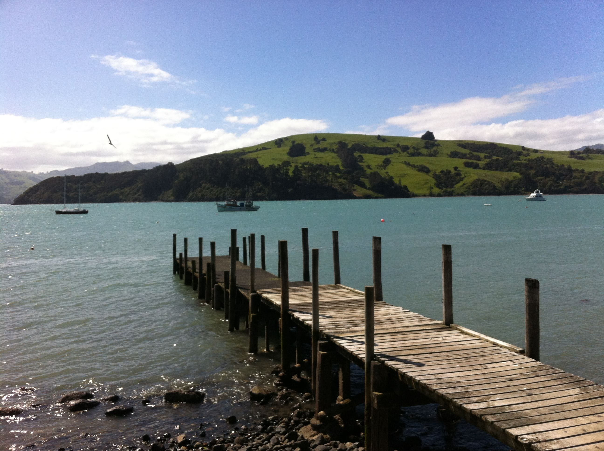

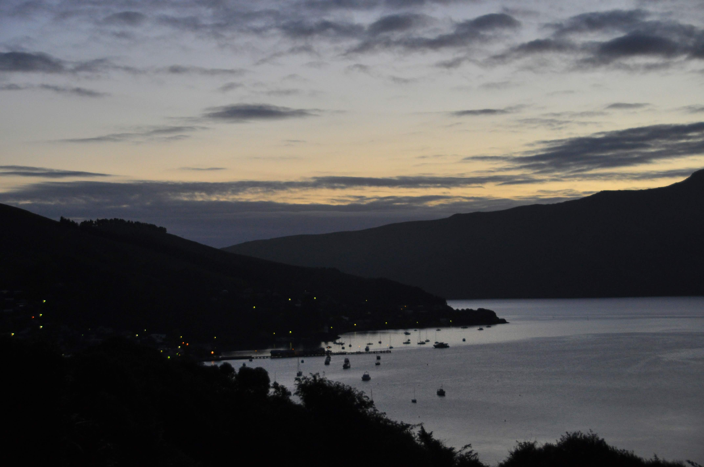

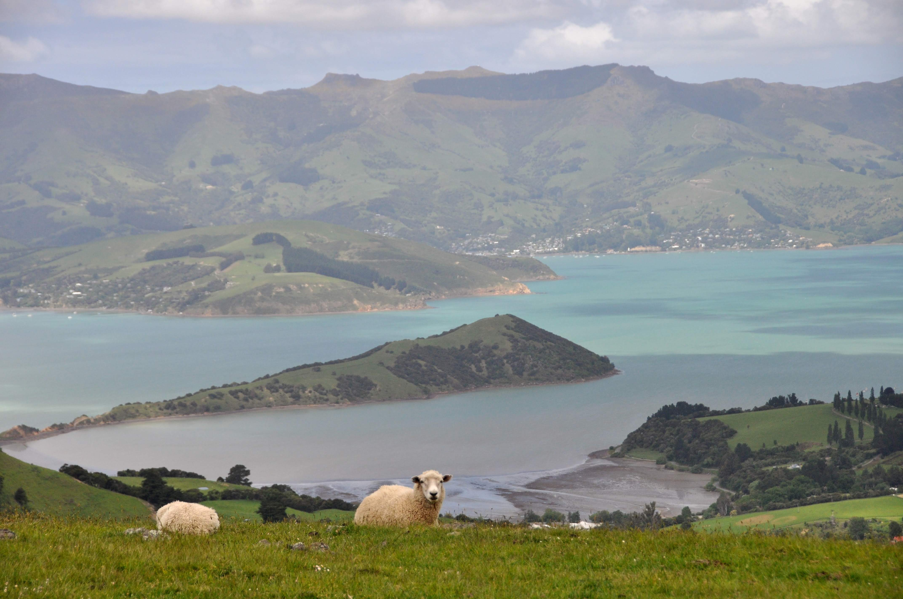
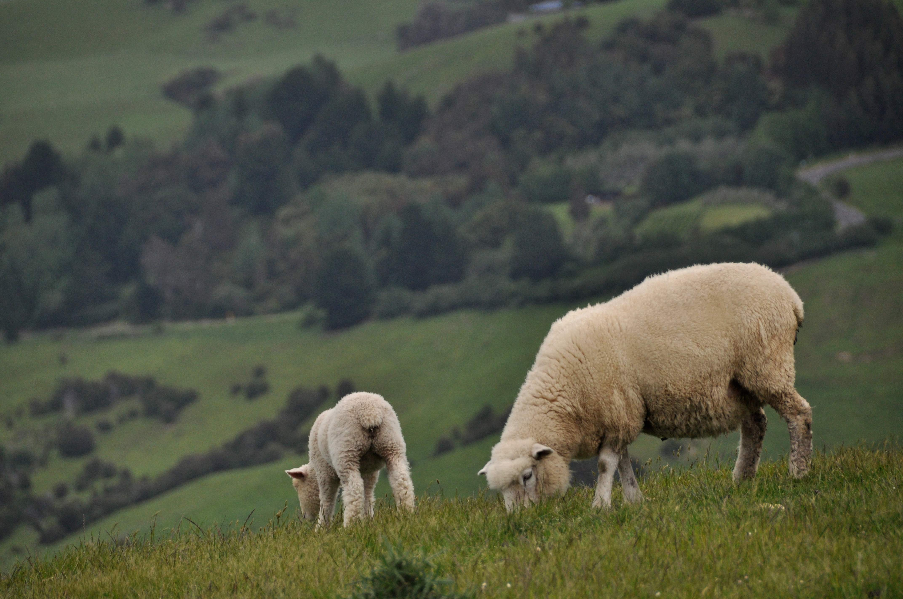
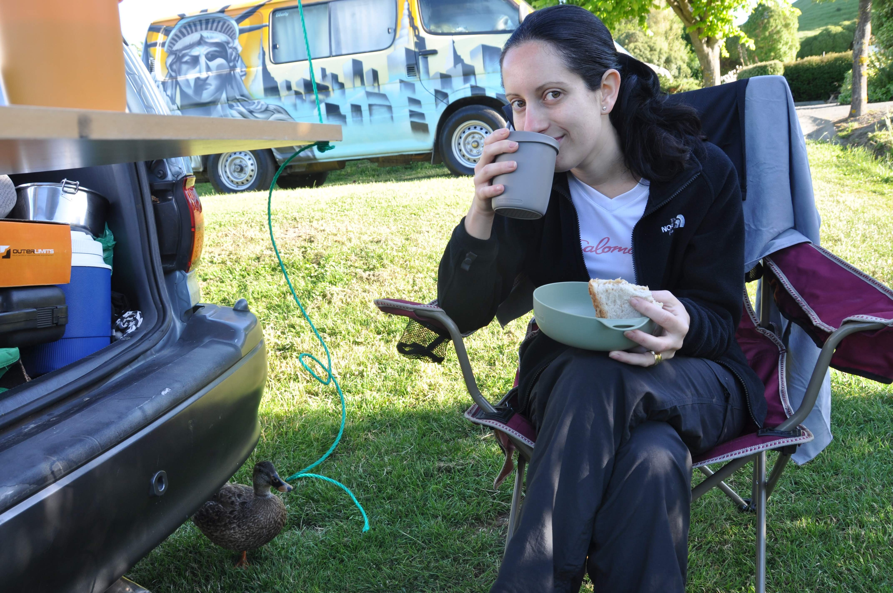