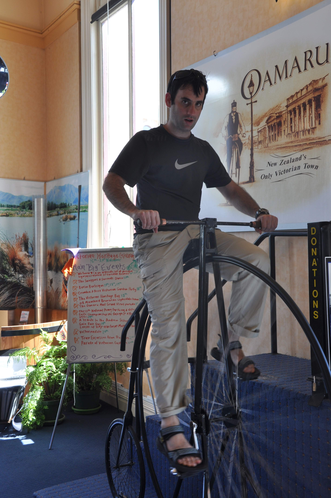
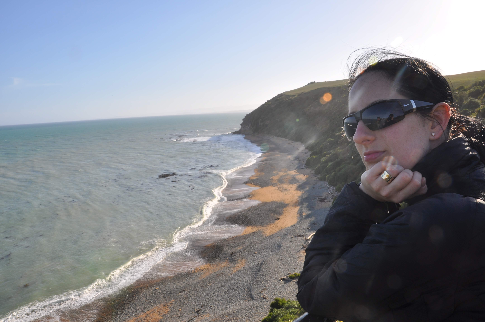
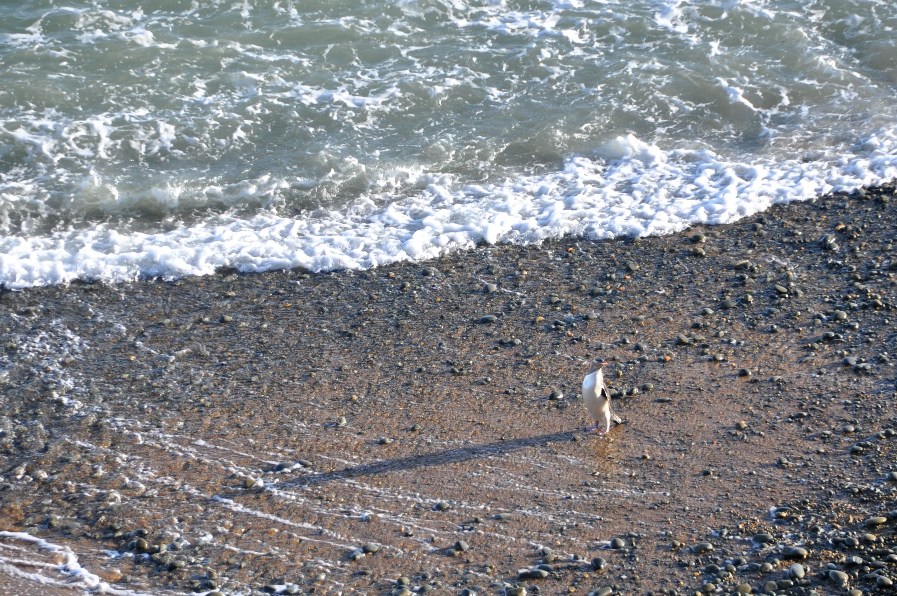
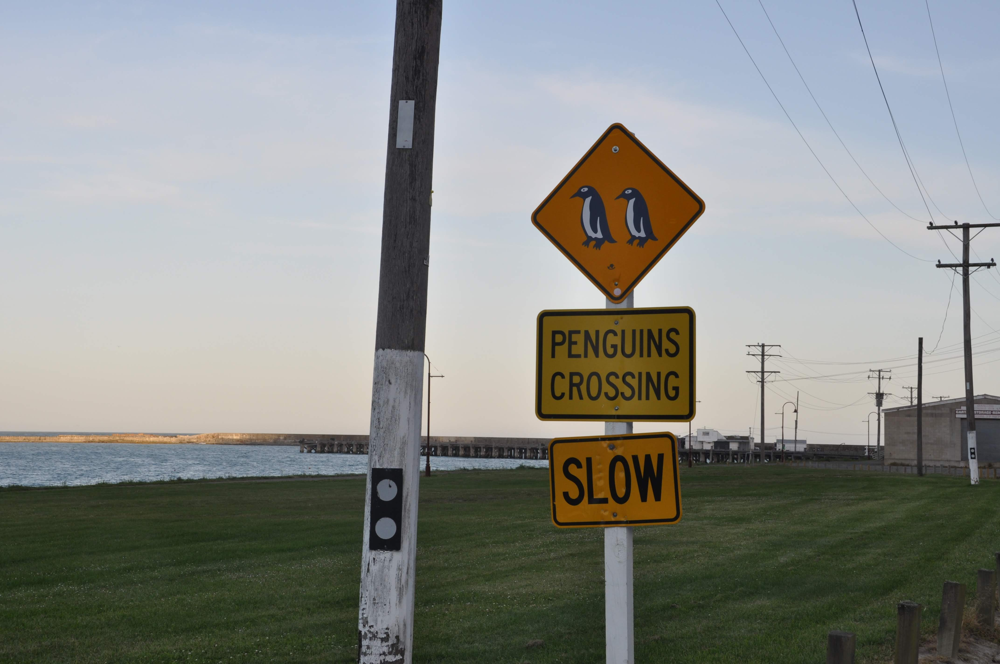
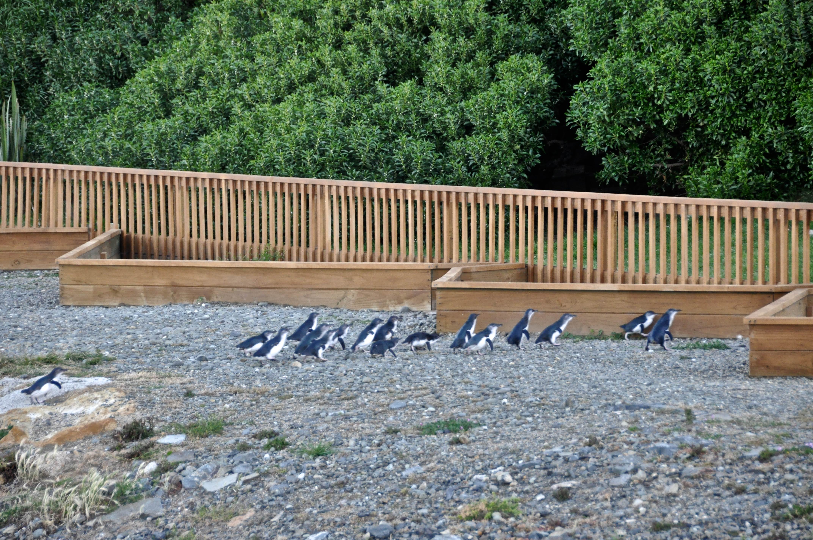
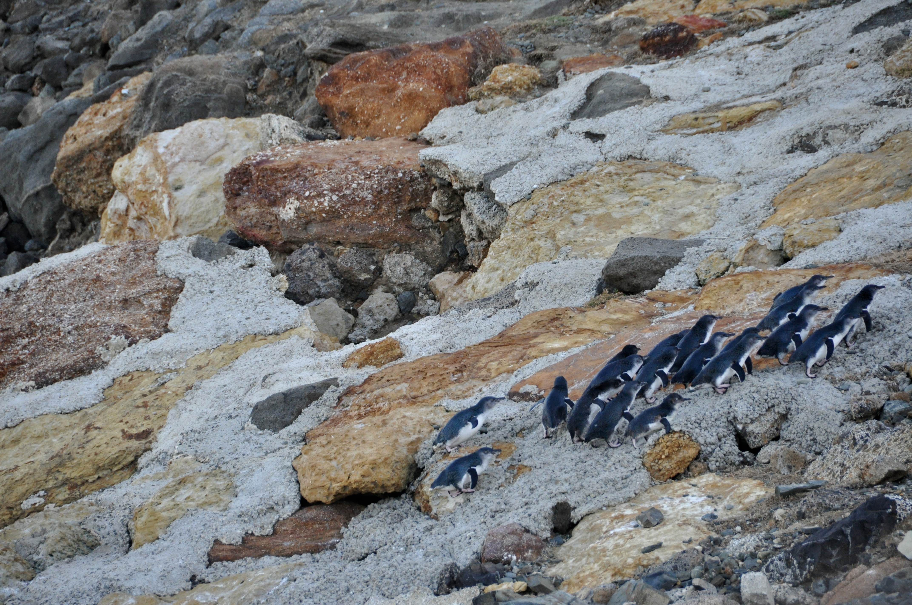
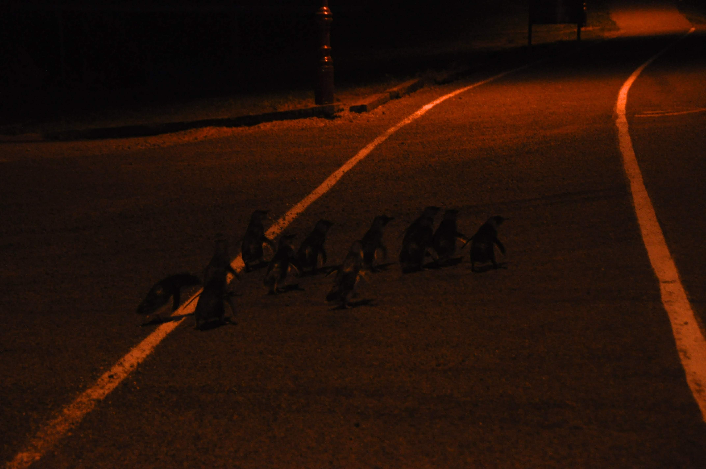

אומרו קיימת אך ורק בזכות שיש בקרבתה מושבת פינגווינים גדולה שתיירים באים לראות ולמרות שרוכבים שם על אופניים ליצניות.

בלשכת התיירות מעודכנות כל יום השעות בהן צפויים הפינגווינים לצאת מהמים על מנת להאכיל את צאצאייהם. קבענו דייט עם הפינגווינים ה״צהובים״ של 18:30 ואח״כ עם הפינגווינים הננסיים ה״כחולים״ של 20:30

שתי המושבות בתהליכי הכחדה. על מושבת הפינגווינים הכחולים (זאת שהכניסה אליה בתשלום) מגנים כאן בחרוף נפש - גדרות נגד טורפים, כיני דגירה מלאכותיים ומסלולי הכוונה לפינגווינים. בקיצור, למרות החשיבות של שימור הפינגווינים - יוצרים כאן זן של פינגווינים שלא ממש יודעים לשרוד בעצמם.

מה שכן - הפינגווינים הקטנים הללו פשוט מתוקים - הם מתקרבים לחוף בקבוצות ומתמודדים כקבוצה עם הגלים הגבוהים שמתנפצים על הסלעים - הם מחכים שתגיע קבוצה מספיק גדולה ואז מאגפים את הסלעים עד ש גל משיט/מרסק אותם על החוף. ממש אפשר לראות ולשמוע אותם מתייעצים - בוא מכאן פינגי - לא לא בוא משם קווה קווה :)

כשיצאנו בין האחרונים ממרכז המבקרים - חיכתה לנו חווית הפינגווינים האמיתית - מסביב לאוטו שלנו התקבצו פינגווינים פיצפונים והסתתרו מתחת לגלגלים - הפינגויינים המסכנים עוברים בחושך באיזור חניית מרכז המבקרים ועלולים להדרס. לנו יצא לראות אותם מקרוב ואף לגרש אותם ממתחת לאוטו :)

