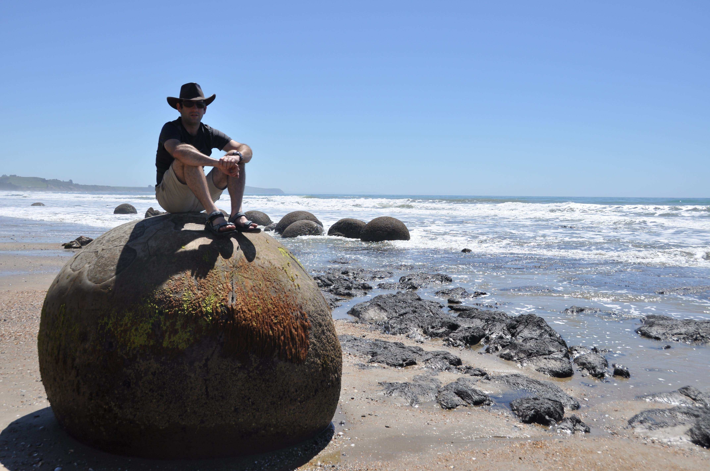
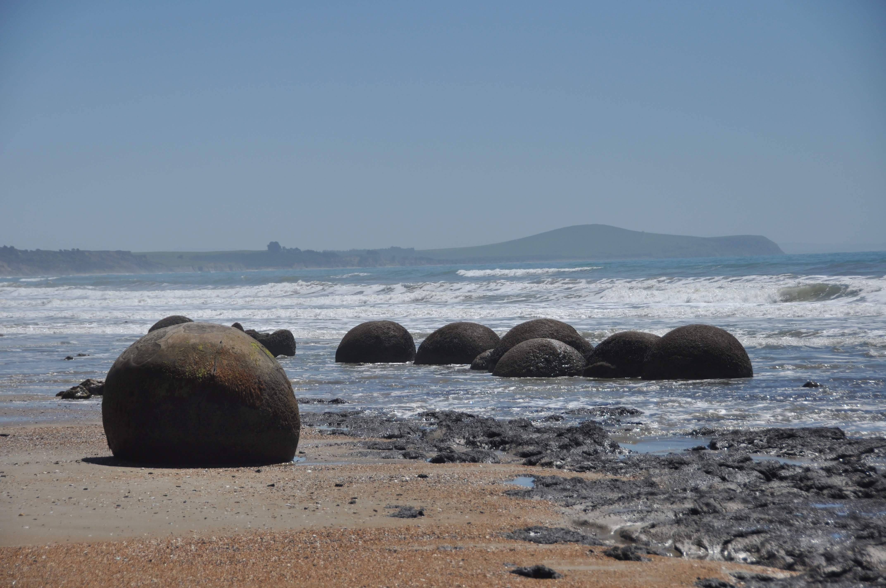
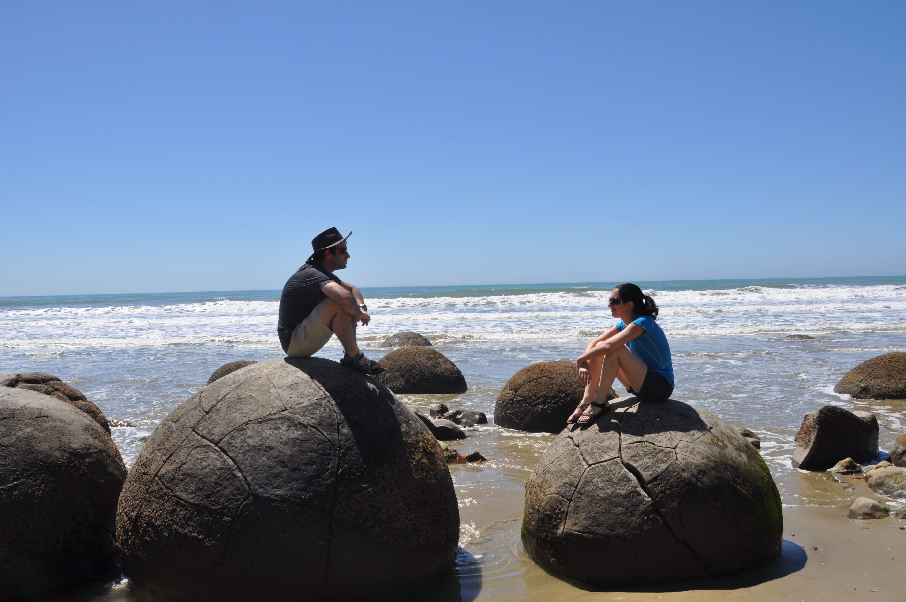
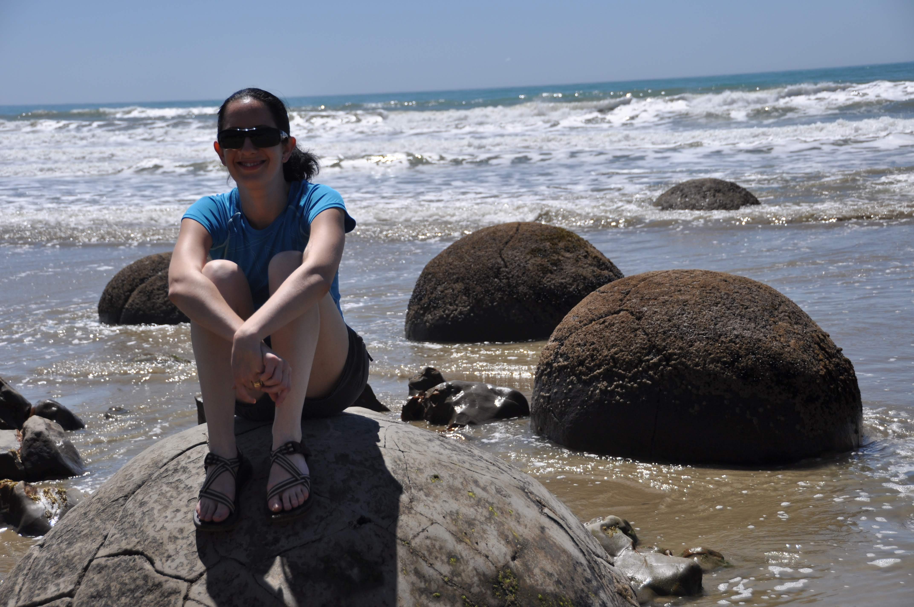
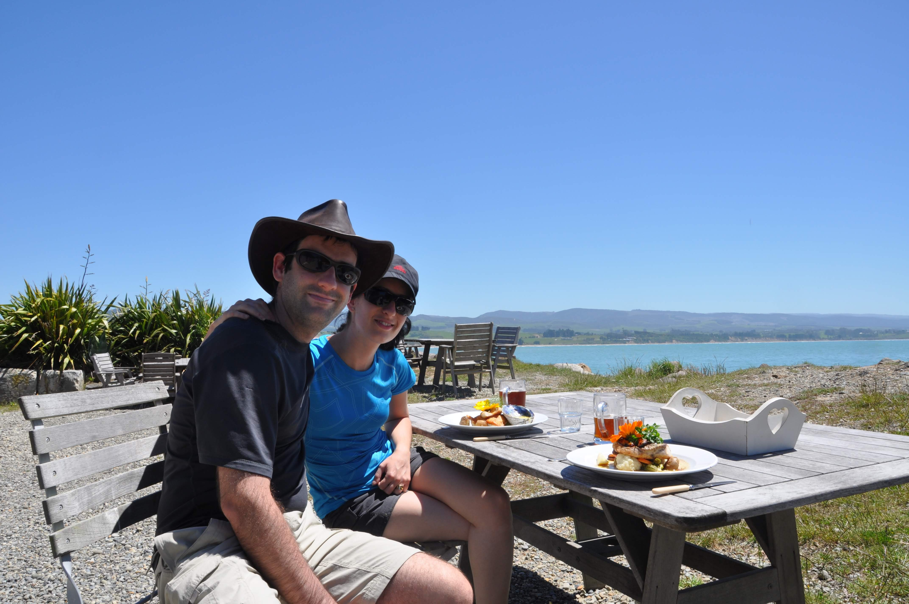
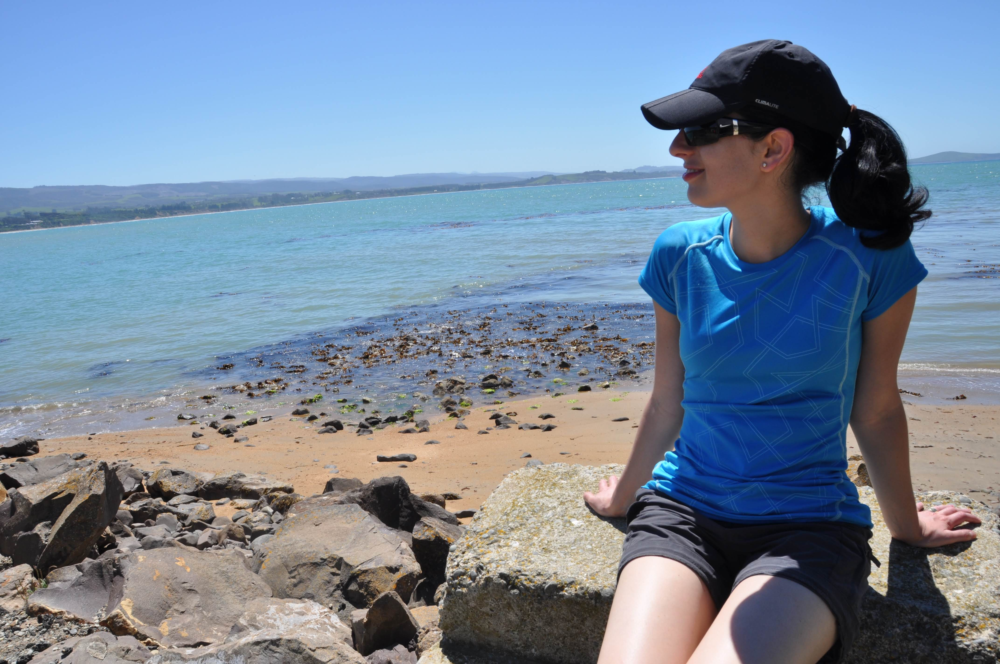
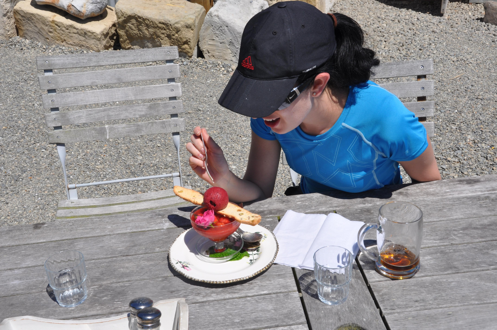
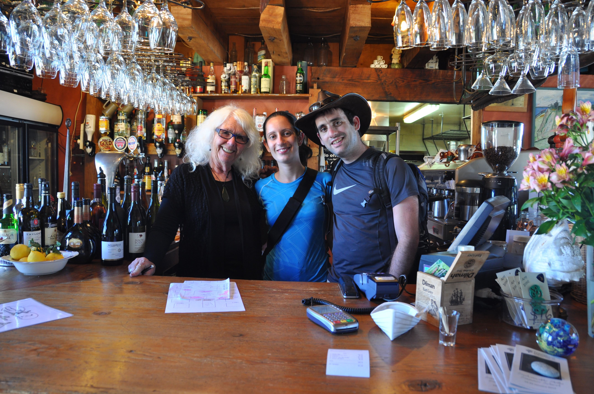
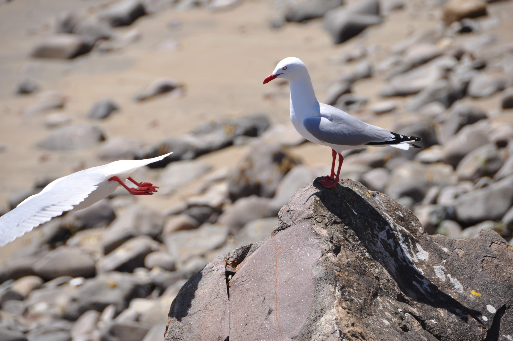

באיזור כפר הדייגים מוארקי שבאמצע שומקום, על חוף הים, פזורים עשרות סלעים עגולים. כל השלטים עמוסים הסברים  על תהליך היווצרות הסלעים - אך כל ההסברים (מלבד ההסבר שהסלעים הם תפוחי האדמה של האלים) היו יכולים להיות טובים גם לסלעים משולשים, מתומנים או סתם בצורת קווץ׳... לא הייתי פוסל תעלול של משרד התיירות שנועד לפזר קצת תיירים גם לאזור נידח זה...



בכפר החלטנו, אחרי שקראנו המלצות חמות, לבקר במסעדה של פלור - זקנה מתוקה שמגישה דגים שנלכדו באותו היום בכפר. המסעדה - צריף די רעוע על שפת הים היתה מ-ד-ה-י-מ-ה! דגים טריים עם מולים מעושנים לצד בירה מקומית צוננת היה בדיוק מה שהיינו צריכים. זו המסעדה הראשונה בה ביקרנו מאז שאנחנו כאן - עד עכשיו רק בישלנו לעצמנו... בדיוק כשהבירה הקרה נגמרה - והשמש החזקה של ניו זילנד החלה להמיס אותנו, הזמנו לקינוח גספצ׳ו תותים קר שקינח את היום הנחמד הזה. הצטלמנו עם פלור הנחמדה וכשנחזור בעוד הרבה שנים ונראה את התמונה לנכדה שלה ואולי נסחט דמעה - ואיזה קינוח על חשבון הבית :)

בערב הגענו לדנידין - עיר גדולה יחסית וחמודה. מצאנו backpackers חביב ולאקי תומפסון ישן היום לראשונה לבד בחוץ
