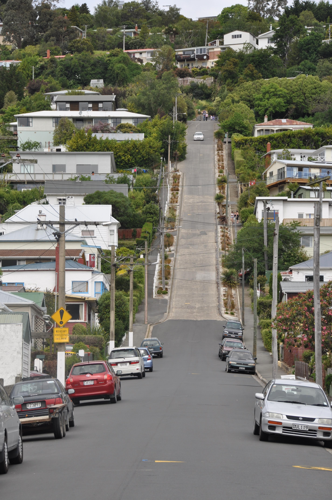
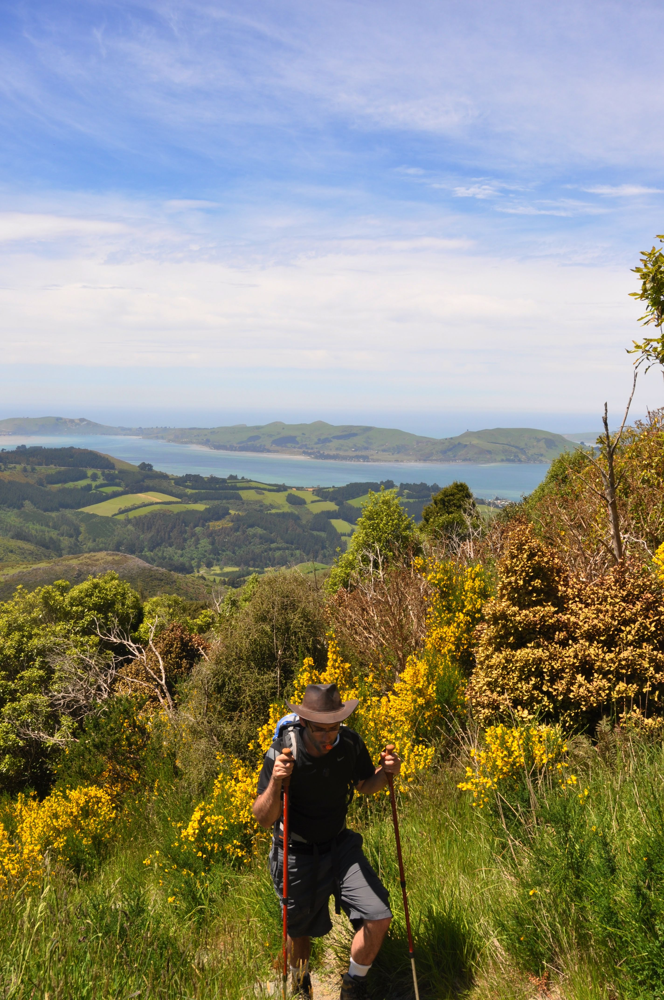
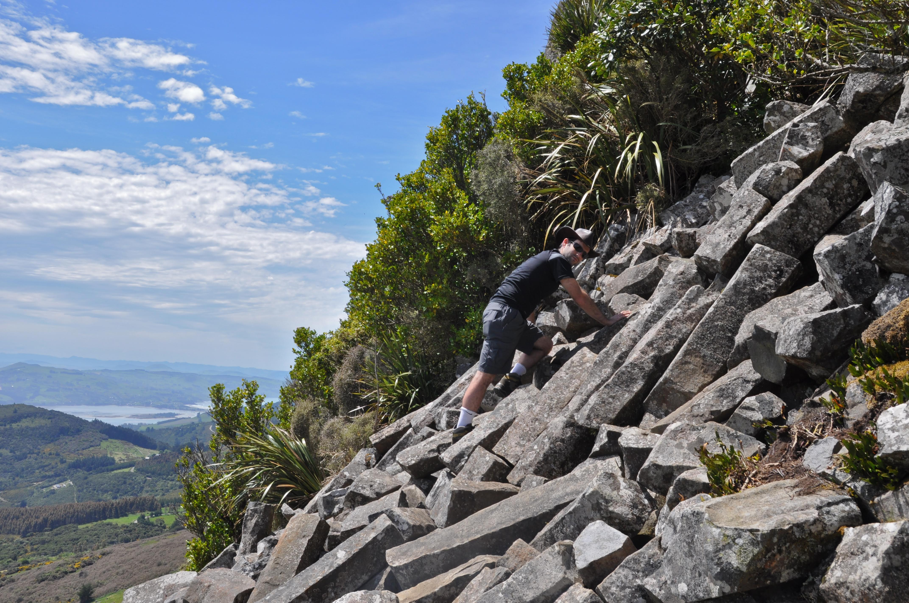
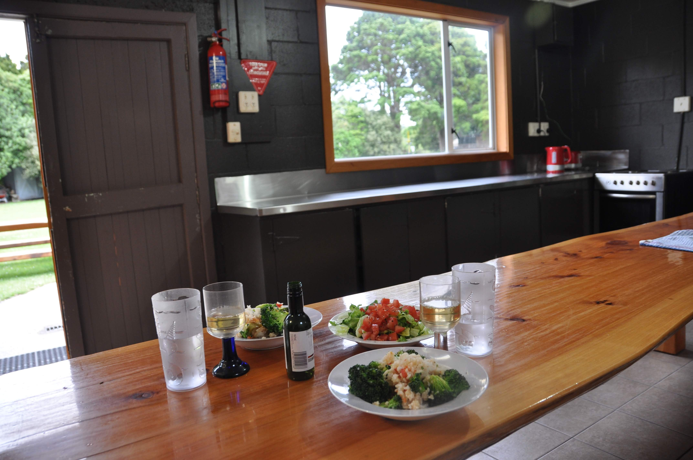

נפרדנו מדאנידין בה ישנו ביומיים האחרונים. בבוקר נסענו לשוק האיכרים של העיר הממוקם בתחנת הרכבת כדי לזלול קרפ גבינות צרפתי אמיתי ולהצטייד להמשך בגבינות, פירות ושאר ירקות. בשונה מבארץ, הברוקולי והאספרגוס ממש זולים כאן אז אנחנו חוגגים...

דאנידין עצמה עיירה חמודה עם רחובות תלולים מאד וכיכר ראשית שהיא בעצם אוקטגון. אפשר למצוא את רחוב המגורים התלול בעולם - לאקי תומפסון נשם לרווחה כשהחלטנו לוותר על הטיפוס...

משם המשכנו למסלול שנקרא organ pipes - בדומה לgiant's causeway שראינו באירלנד - פעילות געשית יצרה פה צורות מעניינות מבזלות. לקראת סוף המסלול התחיל להיות תלול - והירידה - לאט לאט...

בפונוואה מצאנו אתר קמפינג נחמד על שפת מפרץ שליו ולאקי תומפסון חונה ממש על שפת הים. כשהגענו המיים עוד היו רחוקים אבל בבוקר הגאות הביאה את הים ממש עד האף של לאקי...

