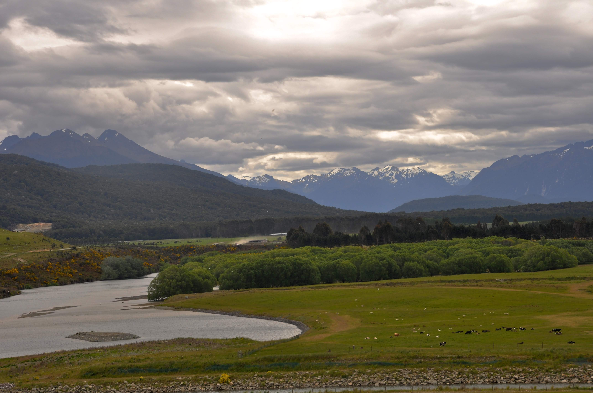
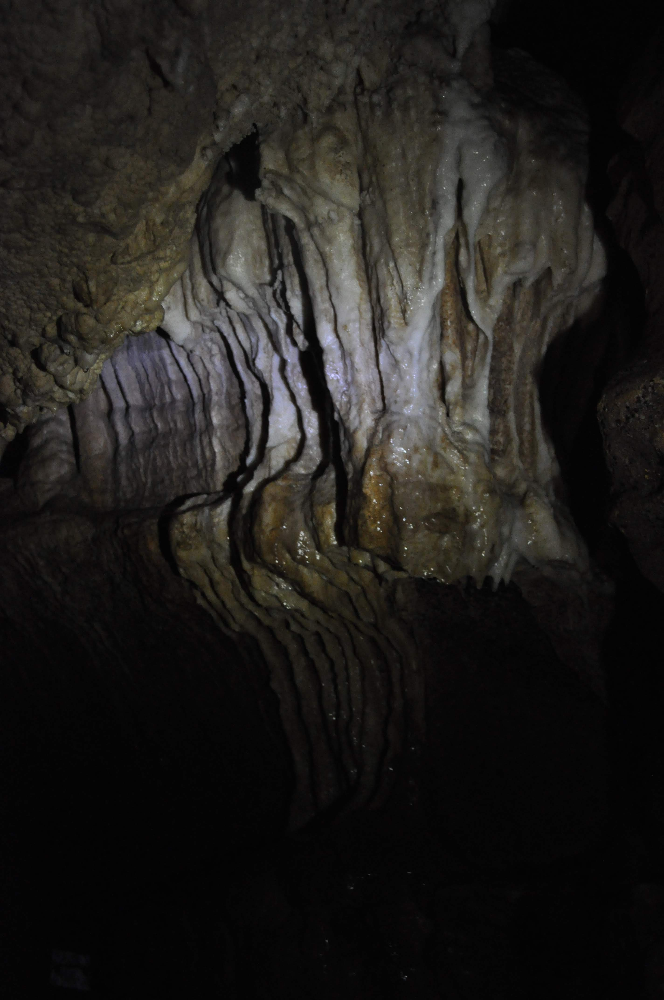

מאיבנקארגיל יצאנו בדרך לפיורדלנד - האזור הפראי והמעיין ביותר מבחינה גאולוגית באי הדרומי ובניו זילנד בכלל. האזור מיושב בדלילות רבה ונמצאים בו כמה מהטרקים שנחשבים ליפים בעולם. בדרך עצרנו לכל מיני מסלולים קצרים, חלקם בתוך יערות סבוכים וחלקם על שפת צוקים גבוהים.

עשינו מסלול די ארוך במערות קליפדן - מערכת מערות עצומה ומפותלת שמתאימה רק לאנשים בגודל של יעל.

אנחנו כאן כבר כמעט שבועיים. כיף פה אפילו יותר ממה שציפינו! כבר נהיינו יותר מסודרים: אחרי סבב ״שיפורי תהליכים״ קיצרנו את זמני ההתארגנות שלנו משמעותית ולאקי תומפסון מסודר ממש כמו בית קטן. סוד הקסם של היעילות קורה בבוקר - בזמן שאני מצחצח שיניים, יעל ״מעבירה נמלה״ על האוטו ועד שאני חוזר הכל מקופל ומוכן למסדר בוקר :)

בטואטפרה - ״בירת הנקניקיות״ של ניו זילנד הצטיידנו בנקניקיות טריות שנטחנו היום וחיסלנו אותן לארוחת הערב. קנינו צידנית קטנה וקרחונים בדיוק בשביל שנוכל לקנות מצרכים שדורשים קירור ולא לפחד שיתקלקלו.

אם אמרנו שבפיורדלנד נמצאים הטרקים היפים בעולם אז בראש הרשימה נמצא המילפורד - טרק שהיינו צריכים כבר להזמין לפני חצי שנה ומחר סוף סוף זה קורה! היום הוקדש כולו להתארגנות ובעיקר מנוחה טוטאלית לקראת הטרק. עצרנו בכל פינת חמד בדרך לטה-אנאו ועשינו פיקניקים חגיגיים עם חטיפים ומשקאות מאיבנקארגיל.

