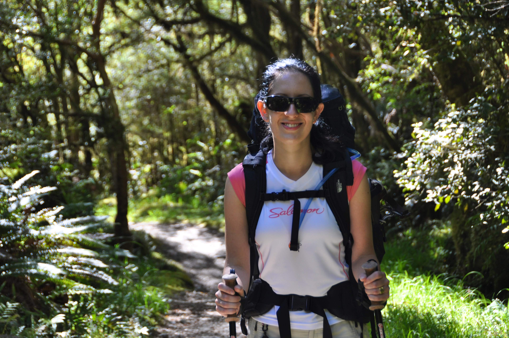

כל כך מהר עברה לה השנה מאז אותה חתונה, ואיזו דרך מיוחדת לחגוג אותה בטרק היפה הזה.

אז מהי המשמעות של ״מסע כומתה״ שכזה בתור חגיגת יום נישואין? ״בית הלל״ היה מפרש שהרגעים היפים ביותר בזוגיות הם דווקא התמיכה האחד בשני ברגעים הקשים. "בית שמאי״ היה מבטל וגורס כי כל זה בעצם לזכר חורבן בית המקדש (במיוחד לאור האופן המבייש בו שברתי את הכוס לפני שנה בדיוק). האמת היא שאיפה שלא נהיה ביחד - זאת החגיגה שלנו... אז סחבתי על הגב כמות של סיידר איכותי ששמרנו לרגל האירוע מהמבשלה באינברקארגיל רק כדי שבכל זאת תהיה איזושהי טקסיות - ויצאנו לדרך. אל הטרק מגיעים בשייט קצר, והיום הראשון הוא ״ניסוי כלים" קל עם הליכה של 5 קילומטרים בלבד עד הבקתה הראשונה.

זאת בכל זאת הפעם הראשונה שיעל עושה טרק, וסוחבת תיק פחות או יותר בגודל שלה... חילקנו את הדברים כדי שהיא תסחוב כמה שפחות משקל - אבל עדיין.. הגענו מוקדם לבקתה והספקנו לשכשך רגליים בנהר...

העובדות:  
- בריג׳ופוביה: פחד כרוני מגשרים וחיבה מוגזמת לסרט ״ביג לבובסקי״ בכיכובו של ג׳ף בריג׳ס  
- יעל לוקה בבריג׳ופוביה קשה  
- בטרק המילפורד עשרות גשרים כאשר גולת הכותרת היא תשעה גשרים תלויים קופצניים במיוחד.

אין דרך טובה יותר להתגבר על פוביות מאשר טרק - או שעוברים - או שנשארים להרקב :) את הגשר הראשון יעל התחילה לעבור בצעדי נמלה קטנטנים כשלפתע יצא מגרונה הקול הגבוה ביותר ששמעתי בוקע מתוך בן אנוש. זגוגיות המשקפיים שלי כמעט התנפצו :) אחרי גשר ועוד גשר - פתאום יעל נעצרת באמצע - ומסתובבת לחייך למצלמה! נמצא מזור לבריג׳ופוביה - טרק המילפורד! בערב יעל אפילו סרבה לשכור את הדי.וי.די של ״ביג לבובסקי״ :)

את הטרק מתחזק גוף שנקרא ״דוק״(DOC) ה״דוק״ הוא גוף ממשלתי שדומה ל״חברה להגנת הטבע״ שלנו - רק הרבה יותר רציני. בכל ערב היה ממונה על הבקתה בה ישנו ריינג׳ר אחר מטעם ה״דוק״. להיות ריינג׳ר כזה זה תפקיד נכסף כאן - ממש כמו טייסים או לוחמי סיירות אצלנו. לטרק המילפורד המבוקש יוצאים רק 40 איש בכל יום (אם הטרק במצב עביר). בכל ערב מכנס הריינג׳ר את כל המטיילים ומעביר תדרוך. חוץ מבטיחות ודגשים מוסיף כל ריינג׳ר את החוכמות שלו. למשל - בערב הראשון - רוס הריינג׳ר הארוך לקח אותנו לסיבוב להכרת הצמחיה ואז חיקה עבורנו את קולות כל הציפורים שבטרק כדי שנוכל לזהות אותן מרחוק.

הריינג'ר רוס

חלק מהייחוד של טרק המילפורד הוא אינסוף המפלים אותם רואים ממש לכל אורך הטרק. לנו יצא לעשות את הטרק כולו כשמזג האויר מושלם - שזוהי אליה וקוץ בה מכיוון שהיו הרבה פחות מפלים והזרימה בהם דלילה. לפי הריינג׳רים זה נדיר לעבור את הטרק כולו בלי גשם ולמעשה הם כינו את ארבעת הימים הללו ״בצורת״. כולם איחלו לנו שלמחרת ירד לנו גשם אבל ללא הועיל... באיזור המילפורד יורדים בממוצע 9 מטר (!) גשם בשנה. יש כאן בממוצע 250 ימי גשם בשנה.

היום השני לא היה מאד ארוך והיה בו זמן להפסקת צהרים ארוכה וטבילה במי קרחונים

הטרק בנוי טוב הן מבחינת סרגל המאמצים והן מבחינת הנופים - ביום השלישי והקשה ביותר מגיעים לפאס ממנו ניתן להשקיף על הרי האיזור כשאתה מוקף באגמים קטנים וצלולים.

בצמוד לפאס מחכה הפתעה בדמות בקתת מסתור קטנה ובה גז כדי שנוכל להכין תה ולהתרענן לקראת הירידה התלולה

לכל דבר טוב יש סוף - עמדנו במשימה וסיימנו את הטרק. זה הטרק הראשון שלנו פה - ולא ממש הספקנו להכנס ל"כושר טרקים" מה שעלה לנו בלא מעט שרירים תפוסים על אף כמות המתיחות שהקפדנו לעשות בסוף כל יום

איך תדע מהם געגועים הבייתה, אם לא תצא למסע ארוך.

איך תדע מהי הקלה, אם לא סחבת תיק כבד כל היום והורדת אותו רק בערב בבקתה.

ואיך תדע כמה חזק יכול לנחור הסקוטי הענק עם התיק הירוק, אם לא ישנת צמוד אליו בבקתה :)

ולא פחות חשוב - איזה כיף לאכול ארוחת בוקר מפנקת אחרי הטרק...

