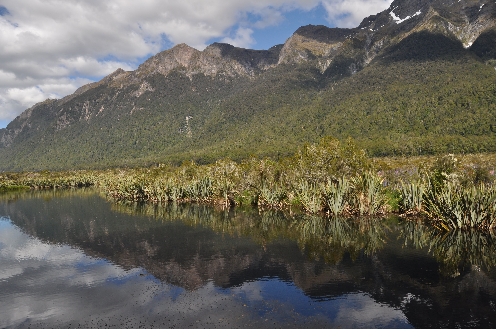
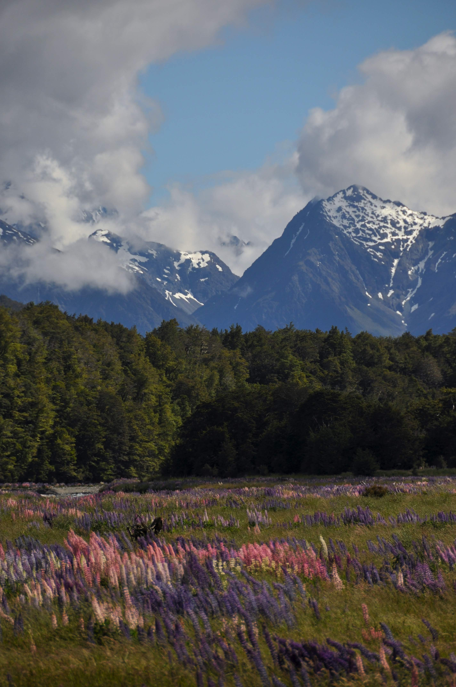
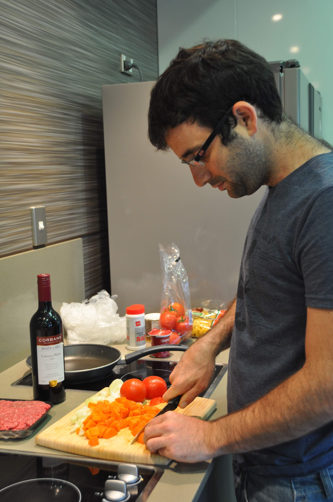

אחרי המילפורד ולפני טרק הקפלר נחנו בעיירונת החמודה טה אנאו.

העיירה מתקיימת כולה בזכות המטיילים שעוצרים בה בין הטרקים ויש בה בדיוק כל מה שהיינו צריכים לימי מנוחה והתארגנות - בעיקר: אגם גדול ויפה (בו צולמו סצינות ל״שר הטבעות״) ומלא פינות יפות לפיקניקים וזלילות למיניהן.

פיקניק נוטלה וסאנד פלייז

קצת על מבטא ניו זילנדי:  אנחנו נמצאים בעיירה ״טי אנאו״, ישנים בחלקת אוהלים שהיא ״טינט סייט״ עבורה שילמנו מעט 

שטרות של ״טין דולרז״ וחיכינו שהחזאי יפסיק להגיד שצפוי באיזור ״היבי ריין״

את הימים העברנו בטיולי יום קצרים באיזור ה Milford road - כביש שסביבו נוף מדהים ואטרקציות ליפנים עם מצלמות וחיוכים.

Mirror lakes, Milford road

נקודת ״כוון-צלם-עכשיו״ ליפני הנודד

טיול יום באיזור Lake Gunn

העקיצות שלו כואבות ומשאירות פצע מדמם, הגירודים נשארים לאורך זמן רב, הוא חזק ועמיד בפני רוב התכשירים הידועים לאדם. ניחשתם נכון - Sand flies - היצור הארור ביקום הוא האוייב הבלעדי של השלווה כאן בניו זילנד. הוא נמצא באי הדרומי בלבד, ובעיקר בפיורדלנד. התכשיר היחיד שבאמת עובד נגדו הוא רעל חזק (deet)שאוכל פלסטיקים ומוריד צבע מבגדים... אנחנו הלכנו על הרעל - נפסיד בקרב - אך ננצח במלחמה! למזלה של יעל הדם שלה חמוץ יותר - או ליתר דיוק הדם שלי מתוק יותר ונראה שאני סופג את רוב האש :)

