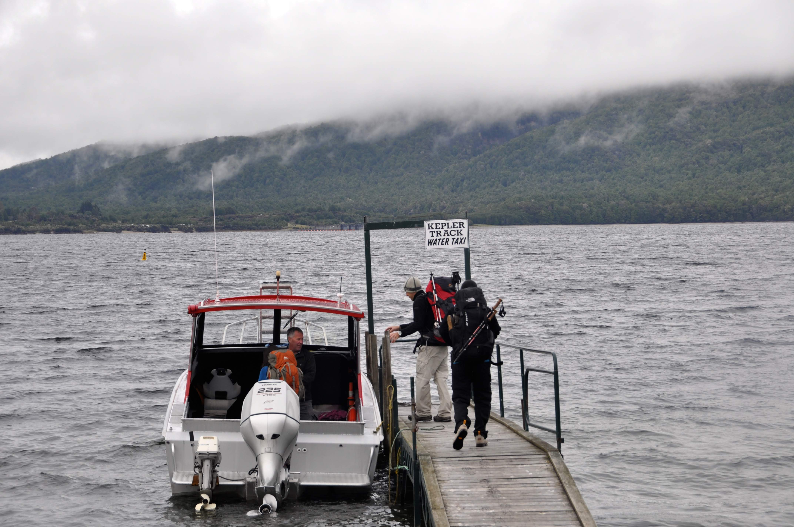

סוף סוף יצאנו לטרק המפורסם כאשר תחזית מזג האויר נהייתה סבירה והשרירים שלנו נרגעו מהמילפורד. עלינו שוב על water taxi קצרצר והתחלנו בטיפוס.

לקפלר בבקשה - שים מונה

היום התחיל בטיפוס לא קל של כ1000 מטר אך לפחות היה קר מאד, יבש ומעונן - מזג אויר אידאלי לטיפוסים. באיזשהו שלב נהיה קצת יותר מידי קר ומעונן והתחלנו לחשוש שהחזאי פישל בניחוש מזג האויר. הגענו לביקתת לקסמור (-להלן בקתת הקור) בערפל כבד כשלא ראינו פיסת נוף אחת בכל היום.

הפתעה נעימה היתה שסוף סוף חזרנו לקצר זמנים. אם במילפורד הלכנו בדיוק בקצב שרשום בשלטים, בקפלר הצלחנו לקצר בזמנים - ודי בגדול... הגוף נכנס קצת ל״כושר טרקים״, למדנו איזה אוכל פחות כבד כדאי להביא וחזרנו להיות צוות מנצח... הפתעה נוספת היא שפגשנו את רן שעבד איתי פעם באילומינייטור בבקתה עם אישתו הטריה. אל הטרק יצאנו עם עודד וצאללי - עוד זוג ישראלים שפגשנו במילפורד ונמצאים במצב מאד דומה לשלנו בחיים - מושכים את ״הילדות״ בטיול ארוך לפני ש״ממשיכים הלאה״... יצא שהיינו בבקתה 10 ישראלים מתוך כ-30 מטיילים בטרק כולו - מה שהפך את הטרק כולו לחוויה חברתית מעולה. את ההפתעה האחרונה להיום סיפק מזג האויר שלפתע החל להתבהר ומחלונות הבקתה נשקף נוף יפיפה.

 יצאנו החוצה לצלם והחלטנו ללכת ל״טיול צד״ קצר מהטרק למערה עמוקה

לא צריך להיות גאון כדי להבין שבבקתת הקור לא היה כל כך חם... זה היה הלילה הקר ביותר שלנו פה - השתמשנו בכל הביגוד הטרמי שהבאנו - גם לשינה.

היום השני התחיל גם הוא בערפל כבד שממש לא היה בתוכניות שלנו ליום שצריך להיות היפה ביותר בטרק. קו העננים היה בדיק בגובה בו הלכנו כך שכל מה שמתחתינו היה בהיר יחסית וטיפה מעלינו ערפל מוחלט וראות אפס. למרות הקור, הלכנו לאט לאט בתקווה שהשמיים יתבהרו לפני שנגיע לרכס והפסגות שבתכנית להיום.

כשהגענו לפסגה הראשונה העננים כיסו אותה ולא ממש היה טעם לטפס. עצרנו למרגלות הפסגה, הכננו תה חם והקמנו מחנה מחאה ישראלי כנגד העננים.

כשנגמר התה החם התקפלנו והמשכנו ללכת מבלי להגיע לפסגה המעוננת. אבל בהמשך היום המזל האיר לנו פנים ולפרקים נשקף נוף מרהיב מכל כיוון אליו הסתכלנו

וואו - איזה יום זה היה - איזה כיף שאנחנו פה...

ביום השלישי והאחרון של הטרק הזה נשאר לנו ללכת 22 קילומטר ביער עד אגם מנאפורי ומשם ההסעה חזרה לטה אנאו. הלכנו מהר ועל אף הקילומטרז׳ הקדמנו בשעתיים והספקנו לאוטובוס המוקדם.

 *נפרדים מאגם מנאפורי ומהטרק היפה הזה*

 בערב עוד הספקנו לזלול את ״ארוחת הפיצוי״ של אחרי הטרק.  ביחד עם צאלה ועודד נכנסנו אקראית למסעדה הראשונה שמצאנו. לא ברור אם היה זה הרעב, אוכל הטרקים או כמות הבירה ששתינו שם (Speight's old dark המעולה) - אבל ארבעתנו יכולנו להשבע שהוגשו לנו המבורגרים קסומים שאינם מהעולם הזה :) שם המסעדה הוא משהו כמו ״בייליז״ ממליץ על ה ״לקסמור דלקס״

כן... זה באמת נכנס
