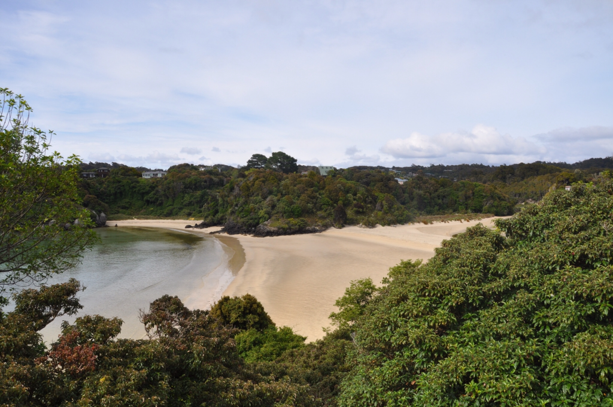
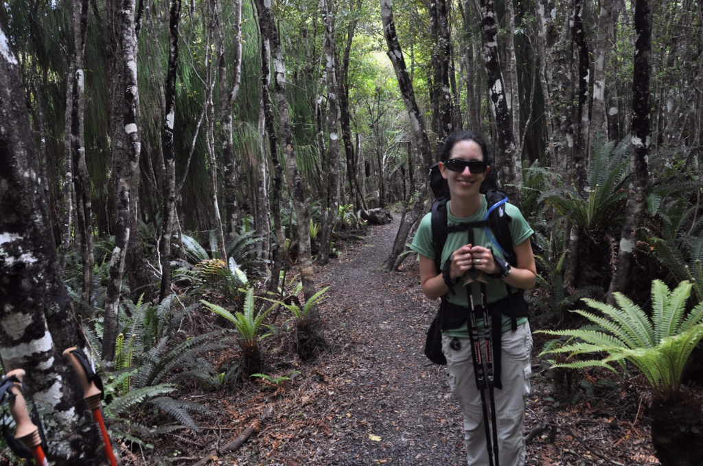

אחרי הנופים ההרריים והפראיים של הפיורדלנד פנינו דרומה אל השלווה המנומנמת של  Stewart island. הפעם נסענו דרך הכביש המהיר והעברנו עוד לילה באינברקארגיל. מזג האויר בעיר היה נעים בהרבה מזה שהיה לנו בביקור הקודם, העיר קיבלה הזדמנות שניה וניצלה זאת היטב. ביקרנו בחנויות הנחמדות שברחובות הקטנים כמו גם באותה מבשלת בירה שזכתה לביקור שני. במבשלה כבר הכירו אותנו וסיפרו לנו על ה״ניסויים״ החדשים בלתת שהם עושים לקראת קריסמס. נפרדנו מחבר שחור ושעיר ודיללנו קצת גם את אוכלוסיית הפרות באיזור.

בבוקר נסענו לבלאף בה השארנו את לאקי תומפסון רכבנו האהוב ולקחנו מעבורת אל האי המדובר. באי סטיוארט ממוקם דרומית ל״אי הדרומי״ של ניו זילנד וזוכה לכינוי ״האי השלישי״. האי נחשב ל״גן עדן״ לאוהבי ציפורים אך גם ל״אדישי ציפורים״ כמותנו יש בהחלט מה לראות כאן. האי בקושי מיושב - כ400 תושבים באי עצום כך שהתערבות האדם בטבע היא מינימלית ועוד לא הצליחו להכחיד פה את כל מיני החיים הנדירים.

")
קצב החיים באי השליו הזה איטי בהרבה אפילו מהעיירות הנידחות של הפיורדלנד. באי מכולת אחת בה ניתן לקנות את כל כל מוצרי המזון, שיפוץ הבית, כלי כתיבה ודייג. את לוח ״מבצעי היום״ מחליף לוח בו כתוב בכל יום למי מיושבי האי יש היום הולדת...  בסטיוארטס איילנד inbreeding אינה מילה גסה ובפאב היחיד שנמצא בעיירה היחיד ה באי אפשר לפגוש את כל בני משפחת האי בערבי טריוויה עם בירות מעולות ותפריט בר עשיר ומפנק.

עוד קורבן של שעמום

אנחנו הגענו אל האי בעיקר כדי ללכת בטרק שנקרא Rakiura - טרק בן 3 ימים שחוצה את האי בנק׳ הצרה שלו ובסך הכל מכסה חלק קטן מאד מהאי הגדול הזה. במהלך הטרק מגיעים להמון חופים קטנים ונטושים עם חול זהוב ומים צלולים המזמינים הפסקות מנוחה וזלילה.

האי לא נחשב חלק מ״מסלול התיירים השחוק״ וניתן להרגיש זאת לטוב ולרע: את הריינג׳רים החרוצים עם הסכין בין השיניים במשרד של הdoc (חברה להגנת הטבע) החליפו 3 דודות מקומיות (שכנראה היו גם אחיות וגם אמהות אחת של השניה) שהיו מאד נחמדות אך מעולם לא עשו את המסלול. מצד שני לשבת בפאב המקומי עם כל הדייגים שנכנסים עם המגפיים שלהם ולהקשיב לסיפורים שלהם זאת חוויה מיוחדת.

ביום השני של הטרק ראינו על החוף שתי ציפורים שחורות עם מקור ארוך וכתום שנקראות ״מפצחי צדפות״. בהתחלה התקרבנו בשקט כדי שהן לא תברחנה, אחר כך לא התקרבנו יותר מידי למשמע הצווחות התוקפניות שהן השמיעו ולבסוף ברחנו בבהלה כשהן התחילו להתעופף מטר מהפרצוף שלנו עם המקורים החדים הללו והצווחות האיומות. בדיעבד הסתבר שזוהי סוף עונת הדגירה שלהן והן הגנו על הקן שלהן.

")
בערב הראשון המליצו לנו לנסות ולחכות לקיווי - הציפור שהיא הסמל הלאומי של ניו זילנד שקשה מאד לראות בטבע. חיכינו בלילה כשעה ללא הצלחה יתרה. צפר מטורלל שישן באתר הקמפינג בשטח שלידנו ושוטט כל הלילה עם פנסים אדומים (אותם הקיווים לא רואים) סיפר לנו שבסוף - מסע החיפושים הארוך שלו השתלם. אנחנו הסתפקנו בלזהות את הקולות של נקבת הקיווי מאחד השיחים והלכנו לישון. את הקיווי שלנו נראה בגן החיות או במוזלי של ארוחת הבוקר...

הביקתה בלילה השני של הטרק היתה ממוקמת מול חוף יפה וצלול בו טבלנו את רגלינו העייפות להנאתנו והצטלמנו - לפחות עד שיעל פתאום שמה לב שאנחנו מוקפים במלא ״חברים״ עם צבטות קטנות וחמודות.

בניגוד לבקתות הgreat walks הקודמות בהן ישנו הבקתות כאן היו בסיסיות ביותר - לא היה גז והיינו חייבים לסחוב את הגזיה שלנו. בטרקים אנחנו אוכלים כאן כמעט בכל ערב ארוחות מיובשות של חברה שנקראת back country. כמעט כל מנה שתדמיינו - מביף סטרוגנוף וצ׳יקן טיקה מסאלה עד תבשיל כבש בפירה מצליחים כאן ליבש ולדחוף לשקית קלה ואטומה. גם חטיפי הבשר המיובש כאן (כיף ג׳רקי) מעולים ומספקים מכת חלבון מעולה בצהריים.

היום השני היה ברובו בתוך יער גשם צפוף עצים. במהלך ההליכה כולה מרגישים שאתה הולך בתוך גן חיות - צפצופים וקירקורים שנשמעים יותר כמו צלצולי פלאפון מאשר ציפורים מלווים אותך בזמן ההליכה כולה. קשה מאד לצלם כאן את הציפורים החמקמקות אבל במהלך היום הצלחתי לצלם tui חמקמקה ובערב ראינו במים ברבור שחור וגדול.

בלילה כשיצאתי לשרותים פתאום ראיתי זנב שמן של חתול גדול. לקח לי כמה שניות להזכר שאין פה בעצם חתולים ורצתי להביא את המצלמה. היה זה אופוסום שמן ומכוער שחיפש חיות נדירות כדי למלא בהן את כרסו השמנמנה. הסיפור של האפוסומים (או ״פוסומז״ כמו שהם קוראים להם) פה בניו זילנד הוא די מדהים - עם כל הכבוד לכמות החיות שאני זולל פה ושם (ראה ערך ״המבורגר 30 החיות״ בפוסט על הקפלר) אוייב החי והטבע האמיתי כאן הוא האופוסום. עד לפני כ120 שנה לא היו בניו זילנד אופוסומים בכלל ומגוון הציפורים (בעיקר אלו נטולות הכנפיים) היה גדול בהרבה ממה שניתן למצוא עכשיו. את האופוסומים הביא לכן מישהו שרצה לגדל אותם למטרת סחר בפרוות - מאז ועד היום זאת היסטוריה והיסטריה: בניו זילנד יש כיום כ80 מיליון (!) אופוסומים שמתרבים וזוללים מכל הבא ליד. ממשלת ניו זילנד מעודדת את התושבים לצוד אותם ואף מוכנה לשלם בתמורה לפרווה שלהם.

מזג האויר שוב שיחק לטובתנו. 20 דקות לפני שסיימנו את הטרק התחיל טפטוף ומייד כשנכנסנו לאכסניה - מבול

אנחנו רוצים לנצל במה זו ולברך שוב את ליגלוש - חברה ותושבת רעננה נלהבת במקורה. מזל טוב ליגל ועמיר!

