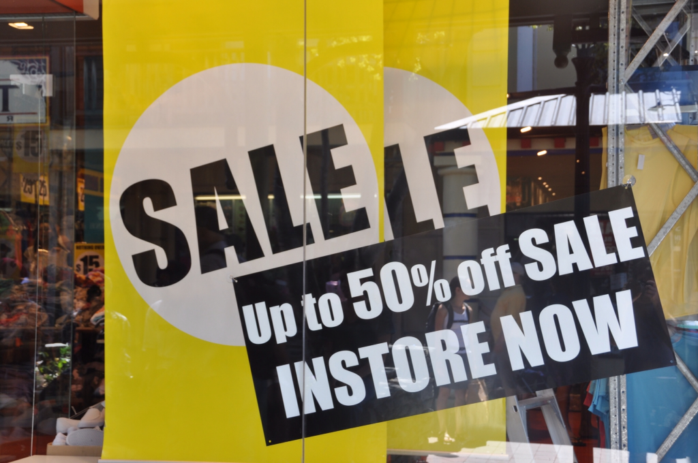

קווינסטאון כפי שמעיד עליה שמה היא בהחלט עיר הראויה למלכה. כשהגענו מסטיוארט איילנד השליו קצת נבהלנו מכמות התיירים ברחובות ובholiday park וחשבנו שנברח מפה מהר מאד - עד שבסוף גם אנחנו התאהבנו בעיירה החמודה. יש כאן פעילויות המתאימות לכל סוגי התיירים - חנויות תיקים של לואי ויטון, חנויות טיולים עצומות, ספורט אתגרי, רכבלים, גולף ולא פחות חשוב העיירה ממוקמת על שפת אגם יפה וצלול ולמרגלות הרים גבוהים ויפים.

קווינסטאון נחשבת לבירת הספורט האתגרי העולמית וניתן להבחין בכך מהרגע הראשון שנכנסים אליה. בימי שמש מתעופפים באוויר עשרות דאונים ומצנחים למיניהם ואפשר לשמוע את צרחות האנשים התלויים בין שמיים לארץ. לכל דוכן נקניקיות שני כאן יש עמדת באנג׳י משלו ואפילו ראינו עץ אשוח תלוי הפוך על חבל באנג׳י לכבוד קריסמס.

אנחנו לא היינו אמיצים יתר על המידה ואת אטרקציית ה״אקסטרים״ חווינו בסירת סילון בנהר שאפילו השם שלו נשמע ״אתגרי״ נהר הShotover. על פני נהר צר ופתלתל המוקף צוקים חדים ובולטים שועט לו פסיכי עם קבלות על גבי מפלצת סילון שמנועה שואב 800 ליטרים של מים בשניה(!) אם זה לא מספיק מפחיד הנהג נצמד במכוון לסלעים, ומלהטט בסיבובים חדים דווקא בחלקים הצרים ביותר. צפו בנו בעודד ובצאללי זועקים:






עלינו ב״גונדולה״ המפורסמת של העיר והחלקנו במזחלות המגניבות. גם הjet boat וגם עסקי המזחלות התנהלו כמו מכונה משומנת שמפיקה עשרות אלפי דולרים ביום - הם בהחלט יודעים כאן את העבודה. בסירה למשל כשהגענו לקטע רחב בנהר בדיוק הנהג עשה סיבוב גדול ומפחיד ובתזמון מושלם בדיוק חלפה מהכיוון השני עוד סירה נושאת יפנים מבועתים.

כולם מכירים את הסיפור על אודיסאוס ועל המלחמה הקשה נגד טרויה. בתום המלחמה הפליג אודיסאוס במשך עשור חזרה לאתיקה בה המתינה לו אשתו הנאמנה. במהלך מסע התלאות המפורסם גבר אודיסאוס האמיץ גם על ה״סירנות״ - שמול קול שירתן שום גבר לא יוכל. מלחיו הצייתנים קשרו אותו לתורן בעוד אוזניהם מולאו בשעווה. למה בעצם אני מספר את כל זה? בסוף ״מלחמות הטרקים״ והטיפוסים מחכים לנמלה הoutlets הענקיים של ארה״ב. מסע התלאות כלל ביקור בקווינסטאון עמוסת החנויות דווקא בboxing day. קשרתי את הנמלה אל התורן כשצעדנו בין החנויות - מאות דולרים בודדות אבדו - אך יצאנו בזול :)

מתוך הגינות כלפי הנמלה אני חייב להתוודות שגם לי היה קשה לראות את חנויות הטיולים היוקרתיות עם מבצעים של 70% ומילאתי את האוטו בקצת שטויות - כדי לספר סיפור טוב חייבים קצת להגזים... אבל היי - לפחות בסיפור שלי, בניגוד לאודיסאה, לכל הדמויות שתי עיניים וראש בודד...

חוץ ממכת קניות - כדי להוסיף חטא על פשע ביצענו גם מספר זלילות. על שפת האגם היפה אפשר לקנות פיש&amp;צ׳יפס, גלידה מעולה ואת ההמבורגר המפורסם שהתור ממנו משתרך לרחוב בשעות הצהריים

בסמוך ל״עיר החטאים״ ממוקם עמק גיבסטון בו שורר מיקרו אקלים המושלם לצורך גידול יקבים. לא פסחנו על התענוג וביקרנו במערה בה מיישנים יין בחביות וטעמנו את כל סוגי ה״פינו״ שמגדלים כאן. גם היין וגם הגבינות כאן מעולים ושווה לקפוץ לקנות מצרכים לארוחת גבינות ויין.

כפי שכבר הזכרתי, בעיר התוססת הזאת יש הכל - בלילה העיר שייכת לצעירים ומקומות הבילוי שוקקי חיים. הלכנו ארבעת ה״זקנים״ לנסות את מזלנו בפאב - כשגילינו שלא מגישים כאן תה ועוגיות נאלצנו לחסל לא מעט כוסות של בירה מקומית.

בנוסף לכל השחיתויות הספקנו לעשות גם טיול יום נחמד בנופים בהן צולמו סצינות ל״שר הטבעות״

 עוד נתגעגע לימי השלווה בקווינסטאון")

