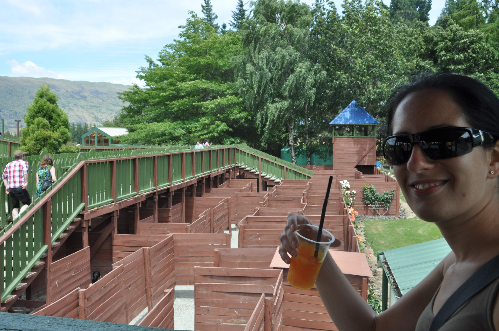
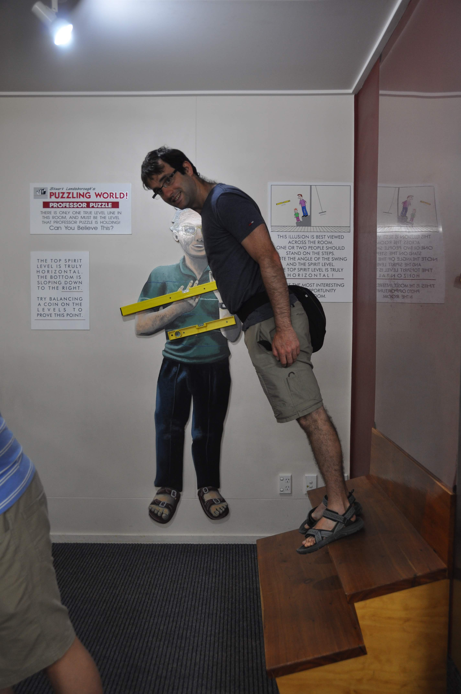
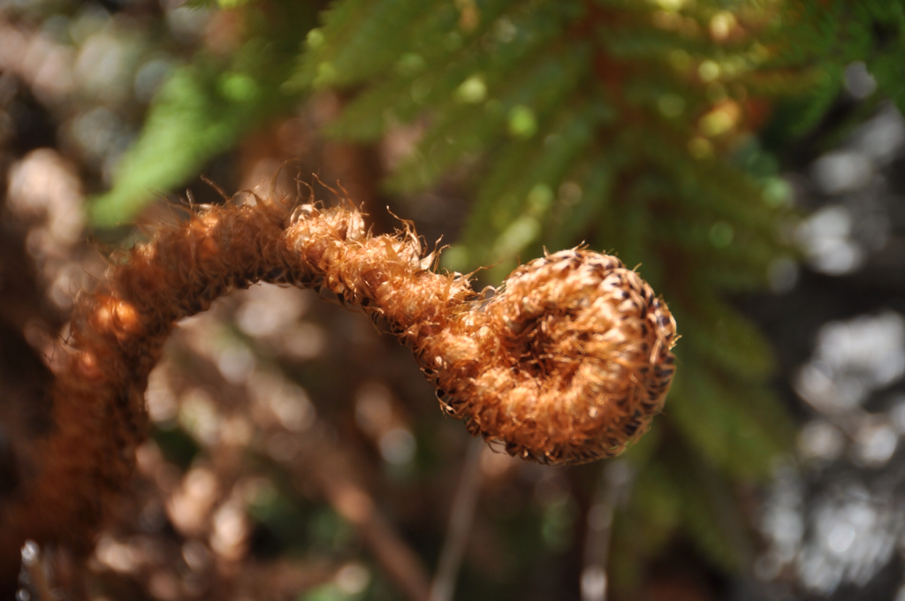

מקווינסטאון הסוערת עברנו לאחותה הקטנה וואנקה. וואנקה נחשבת לעיירה שקטה ושלווה יותר מקווינסטאון, אבל כנראה שבתקופת החגים כאן - שלווה הופכת למצרך נדיר... הניו זילנדים כולם יצאו לתור את ארצם מצוידים בצורה מעוררת קינאה. בניו זילנד יש בכל חור - ואני מתכוון ב-כ-ל חור מגוון אפשרויות לעשות קמפינג. אם זה בקרוונים או באוהלים תמיד יש מקום שיספק את הנדרש - וכמעט תמיד הוא יהיה מול אגם ענקי. אתרי הקמפינג בוואנקה מוצפים באלפי מקומיים. כל משפחה מגיעה עם הקרוואן הנגרר שלה או עם אוהל בגודל של קרקס והעיירה נראית כמו עיר אוהלים ענקית. כמעט כל רכב מקומי גורר מאחוריו כלי שייט כלשהו - אם זאת סירת מנוע, אופנוע ים או חתיכת מתכת ממונעת אחרת שאין לה שם בעברית. אופניים הם כלי פנאי פופולארי כאן כמעט כמו ספורט מים, ומרחצאות חמים ומיני-גולף הם חלופה ליום גשום. שעות היום הארוכות (6:00-22:00) מאפשרות נופש מושלם - את ארוחת הערב אוכלים כולם בשמש מול האגם ב״חלקת המנגל״ שקיימת בכל אתר קמפינג ובשניה שהשמש החזקה שוקעת הקור העז מכריח את כולם להכנס לישון. 

בדרך לעיירה עצרנו ב״פאזליג וורלד״ המפורסם של וואנקה. במקום אפשר להנות משלל אשליות אופטיות ותפיסתיות מגניבות או לסבול במבוך עכברים אנושי תלת ממדי תחת שמש לוהטת

עוד אטרקציה מגניבה בוואנקה היא בית הקולנוע המקומי "Cinema Paradiso" - בית קולנוע ״ביתי״ בו יושבים בספות נוחות, אפשר להזמין פיצה לוהטת וקובעים את מועד ההפסקה בדיוק כשעוגיות הענק יוצאות מהתנור. ראינו סרט חמוד עם מלני לורן - מושא הערצתו של חבר טוב שאוהב להשאר בעילום שם ;)

וואנקה כמובן גם יושבת בפתח הפארק הלאומי Mt. aspiring והעמק עם השם המצחיק מתוקיתוקי (Matukituki). אנחנו הסתפקנו בטיול יום במסלול שנקרא ״רוב רוי״ שבכ4 שעות הליכה לקח אותנו בין נהרות לתצפית על קרחון קטן.

הנסיעה למסלול היתה יפה אך גם קשה. למרות שיחסית פופולרי לטייל בשמורה, לא טרחו לסלול כביש נורמאלי וכדי להגיע לתחילת המסלול נדרשה נסיעה של 30 קילומטר בדרך עפר מרגיזה שטלטלה לנו את הצורה 

כשחזרנו לאקי תומפסון קיבל מקלחת טובה כפיצוי

אין לנו יותר מידי דאגות בטיול הזה - הדבר היחיד ש״מטריד״ אותנו זהו מזג האויר - במדינה הזאת מזג האויר מאד - הפכפך אנחנו רודפים אחרי מזג האויר הטוב ומתחמקים מסופות הגשמים עד כמה שניתן. בגלל האופי ההררי של האזור ועצם היותו אי - גם באזורים קרובים גאוגרפית יכול להיות מזג אויר שונה באופן קיצוני. את תחזית מזג האויר בחדשות לוקח להעביר יותר מעשרים דקות וגם החדשות עצמן עוסקות לא מעט בנושאי מזג האויר - שטפונות שסוחפים פינגווינים לרחובות בעיר אחת - ואזהרות למרוח קרם הגנה spf50 בעיר השכנה. אם כבר הזכרנו חדשות, אז מה שקורה בקרייסצ׳רצ׳ עכשיו זה איום ונורא - שתי רעידות אדמה נוספות ועשרות After Shocks הופכים את העיר אט אט לאבקה. יוצא לנו להתקל בתושבי קרייסצ׳רצ׳ בחופשה - חלקם שוכרים דירות מחוץ לעיר - וחלקם פשוט נוטשים... ובחזרה אל הסיפור שלנו - כשראינו שהשתנתה התחזית לאיזור Mount Cook ואמורים להיות בדיוק יומיים בהירים - שינינו את התוכנית, ארזנו תיקים לטרק קצר ויצאנו לדרך - לכבוש את ההר!
