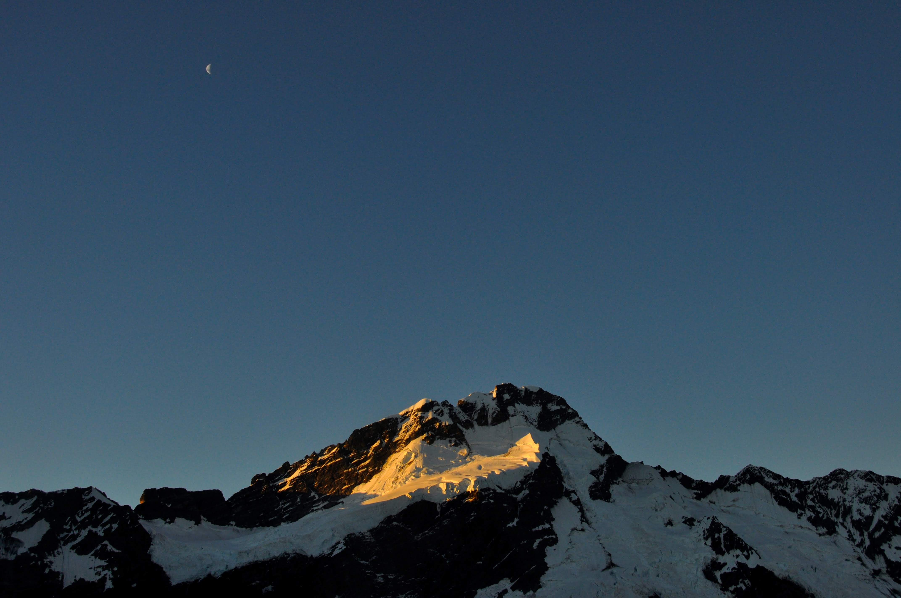

קמנו מוקדם בבוקר כדי להגיע לשמורת Mount Cook - ההר הגבוה בניו זילנד. המסלול כלל טיפוס קשה לבקתה שנקראת "Muler Hut", לינה בה וירידה רק בשנה הבאה! המסלול הוא בסך הכל באורך חמישה קילומטרים אך תוואי השטח הוא עליה רצופה של 1100 מטרים.

הטיפוס לא היה קל בכלל, ומה שהוסיף לקושי היה שבעודנו מטפסים הר קוק לא הפסיק לעשות לנו פרצופים בעודו מעשן והכריח אותנו לפנות אליו בשם ״קוקיליו״.

חציו השני של המסלול מוגדר כ״מסלול לא מסודר״ וממש לקראת סופו נהיה תלול ואילץ את חלקנו לטפס בטקטיקה הידועה בכינויה ״זחילת נמלים״

בסופו של דבר הטיפוס הגדול הסתיים - הנופים שנתגלו היו שווים את המאמץ והפסקת הזלילה שעשינו בתום הטיפוס החזירה לנו את הרוח למפרשים

מתום הטיפוס חיכתה לנו צעידה של כחצי שעה בקרקע סלעית שהלכה ונהייתה מוקפת בשלג עד שלקראת הבקתה הפכה לרצועת שלג אחת גדולה.

היום המדהים הזה כמעט הסתיים ואיתו גם שנת 2011. את חגיגות סוף השנה חגגנו בבקתה עם צאללי ועודד, המון אוכל ואפילו מלא סיידר מקורר בשלג שעודד הפסיכי סחב בעליה.

השמש שקעה בפעם האחרונה על 2011 וצבעה את ההרים בשלל צבעים. עם השמש שקעה גם שנת ה״זריעה״ שלנו, בה סיימנו לימודים, גרמנו לטיול הזה להיות אפשרי וקבענו את מקום מגורינו לשנים הקרובות. כבר הספקנו לקצור חודש של טיול ואפילו פגשנו פה חברים חדשים. שנת 2012 אנחנו מחבקים אותך ב4 ידיים!

רק כד לוודא שאכן 2012 הגיעה קמנו לפנות בוקר והלכנו לראות את הזריחה על שמורת הר קוק. אפילו קוקיליו עוד ישן ונראה כמו סתם עוד הר מושלג

 2012

מה שעולה חייב לרדת - ירדנו לאט לאט בירידה שהיתה קשה יותר מהעליה. הברכיים שלנו צריכות מנוחה של כמה ימים...

