אחרי הטיול בשמורת הר קוק החלטנו להוריד הילוך ולנוח קצת מבלי לעשות יותר מידי ״אטרקציות״. למיזם ניתן השם ״פרוייקט נופש מהחופש״ והוא זכה להצלחה רבה. לקחנו את הזמן בדרך חזרה מהר קוק לאזור Wanaka והעברנו לילה בעיירה על שפת Lake Tekapo ששמה כשם האגם.

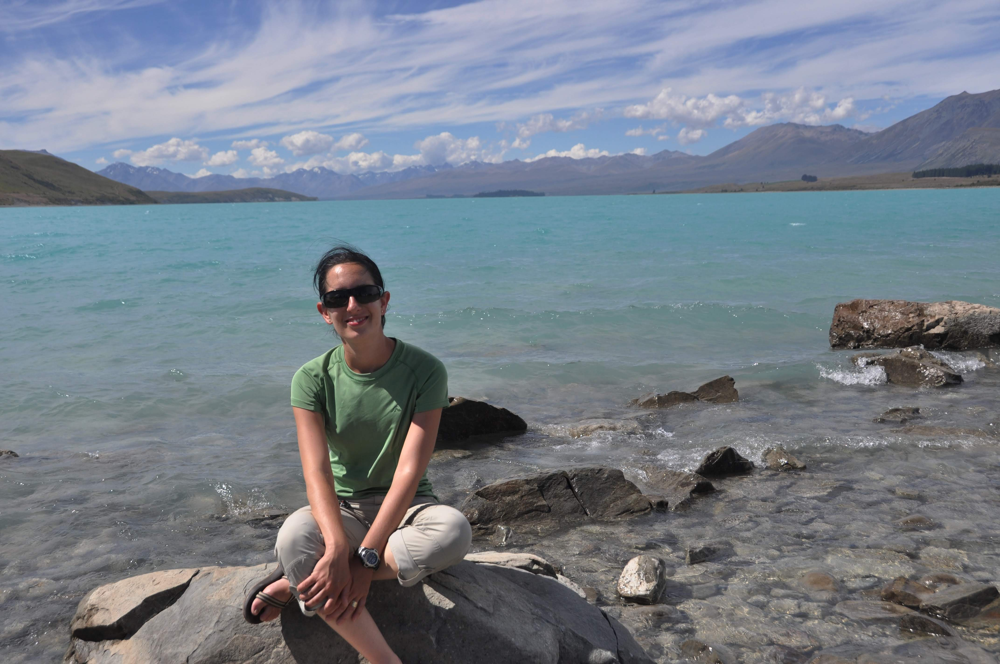
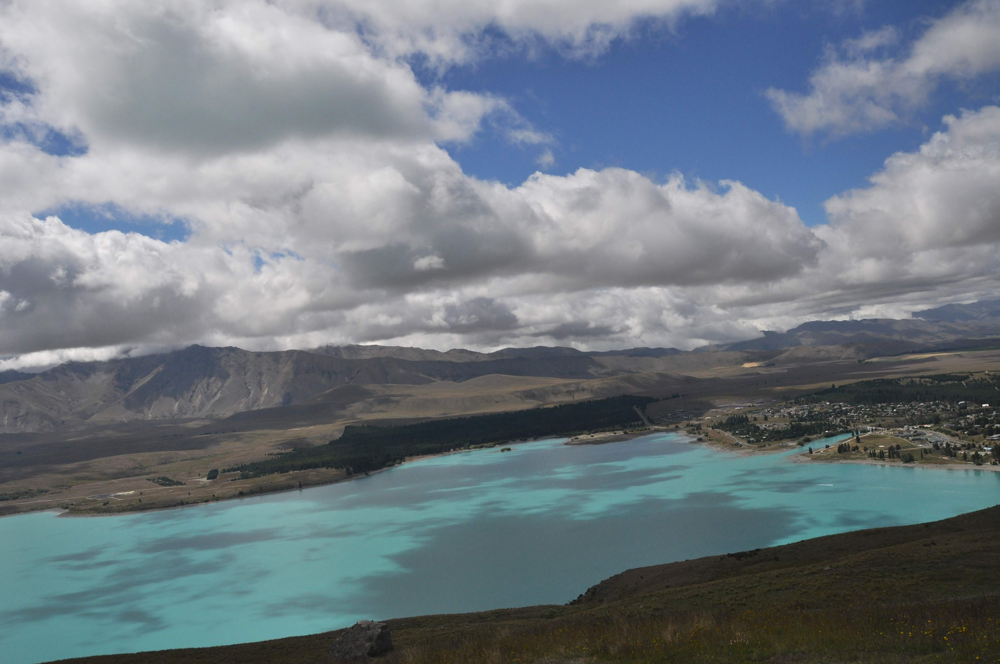
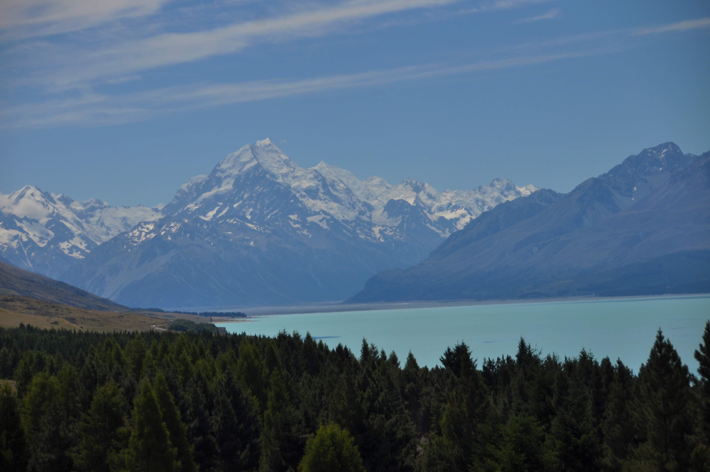
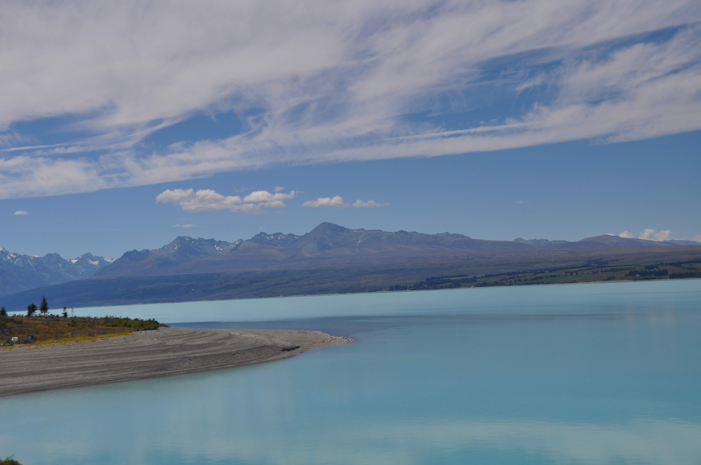
בדרך לאגם טקפו עברנו גם באגם ״פוקקי״. חוץ משמותיהם המצחיקים, תכונה נוספת שמייחדת את האגמים היא צבעם הלא שגרתי. בתור עיוור צבעים אני יכול רק לספר שיעל מעידה שמדובר בסוג של טורקיז. תשפטו בעצמכם:

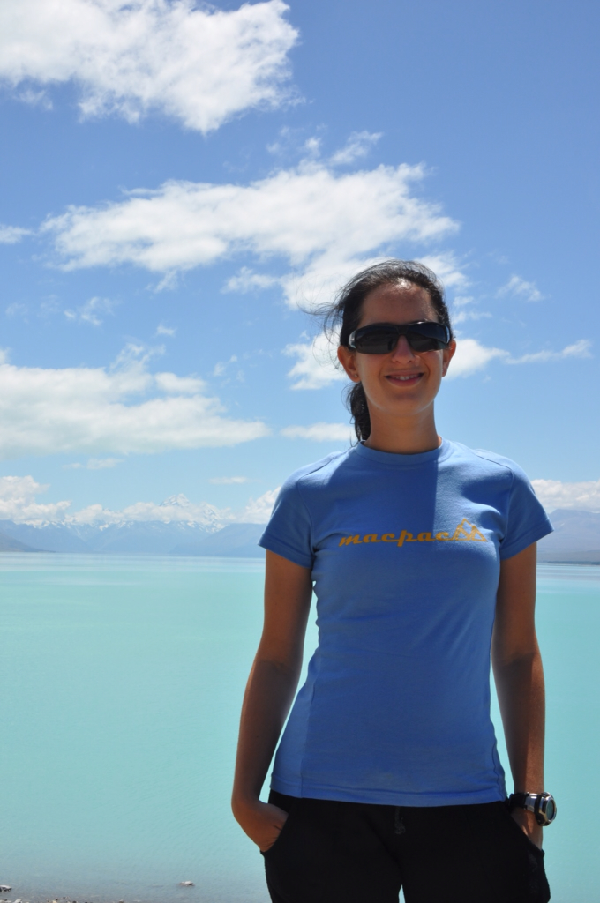

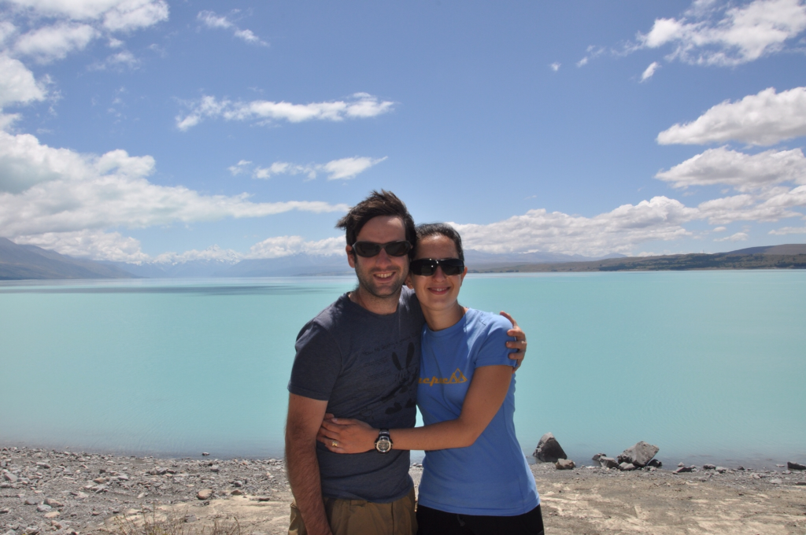

את צבעם, יהיה אשר יהיה, קיבלו האגמים בזכות נסיגת הקרחונים שהתרחשה באיזור. כמו באיזור המילפורד ובאזור הקרחונים אליו ניסע בקרוב - נסיגת הקרחונים השאירה אחריה תופעות טבע שונות ומשונות. הסלעים שהיו בדרכו של הקרחון נשחקו על ידיו במשך כמה אלפי שנים והתפרקו לאבקה. המים שטפו את אבק הסלעים לאגם ומכאן צבע המים המיוחד. כחלק מעניין הנופש, ויתרנו על מסלולי ההליכה באזור ונסענו עם לאקי היישר לבית הקפה הממוקם על פסגת גבעה והרווה את צמאונינוי לנופים ולמרק.

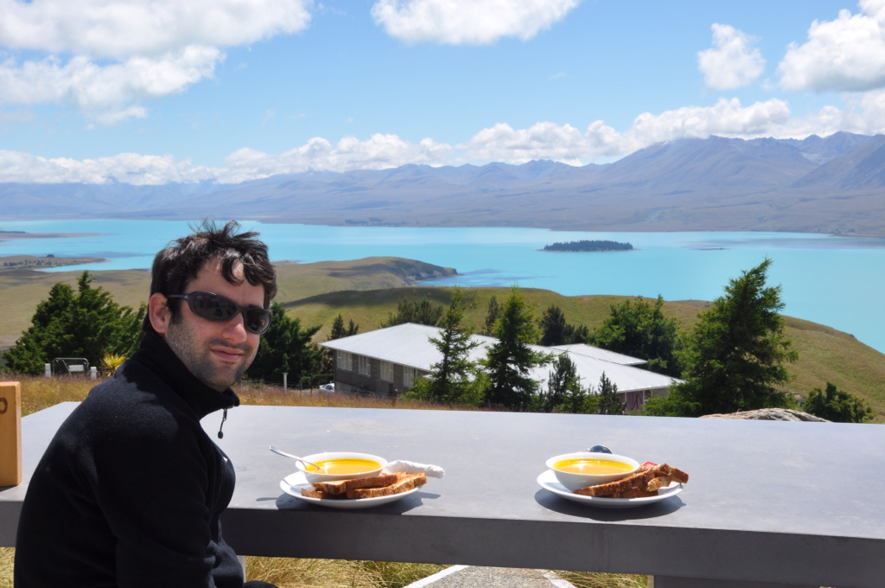

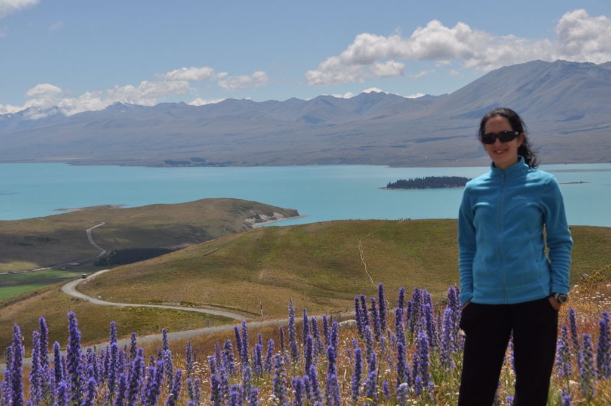

משם חזרנו לוואנקה שטופת השמש כדי להמשיך לנפוש. חזרנו אל הקולנוע הבייתי בוואנקה כדי לראות את ״טין טין״ והעברנו את הימים בקריאת ספרים וזלילת מטעמים. בנופש אסור היה לנו להתעסק בתכנון המשך הטיול ואפילו בתעוד הטיול בבלוג - שלווה.

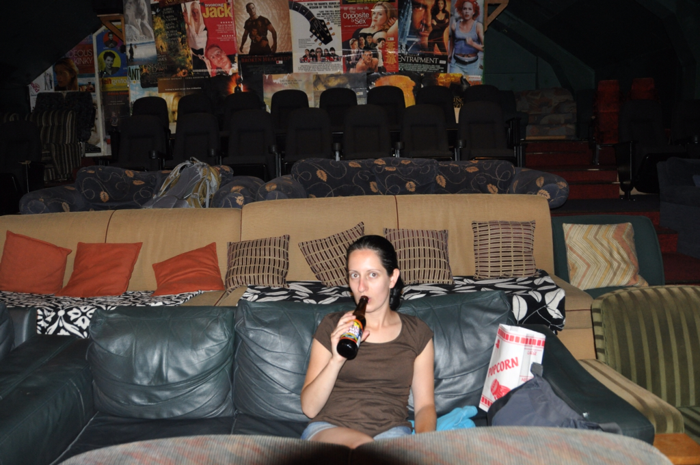
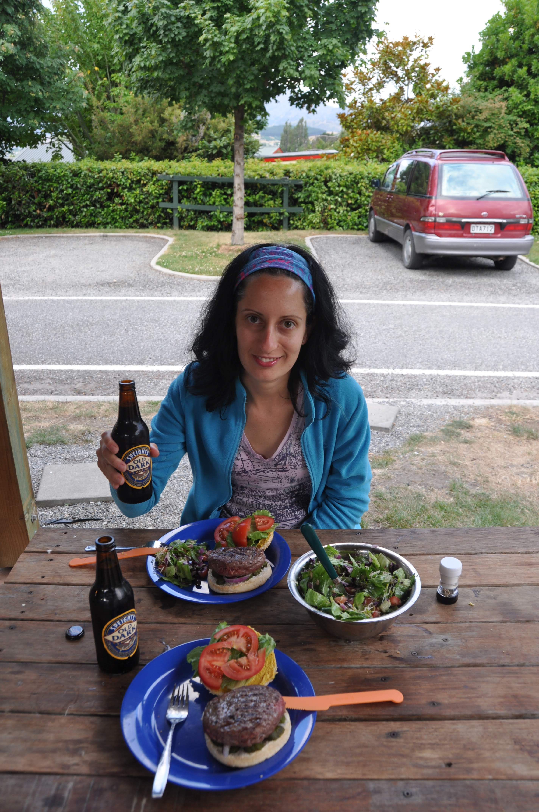
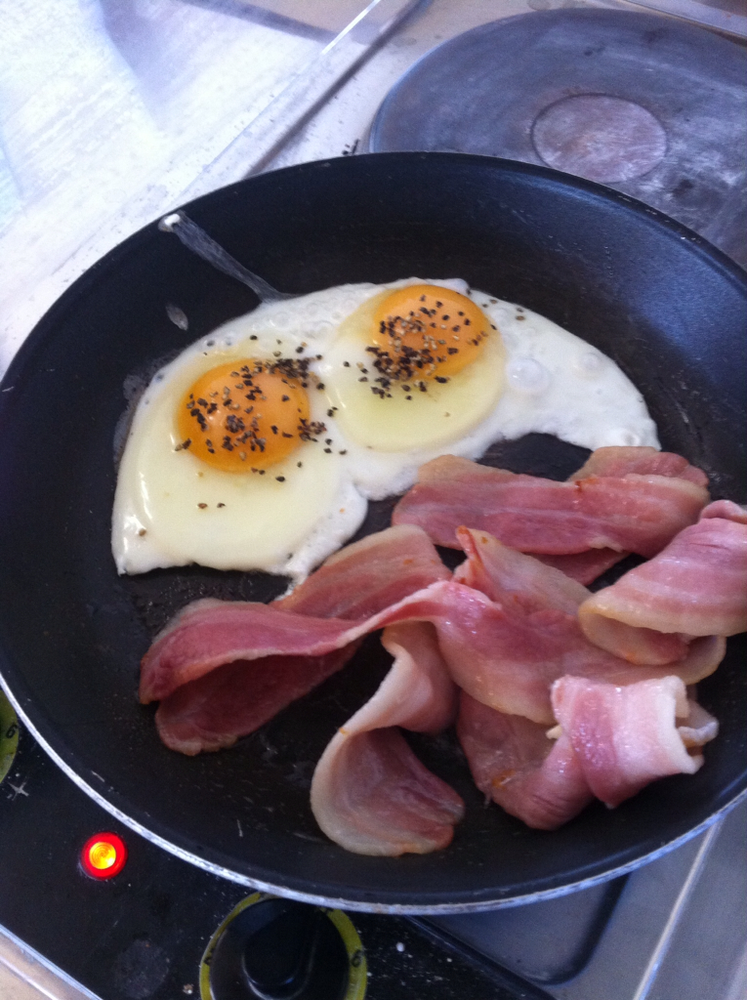
מכאן ניסע צפונה אל ״אזור הקרחונים״. קצת עצוב - נגמר הנופש וצריכים לחזור שוב לחופש :)
