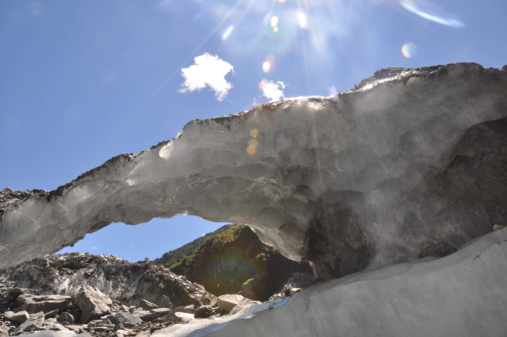

אחרי הנופש בוואנקה נסענו צפונה בחוף המערבי בדרך לאזור ״הקרחונים״. את הנסיעה הארוכה העברנו בהפסקות קצרות על קו החוף היפה בחלק קטן מעשרות המסלולים ונק׳ התצפית שבדרך.

באזור הקרחונים מזג האויר לא היה מדהים, אך לא היתה לנו יותר מידי ברירה ונשארנו שם לחכות למזג אויר טוב. לפני שהתחיל הגשם עוד הספקנו לעשות מסלול זריז סביב אגם מאת׳יסון שהיה יפה למרות מזג-אויר-יום-הדין ששרר באזור.

קצת אחרי שסיימנו את המסלול באגם התחיל הגשם... הגשם ירד ופשוט לא הפסיק לשניה במשך קצת יותר מיומיים! שם האזור בו ממוקמים הקרחונים הוא Westland אך המקומיים מכנים אותו Wetland - ועכשיו די ברור לנו למה...

באתרי התיירות ניסו לשכנע אותנו ללכת לטפס על הקרחון למרות הכל כי התחזית לא ניבאה התבהרות והם טענו שזה חווייתי לטפס על הקרחון גם בגשם. אנחנו החלטנו לא ללכת עם הראש בקיר, אלא לטבול את הראש במעיינות חמים עד יעבור הזעם. במשך ימי הגשם סיימנו עוד ספר ושרצנו במעיינות החמים שבעיירה פרנץ-ג׳וזף. המעיינות ממוקמים ממש בלב יער הגשם והבריכות מוקפות בצמחיה טרופית סבוכה.

את הערב במקום השומם הזה העברנו עם צאללי ועודד בפאב השכונתי, חלקנו שתינו די הרבה וחלקנו מעידים שפגשנו מאורי שאוהב להתחכך.

ניצלנו את המטבח הגדול במקום הלינה שלנו כדי לשפר את מתכון ״בולונז הטיולים״ שלנו ואפילו לימדנו מקומיים מהי קינואה. זה נחשב מנומס כאן להציץ בסירים של מטיילים ולשאול על הבישולים - וטוב שכך! למדנו כבר כל מיני טריקים כאן ויש לנו כבר את ״מנות הטיול״ המועדפות עלינו - והזרוע עוד נטויה.

כשהתחיל להתבהר אצנו רצנו לעשות מסלול קצר המוביל אל קרחון פוקס והזמנו סיור מודרך על קרחון פרנץ ג׳וזף למחרת. בדרך לקרחון פוקס עברנו בעמק שהותיר אחריו הקרחון בעת נסיגתו. יפה לראות על דפנות ההרים מסביב לעמק את השחיקה שנגרמה על ידי נסיגת הקרחון - עדות לכך שהוא הגיע פעם ממש עד הים. נדיר שקרחונים קיימים באזורים כאלה (בלב יער גשם על שפת הים) אך כמות המשקעים באזור ושינויי האקלים הקיצוניים אפשרו לשלג להערם עד שהוא נדחס לכדי גוש קרח ענקי.

למחרת בבוקר התייצבנו במשרד חברת הסיורים המודרכים וחתמנו על עשרות סעיפים שמונים דרכים שונות ומשונות איך אנחנו עלולים להימחץ להרמס ואף להשתפד וכל זאת מבלי שזה יהיה באחריותם. הצטיידנו בcrampons - תוספת משוננת לנעליים לצורך הליכה בקרח ויצאנו סוף סוף לקרחון שעבורו הגענו עד הלום.

 

 

 הקרחון באמת היה מרשים מאד ואחרי שמתרגלים לסמוך על הקרמפונים גם אפשר היה להתרוצץ בחופשיות. הסיור כלל מעבר במערות קרח שנוצרו באופן טבעי בקרחון על ידי זרימת מים וכיסי אויר חמים. בכניסה למערות יעל הלכה לאט כדי לא להחליק אך מהרגע שטיפות מי קרחונים החלו מטפטפות על גבה - נעלם הפחד והתחלף במיומנות קרחונים נדירה. לטיולים הבאים אני אקח איתי קצת קרח בתור קטליזטור נמלים...

המדריך שלנו היה בריון די רציני - במקום בו לאנשים בדרך כלל יש אצבעות - היו לו חמישה תפוחי אדמה שמנמנים בעזרתם הוא לפת גרזן קרח כבד במיוחד. השימוש העיקרי של הגרזן היה לסדר את המסלול לפני הקבוצה אך לעיתים הוא נלקח לצורך סיפוק יצר ההרס הטמון בי - אותו יצר ילדות של״ציפי המנהלת״ נראה כל כך מופרז...

הקרחון פרנץ ג׳וזף בכ100 השנים האחרונות נשאר בערך באותו הגודל. לפי המדריך דמוי הטרול שלנו - בכל 10 שנים התרחש בניו זילנד שינוי אקלים קיצוני שבעקבותיו במשך 10 השנים הבאות הקרחון התקדם או נסג לסירוגין. בזמן האחרון לעומת זאת, כנראה בעקבות ההתחממות הגלובלית, הקרחון נסוג באופן מוגבר ויש חשש סביר שבשנים הקרובות המשטח בו עשינו את ההליכה יקרוס לתוך עצמו ולא תהיה יותר גישה בטוחה לקרחון. בקיצור - אם עדיין לא השתכנעתם: קנו כרטיסי טיסה לניו זילנד עוד היום! השמש ממיסה את הקרחונים ואני ביחד עם 80 מיליון אופוסומים זוללים פה את כל החיות! (עוד נחזור לנושא זלילת החיות)

סיימנו את המסלול עייפים אך מרוצים, נרגענו בטבילה נוספת במעיינות החמים ויצאנו מהר לדרך לסגור חשבון עם אוייב ישן -האופוסום. איזה אופוסום? בדרך צפונה יש חווה של פסיכים בנושא איכות הסביבה שצדים אופוסומים ומוכרים פאי ממולא בבשרם. אני, שתמיד שמח להזדמנות לטעום חיה חדשה התרגשתי כולי אך לרוע המזל המקום היה סגור בלי שום זכר לא לפאי ולא לאופוסום :( טוב נו... כנראה שיצאתי נשכר - סביר להניח שלחולד מגודל יש טעם של.... חולד מגודל?

