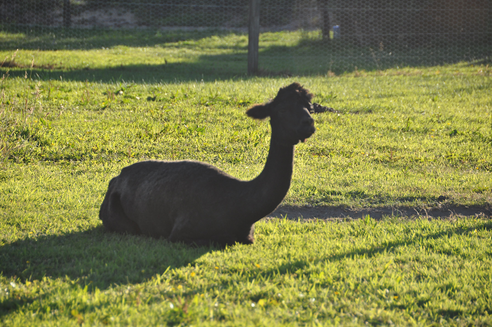
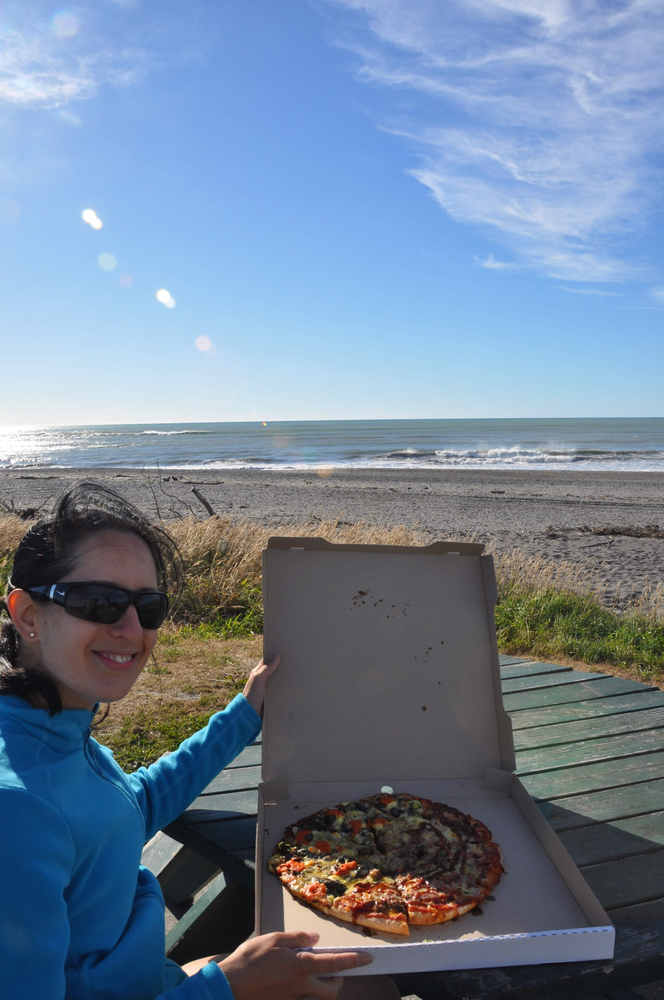
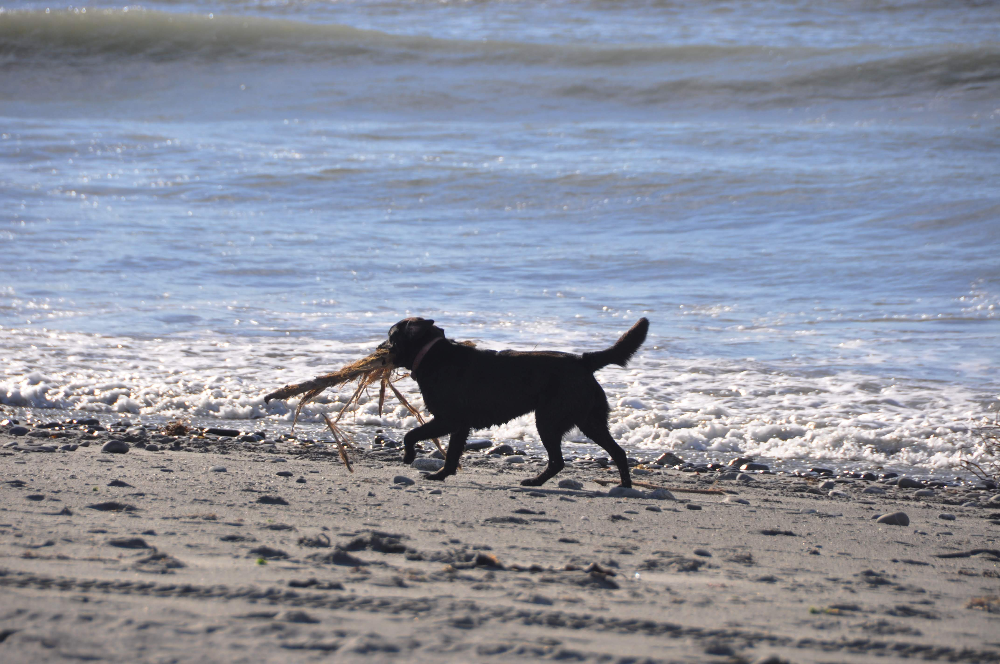
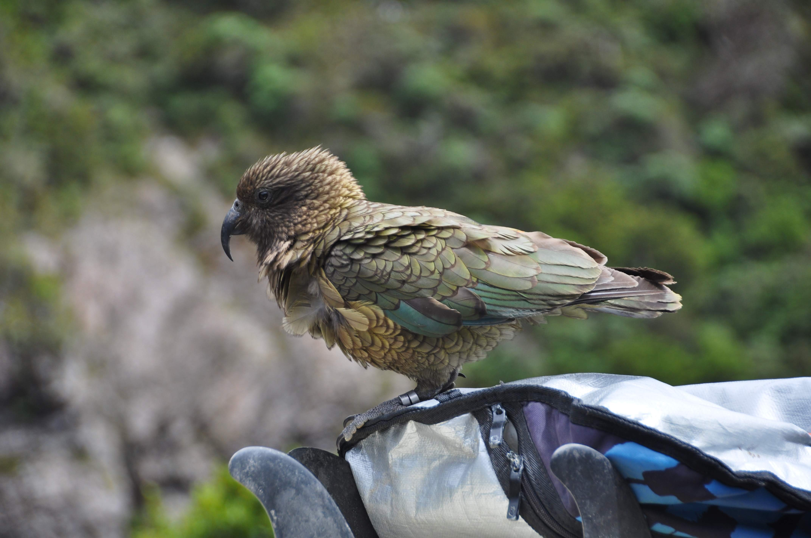
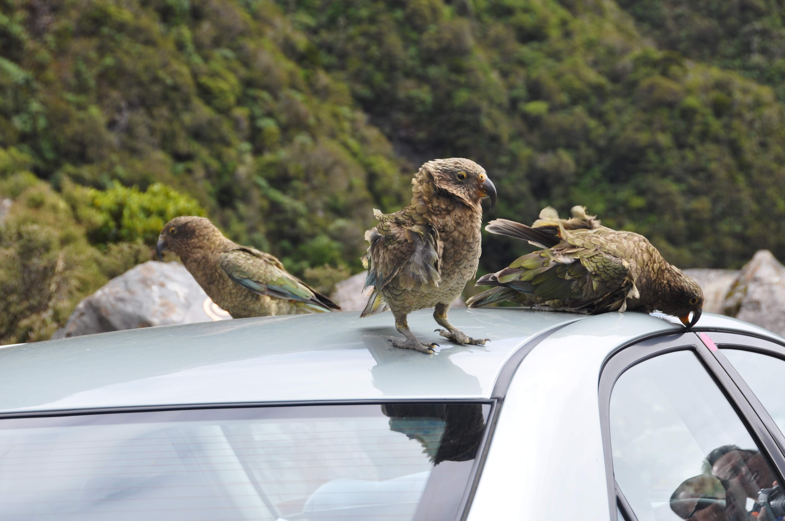
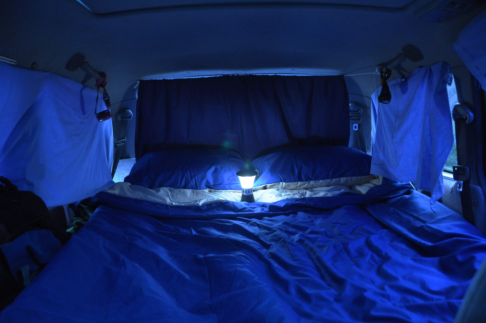
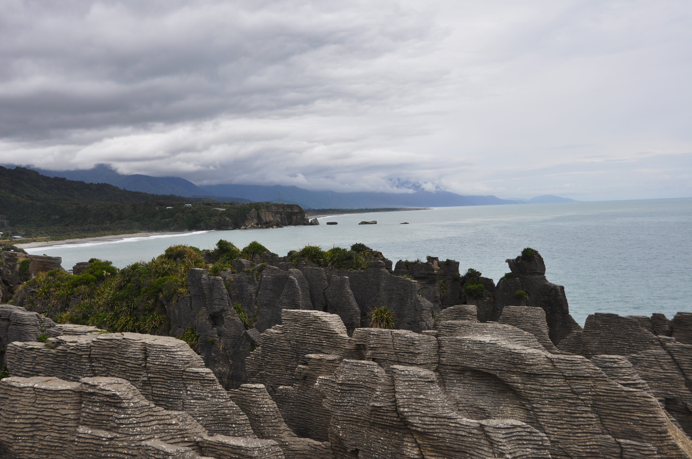
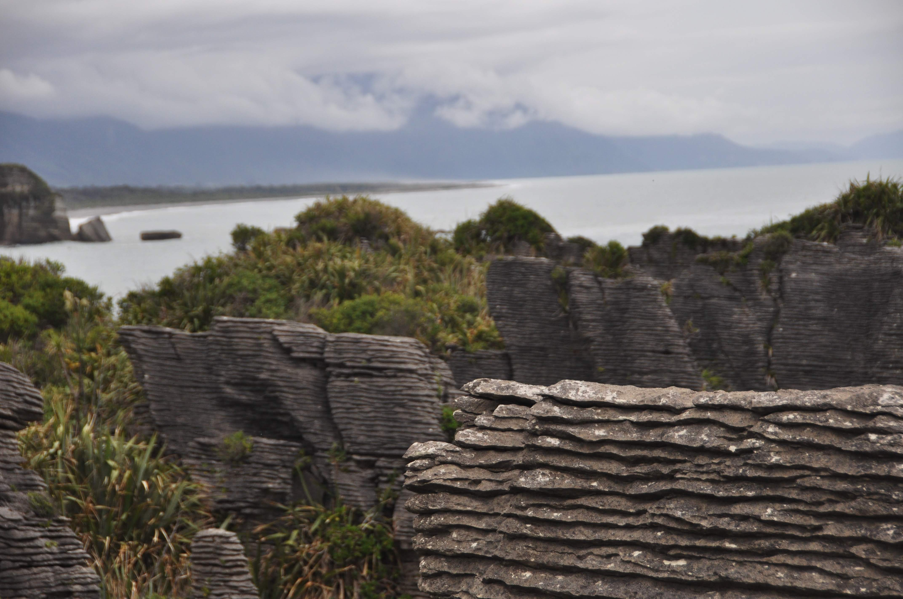
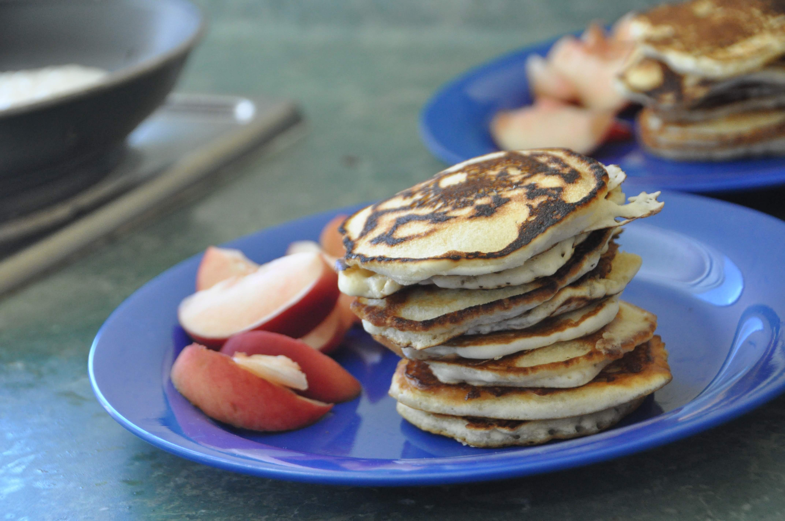
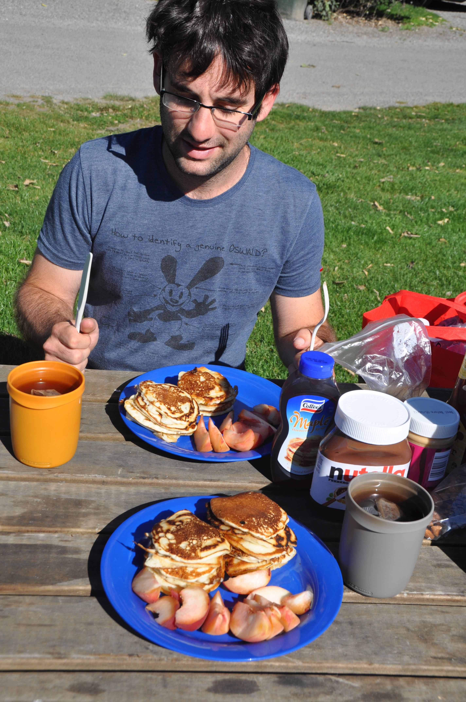

מאזור הקרחונים המשכנו להתקדם צפונה, אנחנו כבר כמעט חודשיים באי הדרומי ועוד נשאר הרבה מה לראות. מזג האויר ב״ארתורס׳ פאס״ - היעד הבא שלנו לא נראה טוב אז משכנו קצת זמן באיזור החוף המערבי. ישנו לילה בעיירה בשם הוקיטיקה באתר קמפינג ובו מיני-גן-חיות הכולל חיות משונות כמו זאת:

מי שעובר בעיר - מומלץ לעצור אצל ״פיפי השמן״, לקחת מגש פיצה ולזלול אותה על חוף הים היפה של העיירה. יש פיצה עם תוספת דגים שמאד מומלצת ופיצה שנקראת ״טי-רקס״ לטורפי חיות גרגרנים במיוחד.

משם המשכנו לארתורס׳ פאס - עיירה בת 62 תושבים שנמצאת באזור הררי יפה ובה מספר מסלולי הליכה מומלצים. מזג האוויר היה רע, עקשן וילדותי - הפעם החלטנו לא לחכות והסתפקנו במסלול קצר למפל גבוה שנקרא ״קערת הפונץ׳ של השטן״.

עם כל הכבוד לשטן ולכלי המטבח שלו, את ארתורס׳ פאס נזכור בזכות כמויות ציפורי הקיה הערמומיות שפגשנו שם בכל הזדמנות. הציפורים הללו, שנחשבות למין התוכים החכם בעולם, מסוגלות לפתוח רוכסנים של תיקים ולחטט בחיפוש אחר אוכל.   למעשה הן ינסו לפתוח כל דבר בחיפוש אחר אוכל - כולל האצבע שלי...

")
משם המשכנו לגריימאות׳ האפרורית אותה ניצלנו להצטיידות במזון ולצורכי עיצוב פנים. קנינו מצעים חדשים ווילון, עשינו ללאקי תומפסון עיצוב פנים דקורטיבי קליל וכעת הוא נראה כך:

בהמשך הדרך בWestport עצרנו כדי לראות מושבה של כלבי ים. עמדת התצפית ממוקמת כך שכלבי הים לא יודעים שהם נצפים ואפשר לראות אותם בשגרת היום שלהם - מטפסים על סלעים רק כדי לקפוץ ראש למים, משחקים בסוג של תופסת או סתם משתזפים על סלע - החיים הטובים....

")
משם, בהמשך הכביש עצרנו בעיירה עם השם המשונה פונקייקי. לא ברור אם שם העיירה ניתן לה על שם האטרקציה העיקרית שבה, להיפך, או שזהו סתם צירוף מקרי מטופש. מן העיירה יוצא מסלול קצר שמוביל אל ״סלעי הפנקייק״ סלעים שהים שחק אותם בצורת שכבות-שכבות כך שהם נראים ממש כמו ערימה ענקית של פנקייקים.

אנחנו בתור מטיילים יסודיים החלטנו להעצים את חווית הביקור בפונקייקי - וכך נראתה ארוחת הבוקר שלנו אתמול:

