נלסון נחשבת לאחת מהערים הפופולריות ביותר לתיירות פנים בניו זילנד. היא ממוקמת קרוב לשני פארקים לאומיים עצומים, מגדלים בה יין וכל מיני קשקושים אורגניים ותושביה נחשבים ל״היפים הפלצניים״ של ניו זילנד. השוק של נלסון מתקיים בשבת והוא הגדול והמגניב ביותר בו ביקרנו בניו זילנד. בנלסון יש המון מספרות ויעל ניצלה זאת כדי לתדלק את הצורך הטבעי שלה להתייפות.

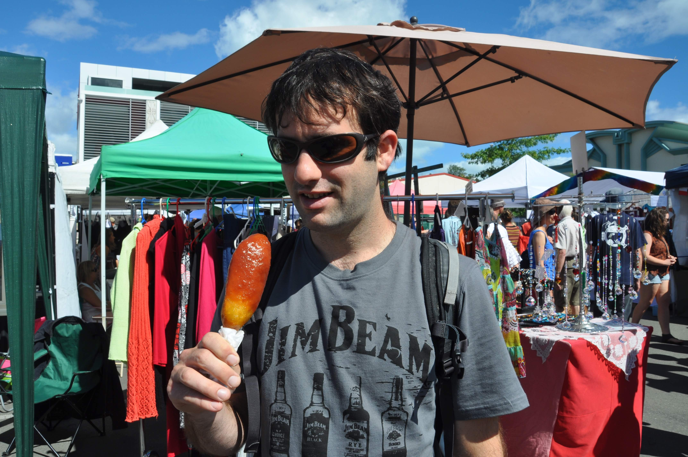

את אתר הקמפינג בו ישנו לא נשכח לעולם. הסיבה הראשונה לכך היא ״המצעד״ שהתקיים כל בוקר: כבר התרגלנו שבכל מקום יש ברווזים שבאים לבקש שאריות, אבל כאן היה משהו שונה - בכל בוקר הצעידה אמא ברווזה כמות של גוזלים ברווזיים מצידו האחד של הנהר אל צידו האחר. כל כך רכים - כל כך מתוקים!

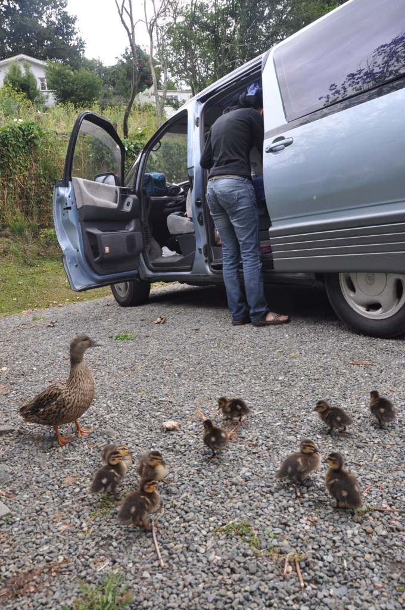

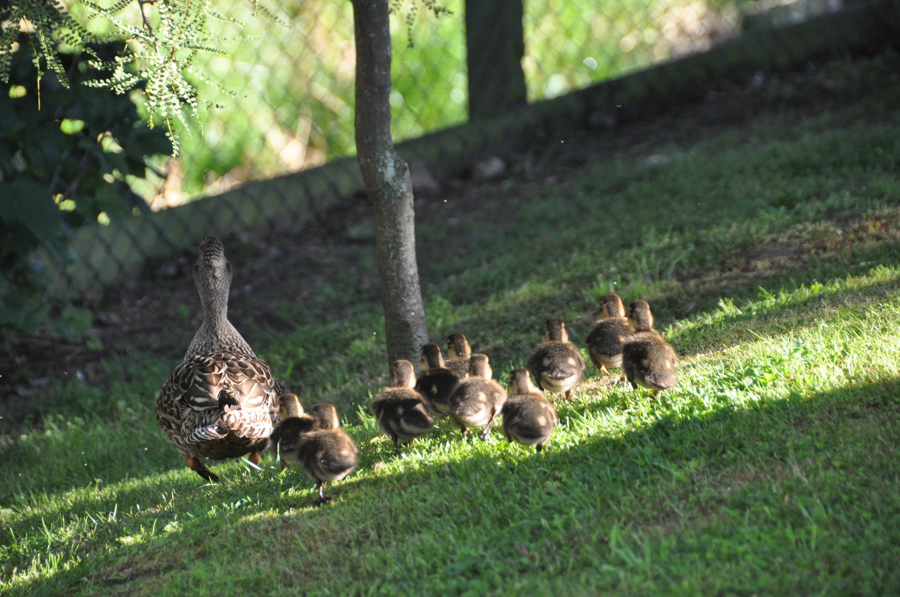
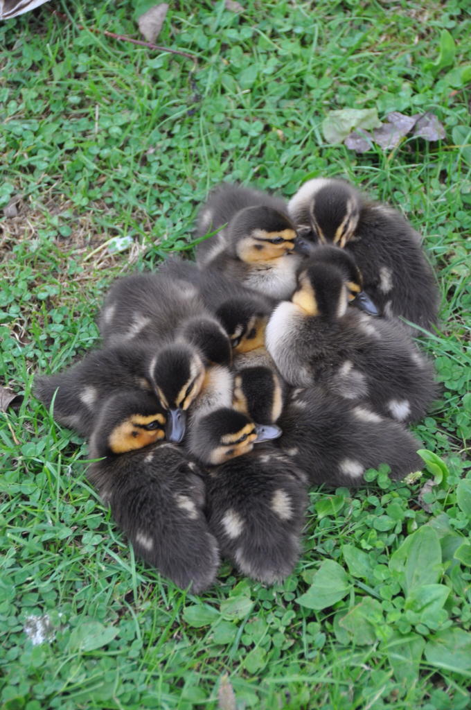

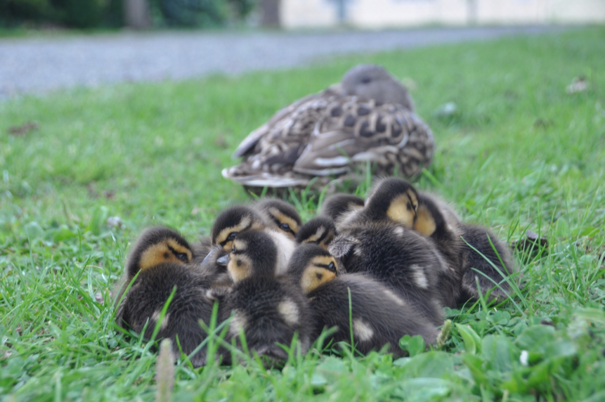
הסיבה השניה - והיותר משמעותית שבגינה נזכור את המקום היא שלל היצורים האיומים שהתגוררו בו - ואני מתכוון הפעם להומו-סאפיאנס... גרו כאן בכפיפה אחת אנשים משונים במיוחד: היו שלישיית גרמנים שבמשך 3 ימים לא יצאו מחדר הטלוויזיה אלא כדי להכין לעצמם מנה חמה עם ריח מחריד. היו את המלוכסנים שארוחת הבוקר שלהם הייתה כרוב מבושל לצד הר של גלידת שוקולד. אך גולת הכותרת הייתה מאורי שנראה כמו אוסאמה בן לאדן שטרח להסביר לכולם שהוא מחופש לפלסטינאי כי ״האדם הלבן״ בניו זילנד גזל את אדמות המאורים ממש כפי שהישראלים גזלו את ארצם של הפלסטינאים. בדיעבד הסתבר שהוא אפילו לא היה אורח של האתר - פשוט גר באזור ואוהב להשתמש במנגלים שאותו ״אדם לבן״ פיזר למענו כשפיתח את כל האי.

משום מה, יותר מכל תבשיל אחר משך "התבשיל הפרסי״ שלנו תשומת לב מרובה ונאלצנו להסביר לכל מיני אנשים את מקורו (סוג של שקשוקת תרד). תודה מיוחדת ללירון ס. על המתכון ולאחמדינג׳אד את כורש על המסורת.

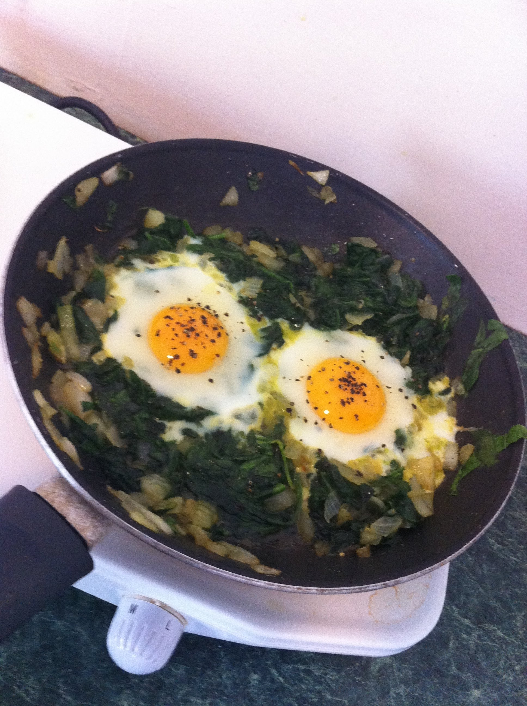
חוץ מלחזות ביצורים באתר הקמפינג טיילנו ב Nelson Lakes National Park טיול יום שנקרא Puddy's track. משרד הdoc של האזור הוא גדול ומצויין ובו יעזרו לכל אחד למצוא באיזור מסלול הליכה לפי כושרו - אם זה הליכה של יום, כמה שעות או שבוע.

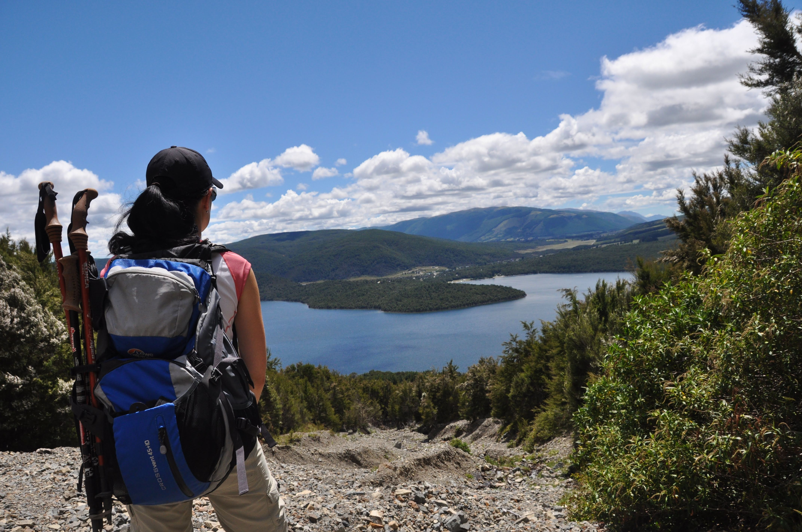

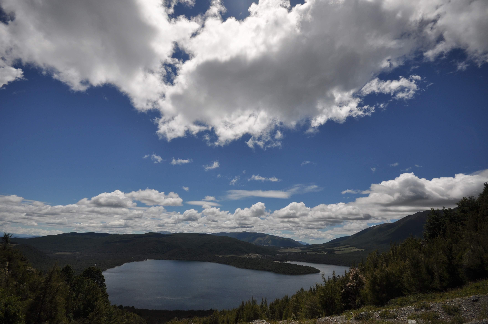
את הפסקת הצהריים של המסלול העברנו על שפת האגם. כל כך התפלאנו שהסנדפלייז לא גילו את הנקודה היפה הזאת אז נשכבנו שם על הגב עד שנרדמנו.

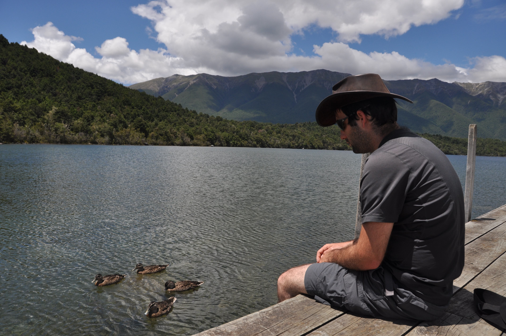

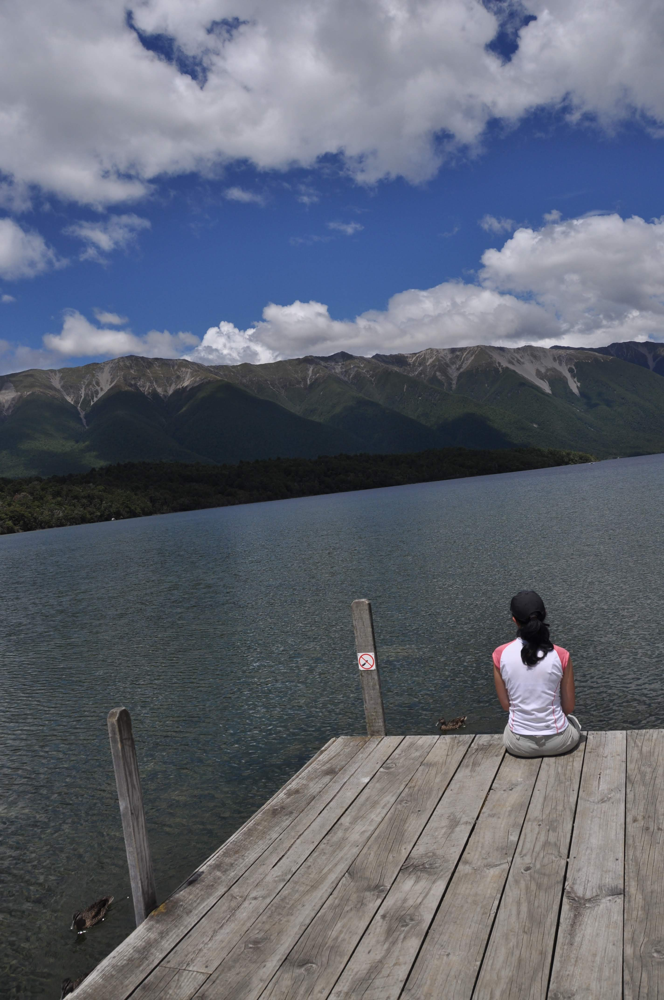

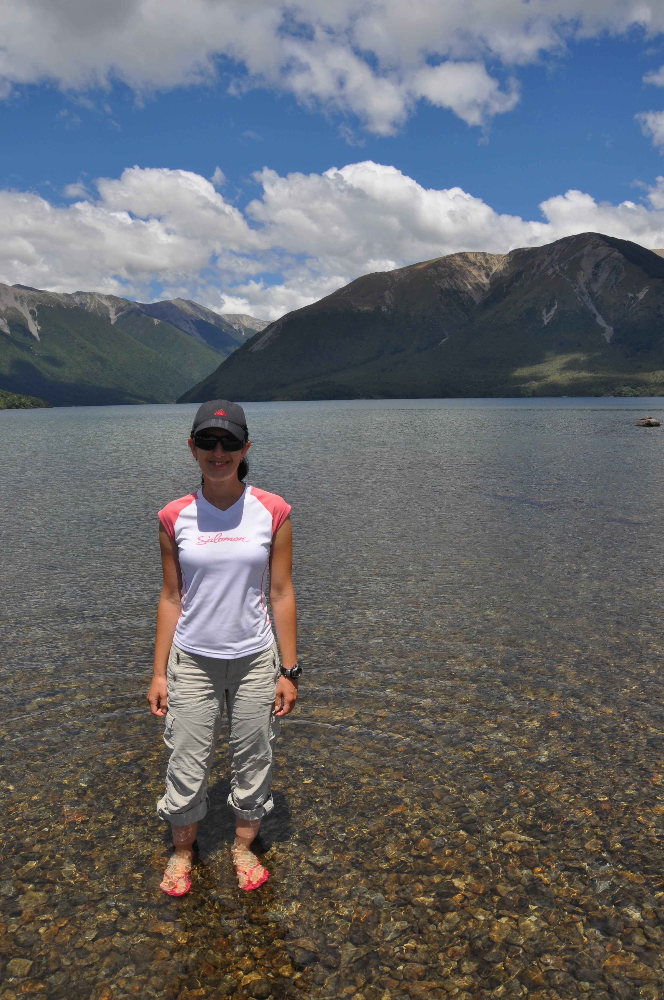
בנלסון נפרדנו מצאללי ועודד איתם חווינו לא מעט רגעים גדולים בטיול הזה - דרכנו מתפצלות - ואת הכוסית הבאה נרים יחד כבר בתל אביב. יצאנו ארבעתנו כדי לחפש מקום נחמד מספיק כדי שיארח את הפרידה המרגשת אך מרוב שפסלנו פאבים - לא שמנו לב שהשעה כבר נהייתה מאוחרת והעיר נכנסה לתרדמת. מבלי להתבלבל הוצאנו שולחן, כיסאות פיקניק ואת היין והוויסקי שהספקנו לאגור ברכבים ויצאנו לחפש הרפתקאות. התיישבנו במרכז של מגרש כדורגל ענק וחשוך בו קיימנו את שתיית הפרידה. עודד אפילו פינק בסיגר ניצחון.

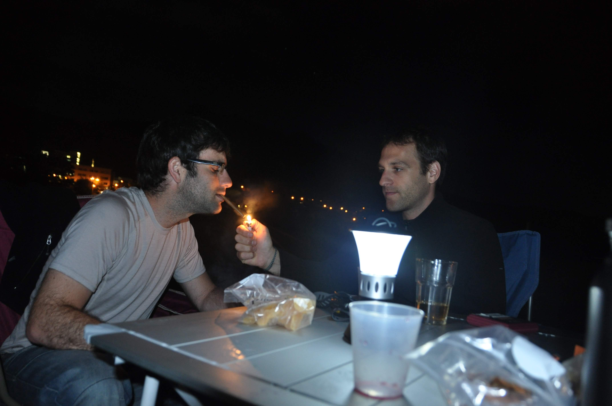
מנלסון המשכנו לכיוון החוף הצפון מערבי (אייבל טאזמן) ובדרך עצרנו ביקבים של האיזור לטעום ״פינו גרי״ ולהצטייד בבקבוקים לפיקניק גבינות ויין המסורתי.

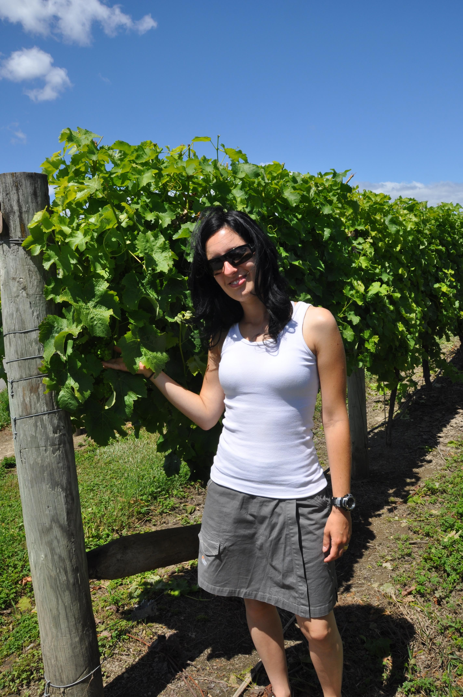

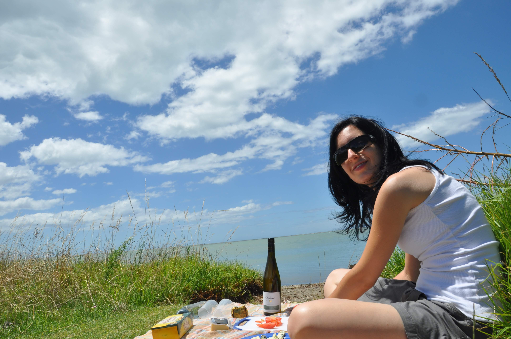
את הלילה האחרון באזור העברנו במוטואקה - עוד עיירת נופש החביבה על ליבם של המקומיים. מאז חג המולד כמעט כל אתרי הקמפינג מפוצצים במקומיים שמקימים פה מאהלים מנקרי עיניים עם מטבחים ניידים סופר-מאובזרים שמלבד המנגל מכילים מקררים, כיריים ניידים ואפילו תנורי גז. מה שבהתחלה היה נחמד התחיל כבר להיות מציק - במוטואקה מיקמו אותנו בסמוך לכרית מתנפחת של ילדים שפשוט לא הפסיקו להשתולל שם (אני מודה - גם אני קפצתי לא פעם...). כדי להרגע בדקנו באתר של משרד החינוך הניו זילנדי - חופשת הקיץ מסתיימת ב30 לינואר - עוד מעט שוב שקט!

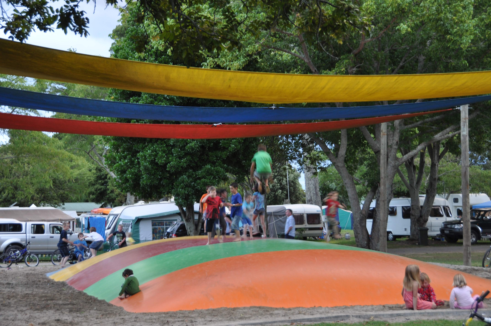

הבטחתי התחלות חדשות וקיימתי רק פרידות... ההתחלה החדשה לא שייכת לנו אלא לגרוסברג ושירה. מזל טוב לגרוסברג - השדכן הרשמי שלנו ולשירה - עוד בת רעננה מוצלחת! מי יתן וילדיכם ימלאו את השכונות השלוות של רעננה עד לפיצוץ אוכלוסין. מצורף סרטון הברכה כפי ששולב בסרט החברים והוקרן בערב החתונה. מזל טוב!


