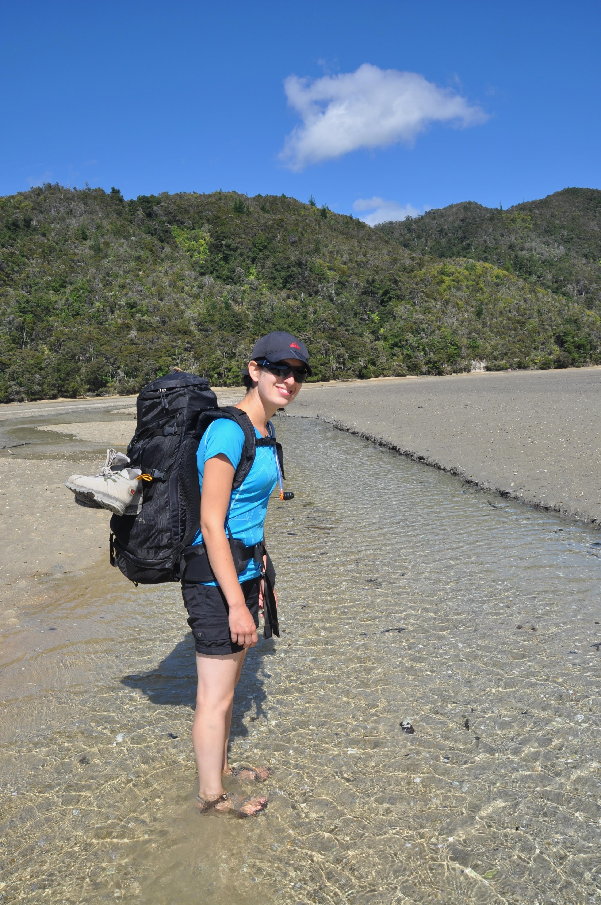

נכון, אני יודע, רק לפני שבוע כתבתי כאן על קרחונים גשם וקור - אבל הפוסט הזה מוקדש כולו לשמש ים וחופים זהובים. כזו היא ניו זילנד - כל סוגי הנופים שבעולם ארוזים כל כך נח לטיול באריזה של ממתק. בחלקו הצפון מערבי של האי הדרומי שוכן הפארק הלאומי ״אייבל טאזמן״ והוא מפורסם בחופיו המבודדים והיפים. אפשרויות הטיול באייבל טאזמן הן רבות: אפשר ללכת ברגל, לחתור בקייק, או לקפץ בין החופים בעזרת water taxi. אנחנו השתדלנו למצות את כל האפשרויות.

בתור חימום חתרנו במסלול קצר בקייאק. זוהי הפעם ראשונה שאנחנו מתנסים בכלי שייט רציני יותר מסירת פדלים, או הקייאק המתנפח שמשכירים בנהר הירדן. ממש הופתענו מהדיוק בו ניתן לשלוט בכלי הפשוט הזה. אפילו במי הים עם זרמים חלשים וטלטלות הצלחנו בקלות לנווט בין איים קטנים וסלעים מזדקרים.

אחרי חוויית הקייאק רבצנו כל היום בחוף רחצה פופולרי ויפה עם שאריות גבינות ויין וטבלנו במים המרעננים יחד עם המקומיים ששרצו בחוף.

למחרת יצאנו לטרק של האייבל טאזמן. את הטרק אפשר לחלק כך שהוא יקח בין יום לחמישה ימים. מכל נקודה אפשר לקחת water taxi שתקח אותך לכל נקודה אחרת או לחתור מחוף לחוף עם קיאק כשסירה משיטה לך את הציוד - נוחות אופטימלית. אנחנו - בגלל הסיפורים ששמענו על הסנדפלייז שאורבים לך בכל פינה בטרק הסתפקנו ביומיים טיול - בדיעבד אולי היינו מזמינים בקתה ליום נוסף. כנראה שאיזה הוביט מטורלל זרק את זבובי החול לתוך לוע mount doom בו הם חושלו מלכתחילה והארץ התיכונה שקטה מהם לפחות במשך יומיים שלמים.

 בשל פופולריות הטרק וכמות המיטות הקטנה בבקתות נאלצנו להזמין את הבקתה יותר משבועיים מראש - מה שלא אפשר לנו להתחשב בתחזית מזג האויר. אחרי כמה מהלכים בוגדניים חזר מזג האויר להיות חברנו הטוב והתנהג באופן ראוי לציון. אין בטרק איזושהי נקודת שיא כמו פסגה, מפל או תצפית - לכל אורכו של הטרק פזורים חופים זהובים אשר מזמינים הפסקות רביצה רבות. שעות ההליכה המועטות וריבוי הפסקות הקריאה והרביצה הופכים את הטרק הזה ל״טרק אוירה״ ובהחלט אפשר להכניסו לרשימה האקסקלוסיבית של ההרפתקאות היותר מוצלחות שלנו כאן :)

תופעה מדהימה שחייבים להתייחס אליה בתכנון הטרק היא ההפרש העצום בין גאות לשפל. קטעים מסויימים לא עבירים בזמן גאות וחייבים לבדוק את התחזית מראש כדי לדעת באילו שעות אפשר לעבור. במסלולי השפל צריך הרבה פעמים להרטיב קצת את הרגליים ולצעוד בין סרטנים וצדפות. באזורי השפל אפשר גם לראות סירות עוגנות ביבשה ממתינות שוב למים שישאו אותן.

בסוף היום השני לקחנו water taxi חזרה לנק׳ המוצא ונסענו הלאה אל ההרפתקה הבאה.

